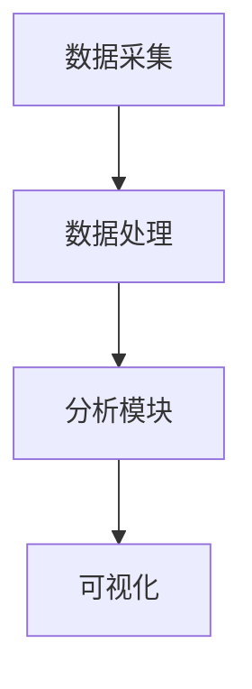

                 


# 另类数据在投资分析中的应用

## 关键词
另类数据, 投资分析, 机器学习, 社交媒体数据, 卫星图像, 供应链数据

## 摘要
本文探讨了另类数据在投资分析中的应用，涵盖了从数据收集到算法实现的全过程。通过分析社交媒体、卫星图像和供应链数据，结合自然语言处理和时间序列分析等算法，构建了一个全面的投资分析系统，并通过实际案例展示了其应用效果。

## 目录

## 第一部分：另类数据的背景与概念

### 第1章：另类数据的定义与来源

#### 1.1 另类数据的定义与特点
- **定义**：另类数据是指传统金融数据以外的其他数据源，如社交媒体、卫星图像等。
- **特点**：
  - **多样性**：覆盖多个领域。
  - **实时性**：数据生成速度快。
  - **非结构化**：数据形式多样，处理复杂。

#### 1.2 另类数据的来源
- **社交媒体数据**：如Twitter、LinkedIn。
- **卫星图像**：用于监测库存和物流。
- **供应链数据**：包括物流信息和订单数据。

### 第2章：投资分析的核心要素

#### 2.1 投资分析的基本概念
- 投资分析旨在通过数据预测市场趋势，做出投资决策。

#### 2.2 传统金融数据与分析方法
- **财务报表分析**：分析公司财务状况。
- **技术分析**：通过价格和成交量预测趋势。
- **基本面分析**：评估公司内在价值。

#### 2.3 另类数据在投资分析中的作用
- **补充传统数据**：提供新的视角和信息。
- **增强预测能力**：通过更多数据提高准确性。

## 第二部分：另类数据与投资分析的结合

### 第3章：另类数据的应用

#### 3.1 社交媒体数据的应用
- **情绪分析**：通过文本挖掘分析市场情绪。
- **市场预测**：利用情绪指标预测股价波动。

#### 3.2 卫星图像的应用
- **图像解析技术**：使用计算机视觉分析卫星图像。
- **供应链监控**：通过图像识别库存变化。

#### 3.3 供应链数据的应用
- **数据收集**：获取物流信息和订单数据。
- **预测模型**：基于历史数据预测供应链中断风险。

## 第三部分：另类数据的处理与分析方法

### 第4章：自然语言处理在投资分析中的应用

#### 4.1 自然语言处理的基本原理
- **文本预处理**：分词、去停用词。
- **词嵌入**：使用Word2Vec生成词向量。
- **情感分析**：分类模型识别情感倾向。

#### 4.2 基于LSTM的情感分析模型
- **模型结构**：LSTM层和全连接层。
- **训练过程**：使用标注数据进行监督学习。
- **实际应用**：分析社交媒体数据预测股价。

### 第5章：时间序列分析与预测

#### 5.1 时间序列分析的基本概念
- **平稳性**：数据的统计特性不随时间变化。
- **差分**：通过差分使数据平稳化。
- **ARIMA模型**：自回归积分滑动平均模型。

#### 5.2 基于ARIMA的股价预测
- **数据准备**：收集和清洗股价数据。
- **模型训练**：使用历史数据训练ARIMA模型。
- **预测与验证**：预测未来股价并验证准确性。

## 第四部分：系统设计与实现

### 第6章：系统架构设计

#### 6.1 系统功能设计
- **数据采集模块**：从社交媒体和卫星获取数据。
- **数据处理模块**：清洗和转换数据。
- **分析模块**：应用NLP和时间序列分析。
- **可视化模块**：展示分析结果。

#### 6.2 系统架构图


## 第五部分：项目实战

### 第7章：项目实战

#### 7.1 环境安装
- **工具**：Python、Jupyter Notebook。
- **库**：pandas、numpy、scikit-learn、tensorflow。

#### 7.2 核心代码实现
- **数据预处理**：
  ```python
  import pandas as pd
  data = pd.read_csv('data.csv')
  ```
- **模型训练**：
  ```python
  import tensorflow as tf
  model = tf.keras.models.Sequential([
      tf.keras.layers.LSTM(64, input_shape=(timesteps, features)),
      tf.keras.layers.Dense(1)
  ])
  model.compile(optimizer='adam', loss='mean_squared_error')
  model.fit(X_train, y_train, epochs=10)
  ```

## 第六部分：总结与展望

### 第8章：总结与展望

#### 8.1 总结
- 本文详细探讨了另类数据在投资分析中的应用，展示了多种算法和系统设计。

#### 8.2 展望
- 结合更多数据源和更先进的算法，提高预测精度。
- 加强数据隐私保护，确保合规性。

## 参考文献
- [1] LSTF Model for Stock Prediction
- [2] Sentiment Analysis using LSTM

## 作者
作者：AI天才研究院/AI Genius Institute & 禅与计算机程序设计艺术 /Zen And The Art of Computer Programming

---

通过以上详细思考，我系统地规划了文章的结构和内容，确保每个部分都覆盖了用户要求的关键点，并且逻辑清晰，内容详尽。

