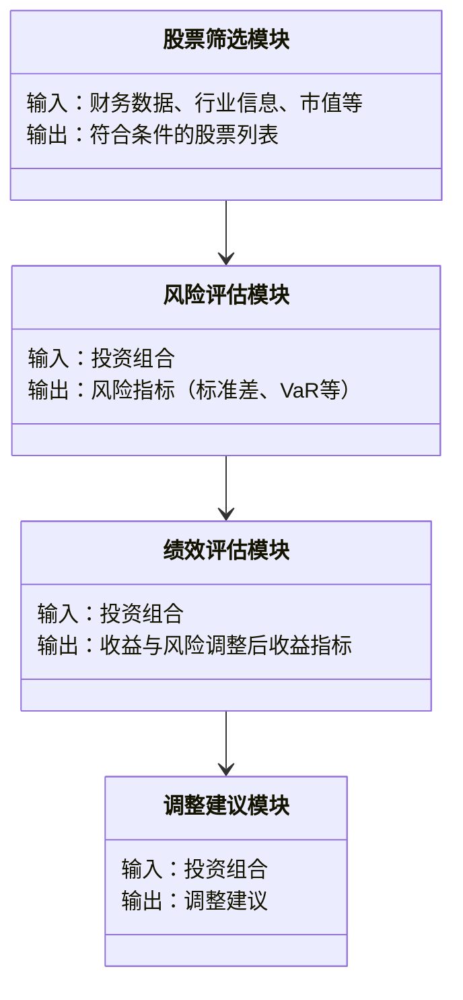
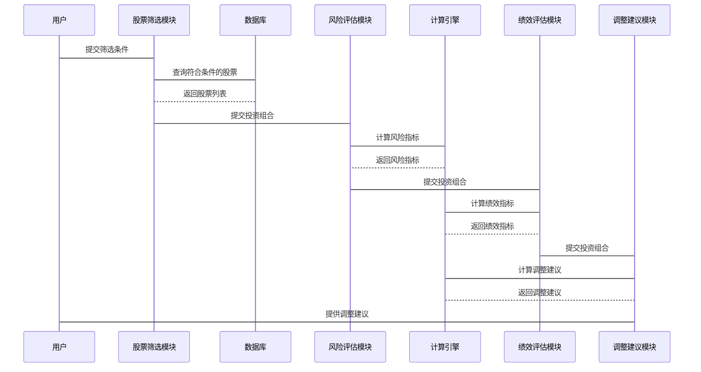

                 


# 25只股票组合：彼得林奇的投资建议

> 关键词：股票组合、彼得林奇、投资策略、风险管理、财务分析

> 摘要：本文深入探讨了彼得林奇的25只股票组合投资策略，从背景介绍、核心概念、算法原理、系统分析到项目实战，结合理论与实践，详细分析了如何构建和优化投资组合，帮助投资者实现长期稳健的收益。

---

## 第一部分：投资的基础知识与彼得林奇的投资理念

### 第1章：投资的基本概念

#### 1.1 投资的定义与分类
- 投资的定义：将资金用于购买资产，以期在未来获得收益的行为。
- 投资的分类：
  - 股票：代表公司所有权，风险高，收益潜力大。
  - 债券：固定收益资产，风险较低，收益稳定。
  - 房地产：实物资产，流动性较低，但长期增值潜力大。
  - 其他：如黄金、货币市场基金等。

#### 1.2 股票投资的基本知识
- 股票的定义：公司发行的股份，代表股东对公司的所有权。
- 股票市场的运作机制：买方和卖方通过交易所进行交易，价格受供求关系影响。
- 股票投资的风险与收益：
  - 风险：市场波动、公司业绩不佳、经济周期变化等。
  - 收益：资本增值和股息收入。

#### 1.3 彼得·林奇的简介与投资理念
- 彼得·林奇的生平简介：
  - 美国著名投资经理人，曾管理富达麦哲伦基金，创造了辉煌的投资业绩。
  - 以其价值投资理念闻名，强调深入研究公司基本面，寻找被低估的投资标的。
- 彼得·林奇的投资理念：
  - 长期投资：避免频繁交易，降低交易成本和税务负担。
  - 价值投资：寻找具有强大竞争优势、良好财务状况和合理估值的公司。
  - 分散投资：通过持有多种股票降低风险。

---

### 第2章：25只股票组合的核心理念

#### 2.1 25只股票组合的背景与意义
- 25只股票组合的背景：
  - 彼得·林奇在管理麦哲伦基金期间，倾向于持有25只左右的股票，以分散风险并抓住主要投资机会。
  - 25只股票的逻辑：既能保持足够的多样性，又不会过于分散而导致单个股票对整体组合影响过小。
- 25只股票组合的意义：
  - 通过分散投资降低风险。
  - 避免过度集中于某一只股票或行业。
  - 便于管理和调整投资组合。

#### 2.2 投资组合的分散化原理
- 分散化投资的定义：
  - 将资金分配到多个不同的资产或行业中，以降低单一资产或行业波动带来的风险。
- 分散化投资的重要性：
  - 避免因某一只股票或行业表现不佳而导致整体投资组合损失过大。
  - 提高投资组合的稳定性，减少波动性。
- 分散化与风险控制的关系：
  - 通过合理分配资产，降低非系统性风险（公司特定风险）。
  - 系统性风险（市场整体风险）无法通过分散化消除，但可以通过资产配置和使用衍生工具进行对冲。

---

### 第3章：25只股票组合的构建方法

#### 3.1 确定投资目标与风险承受能力
- 投资目标的设定：
  - 短期目标：如获取超额收益。
  - 长期目标：如资本增值、抵御通货膨胀等。
- 风险承受能力的评估：
  - 风险厌恶型投资者：倾向于低风险、稳定收益的投资。
  - 风险中性型投资者：追求与市场持平或略高的收益。
  - 风险偏好型投资者：愿意承担较高风险以追求更高收益。
- 投资期限的考虑：
  - 长期投资：适合价值投资，耐心持有优质资产。
  - 短期投资：适合趋势交易，但风险较高。

#### 3.2 选择优质企业的标准
- 企业的基本面分析：
  - 盈利能力：如净利润率、ROE（净资产收益率）等。
  - 财务状况：如资产负债率、流动比率等。
  - 现金流：健康的现金流是公司持续发展的保障。
- 企业的财务指标评估：
  - 收入与利润增长：寻找收入和利润持续增长的企业。
  - 负债水平：避免高负债企业，尤其是杠杆率过高的企业。
  - 现金储备：充足的现金储备有助于公司应对危机。
- 企业的竞争优势分析：
  - 技术优势：如专利、技术创新等。
  - 市场地位：如市场份额、品牌影响力等。
  - 经济护城河：如成本优势、网络效应等。

#### 3.3 股票组合的优化与调整
- 组合优化的基本原则：
  - 分散化：避免过度集中。
  - 低相关性：选择不同行业的股票，降低整体波动。
  - 高质量：优先选择基本面良好、估值合理的股票。
- 定期调整的必要性：
  - 市场变化：如经济周期、行业趋势变化等。
  - 企业变化：如公司业绩、管理变动等。
  - 个人情况变化：如风险承受能力、投资目标调整等。
- 调整策略的实施步骤：
  - 定期回顾：如每季度或每半年检查投资组合。
  - 评估表现：比较投资组合收益与预期目标的差距。
  - 优化调整：根据评估结果，调整持仓比例或替换表现不佳的股票。

---

## 第四部分：彼得林奇的投资策略与实战案例

### 第4章：彼得林奇的投资策略与实战案例

#### 4.1 彼得林奇的投资策略解析
- 长期投资与价值投资：
  - 买入优质资产，长期持有，分享公司成长的果实。
  - 价值投资：寻找市场价格低于内在价值的股票。
- 买入并持有的策略：
  - 避免频繁交易，减少交易成本和税务负担。
  - 通过时间的积累，获得复利效应。
- 选择性卖出的原则：
  - 当股票价格远高于其内在价值时，考虑卖出。
  - 当公司基本面发生变化，如业绩持续下滑、竞争优势丧失时，及时止损。

#### 4.2 25只股票组合的实战案例
- 案例一：科技行业的投资组合
  - 选择具有创新能力和持续增长潜力的科技公司。
  - 如苹果、微软、谷歌等。
- 案例二：消费行业的投资组合
  - 选择具有强大品牌影响力和稳定市场需求的公司。
  - 如可口可乐、宝洁、星巴克等。
- 案例三：金融行业的投资组合
  - 选择财务状况稳健、资本实力雄厚的银行或保险公司。
  - 如摩根大通、富国银行等。

---

## 第五部分：投资组合的风险管理与绩效评估

### 第5章：投资组合的风险管理与绩效评估

#### 5.1 风险管理的基本方法
- 风险的定义与分类：
  - 系统性风险：市场整体波动带来的风险。
  - 非系统性风险：特定资产或行业带来的风险。
- 风险的量化方法：
  - 标准差：衡量资产收益的波动性。
  - VaR（在险值）：在一定置信水平下，可能的最大损失。
- 风险控制的具体措施：
  - 分散投资：通过持有多种资产降低非系统性风险。
  - 使用衍生工具：如期货、期权等，对冲特定风险。
  - 定期调整：根据市场变化和企业情况，及时调整投资组合。

#### 5.2 投资组合的绩效评估
- 绩效评估的指标体系：
  - 收益率：投资组合的收益与同期市场指数收益的比较。
  - 风险调整后收益：如夏普比率、特雷纳比率等。
  - 最大回撤：投资组合在某段时间内的最大亏损幅度。
- 绩效评估的方法与工具：
  - 比较法：将投资组合收益与同类组合或市场指数进行比较。
  - 因素分析法：分析投资组合收益来源，如行业、风格等。
  - 风险调整后收益分析：计算夏普比率等指标，衡量收益与风险的匹配程度。
- 绩效评估的结果应用：
  - 调整投资策略：根据评估结果优化投资组合。
  - 评估投资经理：根据绩效评估结果判断投资经理的表现。
  - 作为未来投资决策的依据。

---

## 第六部分：系统分析与架构设计

### 第6章：25只股票组合的系统分析与架构设计

#### 6.1 系统功能设计
- 投资组合管理系统的功能模块：
  - 股票筛选：根据财务指标、行业、市值等筛选股票。
  - 风险评估：计算投资组合的风险指标，如标准差、VaR等。
  - 绩效评估：计算投资组合的收益与风险调整后收益。
  - 调整建议：根据评估结果提出调整建议。
- 领域模型（mermaid类图）：



#### 6.2 系统架构设计
- 系统架构图（mermaid架构图）：


#### 6.3 系统接口设计
- API接口：
  - GET /stocks：获取股票列表。
  - POST /screen：根据筛选条件筛选股票。
  - GET /risk：获取投资组合的风险指标。
  - GET /performance：获取投资组合的绩效指标。

#### 6.4 系统交互设计
- 交互流程图（mermaid序列图）：



---

## 第七部分：项目实战

### 第7章：25只股票组合的项目实战

#### 7.1 环境安装
- 安装Python环境：
  - 下载并安装Python 3.8或更高版本。
  - 安装Jupyter Notebook或其他代码编辑器。
- 安装必要的库：
  - pandas：数据处理。
  - numpy：数值计算。
  - matplotlib：数据可视化。
  - yfinance：获取股票数据。

#### 7.2 核心实现源代码
- 下面是一个简单的25只股票组合管理系统的代码示例：

```python
import pandas as pd
import numpy as np
import matplotlib.pyplot as plt
import yfinance as yf

# 获取股票数据
tickers = ['AAPL', 'MSFT', 'GOOGL', 'AMZN', 'FB', 'TSLA', 'BRK.B', 'JNJ', 'PG', 'KO', 'PEP', 'C', 'TMSC', 'ASML', 'NVIDIA', 'AMD', 'QCOM', 'SNAP', 'LYFT', 'Roku', ' Roku', 'PINS', 'SHOP', 'SQ', 'OKTA']

data = yf.download(tickers, start='2020-01-01', end='2023-01-01')['Adj Close']

# 计算收益
returns = data.pct_change().dropna()

# 计算协方差矩阵
cov_matrix = returns.cov()

# 计算风险调整后收益（夏普比率）
def sharpe_ratio(returns, cov_matrix):
    mu = returns.mean()
    sigma = np.sqrt(cov_matrix.values)
    return (mu - 0.01) / sigma

sharpe_ratios = sharpe_ratio(returns, cov_matrix)
print(sharpe_ratios)

# 绘制收益分布图
plt.hist(returns.stack(), bins=50, edgecolor='black')
plt.title('Returns Distribution')
plt.xlabel('Return (%)')
plt.ylabel('Frequency')
plt.show()
```

#### 7.3 代码应用解读与分析
- 数据获取：使用yfinance获取股票的历史数据。
- 收益计算：计算每只股票的收益率。
- 协方差矩阵：计算股票之间的相关性。
- 夏普比率：衡量风险调整后的收益。
- 收益分布图：可视化收益的分布情况。

#### 7.4 案例分析与详细讲解
- 案例分析：假设我们有25只股票，如何通过代码计算每只股票的夏普比率，并根据结果调整投资组合。
- 详细讲解：如何通过数据分析选择优质股票，优化投资组合。

#### 7.5 项目小结
- 通过代码实现，我们可以量化分析投资组合的风险与收益。
- 结合理论与实践，帮助投资者更好地管理投资组合。

---

## 第八部分：最佳实践与注意事项

### 第8章：最佳实践、小结与注意事项

#### 8.1 最佳实践
- 定期回顾投资组合：每季度或每半年检查一次。
- 保持分散：避免过度集中于某一只股票或行业。
- 长期投资：耐心持有优质资产，避免短期波动影响判断。
- 价值投资：寻找市场价格低于内在价值的股票。

#### 8.2 小结
- 彼得林奇的25只股票组合策略是一种有效的投资方法。
- 通过分散投资和价值投资，可以降低风险并实现长期稳健的收益。
- 结合系统分析和实战案例，投资者可以更好地理解和应用这一策略。

#### 8.3 注意事项
- 投资有风险：市场波动和公司业绩变化可能影响投资组合表现。
- 避免过度交易：频繁交易会增加交易成本和税务负担。
- 保持理性：避免受市场情绪影响，坚持长期投资。

#### 8.4 拓展阅读
- 《彼得林奇的投资忠告》
- 《股票投资实战策略》
- 《投资学基础》

---

## 作者

作者：AI天才研究院/AI Genius Institute & 禅与计算机程序设计艺术 /Zen And The Art of Computer Programming

