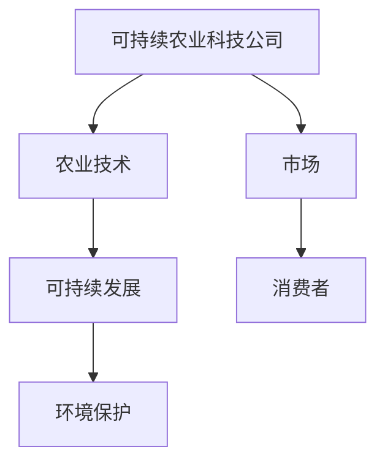
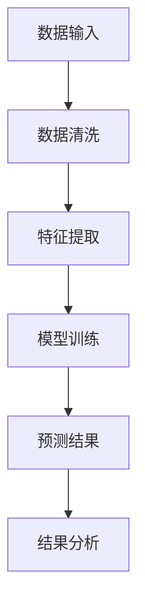
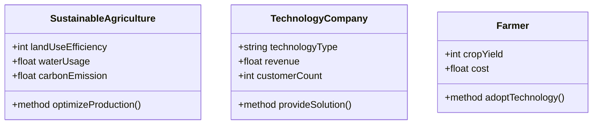
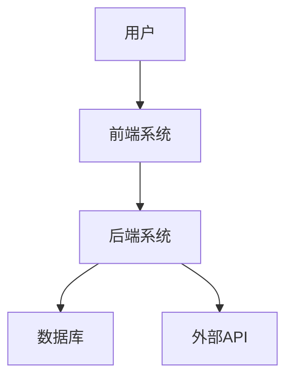
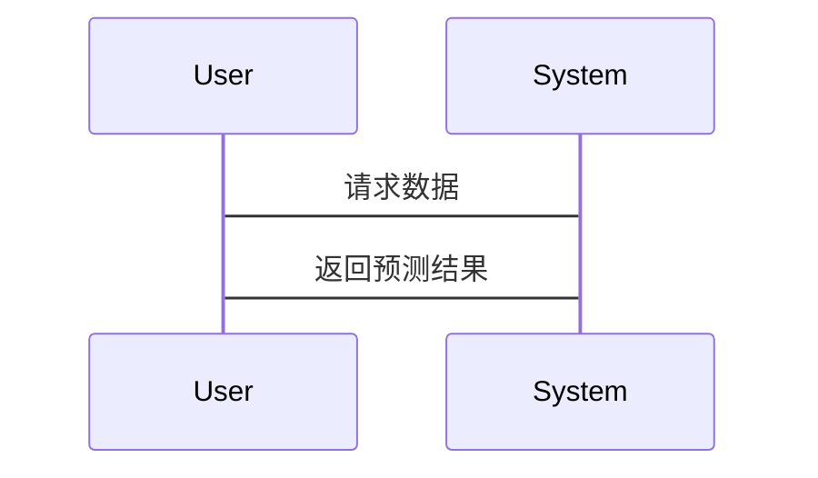

                 


# 可持续农业科技公司的市场前景预测

## 关键词：可持续农业、农业科技公司、市场前景、预测模型、投资机会、技术应用

## 摘要：随着全球人口增长、资源短缺和环境问题的加剧，可持续农业成为全球关注的焦点。本文通过分析可持续农业科技公司的核心概念、市场现状、技术应用和预测模型，探讨其未来的发展趋势和投资机会。通过详细的技术分析和案例研究，本文为读者提供关于可持续农业科技公司的深度见解。

---

# 第一部分: 可持续农业科技公司的市场前景预测背景介绍

## 第1章: 可持续农业科技公司的概念与背景

### 1.1 可持续农业的定义与特征

#### 1.1.1 可持续农业的核心概念
可持续农业是一种以生态友好、资源高效利用和经济可持续为目标的农业生产方式。其核心在于在满足当前需求的同时，不损害后代的生存和发展的能力。

#### 1.1.2 可持续农业的三大支柱
1. **环境可持续性**：减少资源消耗和环境污染，保护生态系统。
2. **经济可持续性**：确保农民和企业能够长期获得经济收益。
3. **社会可持续性**：提高农民的生活质量，促进农村社区的发展。

#### 1.1.3 可持续农业与传统农业的对比
| 特性            | 可持续农业                     | 传统农业                     |
|-----------------|-------------------------------|-----------------------------|
| 资源利用         | 高效、循环                   | 低效、线性                   |
| 环境影响         | 小                           | 大                           |
| 经济模式         | 多元化、可持续                 | 单一化、依赖外部输入           |
| 社会影响         | 促进社区发展                   | 可能导致资源分配不均           |

### 1.2 科技在农业中的应用与发展

#### 1.2.1 农业科技的历史演变
农业科技经历了从传统工具到现代技术的演变：
1. **传统农业**：依赖人工劳动和简单工具。
2. **机械化农业**：引入机械提高生产效率。
3. **精准农业**：利用GPS、传感器等技术实现精准管理。
4. **智慧农业**：结合物联网、人工智能和大数据，实现智能化管理。

#### 1.2.2 当前农业科技的主要领域
1. **智能设备**：如无人机、智能 irrigation systems。
2. **数据驱动决策**：通过大数据分析优化生产。
3. **生物技术**：如基因编辑技术（CRISPR）。
4. **可再生能源**：如太阳能在农业中的应用。

#### 1.2.3 农业科技与可持续发展的关系
农业科技是实现可持续农业的核心驱动力。通过技术创新，可以减少资源浪费、提高效率并降低环境影响。

### 1.3 可持续农业科技公司的定义与边界

#### 1.3.1 可持续农业科技公司的定义
可持续农业科技公司是以可持续农业为目标，利用科技创新提供解决方案的企业。这些公司通常专注于某一领域，如智能设备、数据分析或生物技术。

#### 1.3.2 公司的边界与外延
- **边界**：专注于农业领域的技术创新。
- **外延**：延伸至相关产业，如供应链管理、农村金融等。

#### 1.3.3 核心要素与组成结构
- 核心要素：技术创新能力、市场洞察力、可持续发展理念。
- 组成结构：研发团队、市场团队、技术支持团队。

## 第2章: 可持续农业科技公司的核心概念与联系

### 2.1 核心概念的原理与特征

#### 2.1.1 可持续农业的技术特征
- **资源高效利用**：通过技术手段减少水、土地和能源的浪费。
- **环境友好**：减少污染物排放，保护生态系统。
- **经济可持续**：通过技术创新降低成本，提高收益。

#### 2.1.2 科技公司的商业模式
- **订阅模式**：提供技术服务，按需收费。
- **产品销售**：销售智能设备或软件。
- **合作模式**：与政府、企业合作，共同推动可持续农业。

#### 2.1.3 可持续性与经济效益的平衡
通过技术创新，可持续农业可以实现经济效益与环境效益的双赢。例如，智能 irrigation systems 可以减少水资源浪费，同时提高作物产量。

### 2.2 核心概念的对比分析

#### 2.2.1 不同农业科技公司的对比
| 参数           | 公司A（专注智能设备） | 公司B（专注数据分析） | 公司C（专注生物技术） |
|----------------|------------------------|-------------------------|------------------------|
| 核心技术       | 智能灌溉设备          | 大数据分析工具         | 基因编辑技术         |
| 市场定位       | 农民和农业企业          | 政府和大型农业企业      | 种子企业和科研机构    |
| 发展潜力       | 中等                   | 高                      | 高                      |

#### 2.2.2 可持续性与传统模式的对比
| 特性           | 可持续农业模式       | 传统农业模式           |
|----------------|-----------------------|-------------------------|
| 资源利用效率   | 高                    | 低                     |
| 环境影响       | 小                    | 大                     |
| 经济收益       | 中高                  | 中低                   |
| 社会影响       | 积极                  | 中性或负面              |

#### 2.2.3 技术创新与市场接受度的对比
- **技术创新**：高技术创新往往面临较高的市场接受度门槛。
- **市场接受度**：市场对可持续农业技术的接受度逐步提高。

### 2.3 实体关系图


---

# 第二部分: 可持续农业科技公司的市场预测模型

## 第3章: 市场预测模型的算法原理

### 3.1 算法原理概述

#### 3.1.1 数据预处理
- **数据清洗**：去除重复数据和异常值。
- **特征提取**：选择对预测有影响的关键特征。

#### 3.1.2 模型选择
- **线性回归**：适用于线性关系。
- **随机森林**：适用于非线性关系。
- **时间序列分析**：适用于历史数据预测。

#### 3.1.3 模型训练与优化
- **训练数据**：使用历史数据进行模型训练。
- **优化参数**：通过交叉验证优化模型参数。

### 3.2 算法流程图


### 3.3 算法实现代码

#### 3.3.1 线性回归模型
```python
import pandas as pd
from sklearn.model_selection import train_test_split
from sklearn.linear_model import LinearRegression

# 数据加载
data = pd.read_csv('agriculture_data.csv')

# 数据预处理
X = data[['feature1', 'feature2']]
y = data['target']

# 数据分割
X_train, X_test, y_train, y_test = train_test_split(X, y, test_size=0.2)

# 模型训练
model = LinearRegression()
model.fit(X_train, y_train)

# 预测结果
y_pred = model.predict(X_test)
```

#### 3.3.2 数学模型
$$ y = \beta_0 + \beta_1x_1 + \beta_2x_2 + \epsilon $$

其中：
- $y$ 是目标变量
- $x_1, x_2$ 是自变量
- $\beta_0, \beta_1, \beta_2$ 是回归系数
- $\epsilon$ 是误差项

---

## 第4章: 系统分析与架构设计方案

### 4.1 问题场景介绍
可持续农业科技公司需要解决的问题包括资源浪费、环境污染和农民收入低等。

### 4.2 项目介绍
项目目标：开发一个可持续农业技术解决方案。

### 4.3 系统功能设计

#### 4.3.1 领域模型类图


### 4.4 系统架构设计

#### 4.4.1 系统架构图


### 4.5 系统接口设计

#### 4.5.1 系统交互序列图


---

## 第5章: 项目实战

### 5.1 环境安装

#### 5.1.1 Python环境安装
安装Python和必要的库：
```bash
pip install numpy pandas scikit-learn
```

### 5.2 核心代码实现

#### 5.2.1 可持续农业预测代码
```python
import pandas as pd
from sklearn.linear_model import LinearRegression

# 数据加载
data = pd.read_csv('agriculture_data.csv')

# 数据预处理
X = data[['feature1', 'feature2']]
y = data['target']

# 数据分割
X_train, X_test, y_train, y_test = train_test_split(X, y, test_size=0.2)

# 模型训练
model = LinearRegression()
model.fit(X_train, y_train)

# 预测结果
y_pred = model.predict(X_test)
```

### 5.3 案例分析与解读

#### 5.3.1 案例分析
案例：某农业科技公司开发了一种智能 irrigation system，通过数据分析优化水资源利用，减少浪费30%。

#### 5.3.2 代码解读
- 数据加载：从CSV文件加载数据。
- 数据预处理：选择关键特征。
- 模型训练：使用线性回归训练模型。
- 预测结果：输出预测结果并进行分析。

---

## 第6章: 总结与展望

### 6.1 最佳实践 tips
- **技术创新**：持续投入研发，保持技术领先。
- **市场洞察**：深入了解客户需求，制定个性化解决方案。
- **可持续发展**：在追求经济效益的同时，注重环境保护和社会责任。

### 6.2 小结
通过技术创新和市场洞察，可持续农业科技公司有望在未来几年实现快速发展。随着技术的不断进步，可持续农业将为全球粮食安全和环境保护做出重要贡献。

### 6.3 注意事项
- 风险：技术落地难度大，市场接受度低。
- 挑战：资源有限，需要政府和企业的支持。

### 6.4 拓展阅读
- 推荐书籍：《The Innovator's Guide to Growth》
- 推荐网站：[农业科技公司案例库](https://www.techagriculture.com)

---

# 作者：AI天才研究院/AI Genius Institute & 禅与计算机程序设计艺术 /Zen And The Art of Computer Programming

