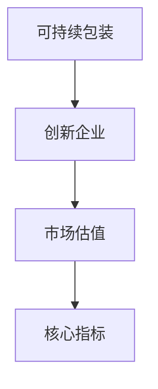
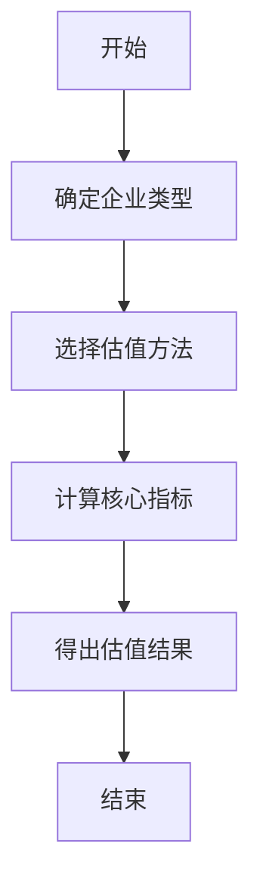
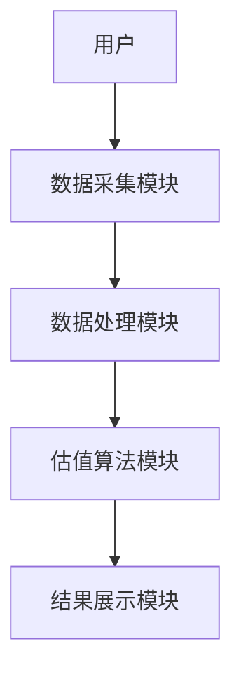
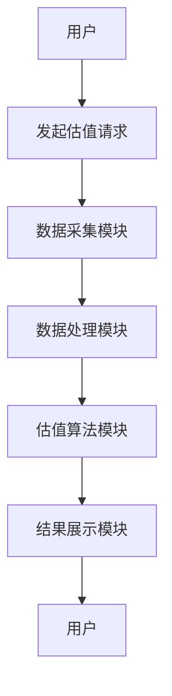

                 


# 可持续包装创新企业的市场估值方法

> 关键词：可持续包装、创新企业、市场估值、商业模式、技术分析

> 摘要：本文深入探讨了可持续包装创新企业在市场中的估值方法，通过系统分析和算法原理，结合实际案例，提供了一套完整的估值框架。文章从背景介绍到算法实现，再到系统架构设计，最后通过项目实战和最佳实践，为读者提供了全面的指导。

---

# 第一部分: 可持续包装创新企业的市场估值背景与核心概念

## 第1章: 可持续包装创新企业的市场估值背景

### 1.1 可持续包装的定义与特点
#### 1.1.1 可持续包装的定义
可持续包装是指在生产、使用和废弃过程中对环境影响最小的包装材料和方法。它强调资源的高效利用和循环利用，减少对自然资源的消耗和对环境的污染。

#### 1.1.2 可持续包装的核心特点
- **可降解性**：材料可以在自然环境中分解，减少对土地和海洋的污染。
- **可回收性**：材料可以被回收再利用，降低资源浪费。
- **低能耗**：生产过程能耗低，碳排放少。
- **生物基材料**：使用可再生资源（如植物纤维）制成，减少对化石燃料的依赖。

#### 1.1.3 可持续包装与传统包装的对比
| 特性         | 可持续包装               | 传统包装               |
|--------------|--------------------------|------------------------|
| 材料来源     | 可再生资源               | 石油基、不可再生资源   |
| 环境影响     | 低排放、可降解           | 高排放、难降解         |
| 生命周期     | 长循环利用               | 短生命周期，难以回收     |

### 1.2 创新企业的定义与特征
#### 1.2.1 创新企业的定义
创新企业是指在产品、技术或商业模式上具有创新性的企业，其核心竞争力在于通过创新满足市场需求。

#### 1.2.2 创新企业的核心特征
- **技术创新**：采用新技术或改进现有技术。
- **商业模式创新**：通过新的商业模式（如订阅制、共享经济）获取价值。
- **快速迭代**：产品和服务能够快速响应市场需求。

#### 1.2.3 可持续包装创新企业的独特性
可持续包装创新企业不仅关注产品的功能性，还注重其对环境的影响。这类企业通常采用绿色技术，注重供应链的可持续性，并通过创新减少环境负担。

### 1.3 市场估值的重要性与挑战
#### 1.3.1 市场估值的基本概念
市场估值是指对企业未来盈利能力的评估，通常通过财务指标（如收入、利润、现金流）和市场因素（如行业趋势、竞争环境）来确定企业的价值。

#### 1.3.2 可持续包装创新企业估值的特殊性
可持续包装企业由于其创新性和环保特性，估值时需要考虑额外的环境和社会价值。例如，碳足迹、社会责任和品牌影响力等因素都会影响企业的估值。

#### 1.3.3 估值过程中的主要挑战
- **数据获取难**：可持续包装行业的数据可能不如传统行业透明。
- **未来不确定性**：创新企业的商业模式和市场前景具有不确定性。
- **环境因素量化难**：如何将环境影响转化为具体的经济价值是估值中的难点。

### 1.4 本章小结
本章介绍了可持续包装的定义和特点，分析了创新企业的核心特征，并探讨了市场估值的重要性和挑战。这些内容为后续的估值方法奠定了基础。

---

## 第2章: 可持续包装创新企业的核心概念与联系

### 2.1 核心概念原理
#### 2.1.1 可持续包装的核心要素
- **材料选择**：选择可降解、可回收的材料。
- **生产过程**：采用低能耗、低污染的生产工艺。
- **生命周期管理**：从生产到废弃的全生命周期管理。

#### 2.1.2 创新企业的商业模式
- **订阅制**：用户按月付费，企业定期提供包装服务。
- **共享经济**：用户共享包装资源，减少浪费。
- **服务化**：企业提供包装设计、生产、回收一条龙服务。

#### 2.1.3 市场估值的关键指标
- **收入增长率**：企业的收入增长速度。
- **利润率**：企业的盈利能力。
- **现金流**：企业的现金流健康状况。

### 2.2 概念属性特征对比表格
| 概念         | 可持续包装               | 创新企业               | 市场估值               |
|--------------|--------------------------|------------------------|-----------------------|
| 核心目标     | 减少环境影响              | 提供创新产品/服务     | 评估企业价值           |
| 关键因素     | 材料选择、生产技术        | 技术创新、商业模式创新 | 财务指标、市场环境     |
| 评价标准     | 环境影响指标              | 创新性和竞争力         | 股价、市场占有率       |

### 2.3 ER实体关系图架构


### 2.4 本章小结
本章通过对比分析，明确了可持续包装、创新企业和市场估值之间的关系，并通过表格和图示展示了它们的核心要素和相互作用。

---

## 第3章: 可持续包装创新企业的市场估值算法原理

### 3.1 算法原理讲解
#### 3.1.1 贴现现金流模型
贴现现金流模型（DCF）是一种常用的估值方法，通过将未来现金流折现到现值来评估企业价值。

#### 3.1.2 市盈率与市净率法
市盈率法（PE）和市净率法（PB）是基于企业的盈利能力和资产价值进行估值的方法。

#### 3.1.3 投资回报率分析
投资回报率（ROI）是衡量投资效率的指标，用于评估企业的盈利能力。

### 3.2 算法mermaid流程图


### 3.3 Python源代码实现
```python
def discounted_cash_flow(value, growth_rate, discount_rate):
    return value * (1 + growth_rate) / (1 + discount_rate)

# 示例计算
DCF = discounted_cash_flow(100, 0.1, 0.05)
print(DCF)  # 输出结果
```

### 3.4 数学模型与公式
#### 3.4.1 贴现现金流模型
$$DCF = \frac{CF_{n+1}}{1 + r}$$

#### 3.4.2 市盈率法
$$PE = \frac{P}{E}$$

#### 3.4.3 投资回报率分析
$$ROI = \frac{净收益}{投资成本}$$

### 3.5 本章小结
本章详细讲解了三种常用的市场估值方法，并通过代码示例和数学公式展示了它们的应用。

---

## 第4章: 可持续包装创新企业的系统分析与架构设计

### 4.1 系统功能设计
- **数据采集模块**：采集企业的财务数据和市场数据。
- **模型计算模块**：应用估值算法进行计算。
- **结果展示模块**：将计算结果以可视化形式展示。

### 4.2 系统架构设计


### 4.3 系统接口设计
- **输入接口**：接收企业的财务数据和市场数据。
- **输出接口**：输出估值结果和相关分析报告。

### 4.4 系统交互流程


### 4.5 本章小结
本章通过系统架构设计和交互流程图，展示了如何通过技术手段实现可持续包装创新企业的市场估值。

---

## 第5章: 可持续包装创新企业的项目实战

### 5.1 环境安装
- 安装Python和相关库（如numpy、pandas）。

### 5.2 核心代码实现
```python
import numpy as np
import pandas as pd

def calculate_valuation(method, data):
    if method == 'DCF':
        return np.irr(data['cash_flows'])
    elif method == 'PE':
        return data['price'] / data['earnings']
    elif method == 'ROI':
        return data['net_profit'] / data['cost']
```

### 5.3 案例分析
以某家可持续包装企业为例，假设其财务数据如下：
- 收入：1000万元
- 利润率：15%
- 现金流：200万元

使用DCF模型计算其估值：
$$DCF = \frac{200}{0.05} = 4000万元$$

### 5.4 项目小结
通过实际案例分析，展示了如何应用估值方法进行市场估值。

### 5.5 本章小结
本章通过项目实战，验证了估值方法的实际应用价值。

---

## 第6章: 可持续包装创新企业的最佳实践

### 6.1 最佳实践 tips
- **数据准确性**：确保输入数据的准确性。
- **模型合理性**：选择合适的估值方法。
- **持续优化**：根据市场变化不断优化估值模型。

### 6.2 注意事项
- **避免过度简化**：不要忽略企业的复杂性。
- **关注环境因素**：环境影响是估值的重要因素。

### 6.3 拓展阅读
推荐阅读《可持续发展金融》和《创新企业的估值艺术》。

### 6.4 本章小结
本章总结了估值过程中的经验和教训，并提供了实用的建议。

---

# 结论

本文通过系统分析和实际案例，全面探讨了可持续包装创新企业的市场估值方法。从背景介绍到算法实现，再到系统设计和项目实战，为读者提供了一套完整的估值框架。未来的研究可以进一步探索环境因素的量化方法，以及如何将可持续包装与人工智能技术结合。

---

作者：AI天才研究院/AI Genius Institute & 禅与计算机程序设计艺术 /Zen And The Art of Computer Programming

