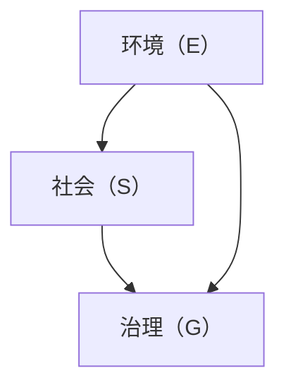
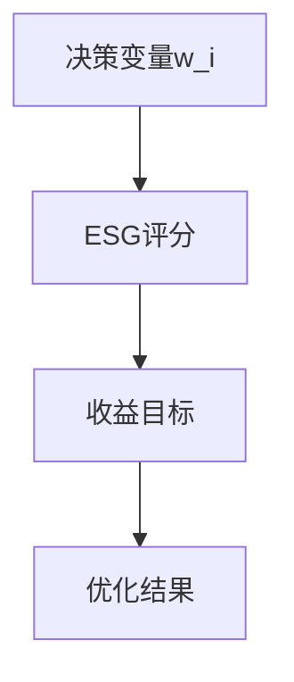
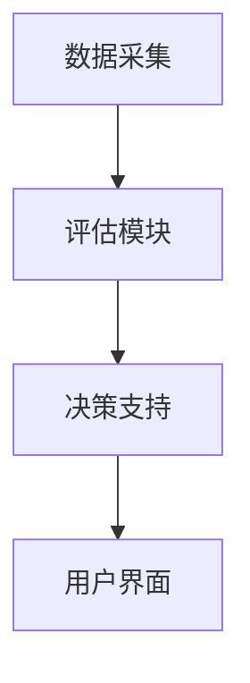
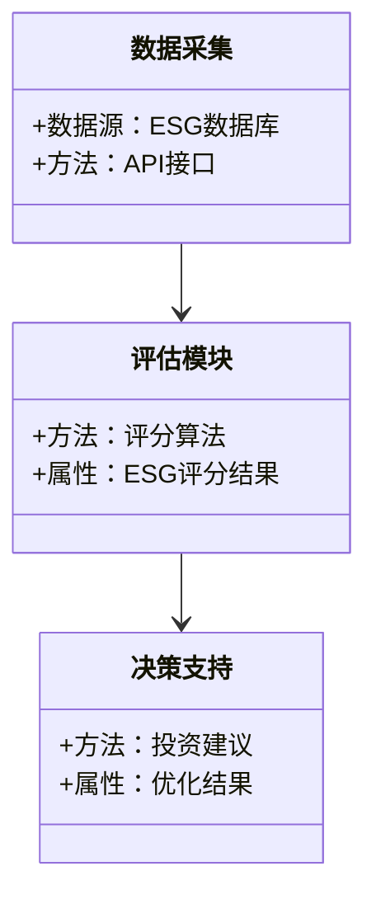
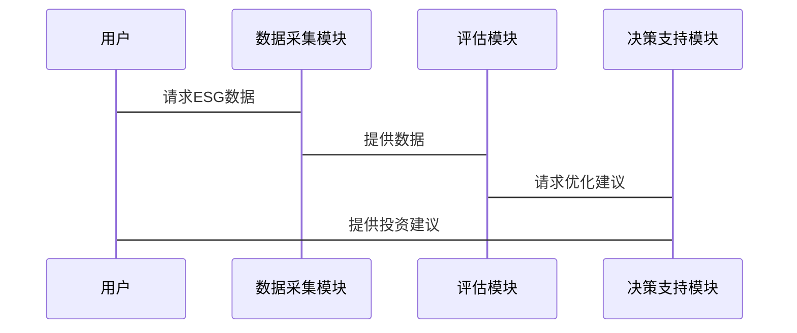

                 


# 可持续发展投资（ESG）：长期价值创造的新范式

> 关键词：可持续发展投资、ESG、环境、社会、治理、长期价值、投资新范式

> 摘要：随着全球对可持续发展的关注不断增加，ESG（环境、社会、治理）投资逐渐成为主流。本文从ESG的核心概念、分析框架、系统设计到实际案例，详细探讨了ESG投资的内在逻辑、实践方法和未来趋势，揭示其如何成为长期价值创造的新范式。

---

# 第1章: ESG投资的背景与核心概念

## 1.1 ESG投资的背景与意义

### 1.1.1 全球可持续发展背景
- 全球气候变化的加剧
- 社会不平等与公平正义的呼声
- 治理失效对企业的影响
- 投资者对长期价值的关注

### 1.1.2 ESG投资的起源与发展
- 从早期的道德投资到现代的ESG框架
- 全球主要市场的ESG投资现状
- 中国市场的ESG投资特点与挑战

### 1.1.3 ESG投资的核心理念与目标
- 长期价值创造的内在逻辑
- ESG投资对社会可持续发展的推动作用
- ESG投资与财务回报的关系

## 1.2 ESG的核心概念与体系架构

### 1.2.1 环境（E）的定义与特征
- 环境因素的核心要素：碳排放、资源消耗、生态保护
- 环境指标的重要性与权重

### 1.2.2 社会（S）的定义与特征
- 社会因素的核心要素：员工权益、社区参与、公平就业
- 社会指标的权重与影响

### 1.2.3 治理（G）的定义与特征
- 治理因素的核心要素：公司治理结构、高管薪酬、董事会多样性
- 治理指标的权重与影响

### 1.2.4 ESG三者的相互关系与整合
- E、S、G之间的相互作用
- ESG整体架构的系统图解（Mermaid图）

## 1.3 ESG核心概念的属性特征对比

### 1.3.1 ESG三者的核心属性对比表
| 因素 | 环境（E） | 社会（S） | 治理（G） |
|------|-----------|-----------|-----------|
| 核心 | 碳排放、资源利用 | 员工权益、社区参与 | 治理结构、高管薪酬 |
| 重要性 | 高 | 中 | 高 |

### 1.3.2 ESG三者的指标权重与重要性分析
- 环境因素通常权重较高，尤其是在碳中和目标下
- 治理因素在企业长期稳定性中的重要性日益凸显
- 社会因素在品牌建设和客户忠诚度中的作用

## 1.4 ESG投资的经济与社会价值

### 1.4.1 长期价值创造的内在逻辑
- 可持续发展如何转化为企业竞争力
- ESG表现与股价的相关性

### 1.4.2 ESG投资对社会可持续发展的推动作用
- 通过投资推动企业改善环境表现
- 促进社会公平与正义
- 提升企业治理透明度

### 1.4.3 ESG投资与财务回报的关系
- 研究表明ESG表现良好的企业具有更高的抗风险能力
- 长期价值创造与股东利益的统一

## 1.5 本章小结
- ESG投资不仅是社会发展的需要，也是企业长期价值创造的核心驱动力
- 通过整合环境、社会和治理因素，ESG投资为投资者提供了新的价值评估维度

---

# 第2章: ESG投资的分析框架与方法论

## 2.1 ESG投资的分析框架

### 2.1.1 ESG分析的维度
- 环境维度：碳排放、资源利用效率
- 社会维度：员工权益、社区参与
- 治理维度：董事会结构、高管薪酬

### 2.1.2 ESG分析的逻辑流程
1. 确定分析目标：选择行业与企业
2. 数据收集：获取企业的ESG指标
3. 评估与评分：基于权重进行评分
4. 投资决策：结合财务指标进行资产配置

### 2.1.3 ESG分析框架的系统图解（Mermaid图）


## 2.2 ESG评分与评级方法

### 2.2.1 ESG评分的核心指标体系
- 环境指标：碳排放强度、可再生能源使用比例
- 社会指标：员工满意度、社区投资
- 治理指标：董事会多样性、高管薪酬结构

### 2.2.2 ESG评级的常用方法与模型
- 等级评分法：AAA到CCC
- 综合评分法：0到100分
- 偏好排序法：基于投资者偏好权重

### 2.2.3 ESG评分与评级的优缺点分析
- 优点：提供量化评估标准
- 缺点：指标权重的主观性

## 2.3 ESG投资的决策模型

### 2.3.1 基于ESG的资产配置模型
- 投资组合优化：最大化ESG评分同时实现收益目标
- 数学模型：
  $$ \text{最大化} \sum w_i \times \text{ESG评分}(i) $$
  $$ \text{约束} \sum w_i \times \text{收益}(i) \geq R $$
  $$ \sum w_i = 1 $$

### 2.3.2 ESG投资的收益-风险优化模型
- 使用均值-方差优化，加入ESG评分作为约束
  $$ \text{最小化} \sum w_i \times \sigma_i^2 $$
  $$ \text{最大化} \sum w_i \times \text{ESG评分}(i) $$
  $$ \sum w_i = 1 $$

### 2.3.3 ESG决策模型的数学表达（Mermaid图）


## 2.4 本章小结
- ESG分析需要结合多维度指标，构建科学的评分与评级体系
- 数学模型为投资决策提供了量化工具
- ESG评分与评级方法的优缺点需要在实际应用中权衡

---

# 第3章: ESG投资的系统分析与架构设计

## 3.1 ESG投资的系统分析

### 3.1.1 系统功能设计
- 数据采集模块：收集企业ESG数据
- 评估模块：计算ESG评分
- 决策支持模块：提供投资建议

### 3.1.2 系统架构设计（Mermaid图）


### 3.1.3 系统接口设计
- 数据接口：与ESG数据源对接
- 用户接口：提供可视化结果

## 3.2 ESG投资的系统架构

### 3.2.1 系统功能设计（Mermaid类图）


### 3.2.2 系统架构设计（Mermaid架构图）


### 3.2.3 系统交互设计（Mermaid序列图）


## 3.3 本章小结
- 系统化的方法能够提高ESG投资的效率与准确性
- 架构设计为大规模应用提供了基础
- 系统交互设计确保了用户友好的体验

---

# 第4章: ESG投资的项目实战与最佳实践

## 4.1 项目实战：基于ESG的某行业投资分析

### 4.1.1 环境搭建
- 数据源：选择公开的ESG数据库
- 工具：Python、Pandas、Scikit-learn

### 4.1.2 核心实现

#### 4.1.2.1 ESG评分计算
```python
import pandas as pd

# 假设df为包含ESG指标的数据框
def calculate_esg_score(df):
    # 定义权重
    weights = {'E': 0.4, 'S': 0.3, 'G': 0.3}
    # 计算加权评分
    esg_score = df[['E', 'S', 'G']].mean(axis=1) * weights.values()
    return esg_score
```

#### 4.1.2.2 投资组合优化
```python
import numpy as np

# 假设returns为投资组合的收益矩阵
def optimize_portfolio(returns, esg_scores):
    n = len(returns)
    # 定义目标函数
    def objective(w):
        return np.dot(w.T, returns @ w)
    # 定义约束
    constraints = [
        ('sum', w, ==, 1),
        ('<=', w, 0, 0.1)  # 最大化ESG评分
    ]
    # 使用优化算法求解
    result = minimize(objective, initial_guess, constraints)
    return result.x
```

### 4.1.3 代码应用解读与分析
- 数据清洗与预处理的重要性
- 权重设置对评分结果的影响
- 优化算法的选择与实现细节

### 4.1.4 实际案例分析
- 以新能源行业为例，分析企业的ESG表现
- 通过优化模型选择最优投资组合

## 4.2 最佳实践与注意事项

### 4.2.1 数据质量的重要性
- 数据来源的可靠性
- 数据清洗与预处理的必要性

### 4.2.2 投资策略的动态调整
- 定期更新ESG评分
- 根据市场变化调整权重

### 4.2.3 风险管理
- ESG投资的非流动性风险
- 短期波动对长期价值的影响

### 4.2.4 持续学习与优化
- 关注ESG指标的最新变化
- 引入新的分析方法与工具

## 4.3 本章小结
- 实战项目展示了ESG投资的具体应用
- 最佳实践为投资者提供了实用的指导
- 持续学习与优化是ESG投资成功的关键

---

# 第5章: ESG投资的未来趋势与展望

## 5.1 ESG投资的未来发展趋势

### 5.1.1 技术驱动的ESG投资
- 人工智能在ESG数据分析中的应用
- 大数据分析与ESG评分的优化

### 5.1.2 ESG投资的全球化与本地化
- 全球统一标准的探索
- 本地化实践的重要性

### 5.1.3 可持续金融产品的创新
- 绿色债券、ESG基金的快速发展
- 创新金融工具的开发

## 5.2 ESG投资对社会价值的影响

### 5.2.1 推动企业治理透明化
- 提升公司治理效率
- 促进董事会多样性

### 5.2.2 促进社会公平与正义
- 通过投资改善社会不平等问题
- 推动企业履行社会责任

### 5.2.3 保护环境与气候变化应对
- 减少碳足迹
- 推动可再生能源发展

## 5.3 本章小结
- ESG投资的未来发展充满潜力
- 技术与创新将推动ESG投资的深化
- ESG投资将为社会创造更多价值

---

# 作者：AI天才研究院/AI Genius Institute & 禅与计算机程序设计艺术 /Zen And The Art of Computer Programming

