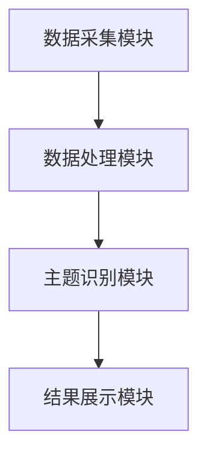

                 


# 可持续发展目标（SDGs）与投资主题识别

## 关键词：
可持续发展目标, 投资主题识别, 机器学习, 数据挖掘, 系统架构设计

## 摘要：
本文旨在探讨可持续发展目标（SDGs）与投资主题识别之间的关联，通过详细分析SDGs的核心概念、投资主题识别的重要性，以及如何利用先进的算法和系统架构来实现SDGs驱动的投资主题识别。文章从背景介绍、核心概念、算法原理、系统架构设计、项目实战到最佳实践，逐步深入，为读者提供全面而系统的指导。

---

## 第1章: 可持续发展目标（SDGs）概述

### 1.1 SDGs的核心概念
#### 1.1.1 SDGs的定义与目标
可持续发展目标（Sustainable Development Goals, SDGs）是联合国在2015年提出的17个全球目标，旨在通过合作解决社会、经济和环境问题。SDGs的目标包括消除贫困、保护地球、促进繁荣等，是全球可持续发展的蓝图。

#### 1.1.2 SDGs的17个具体目标
SDGs的17个具体目标包括：
1. 消除贫困，确保所有人享有尊严和体面的生活。
2. 消除饥饿，实现粮食安全，改善营养状况。
3. 确保健康的生活方式，促进福祉，减少死亡率。
4. 提供包容性和公平的优质教育，促进终身学习。
5. 实现性别平等，增强所有妇女和女孩的能力。
6. 确保清洁的水和 sanitation，推动水资源的可持续管理。
7. 确保清洁能源的普遍获取，推动能源的可持续利用。
8. 促进包容性经济增长，体面就业，和经济增长。
9. 建设有韧性的基础设施，促进工业化，并推动技术创新。
10. 减少不平等，促进各国内部和社会各阶层的包容发展。
11. 创建可持续的城市和社区。
12. 促进负责任的消费和生产模式。
13. 应对气候变化，提升气候适应能力，减少温室气体排放。
14. 保护海洋生态系统，防止海洋污染。
15. 保护和恢复陆地生态系统，促进森林可持续管理。
16. 促进和平、公正、包容性社会，确保所有人参与和平决策。
17. 加强合作伙伴关系，实现多边主义和全球伙伴关系。

#### 1.1.3 SDGs的全球影响与意义
SDGs不仅是联合国的倡议，更是全球各国实现可持续发展的重要指导框架。通过SDGs，各国可以在消除贫困、保护环境、促进社会公平等方面展开合作，推动全球经济增长和社会进步。

---

### 1.2 投资主题识别的重要性
#### 1.2.1 投资主题识别的定义
投资主题识别是指通过分析投资目标、市场趋势和相关数据，识别出具有潜力的投资主题。这些主题通常与社会、经济和环境的可持续发展密切相关。

#### 1.2.2 投资主题识别的必要性
在当前全球经济环境下，投资者需要关注可持续发展，以降低风险、提升收益。通过识别与SDGs相关的投资主题，投资者可以更好地把握市场趋势，优化投资组合。

#### 1.2.3 SDGs与投资主题识别的关联
SDGs为投资主题识别提供了明确的方向和框架。例如，投资于可再生能源、绿色科技和可持续农业等领域，可以直接支持SDGs的实现。

---

## 第2章: SDGs与投资主题识别的核心概念

### 2.1 SDGs与投资主题识别的关系
#### 2.1.1 SDGs对投资主题的影响
SDGs为投资主题识别提供了目标导向，帮助投资者关注具有社会和环境价值的领域。例如，投资于清洁能源技术可以直接支持SDG7（清洁能源）的实现。

#### 2.1.2 投资主题识别在SDGs中的作用
通过投资主题识别，投资者可以支持SDG的实现，同时获得长期的收益。这不仅有助于推动社会和环境目标，还能提升企业的品牌形象和市场竞争力。

---

## 第3章: 投资主题识别的算法原理

### 3.1 算法原理概述
#### 3.1.1 基于文本挖掘的主题识别
文本挖掘是一种从非结构化数据中提取有用信息的技术。通过分析企业年报、新闻报道等文本数据，可以识别出与SDGs相关的投资主题。

#### 3.1.2 基于机器学习的主题分类
机器学习算法可以通过历史数据和标签，自动学习投资主题的特征，从而实现主题分类。

### 3.2 投资主题识别的数学模型
#### 3.2.1 主题识别的向量空间模型
向量空间模型通过将文本表示为向量，计算文本之间的相似度。例如，使用TF-IDF（词频-逆文档频率）计算关键词的重要性。

公式：
$$\text{TF-IDF}(t, d) = \text{TF}(t, d) \times \text{IDF}(t, d)$$

其中，$\text{TF}(t, d)$表示词$t$在文档$d$中的频率，$\text{IDF}(t, d)$表示词$t$的逆文档频率。

#### 3.2.2 主题识别的聚类算法
聚类算法可以将相似的投资主题归为一类。例如，使用K-means算法对投资主题进行聚类。

公式：
$$\text{聚类中心} = \text{argmin} \sum_{i=1}^{n} \sum_{j=1}^{k} w_{ij}d(c_j, c_i)$$

其中，$w_{ij}$表示文档$i$和主题$j$的权重，$d(c_j, c_i)$表示主题$j$和主题$i$之间的距离。

---

## 第4章: 投资主题识别的系统架构与实现

### 4.1 系统功能设计
#### 4.1.1 数据采集模块
数据采集模块负责从各种数据源（如企业年报、新闻报道等）获取数据。

#### 4.1.2 数据处理模块
数据处理模块对采集的数据进行清洗、转换和预处理，提取关键词和主题标签。

#### 4.1.3 主题识别模块
主题识别模块利用机器学习算法对数据进行主题分类和聚类，识别出与SDGs相关的投资主题。

#### 4.1.4 结果展示模块
结果展示模块将识别出的投资主题以可视化的方式呈现，方便投资者理解和决策。

### 4.2 系统架构图


---

## 第5章: 项目实战

### 5.1 项目背景与目标
本项目旨在通过分析企业年报和新闻报道，识别出与SDGs相关的投资主题。

### 5.2 项目实现
#### 5.2.1 环境安装
需要安装Python、机器学习库（如scikit-learn、NLTK）和可视化工具（如Matplotlib）。

#### 5.2.2 核心代码实现
```python
from sklearn.feature_extraction.text import TfidfVectorizer
from sklearn.cluster import KMeans
import numpy as np

# 示例数据
texts = ["可再生能源技术", "绿色建筑", "可持续农业", "清洁能源", "社会责任"]

# TF-IDF向量化
vectorizer = TfidfVectorizer()
X = vectorizer.fit_transform(texts)

# K-means聚类
kmeans = KMeans(n_clusters=2)
kmeans.fit(X)

# 获取聚类结果
clusters = kmeans.labels_

# 显示结果
for i in range(len(texts)):
    print(f"文本{i+1}: {texts[i]}，聚类结果：{clusters[i]}")
```

#### 5.2.3 结果分析
通过代码运行，可以识别出不同的投资主题，并根据聚类结果进行分析。

---

## 第6章: 最佳实践与总结

### 6.1 小结
本文详细介绍了SDGs与投资主题识别的核心概念、算法原理和系统架构设计。通过项目实战，展示了如何利用机器学习技术识别投资主题，并为投资者提供决策支持。

### 6.2 注意事项
在实际应用中，需要注意数据的质量和多样性，同时结合企业的具体需求进行调整。

### 6.3 拓展阅读
建议读者进一步阅读相关文献，了解更多的机器学习算法和数据挖掘技术。

---

## 作者：AI天才研究院/AI Genius Institute & 禅与计算机程序设计艺术 /Zen And The Art of Computer Programming

---

希望这篇文章能够帮助读者更好地理解可持续发展目标（SDGs）与投资主题识别之间的关系，并为实际应用提供有价值的参考。

