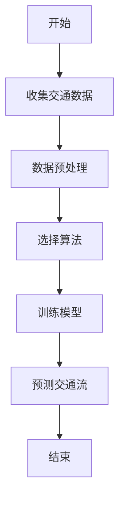

                 


# 可持续城市交通解决方案的市场前景

> 关键词：可持续交通、城市交通、市场前景、技术解决方案、智能交通系统

> 摘要：本文探讨了可持续城市交通解决方案的市场前景，分析了当前城市交通面临的挑战，提出了基于电动化、智能化和共享化的技术解决方案。通过市场分析和案例研究，本文详细阐述了这些解决方案的商业模式、投资分析以及未来的发展趋势。

---

## 第一章：可持续城市交通的背景与问题背景

### 1.1 可持续城市交通的核心概念

可持续交通是指通过优化资源利用和减少环境影响，满足城市交通需求的交通方式。它强调减少碳排放、提高能源效率和降低交通拥堵。可持续交通的核心目标是实现经济、社会和环境的协调发展。

### 1.2 问题背景与问题描述

当前城市交通面临的主要问题包括：

- **交通拥堵**：城市化进程加快导致交通需求激增，道路资源有限，导致交通拥堵。
- **环境污染**：传统燃油车辆排放大量温室气体和污染物，加剧了空气污染问题。
- **能源消耗**：城市交通对化石能源的依赖导致能源消耗巨大，且不可持续。

### 1.3 可持续交通解决方案的边界与外延

- **边界**：可持续交通解决方案的边界包括城市交通系统的设计、运行和管理，不涉及其他领域。
- **外延**：外延包括与交通相关的政策、技术和市场因素，如智能交通系统、共享出行等。

### 1.4 可持续交通的核心要素与概念结构

可持续交通的核心要素包括：

- **电动化**：推广电动汽车，减少碳排放。
- **智能化**：利用大数据和人工智能优化交通管理。
- **共享化**：发展共享出行模式，提高资源利用率。

---

## 第二章：可持续城市交通解决方案的核心概念

### 2.1 可持续交通解决方案的原理

可持续交通解决方案基于以下原理：

- **电动化**：通过推广电动汽车和可再生能源，减少对化石燃料的依赖。
- **智能化**：利用智能技术优化交通流量和减少拥堵。
- **共享化**：通过共享出行模式降低车辆闲置率，提高资源利用率。

### 2.2 核心概念的属性特征对比

以下表格对比了可持续交通解决方案的核心概念的属性特征：

| 特性 | 电动化 | 智能化 | 共享化 |
|------|--------|--------|--------|
| 技术基础 | 电动汽车、充电设施 | 大数据、人工智能 | 共享出行平台 |
| 经济效益 | 降低能源成本 | 提高交通效率 | 降低出行成本 |
| 环境效益 | 减少碳排放 | 减少空气污染 | 减少资源浪费 |

### 2.3 ER实体关系图

以下是一个简单的ER实体关系图，展示了可持续交通解决方案中的主要参与者及其关系：

```mermaid
erDiagram
    用户 {
        string 用户ID
        string 用户名
        string 密码
    }
    政府机构 {
        string 政府ID
        string 政府名称
        string 联系方式
    }
    企业 {
        string 企业ID
        string 企业名称
        string 联系方式
    }
    城市交通系统 {
        string 系统ID
        string 系统名称
        string 系统功能
    }
    用户 --> 城市交通系统 : 使用交通服务
    政府机构 --> 城市交通系统 : 提供政策支持
    企业 --> 城市交通系统 : 提供技术支持
```

---

## 第三章：可持续城市交通解决方案的算法原理

### 3.1 算法原理概述

可持续交通解决方案的算法主要包括交通流预测、路径优化和资源分配。

### 3.2 算法流程图

以下是一个交通流预测算法的流程图：



### 3.3 数学模型与公式

交通流预测模型可以通过以下公式表示：

$$
\text{交通流} = \alpha \cdot \text{历史数据} + \beta \cdot \text{实时数据}
$$

其中，$\alpha$ 和 $\beta$ 是模型参数，需要通过训练确定。

---

## 第四章：可持续城市交通解决方案的系统分析与架构设计

### 4.1 系统功能设计

系统功能设计包括：

- 用户模块：用户注册、登录、查询交通信息。
- 政府模块：政策制定、数据分析。
- 企业模块：技术支持、服务提供。

### 4.2 系统架构设计

以下是一个系统架构图：


---

## 第五章：可持续城市交通解决方案的项目实战

### 5.1 环境安装

项目需要以下环境：

- 操作系统：Linux/Windows/MacOS
- 开发工具：Python、Jupyter Notebook
- 数据库：MySQL/PostgreSQL

### 5.2 核心代码实现

以下是一个简单的Python代码示例：

```python
import pandas as pd

def predict_traffic(data):
    # 数据预处理
    processed_data = data.dropna()
    # 模型训练
    model = linear_model.LinearRegression()
    model.fit(processed_data[['time']], processed_data[['traffic']])
    # 预测
    predicted_traffic = model.predict(new_data[['time']])
    return predicted_traffic
```

### 5.3 案例分析

以某城市为例，分析共享出行模式的应用效果：

- **案例背景**：某城市试点共享出行，减少私家车使用率。
- **结果**：减少了交通拥堵和碳排放。

---

## 第六章：可持续城市交通解决方案的未来展望与总结

### 6.1 未来展望

未来，可持续交通将更加智能化和共享化，人工智能和大数据技术将发挥更大作用。

### 6.2 总结

本文探讨了可持续城市交通解决方案的市场前景，分析了技术解决方案和商业模式，展望了未来的发展趋势。

---

## 作者：AI天才研究院/AI Genius Institute & 禅与计算机程序设计艺术 /Zen And The Art of Computer Programming

