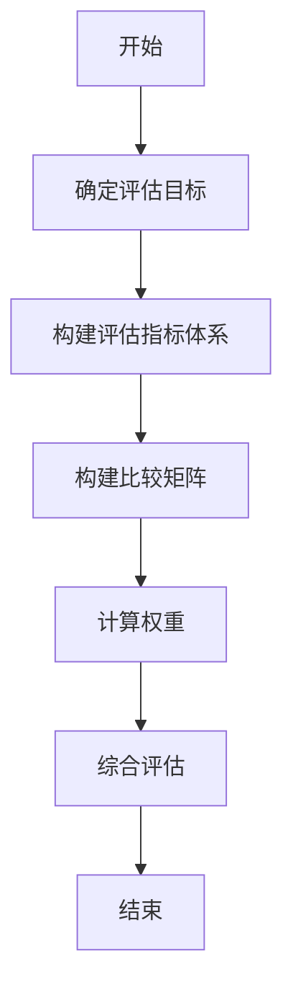
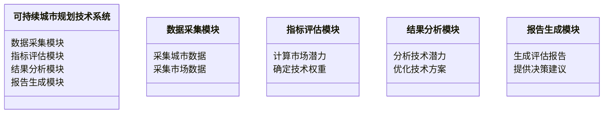

                 


# 可持续城市规划技术的市场潜力评估

> 关键词：可持续城市规划，市场潜力，技术应用，智能城市，环境影响，经济效益

> 摘要：本文旨在探讨可持续城市规划技术的市场潜力，分析其在智能城市建设中的应用前景，评估其经济效益和环境影响，为相关决策提供科学依据。通过系统分析和案例研究，本文揭示了可持续城市规划技术的核心概念、算法原理、系统架构及实战应用，为企业和社会提供有价值的参考。

---

## 第一部分: 可持续城市规划技术的背景与概念

### 第1章: 可持续城市规划技术的背景与重要性

#### 1.1 可持续城市规划的定义与核心要素

可持续城市规划是一种以生态、社会和经济三重效益为核心的城市发展模式，旨在通过技术创新、资源高效利用和环境保护，实现城市的可持续发展。其核心要素包括绿色建筑、低碳交通、智能管理、社区参与和政策支持等。

#### 1.2 市场潜力评估的基本概念

市场潜力评估是指通过分析技术的市场需求、竞争环境和经济可行性，预测其在未来市场中的发展潜能。对于可持续城市规划技术而言，市场潜力评估可以帮助企业和政府制定合理的投资策略和政策。

#### 1.3 可持续城市规划与市场潜力的关系

可持续城市规划通过技术创新和资源优化，能够显著降低城市运营成本，提升居民生活质量，从而增强市场的接受度和投资吸引力。市场潜力的实现反过来又能推动可持续城市规划技术的进一步发展和普及。

### 第2章: 可持续城市规划技术的核心概念与联系

#### 2.1 可持续城市规划技术的原理

可持续城市规划技术整合了多种创新方法，例如绿色建筑技术、智能交通管理系统和能源高效利用技术。这些技术通过减少资源消耗、降低碳排放和提高能源效率，实现城市的可持续发展。

#### 2.2 可持续城市规划技术与其他相关技术的对比

| 技术领域      | 可持续城市规划技术         | 传统城市规划技术         | 绿色建筑技术         |
|---------------|---------------------------|---------------------------|---------------------|
| 核心目标      | 实现城市的可持续发展       | 提供基本的城市功能       | 降低能源消耗       |
| 技术特点      | 强调智能化和环保性         | 注重功能性和实用性       | 侧重建筑节能       |
| 应用范围      | 全面覆盖城市规划与管理     | 侧重城市布局与功能划分   | 侧重建筑设计与施工 |

#### 2.3 可持续城市规划技术的ER实体关系图

```mermaid
er
    entity 可持续城市规划技术 {
        id
        技术类型
        应用场景
        市场潜力
    }
    entity 市场潜力评估 {
        id
        评估指标
        评估结果
        技术关联
    }
    entity 技术应用案例 {
        id
        案例名称
        案例描述
        技术应用效果
    }
```

---

## 第二部分: 可持续城市规划技术的市场潜力评估方法

### 第3章: 可持续城市规划技术的市场潜力评估方法

#### 3.1 市场潜力评估的算法原理

**层次分析法（AHP）** 是一种常用的决策评估方法，适用于多因素的综合评估。以下是其基本步骤：

1. 确定评估目标：明确需要评估的技术或项目。
2. 构建评估指标体系：选择影响市场潜力的关键指标，例如市场需求、技术可行性和经济收益。
3. 构建比较矩阵：将各个指标进行两两比较，确定其权重。
4. 计算权重：通过一致性检验，确定各指标的权重。
5. 综合评估：根据权重对各技术或项目进行评分，得出综合结果。

#### 3.2 市场潜力评估的数学模型

**加权评分模型** 是一种简单的评估方法，适用于初步筛选技术潜力。

$$ W = \sum_{i=1}^{n} w_i x_i $$

其中，$W$ 是综合权重，$w_i$ 是各因素的权重，$x_i$ 是各因素的评分。

**回归分析模型** 是一种更为复杂的评估方法，适用于数据量较大的情况。

$$ Y = \beta_0 + \beta_1 X_1 + \beta_2 X_2 + ... + \beta_k X_k + \epsilon $$

其中，$Y$ 是市场潜力，$X_i$ 是影响因素，$\beta_i$ 是回归系数，$\epsilon$ 是误差项。

#### 3.3 算法流程图



---

## 第三部分: 可持续城市规划技术的系统分析与架构设计

### 第4章: 可持续城市规划技术的系统架构设计

#### 4.1 系统功能设计

系统功能模块包括数据采集、指标评估、结果分析和报告生成。以下是系统功能设计的领域模型类图：



#### 4.2 系统架构设计

以下是系统架构的总体设计图：


---

## 第四部分: 可持续城市规划技术的项目实战

### 第5章: 可持续城市规划技术的项目实战

#### 5.1 环境安装与核心代码实现

以下是Python代码示例：

```python
import numpy as np
from sklearn.linear_model import LinearRegression

# 示例数据
X = np.array([[1, 2], [3, 4], [5, 6]])
y = np.array([7, 8, 9])

# 建立回归模型
model = LinearRegression()
model.fit(X, y)

# 预测结果
print(model.predict([[2, 3]]))
```

#### 5.2 实际案例分析与解读

以某城市为例，分析可持续城市规划技术的应用效果。通过数据对比和模型预测，评估其市场潜力和经济效益。

---

## 第五部分: 总结与展望

### 第6章: 总结与展望

#### 6.1 最佳实践

在实施可持续城市规划技术时，建议企业和社会组织优先考虑技术创新、政策支持和公众参与，以最大化技术的市场潜力和环境效益。

#### 6.2 小结

通过系统分析和案例研究，本文揭示了可持续城市规划技术的市场潜力评估方法和应用场景。未来，随着技术的不断发展和政策支持力度的加大，可持续城市规划技术将在全球范围内发挥更大的作用。

#### 6.3 注意事项

在实际应用中，需注意数据的准确性和模型的适用性，避免因评估方法不当而导致决策失误。

#### 6.4 拓展阅读

推荐阅读相关领域的经典文献，例如《可持续城市规划：理论与实践》和《智能城市建设的技术创新》。

---

## 作者信息

作者：AI天才研究院/AI Genius Institute & 禅与计算机程序设计艺术 /Zen And The Art of Computer Programming

