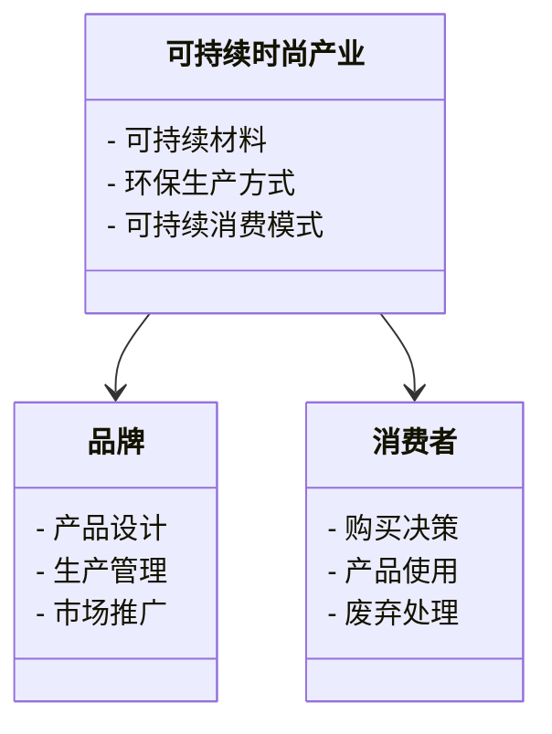
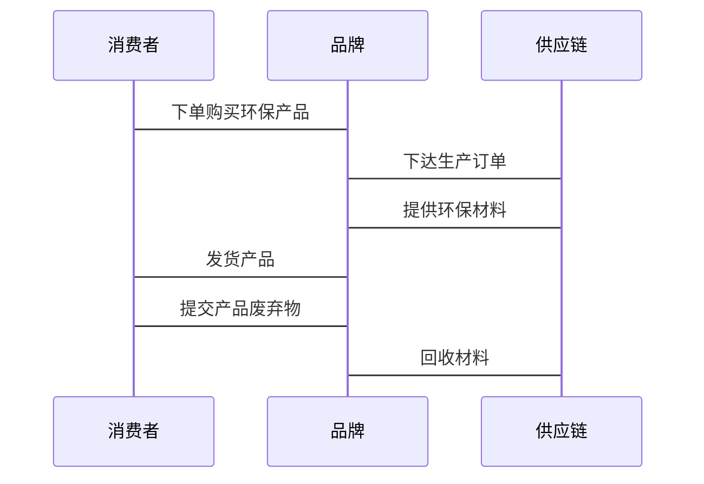

                 


# 可持续时尚产业的发展趋势与投资前景

## 关键词：可持续时尚、环境保护、循环经济、投资前景、技术创新

## 摘要：  
可持续时尚是一种以环保和社会责任为核心的新型时尚产业模式，通过创新材料、生产方式和消费模式，解决传统时尚产业带来的环境和社会问题。本文将分析可持续时尚的核心概念、发展趋势、投资前景，并探讨其系统架构与实际案例，为投资者和从业者提供深度洞察。

---

# 第一部分：可持续时尚产业的背景与核心概念

## 第1章：可持续时尚产业的背景介绍

### 1.1 可持续时尚的定义与核心要素

#### 1.1.1 可持续时尚的定义
可持续时尚是一种通过使用环保材料、优化生产流程、倡导可持续消费模式，以减少对环境和社会负面影响的时尚产业模式。它强调从原材料选择、生产过程到产品生命周期的全面可持续性。

#### 1.1.2 可持续时尚的核心要素
- **环保材料**：使用可再生材料（如有机棉、再生聚酯纤维）或低环境影响材料（如植物基材料）。
- **循环经济**：通过设计耐用产品、回收利用和共享经济模式，延长产品生命周期。
- **社会责任**：关注工人权益、公平贸易和社区发展，确保生产过程的透明性和道德性。
- **可持续消费**：引导消费者选择环保产品，倡导理性消费和废弃物减少。

#### 1.1.3 可持续时尚与传统时尚的区别
- **材料选择**：传统时尚多使用合成纤维和不可再生材料，而可持续时尚强调使用环保材料。
- **生产方式**：传统生产注重速度和成本，而可持续时尚注重减少碳排放和水足迹。
- **消费模式**：传统消费强调快时尚和一次性消费，而可持续时尚倡导慢时尚和循环利用。

### 1.2 可持续时尚的背景与问题背景

#### 1.2.1 环境问题的加剧
- 传统时尚产业是全球第二大污染行业，每年产生约2000万吨纺织废料，大量使用有害化学物质，导致水污染和空气污染。
- 纺织生产过程消耗大量水资源，全球约20%的工业水污染来自纺织业。

#### 1.2.2 社会问题的凸显
- 快时尚模式导致大量低质量、低成本产品的生产，工人权益得不到保障，尤其是发展中国家的工厂工人面临恶劣的工作条件和低工资。
- 消费者对快时尚的依赖导致过度消费和浪费，加剧了资源枯竭和环境污染。

#### 1.2.3 传统时尚产业的局限性
- 环境影响巨大：从原材料提取到生产、运输、消费和废弃，每个环节都产生大量碳排放和污染。
- 社会责任缺失：许多品牌忽视工人权益和生产过程中的道德问题。
- 消费者行为不可持续：快时尚模式培养了冲动消费习惯，导致资源浪费和环境污染。

### 1.3 可持续时尚的解决方案

#### 1.3.1 环境友好型生产方式
- 使用环保材料：例如，使用有机棉、再生聚酯纤维、竹纤维等。
- 优化生产流程：减少水和能源的使用，采用无害化学工艺，减少碳排放。
- 循环经济模式：通过设计可回收的产品，建立回收体系，延长产品生命周期。

#### 1.3.2 社会责任型商业模式
- 公平贸易：确保工人获得合理的工资和良好的工作条件。
- 透明供应链：公开生产过程和供应商信息，确保供应链的道德性。
- 社区支持：通过支持本地生产、合作和社区发展，促进社会公平。

#### 1.3.3 可持续消费行为的引导
- 教育消费者：通过宣传和教育，改变消费者的消费习惯，倡导理性消费。
- 提供可持续选择：通过产品标签和认证，帮助消费者选择环保产品。
- 鼓励共享经济：通过租赁、共享和二手交易平台，延长产品的使用周期。

---

## 第2章：可持续时尚的核心概念与联系

### 2.1 核心概念原理

#### 2.1.1 可持续材料的使用
- 可再生材料：例如，有机棉、再生聚酯纤维、竹纤维等。
- 低环境影响材料：例如，使用植物基材料（如麻、大麻）或海洋塑料。

#### 2.1.2 环保生产流程
- 优化资源使用：例如，采用节水技术和节能设备。
- 无害化学工艺：例如，使用环保染料和无水染色技术。
- 低碳运输：例如，选择铁路和海运而非空运，减少碳排放。

#### 2.1.3 可持续消费模式
- 耐用产品设计：通过高质量设计和模块化设计，延长产品使用寿命。
- 产品生命周期管理：通过设计可回收产品和逆向物流体系，减少废弃物产生。
- 消费者教育：通过教育和宣传，引导消费者选择环保产品和理性消费。

### 2.2 核心概念属性特征对比表

| 特性       | 可持续时尚       | 传统时尚       |
|------------|----------------|----------------|
| 材料来源     | 可再生/环保材料   | 常规材料       |
| 生产方式     | 低能耗/零排放     | 高能耗/高排放 |
| 消费模式     | 循环利用/理性消费 | 快时尚/冲动消费 |

### 2.3 核心概念实体关系图


---

## 第3章：可持续时尚的发展趋势分析

### 3.1 全球可持续时尚发展趋势

#### 3.1.1 环保法规的加强
- 各国政府开始出台环保法规，例如欧盟的《循环经济行动计划》和中国的“碳中和”目标。
- 纺织行业面临更严格的环保标准，例如限制有害化学物质的使用和减少碳排放。

#### 3.1.2 消费者行为的变化
- 消费者越来越关注产品的环保和社会责任属性，尤其是Z世代和千禧一代。
- 消费者更倾向于选择透明、可持续的品牌，对品牌的信任度和忠诚度更高。

#### 3.1.3 技术创新的推动
- 数字化生产技术：例如，3D打印技术用于生产鞋类和配饰。
- 智能服装：例如，含有传感器的衣物，可以监测健康数据。
- 区块链技术：用于供应链透明化，确保材料来源和生产过程的可追溯性。

### 3.2 区域市场特点分析

#### 3.2.1 欧洲市场
- 欧洲是可持续时尚发展最快的地区之一，消费者环保意识强，政府监管严格。
- 许多品牌已经推出环保产品线，并承诺实现碳中和。

#### 3.2.2 中国市场
- 中国市场潜力巨大，消费者对可持续时尚的认知度逐步提高。
- 中国政府推动绿色发展战略，支持环保产业的发展。

#### 3.2.3 北美市场
- 北美市场注重创新和科技驱动，许多科技公司开始进入可持续时尚领域。
- 消费者对透明供应链和环保材料的需求增加。

### 3.3 技术创新带来的变化

#### 3.3.1 循环经济模式
- 通过设计可回收的产品，建立回收体系，延长产品生命周期。
- 例如，Patagonia的Worn Wear计划，鼓励消费者购买二手产品。

#### 3.3.2 数字化与智能化
- 使用数字平台和移动应用，提供在线试衣、虚拟试装等服务，减少物理试穿带来的碳排放。
- 利用大数据分析消费者行为，优化生产和供应链管理。

#### 3.3.3 区块链技术
- 区块链技术可以用于追踪材料来源和生产过程，确保供应链的透明性和真实性。
- 例如，Everledger平台用于追踪钻石和奢侈品的来源。

---

## 第4章：可持续时尚产业的投资前景分析

### 4.1 可持续时尚市场的潜力与机会

#### 4.1.1 市场规模增长
- 根据麦肯锡的报告，到2030年，全球可持续时尚市场规模将达到1.5万亿美元。
- 消费者对环保产品的偏好增加，尤其是在发达国家市场。

#### 4.1.2 技术驱动的投资机会
- 投资环保材料和技术研发，例如投资新型纤维技术和染色工艺。
- 投资循环经济模式，例如建立回收体系和共享经济平台。

#### 4.1.3 社会责任投资（ESG）
- 投资者越来越关注企业的环境、社会和治理（ESG）表现，可持续时尚品牌更容易获得资本支持。

### 4.2 可持续时尚投资的挑战与风险

#### 4.2.1 成本问题
- 可持续材料和生产方式的成本通常高于传统方式，导致产品价格较高。
- 例如，有机棉的价格是传统棉的2-3倍，可能影响市场竞争力。

#### 4.2.2 消费者接受度
- 尽管消费者环保意识提高，但许多人对可持续产品的价格敏感，可能导致市场渗透率低。
- 例如，快时尚品牌推出环保产品线时，可能面临消费者对价格的质疑。

#### 4.2.3 供应链风险
- 可持续材料的供应链不稳定，例如棉花价格上涨或供应不足。
- 环保生产技术不成熟，可能导致生产效率低下。

### 4.3 可持续时尚投资的成功案例

#### 4.3.1 Patagonia
- 作为户外服装品牌，Patagonia长期致力于环保和可持续发展。
- 通过使用环保材料、公平贸易和透明供应链，Patagonia成为可持续时尚的标杆品牌。

#### 4.3.2 Eileen Fisher
- Eileen Fisher推出“闭 loop”项目，通过回收旧衣料生产新面料，延长产品生命周期。
- 该公司还提供租赁服务，鼓励消费者共享服装，减少浪费。

---

## 第5章：可持续时尚的系统分析与架构设计

### 5.1 可持续时尚产业的系统架构

#### 5.1.1 问题场景介绍
- 可持续时尚产业需要解决的问题包括：材料浪费、生产污染、消费浪费、供应链不透明等。

#### 5.1.2 系统功能设计

##### 5.1.2.1 领域模型（Mermaid 类图）


##### 5.1.2.2 系统架构设计（Mermaid 架构图）


#### 5.1.3 系统接口设计
- **品牌与供应商接口**：订单管理、原材料采购、生产计划。
- **品牌与消费者接口**：在线购物、产品信息查询、售后服务。
- **消费者与废弃物处理接口**：回收点、租赁平台、共享平台。

#### 5.1.4 系统交互设计（Mermaid 序列图）


### 5.2 可持续时尚产业的数学模型

#### 5.2.1 可持续时尚市场的增长预测
- 模型公式：
  $$ 市场规模 = 基础市场规模 \times (1 + 增长率)^{年份} $$
- 参数解释：
  - 基础市场规模：当前市场规模。
  - 增长率：年增长率，通常基于市场研究数据。
  - 年份：预测的年数。

#### 5.2.2 环保材料的成本对比
- 模型公式：
  $$ 可持续材料成本 = 传统材料成本 \times (1 + 环保材料溢价) $$
- 参数解释：
  - 环保材料溢价：可持续材料比传统材料贵的比例，通常为20%-50%。

---

## 第6章：可持续时尚产业的项目实战

### 6.1 可持续服装品牌开发案例

#### 6.1.1 项目背景
- 某初创公司计划推出一个可持续服装品牌，目标是吸引环保意识强的消费者。

#### 6.1.2 项目需求
- 使用环保材料（如有机棉、再生聚酯纤维）。
- 实现透明供应链，确保生产过程的道德性。
- 提供循环利用的产品，如租赁和回收服务。

#### 6.1.3 核心实现

##### 6.1.3.1 环保材料的选择
- 选择有机棉作为主要面料，减少农药使用和水污染。
- 使用再生聚酯纤维作为辅料，减少塑料废弃物。

##### 6.1.3.2 透明供应链管理
- 与公平贸易认证的供应商合作，确保工人权益。
- 使用区块链技术追踪材料来源和生产过程。

##### 6.1.3.3 循环经济模式
- 提供租赁服务，消费者可以按月支付费用，延长产品使用周期。
- 建立回收体系，消费者可以退回旧衣物换取折扣。

#### 6.1.4 项目代码实现

##### 6.1.4.1 环保材料数据库
```python
# 环保材料数据库
class Material:
    def __init__(self, name, environmental_impact):
        self.name = name
        self.environmental_impact = environmental_impact

# 有机棉和再生聚酯纤维
organic_cotton = Material("有机棉", 0.2)
recycled_polyester = Material("再生聚酯纤维", 0.1)
```

##### 6.1.4.2 供应链管理模块
```python
# 供应链管理模块
class Supplier:
    def __init__(self, name, certification, location):
        self.name = name
        self.certification = certification
        self.location = location

# 公平贸易认证供应商
supplier1 = Supplier("供应商A", "公平贸易认证", "东南亚")
```

##### 6.1.4.3 循环经济模块
```python
# 循环经济模块
class RecyclingProgram:
    def __init__(self, name, description):
        self.name = name
        self.description = description

# 回收计划
recycling_program = RecyclingProgram("绿色回收", "通过回收旧衣物，减少纺织废弃物")
```

#### 6.1.5 应用与分析
- 通过环保材料选择，减少对环境的影响。
- 透明供应链管理确保生产过程的道德性。
- 循环经济模式延长了产品生命周期，减少了废弃物产生。

#### 6.1.6 项目小结
- 可持续服装品牌的开发需要从材料选择、生产过程和消费模式三方面入手。
- 技术创新（如区块链和循环经济模式）是实现可持续时尚的关键。

---

## 第7章：可持续时尚产业的最佳实践与投资建议

### 7.1 可持续时尚产业的最佳实践

#### 7.1.1 材料选择
- 优先选择可再生和低环境影响材料。
- 与供应商合作开发环保材料，例如与高校和研究机构合作。

#### 7.1.2 生产方式
- 优化生产流程，减少水和能源的使用。
- 采用无害化学工艺，避免污染。

#### 7.1.3 消费者教育
- 通过品牌故事和教育内容，提升消费者的环保意识。
- 提供透明的产品信息，帮助消费者做出环保选择。

### 7.2 可持续时尚产业的投资建议

#### 7.2.1 环保材料和技术研发
- 投资新型纤维技术和染色工艺，降低生产成本。
- 支持环保科技初创公司，推动技术创新。

#### 7.2.2 循环经济模式
- 投资回收体系和共享经济平台，延长产品生命周期。
- 支持二手交易平台的发展，促进可持续消费。

#### 7.2.3 社会责任投资（ESG）
- 投资具有社会责任感的品牌，关注其供应链透明度和工人权益。
- 参与绿色债券和可持续发展基金，支持环保项目。

### 7.3 可持续时尚产业的注意事项

#### 7.3.1 成本问题
- 可持续材料和技术的成本较高，需要通过规模化和技术创新降低成本。
- 例如，通过技术突破实现环保材料的大规模生产。

#### 7.3.2 消费者接受度
- 尽管消费者环保意识提高，但价格敏感性仍然存在，需要通过教育和营销提升品牌认知度。
- 例如，通过品牌故事和用户教育，改变消费者的消费习惯。

#### 7.3.3 供应链风险
- 可持续材料的供应链不稳定，需要建立多元化的供应商体系。
- 例如，与多个地区的供应商合作，确保材料供应的稳定性。

### 7.4 可持续时尚产业的未来展望

#### 7.4.1 技术创新
- 数字化和智能化将推动可持续时尚的发展，例如通过AI优化生产流程和供应链管理。
- 区块链技术将进一步普及，实现供应链的全面透明化。

#### 7.4.2 消费者行为变化
- 消费者对环保和社会责任的关注将继续增加，推动市场对可持续产品的需求。
- 共享经济和循环经济将成为主流，消费者更倾向于租赁和共享产品。

#### 7.4.3 全球合作
- 可持续时尚需要全球合作，包括政府、企业和消费者共同参与。
- 例如，建立全球性的环保认证体系，推动国际间的合作与标准统一。

---

## 第8章：结论与未来展望

### 8.1 结论

可持续时尚产业是应对环境和社会问题的重要解决方案。通过使用环保材料、优化生产流程和倡导可持续消费模式，可以减少对环境和社会的负面影响。随着消费者环保意识的提高和技术的不断进步，可持续时尚产业将迎来更大的发展机会。

### 8.2 未来展望

未来，可持续时尚将从以下几个方面进一步发展：
1. **技术创新**：数字技术、人工智能和区块链将进一步推动可持续时尚的发展。
2. **政策支持**：各国政府将出台更多环保法规，支持可持续时尚产业的发展。
3. **消费者教育**：通过教育和宣传，提升消费者对可持续时尚的认知和参与度。
4. **全球合作**：国际间的合作将加强，推动可持续时尚的全球化发展。

---

## 附录

### 附录A：相关数据与报告
- 全球可持续时尚市场规模数据（来源：麦肯锡、波士顿咨询等）。
- 各国政府出台的环保法规和政策。

### 附录B：环保认证与标签
- 各种环保认证（如GOTS、公平贸易认证）的介绍和标准。
- 可持续时尚产品的标签设计和使用指南。

### 附录C：工具与资源
- 可持续材料供应商列表。
- 环保生产技术的资源和文献。

---

## 作者

作者：AI天才研究院/AI Genius Institute & 禅与计算机程序设计艺术 /Zen And The Art of Computer Programming

