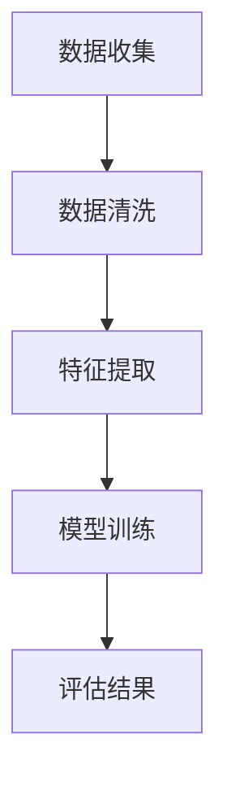
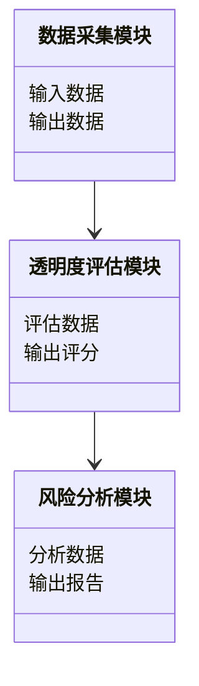
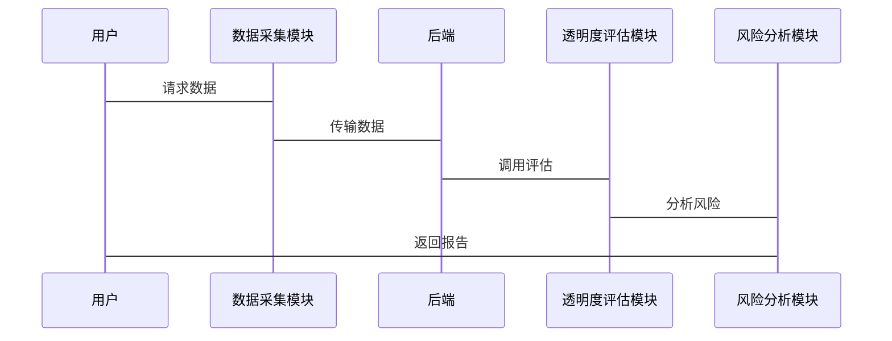

                 


# 可持续时尚供应链的透明度与投资风险

## 关键词：可持续时尚、供应链透明度、投资风险、数据分析、系统架构、风险管理

## 摘要：  
本文探讨了可持续时尚供应链中的透明度与投资风险之间的关系，分析了如何通过提高供应链透明度降低投资风险，并构建了一个数据驱动的透明度评估模型和投资风险分析框架。文章结合实际案例，详细讲解了系统架构设计和项目实现步骤，为企业提供了一套可操作的解决方案。

---

## 第一部分：背景与概述

### 第1章：可持续时尚供应链的背景与挑战

#### 1.1 可持续时尚供应链的定义  
可持续时尚供应链是指从原材料采购、生产、运输到零售的整个过程中，注重环境保护、社会责任和经济效益的整合。其核心特征包括减少资源消耗、降低碳排放、公平贸易和循环经济。  

#### 1.2 透明度与投资风险的背景  
透明供应链是确保消费者了解产品来源和生产过程的关键，而投资风险则涉及供应链中的不确定性因素对企业投资的影响。  

#### 1.3 问题背景与问题描述  
传统供应链存在资源浪费、环境污染和劳工权益问题，导致投资风险增加。透明度低使得企业难以识别和管理风险，影响投资决策。  

#### 1.4 问题解决与边界  
通过提高透明度，企业可以更好地识别和管理供应链中的风险，降低投资风险。边界包括仅关注供应链中的透明度和投资风险，不涉及其他业务领域。  

#### 1.5 核心概念与联系  
透明度和投资风险是可持续供应链中的关键因素，透明度高有助于降低投资风险，反之亦然。  

---

### 第2章：透明度与投资风险的核心概念

#### 2.1 核心概念原理  
透明度涉及供应链各环节的信息公开，投资风险涉及潜在损失的可能性。  

#### 2.2 核心概念对比  
透明度和投资风险的对比表格如下：  

| 属性         | 透明度                         | 投资风险                       |
|--------------|-------------------------------|-------------------------------|
| 定义         | 供应链各环节信息的公开性       | 供应链中的不确定性导致的损失   |
| 属性         | 可视性、可追溯性、公正性       | 风险系数、损失幅度、可控性     |
| 影响因素     | 供应商行为、生产过程、物流     | 市场波动、政策变化、供应链中断 |

#### 2.3 实体关系图  
以下是透明度和投资风险的实体关系图（使用mermaid）：  

```mermaid
erDiagram
    transparent_process {
        id
        process_name
        description
    }
    investment_risk {
        id
        risk_level
        description
    }
    transparent_process --> investment_risk : 影响
```

---

## 第三部分：透明度评估模型

### 第3章：透明度评估模型的设计与实现

#### 3.1 模型设计  
透明度评估模型的数据收集包括供应链各环节的信息，如原材料来源、生产过程、物流和零售环节。模型设计基于这些数据进行综合评估。  

#### 3.2 模型实现  
以下是透明度评估模型的mermaid流程图：  



以下是透明度评估模型的Python代码实现：  

```python
import pandas as pd
from sklearn.metrics import accuracy_score

# 数据加载
data = pd.read_csv('transparency.csv')

# 数据清洗
data.dropna(inplace=True)

# 特征提取
X = data[['材料来源', '生产过程', '物流', '零售']]
y = data['透明度评分']

# 模型训练
from sklearn.ensemble import RandomForestRegressor
model = RandomForestRegressor()
model.fit(X, y)

# 评估结果
predictions = model.predict(X)
print('模型准确率:', accuracy_score(y, predictions))
```

---

## 第四部分：投资风险分析

### 第4章：投资风险的数学模型与分析

#### 4.1 数学模型  
投资风险可以通过线性回归模型进行评估，公式为：  
$$风险 = \beta_0 + \beta_1 \times 透明度$$  

#### 4.2 风险评估  
以下是一个风险评估的案例分析：  

假设透明度评分为0.8，计算投资风险：  
$$风险 = 0.5 + 0.3 \times 0.8 = 0.5 + 0.24 = 0.74$$  

---

## 第五部分：系统分析与架构设计

### 第5章：系统分析与架构设计

#### 5.1 问题场景介绍  
系统应用场景为企业的供应链管理，目标是通过提高透明度降低投资风险。  

#### 5.2 系统功能设计  
以下是系统功能的mermaid类图：  



#### 5.3 系统架构设计  
以下是系统架构的mermaid图：  

```mermaid
container 整体架构 {
    前端
    后端
    数据库
}
```

#### 5.4 系统接口设计  
系统接口包括数据采集接口和评估分析接口，分别用于数据采集和风险评估。  

#### 5.5 系统交互设计  
以下是系统交互的mermaid序列图：  



---

## 第六部分：项目实战

### 第6章：项目实战与实现

#### 6.1 环境安装  
安装所需的Python库：  
```
pip install pandas numpy scikit-learn
```

#### 6.2 核心代码实现  
以下是透明度评估模型和投资风险分析的Python代码：  

```python
import pandas as pd
from sklearn.ensemble import RandomForestRegressor
from sklearn.metrics import accuracy_score

# 数据加载
data = pd.read_csv('transparency.csv')

# 数据清洗
data.dropna(inplace=True)

# 特征提取
X = data[['材料来源', '生产过程', '物流', '零售']]
y = data['透明度评分']

# 模型训练
model = RandomForestRegressor()
model.fit(X, y)

# 评估结果
predictions = model.predict(X)
print('模型准确率:', accuracy_score(y, predictions))

# 投资风险分析
transparency_score = 0.8
risk = 0.5 + 0.3 * transparency_score
print('投资风险:', risk)
```

#### 6.3 案例分析  
通过具体案例展示模型的应用，分析如何通过提高透明度降低投资风险。  

#### 6.4 项目小结  
总结项目实现的关键点，如数据清洗、特征提取和模型训练，强调提高透明度对降低投资风险的重要性。

---

## 第七部分：最佳实践与总结

### 第7章：最佳实践与总结

#### 7.1 最佳实践  
建议企业采用区块链技术增强透明度，定期进行风险评估，并与利益相关者保持良好沟通。  

#### 7.2 小结  
总结全文内容，强调透明度与投资风险之间的关系及提升的重要性。  

#### 7.3 注意事项  
提醒企业在实施过程中可能遇到的挑战，如数据隐私和模型准确性，并提供解决方案。  

#### 7.4 拓展阅读  
推荐相关书籍和资源，供读者深入学习。

---

## 作者信息

作者：AI天才研究院/AI Genius Institute & 禅与计算机程序设计艺术 /Zen And The Art of Computer Programming

