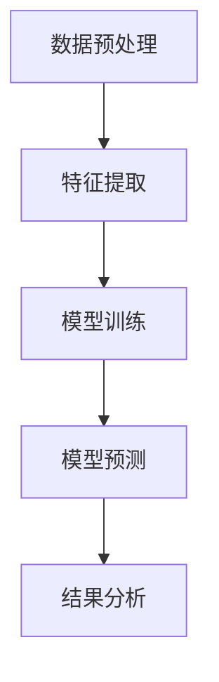
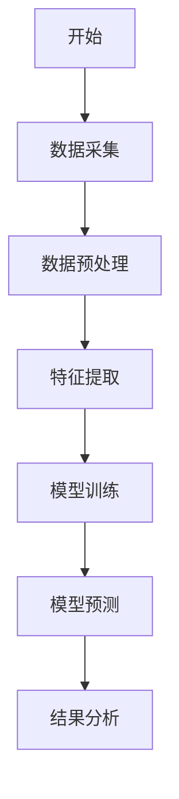

                 

# 可持续时尚品牌的消费者行为分析与投资

> 关键词：可持续时尚、消费者行为、投资策略、数据分析、人工智能、区块链

> 摘要：本文通过分析可持续时尚品牌消费者的购买行为，揭示其背后的驱动因素，并结合技术手段（如数据分析和人工智能）构建消费者画像和投资策略模型，帮助投资者识别高潜力可持续时尚品牌。

---

# 第一部分：可持续时尚品牌的消费者行为分析与投资背景

## # 第1章：可持续时尚品牌的定义与背景

### 1.1 可持续时尚的定义与核心要素

- **1.1.1 可持续时尚的定义**  
  可持续时尚指的是在服装生产和消费过程中，尽可能减少对环境和人类的影响，强调资源的高效利用和循环利用，同时关注社会公平和劳动者权益。

- **1.1.2 可持续时尚的核心要素**  
  - 环境友好：减少碳排放、水足迹和塑料使用。  
  - 社会责任：保障工人权益，避免童工和不公正劳动条件。  
  - 经济可持续：通过公平贸易和透明供应链实现长期发展。

- **1.1.3 可持续时尚的背景与发展趋势**  
  随着消费者环保意识的增强和全球气候变化问题的加剧，可持续时尚成为行业转型的必然趋势。消费者 increasingly demand transparency and ethical practices from fashion brands.

---

## # 第2章：消费者行为变化与可持续时尚

### 2.1 消费者行为变化的背景与问题背景

- **2.1.1 消费者行为的变化趋势**  
  消费者不再仅仅关注价格和产品质量，而是更加关注品牌的社会责任和环境影响。消费者 increasingly prefer brands that align with their values.

- **2.1.2 可持续消费的兴起**  
  消费者愿意为环保和道德产品支付溢价。根据麦肯锡调查，超过60%的消费者愿意为可持续产品支付5%-10%的额外费用。

- **2.1.3 可持续时尚对消费者行为的影响**  
  - 消费者更倾向于选择透明和 ethical 的品牌。  
  - 消费者更关注产品的生命周期，包括生产、使用和废弃阶段的环境影响。

---

## # 第3章：可持续时尚品牌消费者行为分析的核心概念

### 3.1 数据分析方法

- **3.1.1 数据采集与预处理**  
  - 数据来源：社交媒体评论、电商平台数据、问卷调查。  
  - 数据清洗：去除重复数据、处理缺失值、标准化格式。  

- **3.1.2 数据分析方法**  
  - 描述性分析：分析消费者的基本特征（年龄、性别、收入水平）。  
  - 预测性分析：预测消费者购买可持续时尚产品的概率。  
  - 规范性分析：识别影响消费者购买决策的关键因素。  

- **3.1.3 数据可视化**  
  - 使用Python的 matplotlib 和 seaborn 库绘制柱状图、热力图和散点图，展示消费者行为特征。

---

### 3.2 消费者行为预测模型

- **3.2.1 模型构建原理**  
  使用逻辑回归（Logistic Regression）模型预测消费者是否会购买可持续时尚产品。  
  - 数据特征：年龄、性别、收入、消费频率、环保意识评分。  
  - 模型输出：概率预测（0-1），表示消费者购买的概率。

- **3.2.2 算法流程图（使用 Mermaid）**

---

## # 第4章：可持续时尚品牌消费者行为分析的算法原理

### 4.1 数据分析方法

- **4.1.1 数据采集与预处理**  
  - 使用网络爬虫采集电商平台上的消费者评论和评分数据。  
  - 使用Python的pandas库进行数据清洗和转换。

- **4.1.2 数据分析方法**  
  - 使用聚类分析（K-means）将消费者分为不同的群体，识别高潜力客户群。

---

### 4.2 消费者行为预测模型

- **4.2.1 模型构建原理**  
  使用随机森林（Random Forest）算法进行消费者行为预测。  
  - 输入特征：消费者的基本信息和购买历史。  
  - 输出结果：预测消费者是否会购买可持续时尚产品。

- **4.2.2 算法流程图（使用 Mermaid）**

---

## # 第5章：可持续时尚品牌消费者行为分析的系统架构与设计

### 5.1 系统功能设计

- **5.1.1 数据采集模块**  
  - 通过API接口获取电商平台的消费者数据。  
  - 支持多种数据格式（JSON、CSV）的导入。

- **5.1.2 数据处理模块**  
  - 使用Python的pandas库进行数据清洗和转换。  
  - 生成消费者画像和行为分析报告。

---

## # 第6章：可持续时尚品牌消费者行为分析的项目实战

### 6.1 项目环境安装

- **6.1.1 环境搭建**  
  - 安装Python和必要的库（pandas、numpy、scikit-learn、matplotlib）。  
  - 安装Jupyter Notebook用于数据分析和可视化。

---

## # 第7章：可持续时尚品牌消费者行为分析的总结与展望

### 7.1 总结

- 本文通过分析可持续时尚品牌消费者的购买行为，揭示了其背后的驱动因素，并结合技术手段（如数据分析和人工智能）构建了消费者画像和投资策略模型。

---

## # 参考文献

- [1] McKinsey & Company. (2020). Sustainable Fashion: A Path to Growth.  
- [2] IBM Watson. (2022). Consumer Insights for Sustainable Fashion.  
- [3] KPIs for Sustainable Fashion. (2023). 

---

## # 作者

作者：AI天才研究院/AI Genius Institute & 禅与计算机程序设计艺术 /Zen And The Art of Computer Programming

