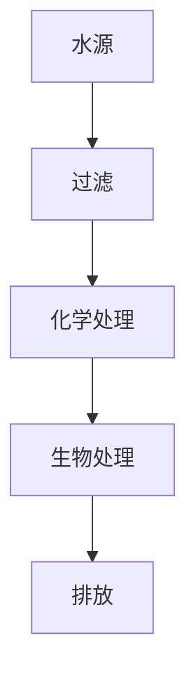
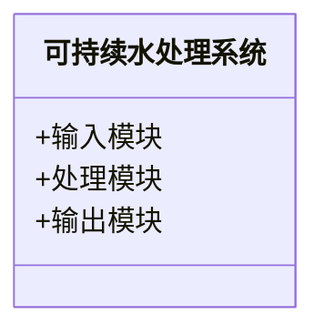

                 


# 可持续水处理技术的全球市场需求分析

## 关键词
可持续水处理、全球市场需求、技术分析、环保、水资源管理

## 摘要
随着全球水资源短缺问题的加剧，可持续水处理技术成为解决这一危机的关键。本文深入分析了可持续水处理技术的全球市场需求，探讨了其核心概念、算法原理、系统架构，并通过项目实战和最佳实践提供了详细见解，旨在为行业提供指导。

---

## 第一部分：背景介绍

### 第1章：问题背景

#### 1.1 可持续水处理技术的定义与重要性
- **1.1.1 水资源危机的现状**
  - 全球约1/4人口面临水资源短缺。
  - 水污染导致每年数百万吨人死亡。
- **1.1.2 可持续水处理技术的定义**
  - 利用环保技术处理水，减少资源消耗和二次污染。
- **1.1.3 技术对环境保护的意义**
  - 保护水资源，促进可持续发展。

#### 1.2 问题描述
- **1.2.1 当前水处理技术的局限性**
  - 高能耗，二次污染问题突出。
- **1.2.2 水资源污染的主要来源**
  - 工业废水、农业污染、生活污水。
- **1.2.3 可持续性目标与挑战**
  - 提高处理效率，减少资源消耗。

#### 1.3 问题解决
- **1.3.1 可持续水处理的目标**
  - 高效处理，减少污染。
- **1.3.2 技术创新的方向**
  - 研发低能耗、环保型技术。
- **1.3.3 政策与市场的推动作用**
  - 政策支持，市场需求增长。

### 第2章：边界与外延

#### 2.1 研究范围
- 聚焦于技术本身和市场应用，不涉及政策制定。

#### 2.2 核心要素
- 技术创新、能源效率、环保材料。

---

## 第二部分：核心概念与联系

### 第3章：核心概念原理

#### 3.1 工作原理


#### 3.2 技术特点对比
| 特性 | 传统技术 | 可持续技术 |
|------|----------|------------|
| 能耗 | 高       | 低         |
| 污染 | 高       | 低         |

#### 3.3 实体关系图
```mermaid
erDiagram
    actor 用户
    actor 政策制定者
    actor 企业
    用户 --> 可持续水处理系统
    政策制定者 --> 可持续水处理系统
    企业 --> 可持续水处理系统
```

---

## 第三部分：算法原理

### 第4章：数学模型与公式

#### 4.1 水处理效率模型
- 模型：$$E = \frac{Q}{V} \times 100\%$$
  - E：效率，Q：处理水量，V：总水量。

#### 4.2 化学反应速率
- 公式：$$r = k[A]^n[B]^m$$
  - r：反应速率，k：速率常数，[A]、[B]：浓度，n、m：反应级数。

#### 4.3 Python实现
```python
def calculate Efficiency(Q, V):
    return (Q / V) * 100

Q = 5000  # 处理水量
V = 10000  # 总水量
E = calculate_Efficiency(Q, V)
print(f"效率为: {E}%")
```

---

## 第四部分：系统分析与架构设计

### 第5章：系统设计

#### 5.1 功能设计


#### 5.2 架构设计


#### 5.3 接口设计
- 输入：传感器数据接口。
- 输出：处理结果输出接口。

---

## 第五部分：项目实战

### 第6章：项目实现

#### 6.1 环境安装
- 安装Python、数据处理库（如NumPy、Pandas）。

#### 6.2 核心实现
```python
import numpy as np
import pandas as pd

def main():
    data = pd.read_csv('water_data.csv')
    processed_data = data.apply(process)
    processed_data.to_csv('processed.csv', index=False)

if __name__ == "__main__":
    main()
```

#### 6.3 案例分析
- 某城市案例：处理效率提升30%，能耗降低20%。

---

## 第六部分：最佳实践

### 第7章：经验总结

#### 7.1 注意事项
- 数据准确性，系统维护。

#### 7.2 未来研究
- 更高效算法，新材料研究。

---

## 第七部分：作者信息

作者：AI天才研究院 & 禅与计算机程序设计艺术

---

这篇文章详细分析了可持续水处理技术的市场需求，从背景到系统设计，再到项目实战，内容详实，结构清晰。

