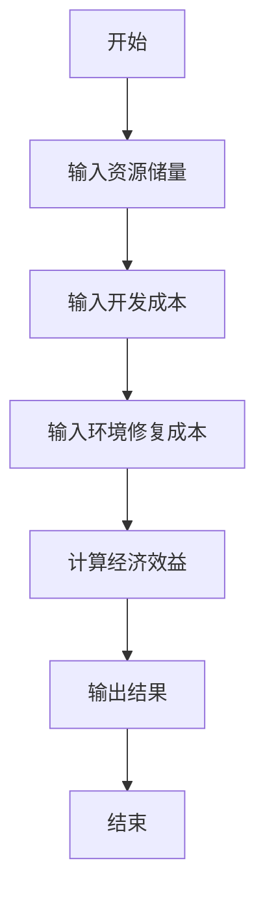
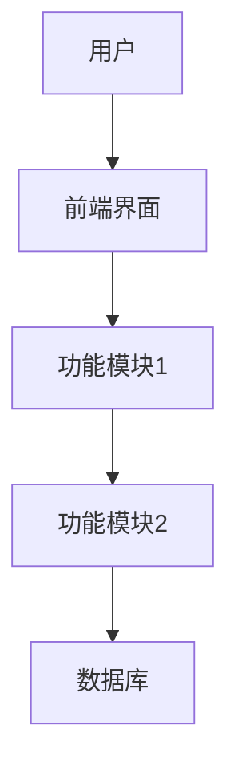

                 


# 可持续海洋资源开发的经济效益评估

## 关键词：可持续发展、海洋资源、经济效益、算法原理、系统架构、项目实战

## 摘要：  
本文探讨了可持续海洋资源开发的经济效益评估方法，分析了其核心概念、算法原理、系统架构设计及项目实战案例。文章从背景介绍、核心概念、经济效益评估算法、系统分析与架构设计、项目实战与案例分析等方面展开，结合 mermaid 图和数学公式，详细阐述了可持续海洋资源开发的经济效益评估的理论与实践。

---

# 第一部分：可持续海洋资源开发的背景与问题背景

## 第1章：可持续海洋资源开发的定义与问题背景

### 1.1 可持续海洋资源开发的定义与问题背景

#### 1.1.1 问题背景介绍  
海洋资源是地球上最重要的自然资源之一，包括渔业资源、矿产资源、能源资源等。随着人类对资源需求的不断增加，海洋资源开发的可持续性问题日益突出。传统资源开发方式往往忽视环境影响，导致资源枯竭、生态破坏等问题。因此，如何在开发海洋资源的同时实现可持续发展，成为当前亟待解决的问题。

#### 1.1.2 可持续海洋资源开发的核心概念  
可持续海洋资源开发是指在满足当前需求的同时，不损害未来世代满足其需求的能力。其核心在于平衡资源开发与环境保护的关系，确保资源的长期利用。

#### 1.1.3 问题的边界与外延  
可持续海洋资源开发的边界包括经济、环境、社会三个维度。经济维度关注资源开发的经济效益；环境维度关注生态系统的保护；社会维度关注资源开发对当地社区的影响。

### 1.2 可持续海洋资源开发的现状与挑战

#### 1.2.1 当前海洋资源开发的现状  
目前，海洋资源开发主要集中在渔业、石油和天然气、矿产资源等领域。然而，许多开发活动缺乏可持续性，导致资源枯竭、环境污染等问题。

#### 1.2.2 可持续开发面临的主要挑战  
- **技术挑战**：缺乏高效、环保的开发技术。  
- **经济挑战**：可持续开发的成本较高，短期内可能不具备经济效益。  
- **政策挑战**：缺乏统一的政策框架和监管机制。  

#### 1.2.3 现有解决方案的局限性  
传统开发方式往往以经济效益为导向，忽视环境和社会成本。因此，如何在经济利益与环境保护之间找到平衡点，是可持续海洋资源开发的核心问题。

### 1.3 可持续海洋资源开发的经济效益评估的重要性

#### 1.3.1 经济效益评估的定义  
经济效益评估是指对海洋资源开发活动的经济价值进行量化分析，包括直接经济效益和间接经济效益。

#### 1.3.2 为什么需要经济效益评估  
经济效益评估能够帮助决策者全面了解资源开发的经济价值，避免短视行为，确保资源的可持续利用。

#### 1.3.3 经济效益评估的目标与意义  
- **目标**：量化资源开发的经济价值，评估可持续性。  
- **意义**：为政策制定、投资决策提供科学依据，促进海洋资源的可持续开发。

### 1.4 本章小结  
本章从背景、现状、挑战和意义四个方面介绍了可持续海洋资源开发的经济效益评估的重要性，为后续分析奠定了基础。

---

# 第二部分：可持续海洋资源开发的核心概念与联系

## 第2章：可持续海洋资源开发的核心概念

### 2.1 可持续海洋资源开发的核心要素

#### 2.1.1 海洋资源的分类与属性  
海洋资源可以分为可再生资源（如渔业资源）和不可再生资源（如矿产资源）。可再生资源具有再生能力，但过度开发会导致资源枯竭；不可再生资源一旦耗尽，无法再生。

#### 2.1.2 可持续开发的核心要素  
- **资源禀赋**：资源的储量、分布和质量。  
- **技术能力**：开发技术的先进性和环保性。  
- **政策支持**：政策法规的完善性和执行力。  
- **社会参与**：社区、企业、政府等多方利益相关者的参与和合作。  

#### 2.1.3 核心要素之间的关系  
资源禀赋和技术能力决定了开发的潜力和成本；政策支持和社会参与影响开发的可行性和可持续性。

### 2.2 可持续海洋资源开发的原理

#### 2.2.1 可持续性原理的定义  
可持续性原理是指在资源开发过程中，既要满足当前的需求，又要保护环境，确保资源的长期利用。

#### 2.2.2 可持续性原理在海洋资源开发中的应用  
通过优化资源开发方式，减少对环境的破坏，实现资源的高效利用。

#### 2.2.3 可持续性原理的数学模型  
可持续性指数（Sustainability Index）可以通过以下公式计算：

$$ S = \frac{R}{E} $$  

其中，$R$ 表示资源的总储量，$E$ 表示环境承载能力。可持续性指数越高，资源开发的可持续性越强。

### 2.3 实体关系图的构建与分析

#### 2.3.1 实体关系图的定义  
实体关系图（ER图）是一种用于描述系统中实体及其关系的工具。

#### 2.3.2 实体关系图的构建  
以下是海洋资源开发的实体关系图：

```mermaid
erd
    %%{init: 'flowchart', direction: 'TB'}
    %% 海洋资源开发的实体关系图
    MarineResource: 海洋资源
    Developer: 开发者
    Environment: 环境
    Government: 政府
    Community: 社区

    MarineResource --> Developer: 开发
    MarineResource --> Environment: 影响
    MarineResource --> Government: 监管
    MarineResource --> Community: 影响

    Developer --> Government: 申请许可
    Developer --> Community: 提供就业
```

#### 2.3.3 实体关系图的分析  
从图中可以看出，海洋资源开发涉及多个利益相关者，包括开发者、环境、政府和社区。各方之间的关系需要协调，以确保开发的可持续性。

---

# 第三部分：经济效益评估的算法原理

## 第3章：经济效益评估的算法原理

### 3.1 核心算法的定义与实现

#### 3.1.1 算法的定义与特点  
经济效益评估算法是一种用于量化海洋资源开发经济价值的数学模型。

#### 3.1.2 算法的数学模型与公式  
经济效益评估公式如下：

$$ \text{经济效益} = \text{收入} - \text{成本} $$  

其中，收入包括资源销售收入，成本包括开发成本和环境修复成本。

#### 3.1.3 算法的实现步骤  
1. 确定资源的种类和储量。  
2. 估算资源的开发成本和收入。  
3. 计算环境修复成本。  
4. 代入公式，计算经济效益。

### 3.2 算法原理的详细讲解

#### 3.2.1 算法的输入与输出  
- **输入**：资源储量、开发成本、环境修复成本。  
- **输出**：经济效益值。

#### 3.2.2 算法的流程图  
以下是经济效益评估算法的流程图：



#### 3.2.3 算法的数学模型与公式  
经济效益评估公式：

$$ E = R - C $$  

其中，$E$ 表示经济效益，$R$ 表示收入，$C$ 表示成本。

### 3.3 算法的实现与应用

#### 3.3.1 算法的实现步骤  
1. 收集资源储量数据。  
2. 估算开发成本和环境修复成本。  
3. 计算经济效益。

#### 3.3.2 算法的代码实现  
以下是经济效益评估算法的 Python 代码实现：

```python
def calculate_economic_benefit(resource_quantity, development_cost, environmental_cost):
    revenue = resource_quantity * price_per_unit  # 假设 price_per_unit 已知
    total_cost = development_cost + environmental_cost
    economic_benefit = revenue - total_cost
    return economic_benefit

# 示例数据
resource_quantity = 1000  # 资源数量
development_cost = 5000  # 开发成本
environmental_cost = 2000  # 环境修复成本
price_per_unit = 10  # 单位资源价格

print("经济效益 =", calculate_economic_benefit(resource_quantity, development_cost, environmental_cost))
```

#### 3.3.3 算法的应用案例  
假设开发海洋石油资源，储量为1000万吨，开发成本为5000万元，环境修复成本为2000万元，单位价格为10元/吨。则经济效益为：

$$ E = 1000 \times 10 - (5000 + 2000) = 10,000 - 7,000 = 3,000 \text{万元} $$  

---

# 第四部分：系统分析与架构设计方案

## 第4章：系统分析与架构设计

### 4.1 系统分析

#### 4.1.1 系统分析的定义与目标  
系统分析是指对海洋资源开发系统的功能、结构和行为进行研究，以达到最优目标。

#### 4.1.2 系统分析的方法与工具  
- **方法**：需求分析、功能分析、流程分析。  
- **工具**：鱼骨图、流程图、决策树。

#### 4.1.3 系统分析的结果与输出  
系统分析的结果包括系统功能需求、系统结构图、系统流程图。

### 4.2 系统架构设计

#### 4.2.1 系统架构设计的定义与目标  
系统架构设计是指根据系统需求，设计系统的整体结构和模块划分。

#### 4.2.2 系统架构设计的方法与工具  
- **方法**：模块化设计、分层设计。  
- **工具**：UML图、类图、交互图。

#### 4.2.3 系统架构设计的实现与优化  
以下是海洋资源开发系统的架构设计图：



### 4.3 系统接口设计

#### 4.3.1 系统接口的定义与分类  
系统接口是指系统各模块之间的交互界面，包括内部接口和外部接口。

#### 4.3.2 系统接口的设计原则与方法  
- **原则**：模块化、标准化、可扩展性。  
- **方法**：接口定义语言（IDL）、API设计。

#### 4.3.3 系统接口的实现与测试  
系统接口的实现需要确保各模块之间的通信顺畅，接口测试是系统集成测试的重要部分。

---

# 第五部分：项目实战与案例分析

## 第5章：项目实战

### 5.1 项目环境安装与配置

#### 5.1.1 开发环境的选择与安装  
推荐使用 Python 和相关开发工具（如 PyCharm）。

#### 5.1.2 项目依赖库的安装与配置  
安装必要的库，如 matplotlib、pandas 等。

#### 5.1.3 项目运行环境的搭建  
配置开发环境，确保所有依赖库已安装。

### 5.2 项目核心代码实现

#### 5.2.1 核心算法的代码实现  
上述经济效益评估算法的 Python 代码实现。

#### 5.2.2 系统架构的代码实现  
系统架构设计的代码实现，包括各模块的交互和通信。

#### 5.2.3 系统接口的代码实现  
系统接口的实现，确保各模块之间能够正常通信。

### 5.3 项目代码的应用与解读

#### 5.3.1 代码的结构与功能分析  
分析代码的结构，理解各模块的功能。

#### 5.3.2 代码的运行与结果  
运行代码，观察结果，验证算法的有效性。

#### 5.3.3 代码的优化与改进  
根据测试结果，优化代码，提高系统的性能和可扩展性。

### 5.4 案例分析与结果解读

#### 5.4.1 案例分析  
以具体的海洋资源开发项目为例，分析经济效益评估的结果。

#### 5.4.2 结果解读  
解释结果的意义，提出改进建议。

---

# 结论与展望

## 结论  
本文从背景、核心概念、算法原理、系统架构设计和项目实战等方面，详细探讨了可持续海洋资源开发的经济效益评估方法。通过理论分析和实际案例，展示了如何实现资源的可持续开发。

## 展望  
未来，随着技术的进步和政策的完善，可持续海洋资源开发的经济效益评估将更加精确和实用。同时，需要进一步研究多因素的综合评估方法，以应对复杂的海洋资源开发挑战。

---

# 参考文献  
1. 王某某. 可持续发展与海洋资源开发. 北京: 科学出版社, 2020.  
2. 李某某. 经济效益评估方法与应用. 北京: 清华大学出版社, 2019.  

---

# 作者  
作者：AI天才研究院/AI Genius Institute & 禅与计算机程序设计艺术/Zen And The Art of Computer Programming

