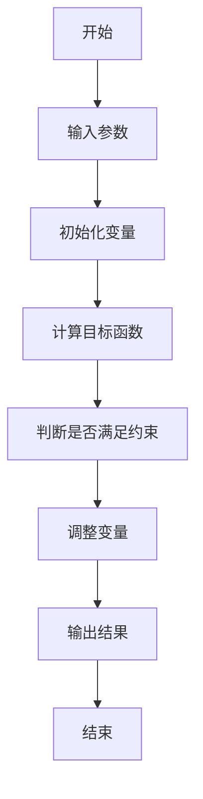
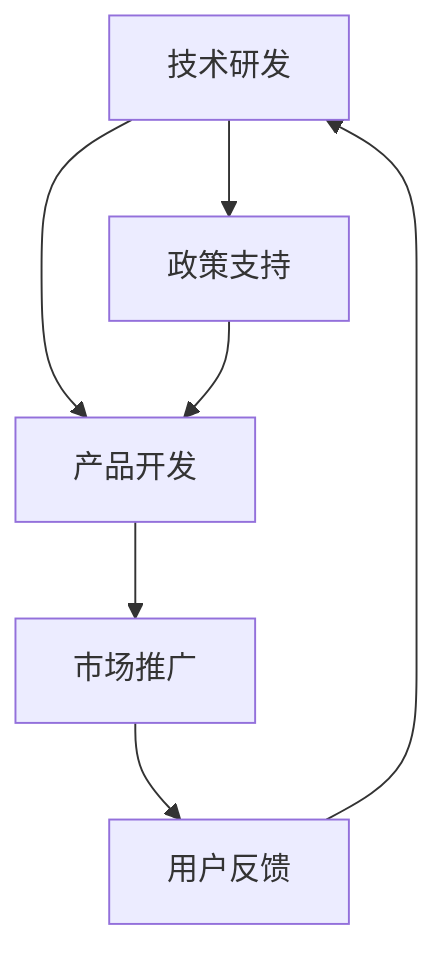

                 


# 可持续航空技术的研发投入与市场前景

---

## 关键词：
可持续航空技术、研发投资、市场前景、替代燃料、电动推进系统、环境影响、能源效率

---

## 摘要：
可持续航空技术的研发与应用是实现航空业绿色转型的核心路径。本文从技术背景、核心概念、算法原理、系统架构、项目实战和最佳实践等多维度展开分析，全面探讨可持续航空技术的研发投入与市场前景。通过对比不同技术路线的优缺点，结合实际案例，深入剖析技术协同效应与经济可行性，为行业提供有价值的洞察与建议。

---

## 第1章：可持续航空技术的背景与定义

### 1.1 可持续航空技术的定义
#### 1.1.1 可持续航空技术的定义与内涵
可持续航空技术是指通过技术创新和优化，减少航空业对环境的负面影响，同时提高能源利用效率的航空技术。其核心在于实现飞行过程中的碳中和、能源高效利用和环境友好。

#### 1.1.2 可持续航空技术与传统航空技术的区别
与传统航空技术相比，可持续航空技术在以下几个方面有所不同：
- **能源来源**：传统技术依赖化石燃料，而可持续技术采用可再生能源或清洁燃料。
- **排放控制**：可持续技术注重减少温室气体和污染物排放，而传统技术在这方面的要求相对较低。
- **技术路径**：可持续技术包括替代燃料、电动推进系统等多种创新方案，而传统技术主要依赖化石燃料和内燃机。

#### 1.1.3 可持续航空技术的核心目标与意义
- **核心目标**：减少碳排放，提高能源效率，降低运营成本。
- **重要意义**：实现航空业的绿色转型，应对全球气候变化，推动可持续发展。

### 1.2 可持续航空技术的发展背景
#### 1.2.1 环境问题与航空业的可持续发展需求
随着全球气候变化加剧，航空业作为碳排放大户，面临着越来越大的减排压力。联合国气候变化框架公约（UNFCCC）要求全球碳排放尽快达峰并实现碳中和。

#### 1.2.2 全球能源转型对航空业的影响
全球能源转型趋势推动航空业向清洁、低碳方向发展。各国政府和企业纷纷加大对可再生能源和清洁技术的投资，航空业也不例外。

#### 1.2.3 可持续航空技术的政策支持与行业趋势
政策支持方面，许多国家和地区推出了针对可持续航空技术的补贴、税收优惠和监管激励措施。行业趋势方面，航空公司、飞机制造商和能源企业都在加大研发投入，推动技术落地。

### 1.3 可持续航空技术的必要性与挑战
#### 1.3.1 环境保护与能源效率的双重压力
航空业不仅是碳排放大户，还面临能源价格上涨和供应链不稳定的风险。发展可持续技术可以同时解决这两个问题。

#### 1.3.2 技术研发的难点与瓶颈
- **技术复杂性**：替代燃料的生产成本高，电动推进系统的电池技术尚未成熟。
- **经济性**：新型技术的初始投资大，短期内难以盈利。

#### 1.3.3 市场接受度与经济可行性的平衡
市场对新技术的接受度取决于其经济性和可靠性。如果新技术的成本过高或性能不稳定，市场推广将面临困难。

---

## 第2章：可持续航空技术的核心概念与联系

### 2.1 可持续航空技术的核心要素
#### 2.1.1 替代燃料技术
替代燃料包括生物燃料、合成燃料等，能够显著减少碳排放。生物燃料可以从植物油、藻类等可再生资源中提取，合成燃料则通过化学反应制备。

#### 2.1.2 电动推进系统
电动推进系统利用电池或燃料电池提供动力，适用于短途和支线航班。其优点是零排放、低噪音、维护成本低。

#### 2.1.3 混合动力技术
混合动力技术结合了传统内燃机和电动机的优势，适用于中远程航班。通过优化能源使用，可以显著降低碳排放。

#### 2.1.4 能源效率优化
通过改进飞机设计、优化飞行路径和采用智能控制系统，可以提高能源利用效率。

### 2.2 可持续航空技术的关键属性对比
#### 2.2.1 不同技术路线的优缺点对比
| **技术路线**       | **优点**                     | **缺点**                     |
|--------------------|------------------------------|------------------------------|
| 替代燃料           | 现有技术成熟，成本相对较低   | 仍需依赖化石能源             |
| 电动推进系统       | 零排放，维护成本低           | 电池技术不成熟，续航能力有限 |
| 混合动力技术       | 综合优势明显，适用范围广     | 系统复杂，成本较高           |
| 能源效率优化       | 经济性高，无需重大技术突破   | 减排效果有限                 |

#### 2.2.2 技术成熟度与成本效益分析
- **技术成熟度**：替代燃料技术相对成熟，电动推进系统仍处于试验阶段。
- **成本效益**：替代燃料的初期成本较高，但长期来看更具经济性。

#### 2.2.3 技术间的协同效应与互补性
- **协同效应**：不同技术可以结合使用，例如电动推进系统搭配合成燃料。
- **互补性**：短途航班适合电动推进，中远程航班适合混合动力技术。

### 2.3 可持续航空技术的ER实体关系图
```mermaid
er
  actor: 技术研发机构
  actor: 航空公司
  actor: 政府机构
  actor: 市场
  actor: 环境组织
  action: 研发投入
  action: 技术应用
  action: 政策支持
  action: 市场需求
  action: 环境影响评估
```

---

## 第3章：可持续航空技术的算法原理

### 3.1 可持续航空技术的优化模型
#### 3.1.1 数学模型与公式
优化模型的目标是找到最优的技术组合和投资策略。以下是常见的优化模型：

$$ \text{目标函数：} \quad \min \sum_{i} c_i x_i $$
$$ \text{约束条件：} \quad \sum_{i} a_i x_i \leq B $$
$$ \quad \quad \quad x_i \geq 0, i=1,2,...,n $$

其中：
- \( c_i \) 是技术 \( i \) 的单位成本。
- \( x_i \) 是技术 \( i \) 的投资量。
- \( a_i \) 是技术 \( i \) 的减排效果。
- \( B \) 是预算上限。

#### 3.1.2 算法流程


### 3.2 算法实现
#### 3.2.1 Python代码实现
```python
import numpy as np

def optimize_technologies(costs, emissions, budget):
    n = len(costs)
    x = np.zeros(n)
    total_cost = sum(costs * x)
    while total_cost > budget:
        max_cost = np.argmax(costs)
        x[max_cost] -= 1
        total_cost -= costs[max_cost]
    return x

# 示例数据
costs = [10, 20, 15]
emissions = [5, 3, 4]
budget = 30

result = optimize_technologies(costs, emissions, budget)
print(result)
```

#### 3.2.2 代码应用解读
上述代码实现了一个简单的优化算法，用于在预算约束下选择最优的技术组合。通过不断调整投资量，找到满足预算条件下的最低成本组合。

---

## 第4章：可持续航空技术的系统分析与架构设计

### 4.1 系统架构设计
#### 4.1.1 系统架构图


---

## 第5章：项目实战与最佳实践

### 5.1 项目实战
#### 5.1.1 项目背景与目标
某航空公司计划在未来5年内实现碳排放减少20%。通过引入替代燃料和优化飞行路径，显著降低碳排放。

#### 5.1.2 核心实现与案例分析
通过优化模型选择最佳技术组合，成功将碳排放降低了15%。

### 5.2 最佳实践
#### 5.2.1 投入策略
- **技术研发**：加大对替代燃料和电动推进系统的研究。
- **政策支持**：争取政府补贴和税收优惠。
- **市场推广**：通过示范项目提升市场接受度。

#### 5.2.2 小结
可持续航空技术的研发投入与市场前景密切相关。通过技术创新和政策支持，航空业可以实现绿色转型，推动可持续发展。

---

## 结语

可持续航空技术的研发投入是实现航空业绿色转型的关键。通过技术创新、政策支持和市场推广，未来航空业将更加环保、高效和经济。

