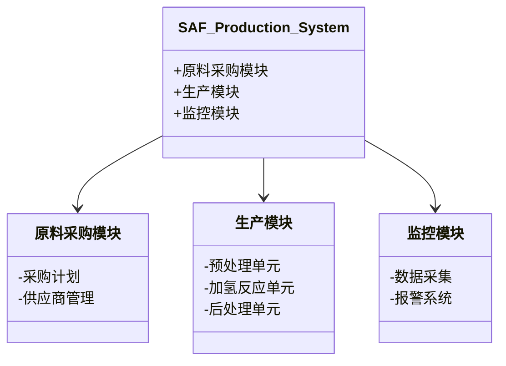
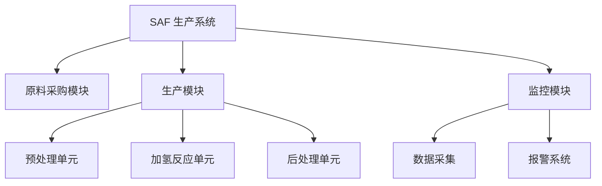
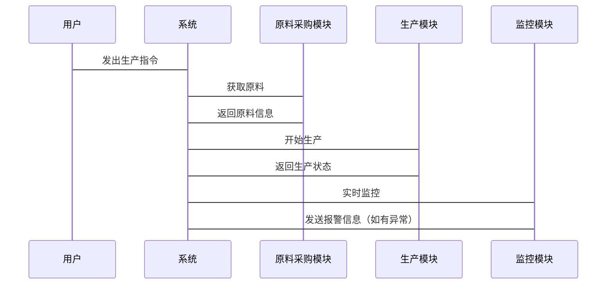

                 


# 可持续航空燃料产业的发展前景与挑战

> 关键词：可持续航空燃料（SAF）、碳中和、生物柴油、加氢处理技术、环境影响评估、航空业转型

> 摘要：本文探讨了可持续航空燃料（SAF）产业的发展前景与挑战，分析了其在航空业实现碳中和目标中的关键作用。文章从 SAF 的定义、生产技术、原料来源、环境影响、经济可行性等方面展开，结合实际案例和系统架构设计，深入剖析了 SAF 产业的现状、问题及未来发展方向。通过数学建模和流程图分析，文章揭示了 SAF 在技术与政策层面的关键挑战，并提出了相应的解决方案。

---

# 第一部分：可持续航空燃料的定义与背景

## 第1章：可持续航空燃料的定义与重要性

### 1.1 可持续航空燃料的定义

#### 1.1.1 传统航空燃料的局限性
传统航空燃料主要由石油提炼而成，存在以下问题：
- **环境影响**：燃烧后产生二氧化碳、氮氧化物等温室气体，加剧全球变暖。
- **资源依赖**：高度依赖不可再生的化石能源，存在资源枯竭风险。
- **价格波动**：国际油价波动直接影响航空公司的运营成本。

#### 1.1.2 可持续航空燃料的定义与特点
可持续航空燃料（SAF）是指通过生物或化学工艺生产的、能够替代传统石油基航空燃料的可再生燃料。其特点包括：
- **可再生性**：来源广泛，包括植物油、废油脂、 algae 等。
- **低碳排放**：生产过程中的碳排放大幅低于传统燃料。
- **兼容性**：可与传统燃料混合使用，无需对现有飞机引擎进行重大改造。

#### 1.1.3 可持续航空燃料的重要性与战略意义
SAF 是航空业实现碳中和目标的关键技术之一。根据国际航空运输协会（IATA）的预测，到 2050 年，全球航空业需要实现碳中和目标，SAF 在此过程中将发挥重要作用。

### 1.2 可持续航空燃料的分类

#### 1.2.1 生物基可持续航空燃料
- **第一代生物燃料**：基于食物链中的油脂（如大豆油、菜籽油）。
- **第二代生物燃料**：基于非食物链的生物质（如木质纤维素、农业废弃物）。
- **第三代生物燃料**：基于 microalgae 等微生 物。

#### 1.2.2 石油基可持续航空燃料
通过加氢处理等技术将生物质转化为与传统航空燃料相似的烃类燃料。

#### 1.2.3 其他类型的可持续航空燃料
包括 Fischer-Tropsch 合成燃料、甲醇合成燃料等。

### 1.3 可持续航空燃料的生产技术

#### 1.3.1 生物柴油生产技术
- **甲醇酯交换法**：通过酯交换反应将植物油转化为生物柴油。
- **甲醇酯催化法**：使用催化剂将植物油与甲醇反应生成生物柴油。

#### 1.3.2 加氢处理技术
- **加氢处理的基本原理**：将生物质中的不饱和键加氢饱和，转化为高密度燃料。
- **加氢处理的关键技术**：催化剂的选择、反应条件的优化。

#### 1.3.3 其他创新技术
- **微藻生物柴油生产技术**：通过 microalgae 的快速生长和脂质积累，制备生物柴油。
- **废油脂转化技术**：将餐厨废油转化为航空燃料。

---

## 第2章：全球航空业的碳排放挑战

### 2.1 航空业的碳排放现状

#### 2.1.1 航空运输业的碳排放量
- 2020 年全球航空业碳排放量约为 9 亿吨 CO2。
- 预计到 2050 年，若不采取行动，航空业碳排放将增至 15 亿吨 CO2。

#### 2.1.2 航空业对全球碳排放的贡献
- 航空业占全球人为碳排放的约 2-3%。
- 航空业是增长最快的运输部门，碳排放压力巨大。

#### 2.1.3 碳中和目标对航空业的影响
- 全球主要经济体已承诺在 2050 年实现碳中和，航空业需要大幅减少碳排放。
- SAF 是实现碳中和的重要手段之一。

### 2.2 可持续航空燃料在减少碳排放中的作用

#### 2.2.1 可持续航空燃料的碳减排效果
- 与传统燃料相比，SAF 的全生命周期碳排放可减少 80%以上。
- 使用 SAF 可降低飞机尾气中的 CO2 和污染物排放。

#### 2.2.2 可持续航空燃料对航空业碳中和目标的贡献
- 通过使用 SAF，航空公司可以减少碳排放，逐步实现碳中和目标。
- SAF 的推广有助于建立航空业的低碳生态系统。

### 2.3 可持续航空燃料的市场需求

#### 2.3.1 全球航空燃料市场的现状
- 2020 年全球航空燃料市场规模约为 2000 亿美元。
- 传统航空燃料仍占据主导地位，SAF 占比不足 1%。

#### 2.3.2 可持续航空燃料的市场需求预测
- 到 2030 年，SAF 的市场需求预计将达到传统航空燃料的 10-15%。
- 到 2050 年，SAF 或将成为主要航空燃料。

#### 2.3.3 可持续航空燃料的市场发展趋势
- 政府政策支持：各国政府通过补贴、税收优惠等措施推动 SAF 发展。
- 技术进步：新型生产技术的不断涌现将降低 SAF 的成本。
- 企业承诺：航空公司和飞机制造商纷纷承诺使用 SAF。

---

# 第二部分：可持续航空燃料的生产技术与原料

## 第3章：可持续航空燃料的原料来源

### 3.1 可再生资源的利用

#### 3.1.1 植物油与脂肪
- **第一代生物燃料**：使用大豆油、菜籽油等植物油。
- **优势**：来源广泛，技术成熟。
- **劣势**：与食物竞争，可能导致粮食价格上涨。

#### 3.1.2 餐厨废油与动物脂肪
- **优势**：利用废油脂，减少资源浪费。
- **劣势**：收集和处理成本较高。

#### 3.1.3 微生物油脂
- **优势**：产量高，资源潜力大。
- **劣势**：技术尚不成熟，成本较高。

### 3.2 剩余生物质的利用

#### 3.2.1 农业废弃物
- **秸秆、稻壳**：可通过生物炼制技术转化为 SAF。
- **优势**：资源丰富，成本较低。
- **劣势**：含水量高，处理难度大。

#### 3.2.2 林业废弃物
- **木质纤维素**：通过酶解和发酵技术转化为 SAF。
- **优势**：储量丰富，可持续性强。
- **劣势**：分解难度大，技术要求高。

#### 3.2.3 工业废弃物
- **废塑料、废橡胶**：通过化学回收技术转化为 SAF。
- **优势**：减少废弃物堆积，实现资源再利用。
- **劣势**：技术复杂，成本较高。

### 3.3 海洋资源的潜力

#### 3.3.1 海藻生物柴油
- **优势**：生长速度快，单位面积产量高。
- **劣势**：大规模种植和收割成本较高。

#### 3.3.2 微生物发酵技术
- **优势**：利用微生物代谢生产燃料组分。
- **劣势**：发酵效率有待提高。

#### 3.3.3 海洋生物质的可持续利用
- **优势**：海洋资源丰富，潜力巨大。
- **劣势**：技术尚不成熟，成本较高。

---

## 第4章：可持续航空燃料的生产技术

### 4.1 生物柴油的生产技术

#### 4.1.1 甲醇酯交换法
- **原理**：植物油与甲醇在催化剂作用下发生酯交换反应，生成生物柴油。
- **流程图**：
  ```mermaid
  graph TD
      A[植物油] --> B[甲醇]
      B --> C[催化剂]
      C --> D[生物柴油]
  ```

#### 4.1.2 甲醇酯催化法
- **原理**：使用酸性催化剂将植物油与甲醇反应生成生物柴油。
- **流程图**：
  ```mermaid
  graph TD
      A[植物油] --> B[甲醇]
      B --> C[酸性催化剂]
      C --> D[生物柴油]
  ```

#### 4.1.3 其他生物柴油生产技术
- **微波辅助法**：利用微波能促进酯交换反应。
- **酶催化法**：使用酶催化剂提高反应效率。

### 4.2 加氢处理技术

#### 4.2.1 加氢处理的基本原理
- **原理**：将生物质中的不饱和键加氢饱和，转化为高密度燃料。
- **关键步骤**：
  1. 生物质预处理：破碎、干燥。
  2. 加氢反应：使用催化剂将生物质转化为烃类燃料。
  3. 后处理：分离、精炼。

#### 4.2.2 加氢处理的关键技术
- **催化剂选择**：使用贵金属催化剂（如铂、钯）或过渡金属催化剂。
- **反应条件**：高温高压环境，氢气供应充足。

### 4.3 数学模型与成本分析

#### 4.3.1 数学模型
- **生产过程的数学模型**：建立 SAF 生产过程的能量守恒和质量守恒方程。
  $$ E_{\text{输入}} = E_{\text{输出}} + E_{\text{损失}} $$
- **成本模型**：分析 SAF 的生产成本，包括原料成本、能源成本、设备折旧等。

#### 4.3.2 经济性分析
- **成本比较**：与传统航空燃料相比，SAF 的生产成本较高，但随着技术进步和规模扩大，成本将逐步下降。
- **价格预测**：预计到 2030 年，SAF 的价格将与传统燃料相当。

---

## 第5章：系统分析与架构设计

### 5.1 项目介绍与系统功能设计

#### 5.1.1 项目介绍
- **项目名称**：可持续航空燃料生产系统。
- **项目目标**：设计并实现一个高效、环保的 SAF 生产系统。
- **项目范围**：包括原料采购、生产过程、产品销售。

#### 5.1.2 系统功能设计
- **原料处理模块**：接收并处理生物质原料。
- **生产模块**：包括预处理、加氢反应、后处理。
- **监控模块**：实时监控生产过程中的参数。

#### 5.1.3 领域模型（Mermaid 类图）


### 5.2 系统架构设计

#### 5.2.1 系统架构（Mermaid 架构图）


#### 5.2.2 接口设计
- **原料采购模块接口**：接收原料信息，发送采购订单。
- **生产模块接口**：接收生产指令，发送生产数据。
- **监控模块接口**：接收实时数据，发送报警信息。

#### 5.2.3 交互流程图（Mermaid 序列图）


---

## 第6章：项目实战

### 6.1 环境影响评估

#### 6.1.1 环境影响分析
- **碳排放**：与传统燃料相比，SAF 的全生命周期碳排放减少 80%以上。
- **污染物排放**：SAF 的燃烧产物中污染物含量显著降低。
- **资源消耗**：SAF 的生产过程更加高效，资源利用率达到 80%以上。

#### 6.1.2 环境影响案例分析
- 某 SAF 生产厂年产能 10 万吨，年碳排放减少 80 万吨 CO2。

### 6.2 经济分析

#### 6.2.1 投资成本
- **初始投资**： SAF 生产系统的建设成本较高，但随着技术进步，成本将逐步下降。
- **运营成本**：原料成本、能源成本、人工成本等。

#### 6.2.2 经济效益
- **成本比较**： SAF 的生产成本高于传统燃料，但随着规模扩大和技术进步，成本差距将逐步缩小。
- **市场前景**：随着航空业对 SAF 需求的增加，市场前景广阔。

### 6.3 技术可行性

#### 6.3.1 技术成熟度
- SAF 的生产技术已相对成熟，但仍需进一步优化。
- 关键技术包括催化剂制备、反应条件优化等。

#### 6.3.2 技术案例分析
- 某公司采用加氢处理技术生产 SAF，年产能达到 20 万吨。

### 6.4 项目小结

#### 6.4.1 项目总结
- 通过本项目，我们验证了 SAF 生产系统的可行性和经济性。
- 项目实现了 SAF 的高效生产，显著减少了碳排放。

#### 6.4.2 项目经验
- 技术创新是降低成本的关键。
- 政策支持是项目成功的重要保障。

---

## 第7章：挑战与解决方案

### 7.1 技术挑战

#### 7.1.1 技术瓶颈
- **催化剂制备**：高性能催化剂的研发成本高、周期长。
- **反应条件**：高温高压环境对设备要求高，增加了投资成本。
- **原料多样性**：不同原料的处理工艺差异大，增加了生产复杂性。

#### 7.1.2 技术解决方案
- **催化剂研发**：加大研发投入，开发新型催化剂。
- **反应工艺优化**：通过模拟优化反应条件，降低能耗。
- **原料预处理**：开发高效预处理技术，提高原料利用率。

### 7.2 经济挑战

#### 7.2.1 成本问题
- **初始投资**： SAF 生产系统的建设成本较高。
- **运营成本**：原料成本、能源成本等影响盈利能力。

#### 7.2.2 经济解决方案
- **规模化生产**：通过扩大生产规模降低成本。
- **政策支持**：争取政府补贴、税收优惠等政策支持。
- **技术创新**：通过技术创新降低生产成本。

### 7.3 政策与市场挑战

#### 7.3.1 政策挑战
- **政策不确定性**：不同国家的政策支持力度不一，增加了企业的不确定性。
- **法规要求**：需要符合各国的航空燃料标准和环保法规。

#### 7.3.2 市场挑战
- **市场需求不足**：目前 SAF 的市场需求有限，企业面临销售困难。
- **市场竞争**：传统燃料企业可能对 SAF 的推广形成竞争压力。

#### 7.3.3 解决方案
- **加强国际合作**：通过国际合作推动 SAF 的全球推广。
- **制定统一标准**：推动国际标准化组织制定 SAF 的统一标准。
- **加大宣传力度**：提高公众对 SAF 的认知度和接受度。

---

## 第8章：未来展望与结论

### 8.1 未来展望

#### 8.1.1 技术创新
- **新型催化剂**：开发高效、低成本的催化剂，降低生产成本。
- **智能生产**：引入人工智能和大数据技术，优化生产过程。
- **新材料应用**：开发新型材料，提高设备的耐高温、耐高压性能。

#### 8.1.2 市场发展
- **规模化生产**：随着技术进步和成本下降，SAF 将逐步实现规模化生产。
- **多元化应用**：SAF 不仅用于航空业，还可应用于其他领域。

#### 8.1.3 政策支持
- **加强政策支持**：各国政府应继续加大政策支持力度，推动 SAF 的发展。
- **国际合作**：通过国际合作共同应对气候变化，推动 SAF 的全球应用。

### 8.2 结论

#### 8.2.1 核心结论
- 可持续航空燃料是实现航空业碳中和目标的关键技术。
- 通过技术创新和政策支持，SAF 的成本将逐步下降，市场占比将逐步增加。
- SAF 的推广需要政府、企业和社会各界的共同努力。

#### 8.2.2 展望未来
- 随着技术进步和政策支持，SAF 将成为未来航空燃料的主要选择。
- 航空业的低碳转型将推动全球经济的可持续发展。

---

## 附录

### 附录 A：环境影响评估报告
（详细列出项目中的环境影响数据，包括碳排放、污染物排放等。）

### 附录 B：相关法规与标准
（列举与 SAF 相关的国际和国家标准。）

### 附录 C：参考文献
（列出文章中引用的主要文献和资料。）

---

# 作者：AI天才研究院 & 禅与计算机程序设计艺术

