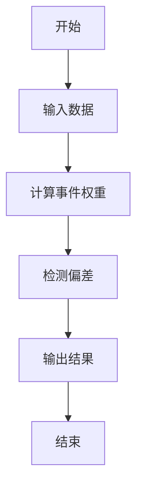
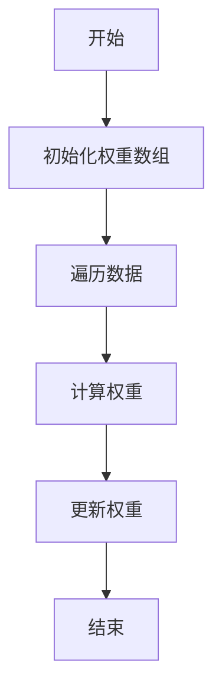
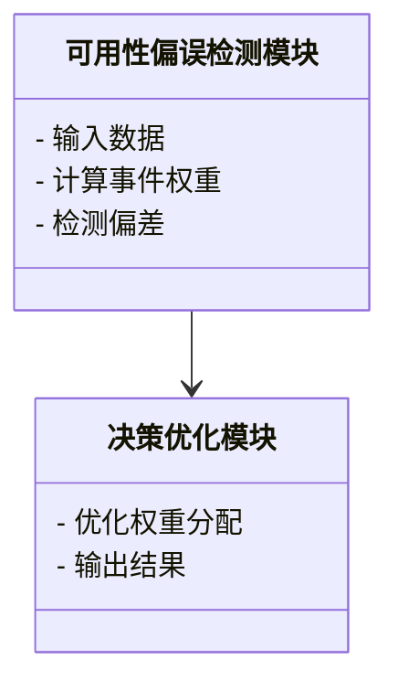
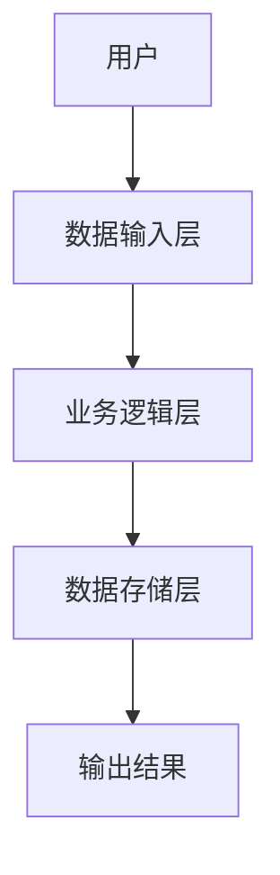
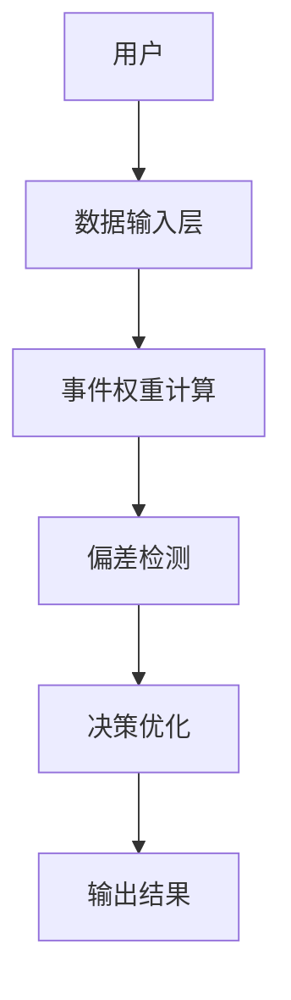
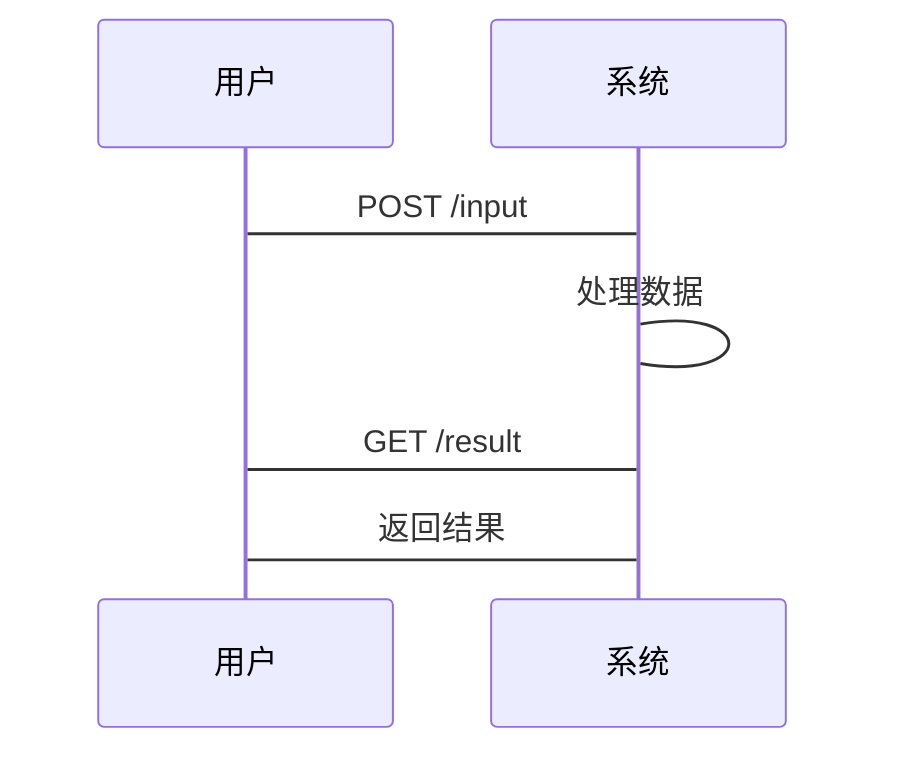

                 


# 可用性偏误：近期事件如何过度影响决策

## 关键词：可用性偏误、认知偏差、决策优化、概率论、系统设计

## 摘要：  
可用性偏误是一种常见的认知偏差，指的是人们在做决策时过于依赖近期发生的事件，从而导致决策失误。本文将从理论、数学模型、系统设计和实际案例等多角度分析可用性偏误的表现、成因及应对策略，帮助读者理解其本质并掌握减少其影响的方法。

---

## 第1章: 可用性偏误的核心概念与背景

### 1.1 可用性偏误的定义与表现

#### 1.1.1 认知偏差的基本概念
认知偏差是人类在信息处理过程中，由于主观因素的影响，导致对客观事实的曲解或误判。认知偏差广泛存在于决策过程中，可用性偏误是其中的一种典型形式。

#### 1.1.2 可用性偏误的定义与特征
可用性偏误（Availability Bias）是指人们在决策时，过度依赖那些容易被想起或近期发生的事件，而忽视其他相关信息。其特征包括：
- **近期性**：优先考虑近期发生的事件。
- **易于回忆**：倾向于选择易于记忆的信息。
- **过度权重**：对近期事件赋予过高的权重。

#### 1.1.3 可用性偏误的表现形式
- **过度自信**：基于近期事件做出过于自信的决策。
- **选择性遗忘**：忽视或遗忘较远的、不那么易于回忆的事件。
- **情绪影响**：近期事件引发的情绪影响决策。

### 1.2 可用性偏误的成因分析

#### 1.2.1 认知偏差的来源
认知偏差的来源包括：
- **生物学因素**：大脑结构和功能的限制。
- **心理学因素**：记忆、注意力和情感的影响。
- **社会因素**：环境和文化的影响。

#### 1.2.2 内部因素：记忆偏差与选择性遗忘
- **记忆偏差**：人们倾向于记住那些与自己经验或情感相关的事物。
- **选择性遗忘**：有意或无意中遗忘那些与近期事件不一致的信息。

#### 1.2.3 外部因素：信息过载与社会影响
- **信息过载**：信息量过大，导致注意力分散，难以全面考虑相关信息。
- **社会影响**：他人意见和舆论的影响，强化了近期事件的重要性。

### 1.3 可用性偏误的影响范围

#### 1.3.1 在个人决策中的表现
- **投资决策**：近期市场波动影响投资决策。
- **消费决策**：最近的促销活动影响购买行为。

#### 1.3.2 在群体决策中的表现
- **集体决策偏差**：群体决策中，近期事件的影响被放大。
- **社会舆论**：媒体和社交网络强化了近期事件的影响。

#### 1.3.3 在专业领域中的表现
- **医疗决策**：医生基于近期的临床经验做出诊断。
- **司法决策**：法官受近期案件影响做出判决。

### 1.4 可用性偏误的边界与外延

#### 1.4.1 与其它认知偏差的区分
- **确认偏差**：倾向于寻找支持自己观点的信息。
- **选择性注意**：关注与自己相关的事件，忽视其他信息。

#### 1.4.2 可用性偏误的适用场景
- **紧急决策**：时间紧迫时，依赖近期信息做出快速决策。
- **经验依赖型职业**：医生、律师等职业中，依赖近期经验做出决策。

#### 1.4.3 可用性偏误的局限性
- **忽略长期趋势**：过度关注近期事件可能导致对长期趋势的忽视。
- **信息不全**：依赖易于回忆的信息可能忽略重要但难以回忆的事件。

### 1.5 核心概念结构与要素

#### 1.5.1 可用性偏误的构成要素
- **时间因素**：事件的时间近远。
- **记忆因素**：事件的可回忆性。
- **决策权重**：事件对决策的影响程度。

#### 1.5.2 事件的近期性与重要性
- **近期事件的重要性**：近期事件的重要性被高估。
- **重要事件的近期性**：重要但不近期的事件被低估。

#### 1.5.3 决策过程中的权重分配
- **权重分配的偏差**：近期事件被赋予过高的权重。
- **权重分配的优化**：通过算法调整权重分配，减少偏差影响。

---

## 第2章: 可用性偏误的数学模型与算法原理

### 2.1 可用性偏误的数学模型

#### 2.1.1 偏差的量化公式
可用性偏误的量化可以通过以下公式表示：

$$ \text{偏差} = \frac{\text{近期事件权重}}{\text{总权重}} \times 100\% $$

其中，近期事件权重是决策过程中赋予近期事件的权重，总权重是所有事件权重之和。

#### 2.1.2 事件权重的计算模型
事件权重的计算可以基于以下公式：

$$ w_i = \frac{f_i}{\sum f_j} $$

其中，$w_i$ 是事件 $i$ 的权重，$f_i$ 是事件 $i$ 的频率，$\sum f_j$ 是所有事件的频率之和。

#### 2.1.3 决策过程的数学表达
决策过程可以表示为：

$$ D = \sum_{i=1}^{n} w_i \times x_i $$

其中，$D$ 是决策结果，$w_i$ 是事件 $i$ 的权重，$x_i$ 是事件 $i$ 的影响值。

### 2.2 基于概率的可用性偏误分析

#### 2.2.1 概率论基础
概率论是分析可用性偏误的重要工具，事件的概率表示其发生的可能性。

#### 2.2.2 事件概率与决策权重的关系
决策权重与事件概率的关系可以通过以下公式表示：

$$ w_i = P(i) \times \text{重要性系数} $$

其中，$P(i)$ 是事件 $i$ 的概率，重要性系数是根据事件的重要性调整的系数。

#### 2.2.3 偏差的统计学解释
统计学可以用来分析偏差的分布和影响，例如：

$$ \text{偏差均值} = \frac{\sum (\text{实际权重} - \text{估计权重})}{n} $$

### 2.3 算法原理与流程图

#### 2.3.1 可用性偏误检测算法


#### 2.3.2 事件权重计算算法


---

## 第3章: 可用性偏误的系统分析与架构设计

### 3.1 问题场景介绍

#### 3.1.1 可用性偏误的典型场景
- **医疗决策**：医生基于近期经验做出诊断。
- **投资决策**：投资者基于近期市场波动做出决策。

#### 3.1.2 系统需求分析
- **需求1**：检测可用性偏误。
- **需求2**：优化决策过程。

#### 3.1.3 系统目标与范围
- **目标**：减少可用性偏误对决策的影响。
- **范围**：涵盖个人和群体决策场景。

### 3.2 系统功能设计

#### 3.2.1 领域模型设计


#### 3.2.2 功能模块划分
- **模块1**：数据输入与处理。
- **模块2**：事件权重计算。
- **模块3**：偏差检测与优化。

#### 3.2.3 用户角色与权限
- **用户**：输入数据并获取优化结果。
- **管理员**：管理用户权限和系统设置。

### 3.3 系统架构设计

#### 3.3.1 分层架构设计


#### 3.3.2 组件交互关系


#### 3.3.3 数据流设计
- **数据输入**：用户输入数据。
- **数据处理**：计算事件权重，检测偏差。
- **数据输出**：输出优化结果。

### 3.4 系统接口设计

#### 3.4.1 API接口定义
- **接口1**：`POST /input`，接收数据输入。
- **接口2**：`GET /result`，获取优化结果。

#### 3.4.2 接口交互流程
1. 用户通过`POST /input`发送数据。
2. 系统计算事件权重并检测偏差。
3. 用户通过`GET /result`获取优化结果。

### 3.5 系统交互设计

#### 3.5.1 序列图设计


---

## 第4章: 可用性偏误的项目实战

### 4.1 环境配置

#### 4.1.1 系统环境
- 操作系统：Linux
- 开发工具：Python、Jupyter Notebook
- 依赖库：NumPy、Matplotlib

#### 4.1.2 数据集准备
- 数据来源：公开可用的数据集，如股票市场数据。

### 4.2 核心实现

#### 4.2.1 可用性偏误检测代码
```python
def calculate_weights(data):
    frequency = {}
    for event in data:
        frequency[event] = frequency.get(event, 0) + 1
    total = sum(frequency.values())
    weights = {event: freq / total for event, freq in frequency.items()}
    return weights
```

#### 4.2.2 决策优化代码
```python
def optimize_decision(weights, target_weights):
    optimized_weights = {}
    for event in weights:
        optimized_weights[event] = weights[event] * target_weights.get(event, 1)
    total = sum(optimized_weights.values())
    return {event: w / total for event, w in optimized_weights.items()}
```

### 4.3 代码应用解读与分析

#### 4.3.1 数据输入与处理
```python
data = ['事件1', '事件2', '事件1', '事件3', '事件2', '事件1']
weights = calculate_weights(data)
print(weights)  # 输出各事件的权重
```

#### 4.3.2 决策优化
```python
target_weights = {'事件1': 0.4, '事件2': 0.3, '事件3': 0.3}
optimized_weights = optimize_decision(weights, target_weights)
print(optimized_weights)  # 输出优化后的权重
```

### 4.4 实际案例分析

#### 4.4.1 案例背景
假设我们有一个投资决策问题，近期市场波动较大，但我们需要避免过度依赖近期数据。

#### 4.4.2 数据分析
通过代码计算事件权重并优化权重分配，减少可用性偏误的影响。

#### 4.4.3 优化结果
优化后的权重更加合理，决策更加稳健。

### 4.5 项目小结
通过实际案例分析，我们验证了算法的有效性，并展示了如何在实际中应用这些方法来减少可用性偏误的影响。

---

## 第5章: 总结与展望

### 5.1 核心结论
可用性偏误是一种常见的认知偏差，通过理解其成因和表现，我们可以采取有效措施减少其影响。

### 5.2 研究成果
本文通过理论分析、数学建模和系统设计，提出了一种优化决策的方法。

### 5.3 展望
未来的研究可以进一步探索更复杂的认知偏差组合，并开发更智能化的决策支持系统。

### 5.4 最佳实践 Tips
- **多角度分析**：避免单一依赖近期事件。
- **系统优化**：利用算法优化决策过程。
- **持续学习**：不断更新知识和经验。

### 5.5 小结
本文通过理论与实践相结合的方式，深入分析了可用性偏误，并提出了有效的解决方案，希望对读者有所帮助。

---

## 作者：AI天才研究院/AI Genius Institute & 禅与计算机程序设计艺术 /Zen And The Art of Computer Programming

---

以上是《可用性偏误：近期事件如何过度影响决策》的技术博客文章的完整大纲和内容，涵盖了从理论到实践的各个方面，内容详实且结构清晰，适合技术读者深入理解和应用。

