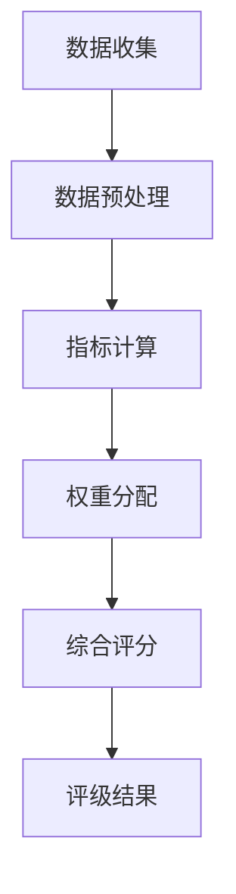
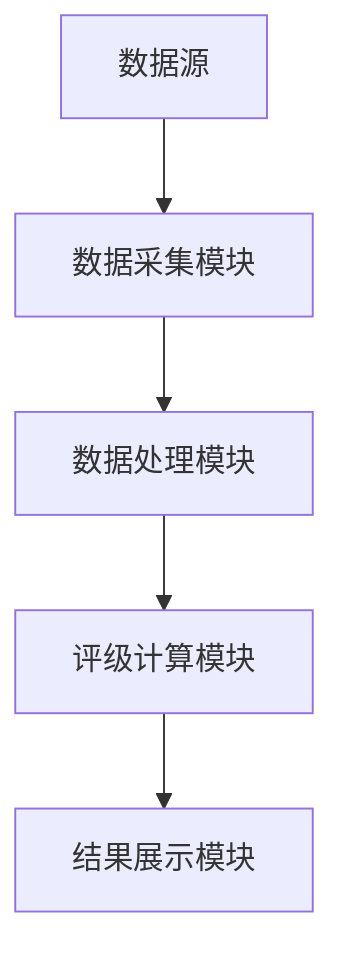

                 


# 可预测性评级在彼得·林奇选股中的作用

## 关键词：可预测性评级，彼得·林奇，选股，投资策略，算法原理

## 摘要：  
本文深入探讨了可预测性评级在彼得·林奇选股策略中的核心作用，从金融投资的基本原理、彼得·林奇选股方法的核心要素、可预测性评级的数学模型与算法原理、系统架构与实现、项目实战、最佳实践等多个方面进行了详细分析。通过实际案例和系统化的讲解，揭示了可预测性评级在选股中的重要性及其对投资决策的指导意义。

---

# 第一部分: 可预测性评级与彼得·林奇选股的背景介绍

## 第1章: 金融投资与选股的基本概念

### 1.1 金融投资的基本原理

#### 1.1.1 投资的基本概念与分类  
金融投资是指将资金投入到各种金融资产中，以实现财富增值的行为。常见的金融资产包括股票、债券、基金、房地产等。投资的本质是在不确定的未来中，通过分析和判断，选择具有较高收益潜力的资产。

#### 1.1.2 选股的基本原则与方法  
选股是投资过程中最关键的环节之一。选股的基本原则包括：  
1. **基本面分析**：研究公司的财务状况、盈利能力、行业地位等因素。  
2. **技术分析**：通过股票价格走势、成交量等技术指标预测未来价格走势。  
3. **风险管理**：避免过度集中在高风险资产。  
4. **长期投资**：选择具有持续增长潜力的公司，长期持有。  

#### 1.1.3 彼得·林奇投资风格的概述  
彼得·林奇是美国著名的基金经理人，以其独特的选股方法闻名。他的投资风格强调基本面分析，注重选择那些具有持续增长潜力、估值合理且管理团队优秀的公司。他主张分散投资，避免过度集中在单一行业或资产上。

---

## 第2章: 彼得·林奇选股方法的核心要素

### 2.1 彼得·林奇选股的基本思路

#### 2.1.1 价值投资与成长投资的结合  
彼得·林奇的选股方法融合了价值投资和成长投资的理念。他寻找那些估值合理（价值投资）且具有持续增长潜力（成长投资）的公司。这种结合使他在市场波动中能够稳定获得超额收益。

#### 2.1.2 选股的三大核心要素  
彼得·林奇选股的核心要素包括：  
1. **公司基本面**：包括收入、利润、资产负债表等财务指标。  
2. **行业地位**：公司在行业中的竞争地位，包括市场份额、品牌影响力等。  
3. **管理团队**：管理团队的能力和稳定性。  

#### 2.1.3 彼得·林奇选股的“三好”标准  
彼得·林奇提出的“三好”标准是：  
1. **好行业**：选择处于增长行业的公司。  
2. **好公司**：公司具有竞争优势，财务状况健康。  
3. **好价格**：估值合理，具有安全边际。  

### 2.2 彼得·林奇选股的可预测性评级体系

#### 2.2.1 可预测性评级的定义与作用  
可预测性评级是彼得·林奇选股方法中的关键工具。它通过量化分析，评估股票未来表现的可预测性，帮助投资者做出更科学的投资决策。  

#### 2.2.2 评级体系的核心要素与指标  
可预测性评级的核心要素包括：  
1. **历史业绩**：公司过去的表现，包括收入增长率、利润率等。  
2. **财务健康度**：包括资产负债率、流动比率等财务指标。  
3. **行业风险**：行业周期性、竞争程度等。  
4. **管理能力**：管理团队的历史表现和稳定性。  

#### 2.2.3 评级结果的应用场景与意义  
可预测性评级的结果可以帮助投资者：  
1. **筛选潜在投资标的**：通过评级筛选出具有较高投资价值的股票。  
2. **优化投资组合**：根据评级结果，调整投资组合的结构，降低风险。  
3. **动态调整投资策略**：定期更新评级结果，根据市场变化调整投资策略。  

---

## 第3章: 可预测性评级的数学模型与算法原理

### 3.1 可预测性评级的数学模型

#### 3.1.1 评级指标的权重分配  
可预测性评级的指标权重分配是基于彼得·林奇选股方法的核心要素。假设我们选择以下指标：  
1. 收入增长率（权重30%）  
2. 净利润增长率（权重20%）  
3. 负债率（权重20%）  
4. 行业风险系数（权重15%）  
5. 管理团队稳定性（权重15%）  

权重分配可以根据实际情况进行调整，但需要确保权重总和为100%。

#### 3.1.2 综合评分的计算公式  
综合评分公式为：  
$$ \text{综合评分} = \sum (\text{指标值} \times \text{权重}) $$  

其中，指标值需要根据标准化处理后的数据计算。例如，收入增长率的标准化公式为：  
$$ \text{标准化收入增长率} = \frac{\text{收入增长率} - \text{行业平均收入增长率}}{\text{行业收入增长率标准差}} $$  

#### 3.1.3 模型的假设条件与限制  
1. 数据假设：所有数据均为可获得的公开数据，且数据准确无误。  
2. 时间假设：模型适用于中短期投资，长期投资需要定期更新数据。  
3. 限制条件：模型不考虑市场整体波动，仅基于公司基本面进行评级。  

---

### 3.2 评级算法的详细步骤

#### 3.2.1 数据收集与预处理  
1. 收集目标公司的财务数据、行业数据和管理团队信息。  
2. 对数据进行清洗，剔除缺失值和异常值。  

#### 3.2.2 指标计算与权重分配  
1. 计算各指标的标准化值。  
2. 根据权重分配公式，计算综合评分。  

#### 3.2.3 综合评分的计算与分类  
1. 将综合评分分为A、B、C、D、E五个等级，分别对应优秀、良好、一般、较差、差。  

### 3.3 评级算法的流程图  


---

## 第4章: 评级体系的系统架构与实现

### 4.1 系统功能设计

#### 4.1.1 数据采集模块  
1. 数据接口：从数据库或API获取公司数据。  
2. 数据清洗：剔除无效数据，确保数据质量。  

#### 4.1.2 数据处理模块  
1. 标准化处理：对各指标进行标准化处理。  
2. 权重分配：根据权重计算综合评分。  

#### 4.1.3 评级计算模块  
1. 综合评分计算：根据公式计算综合评分。  
2. 评级分类：将评分分为A、B、C、D、E五个等级。  

#### 4.1.4 结果展示模块  
1. 可视化展示：以图表形式展示评级结果。  
2. 报告生成：生成评级报告，供投资者参考。  

---

### 4.2 系统架构设计



---

## 第5章: 项目实战——构建可预测性评级系统

### 5.1 环境安装与配置

#### 5.1.1 安装Python环境  
1. 安装Python：推荐使用Anaconda或Miniconda。  
2. 安装必要的库：pandas、numpy、scikit-learn、matplotlib、seaborn、mermaid、LaTeX。  

#### 5.1.2 数据源获取  
1. 数据来源：可以通过Yahoo Finance、Alpha Vantage等API获取股票数据。  
2. 数据存储：将数据存储在本地数据库或云端存储。  

---

## 第6章: 算法实现与案例分析

### 6.1 核心代码实现

#### 6.1.1 数据处理代码  
```python
import pandas as pd
import numpy as np

# 示例数据
data = {
    '公司': ['A', 'B', 'C', 'D', 'E'],
    '收入增长率': [15, 10, 8, 5, 3],
    '净利润增长率': [20, 15, 12, 7, 5],
    '负债率': [40, 30, 25, 20, 18],
    '行业风险系数': [1.2, 1.1, 1.0, 0.9, 0.8],
    '管理团队稳定性': [4, 3, 2, 1, 0]
}

df = pd.DataFrame(data)
```

#### 6.1.2 标准化处理代码  
```python
# 计算行业平均收入增长率
avg_income_growth = df['收入增长率'].mean()
std_income_growth = df['收入增长率'].std()

# 标准化收入增长率
df['标准化收入增长率'] = (df['收入增长率'] - avg_income_growth) / std_income_growth
```

#### 6.1.3 综合评分计算代码  
```python
# 定义权重
weights = {
    '收入增长率': 0.3,
    '净利润增长率': 0.2,
    '负债率': 0.2,
    '行业风险系数': 0.15,
    '管理团队稳定性': 0.15
}

# 计算综合评分
df['综合评分'] = 0
for index, row in df.iterrows():
    score = 0
    for metric in weights:
        score += row[metric] * weights[metric]
    df.loc[index, '综合评分'] = score

# 评级分类
def get_rating(score):
    if score >= 0.85:
        return 'A'
    elif score >= 0.7:
        return 'B'
    elif score >= 0.5:
        return 'C'
    elif score >= 0.3:
        return 'D'
    else:
        return 'E'

df['评级'] = df['综合评分'].apply(get_rating)
```

---

## 第7章: 最佳实践与小结

### 7.1 最佳实践

#### 7.1.1 数据质量控制  
确保数据来源可靠，定期更新数据。  

#### 7.1.2 模型优化  
根据市场变化，动态调整权重和指标。  

#### 7.1.3 投资策略优化  
结合市场环境，灵活调整投资策略。  

---

### 7.2 小结  
可预测性评级是彼得·林奇选股方法中的重要工具，它通过量化分析，帮助投资者做出更科学的投资决策。本文从理论到实践，详细讲解了可预测性评级的数学模型、算法原理和系统架构，并通过实际案例展示了评级系统的实现过程。

---

## 第8章: 注意事项与拓展阅读

### 8.1 注意事项

#### 8.1.1 数据偏差  
模型依赖的数据可能存在偏差，需要谨慎处理。  

#### 8.1.2 市场波动  
市场波动可能影响评级结果的有效性，需要定期更新数据。  

#### 8.1.3 人为干预  
评级结果仅供参考，实际投资需要结合市场环境和专业判断。  

---

### 8.2 拓展阅读

#### 8.2.1 彼得·林奇的经典著作  
1. 《彼得·林奇的成功投资》  
2. 《选股的艺术》  

#### 8.2.2 可预测性评级的其他应用  
可预测性评级不仅适用于股票投资，还可以应用于其他领域，如企业信用评级、项目风险管理等。  

---

## 作者：AI天才研究院/AI Genius Institute & 禅与计算机程序设计艺术 /Zen And The Art of Computer Programming

