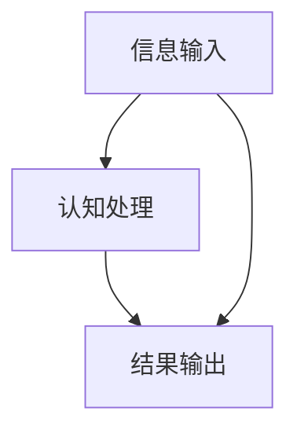
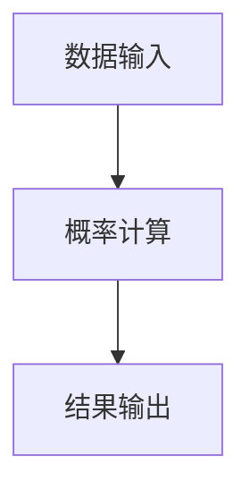
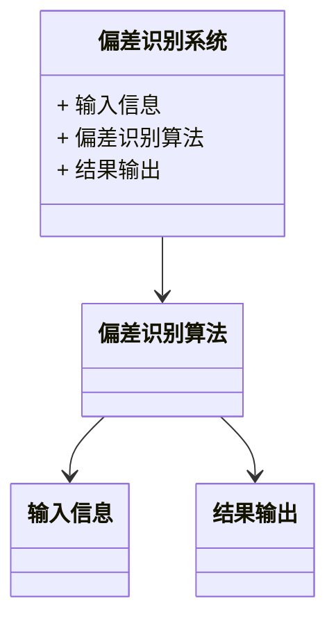
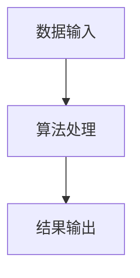

                 


# 后见之明偏差：正确评估历史信息的价值

---

## 关键词：
后见之明偏差, 偏差成因, 偏差影响, 认知偏差, 历史信息评估, 决策偏差, 偏差应对策略

---

## 摘要：
后见之明偏差是一种常见的认知偏差，表现为人们在回顾过去时，倾向于认为自己事先已经预料到了结果。这种偏差不仅影响个人决策，还影响组织和历史研究。本文从偏差的定义、成因、影响出发，结合概率论和统计学原理，详细分析后见之明偏差的算法原理和数学模型，并通过实际案例展示如何评估和应对偏差。文章还提出了系统化的架构设计和最佳实践策略，帮助读者正确评估历史信息的价值。

---

## 第一部分：后见之明偏差的背景与核心概念

### 第1章：后见之明偏差的定义与成因

#### 1.1 后见之明偏差的定义
后见之明偏差（Hindsight Bias）是指人们在回顾过去事件时，倾向于相信自己事先已经预料到了结果，即使在当时并没有明确的证据或意识。这种偏差表现为人们在事后将结果与自己的预测紧密联系起来，从而扭曲了对过去信息的评估。

- **偏差的定义与基本特征**  
  后见之明偏差的核心在于“事后诸葛亮”的心理现象，人们倾向于高估自己在事前的预测能力。这种偏差通常与信息处理的简化性、记忆的重构性以及对不确定性的厌恶有关。

- **偏差的产生机制**  
  人们在回顾过去时，倾向于选择性地记忆和重构信息，忽略那些与实际结果不符的细节。这种重构过程使得人们相信自己在事前已经掌握了足够的信息来预测结果。

- **偏差的分类与应用场景**  
  后见之明偏差可以分为个体层面和组织层面。个体层面表现为个人在决策后对自己判断的过高评价，组织层面则表现为团队或企业在总结失败经验时，倾向于认为失败是可以预见的。

---

#### 1.2 后见之明偏差的成因分析
后见之明偏差的成因涉及心理学、认知科学和统计学等多个领域。

- **认知偏差的理论基础**  
  后见之明偏差与确认偏差（Confirmation Bias）、可得性偏差（Availability Bias）等密切相关。人们倾向于记住那些与结果一致的信息，忽略与结果不符的证据。

- **心理学视角下的偏差成因**  
  心理学研究表明，后见之明偏差源于人们对不确定性的厌恶。当结果已知时，人们倾向于构建一个确定的过去，以减少认知上的不适感。

- **社会环境对偏差的影响**  
  社会环境中的压力和群体思维也会加剧后见之明偏差。在团队决策中，成员倾向于支持已经发生的结果，以维护集体的和谐与一致性。

---

#### 1.3 后见之明偏差的影响与后果
后见之明偏差对个人和组织的决策过程有深远的影响。

- **对个人决策的影响**  
  个人倾向于高估自己的预测能力，从而在未来的决策中过度自信，可能导致错误的决策。

- **对组织决策的影响**  
  组织在总结经验教训时，容易陷入后见之明偏差，认为失败是可以预见的，从而忽视了真正需要改进的方面。

- **对历史研究与信息评估的影响**  
  历史研究者在分析过去事件时，容易受到后见之明偏差的影响，导致对历史信息的误读和误评。

---

#### 1.4 后见之明偏差与其他认知偏差的关系
后见之明偏差并非孤立存在，而是与多种认知偏差密切相关。

- **偏差的共性与特性对比**  
  通过对比表可以看出，后见之明偏差与其他偏差（如确认偏差、可得性偏差）在成因和表现上既有相似性，也有独特性。

| 偏差类型         | 成因                         | 表现形式                     |
|------------------|------------------------------|------------------------------|
| 后见之明偏差     | 对不确定性的厌恶             | 过度自信于事前的预测能力     |
| 确认偏差         | 追求一致性                   | 过度关注支持已有假设的证据     |
| 可得性偏差       | 易记性信息的影响             | 过度依赖易记的事件进行判断     |

- **偏差之间的相互作用**  
  后见之明偏差与其他偏差相互作用，例如确认偏差会加剧后见之明偏差，因为人们倾向于选择性地记忆那些支持自己预测的信息。

- **偏差的综合影响分析**  
  多种偏差的综合影响可能导致人们在回顾过去时，不仅高估自己的预测能力，还可能忽略重要的反面证据。

---

## 第二部分：后见之明偏差的核心概念与理论模型

### 第2章：后见之明偏差的核心概念

#### 2.1 偏差的核心要素
后见之明偏差的核心要素包括信息处理的重构性、预测能力的高估以及对不确定性的厌恶。

- **偏差的核心概念属性**  
  通过ER实体关系图可以清晰地展示后见之明偏差的核心要素及其相互关系。

```mermaid
erDiagram
    偏差信息处理
    {
        id 信息处理ID
        type 偏差类型
        timestamp 时间戳
    }
    偏差成因
    {
        id 成因ID
        description 成因描述
       关联关系
    }
    偏差影响
    {
        id 影响ID
        description 影响描述
       关联关系
    }
    偏差信息处理 --o 偏差成因
    偏差信息处理 --o 偏差影响
```

- **偏差的特征对比表**  
  通过对比表可以看出，后见之明偏差与其他偏差在特征上的差异。

| 偏差类型         | 关注点                 | 表现形式                     |
|------------------|-----------------------|------------------------------|
| 后见之明偏差     | 事后对过去的评估       | 过度自信于事前的预测能力     |
| 确认偏差         | 事后对已有假设的确认   | 过度关注支持假设的证据       |
| 可得性偏差       | 事后对易记信息的依赖   | 过度依赖易记的事件进行判断     |

---

#### 2.2 偏差的理论模型
后见之明偏差的理论模型可以解释人们为何会在事后高估自己的预测能力。

- **偏差的理论框架**  
  后见之明偏差的理论框架基于认知心理学和统计学，强调人们对不确定性的厌恶和对信息的重构性。

- **偏差的数学模型**  
  通过数学模型可以量化后见之明偏差的影响程度。

  $$ P(\text{偏差}) = \frac{\text{实际预测与结果一致的次数}}{\text{总预测次数}} $$

- **偏差的系统架构图**  
  下图展示了后见之明偏差的系统架构，包括信息输入、认知处理和结果输出三个模块。



---

## 第三部分：后见之明偏差的算法原理与数学模型

### 第3章：后见之明偏差的算法原理

#### 3.1 偏差的算法原理
后见之明偏差的算法原理基于概率论和统计学。

- **偏差的计算公式**  
  通过贝叶斯定理可以计算后见之明偏差的概率。

  $$ P(A|B) = \frac{P(B|A)P(A)}{P(B)} $$

- **偏差的计算流程图**  
  下图展示了偏差的计算流程，包括数据输入、概率计算和结果输出。



- **偏差的Python实现代码**  
  下面是一个简单的Python代码示例，用于计算后见之明偏差的概率。

  ```python
  def calculate_hindsight_bias(probability_of_event, prior_probability):
      return (probability_of_event * prior_probability) / sum([probability_of_event * prior_probability, (1 - probability_of_event) * (1 - prior_probability)])
  
  # 示例
  probability_of_event = 0.8
  prior_probability = 0.6
  bias = calculate_hindsight_bias(probability_of_event, prior_probability)
  print("后见之明偏差概率为:", bias)
  ```

---

#### 3.2 偏差的数学模型
数学模型是理解后见之明偏差的关键工具。

- **偏差的概率模型**  
  通过概率模型可以量化偏差的影响。

  $$ P(\text{偏差}) = \frac{P(\text{结果}| \text{预测})P(\text{预测})}{P(\text{结果})} $$

- **偏差的贝叶斯定理应用**  
  贝叶斯定理可以用于分析后见之明偏差的条件概率。

  $$ P(\text{预测}|\text{结果}) = \frac{P(\text{结果}|\text{预测})P(\text{预测})}{P(\text{结果})} $$

- **偏差的数学公式推导**  
  通过推导公式可以更深入地理解偏差的成因。

  $$ P(\text{结果}) = P(\text{结果}|\text{预测})P(\text{预测}) + P(\text{结果}|\neg \text{预测})P(\neg \text{预测}) $$

---

## 第四部分：后见之明偏差的系统分析与架构设计

### 第4章：后见之明偏差的系统分析

#### 4.1 系统分析与设计
后见之明偏差的系统分析需要从功能需求和架构设计两个方面入手。

- **系统功能需求分析**  
  系统需要能够识别和评估后见之明偏差的影响，提供预测能力和结果输出的功能。

- **系统功能设计图**  
  下图展示了系统的功能设计，包括信息输入、偏差识别和结果输出三个部分。



- **系统架构设计图**  
  下图展示了系统的整体架构，包括数据输入、算法处理和结果输出三个模块。



---

## 第五部分：后见之明偏差的项目实战

### 第5章：后见之明偏差的项目实战

#### 5.1 项目介绍
本项目旨在通过实际案例分析后见之明偏差的影响，并提出应对策略。

- **环境安装**  
  需要安装Python和相关库（如NumPy、Matplotlib）。

- **系统核心实现源代码**  
  下面是一个简单的Python代码示例，用于模拟后见之明偏差的影响。

  ```python
  import numpy as np
  import matplotlib.pyplot as plt

  # 模拟数据
  np.random.seed(42)
  predictions = np.random.choice([0, 1], 100)
  results = np.random.choice([0, 1], 100)

  # 计算偏差
  bias = sum([1 for p, r in zip(predictions, results) if p == r]) / len(predictions)
  print("后见之明偏差概率为:", bias)

  # 可视化
  plt.figure(figsize=(10, 6))
  plt.plot(range(100), predictions, label="预测")
  plt.plot(range(100), results, label="结果")
  plt.legend()
  plt.show()
  ```

- **代码应用解读与分析**  
  通过代码可以模拟后见之明偏差的影响，并可视化预测与结果的差异。

- **实际案例分析**  
  通过一个实际案例（如股票价格预测），分析后见之明偏差对决策的影响，并提出应对策略。

---

## 第六部分：后见之明偏差的最佳实践

### 第6章：后见之明偏差的最佳实践

#### 6.1 关键点总结
- **偏差的应对策略**  
  通过多角度分析和概率模型，可以有效降低后见之明偏差的影响。

- **小结**  
  后见之明偏差是认知偏差的一种，通过系统化的分析和数学模型的应用，可以更好地理解和应对偏差。

- **注意事项**  
  在实际应用中，需要注意数据的客观性和模型的准确性，避免偏差的误导。

- **拓展阅读**  
  推荐阅读相关书籍和论文，深入了解认知偏差的理论与应用。

---

## 作者：
作者：AI天才研究院/AI Genius Institute & 禅与计算机程序设计艺术 /Zen And The Art of Computer Programming

