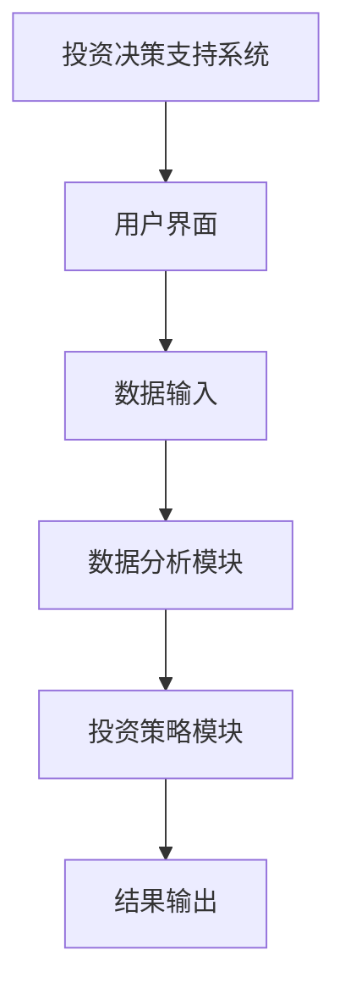

                 


# 周期型vs非周期型公司：彼得林奇的观点

---

## 关键词：
- 彼得·林奇
- 周期型公司
- 非周期型公司
- 投资策略
- 股票分析

---

## 摘要：
本文深入探讨了周期型和非周期型公司的区别及其在投资中的表现，结合彼得·林奇的投资观点，分析了这两种公司的优缺点，提出了投资策略和数学模型，并通过实际案例展示了如何应用这些策略进行投资决策。

---

## 第一部分: 周期型 vs 非周期型公司的背景与概念

### 第1章: 周期型与非周期型公司的定义与特点

#### 1.1 周期型公司的定义与特点
周期型公司是指其业绩受经济周期影响较大的公司。这类公司通常在经济繁荣时表现优异，而在衰退时则会受到较大冲击。

##### 1.1.1 什么是周期型公司
周期型公司通常属于制造业、建筑业和材料行业等实体经济领域。这些行业的需求与整体经济状况密切相关。

##### 1.1.2 周期型公司的核心特征
- **需求波动性**：周期型公司的需求受经济周期影响较大。
- **盈利能力波动性**：由于需求波动，这些公司的盈利能力也会出现周期性波动。
- **市场敏感性**：周期型公司对市场变化非常敏感，容易受到宏观经济政策的影响。

##### 1.1.3 周期型公司的优缺点
- **优点**：在经济繁荣时期，周期型公司通常能够实现高增长。
- **缺点**：在经济衰退时期，这些公司可能面临需求下降、利润减少甚至亏损。

#### 1.2 非周期型公司的定义与特点
非周期型公司是指其业绩相对稳定，不受经济周期影响较大的公司。这些公司通常提供必需品或服务，需求相对稳定。

##### 1.2.1 什么是非周期型公司
非周期型公司通常属于公用事业、医疗保健、食品饮料等行业。这些行业的需求相对稳定，不受经济周期影响较大。

##### 1.2.2 非周期型公司的核心特征
- **需求稳定性**：非周期型公司的需求相对稳定，波动较小。
- **盈利能力稳定性**：由于需求稳定，这些公司的盈利能力通常较为稳定。
- **市场抗波动性**：非周期型公司通常能够在经济衰退期间保持较好的表现。

##### 1.2.3 非周期型公司的优缺点
- **优点**：在经济衰退时期，非周期型公司通常能够保持稳定的收益。
- **缺点**：在经济繁荣时期，这些公司的增长潜力可能不如周期型公司。

### 第2章: 周期型与非周期型公司的对比分析

#### 2.1 两者的区别与联系
周期型公司和非周期型公司在需求波动性、盈利能力稳定性以及市场敏感性方面存在显著差异。然而，这两种公司各有优缺点，投资者可以根据自身的风险偏好和投资目标选择适合的投资标的。

##### 2.1.1 周期波动性对比
- 周期型公司：需求和盈利能力波动较大。
- 非周期型公司：需求和盈利能力相对稳定。

##### 2.1.2 盈利稳定性对比
- 周期型公司：盈利能力波动较大。
- 非周期型公司：盈利能力相对稳定。

##### 2.1.3 市场敏感性对比
- 周期型公司：对市场变化非常敏感。
- 非周期型公司：市场敏感性较低。

#### 2.2 核心概念对比表格

| **对比维度** | **周期型公司** | **非周期型公司** |
|--------------|----------------|-------------------|
| **需求波动性** | 高             | 低               |
| **盈利能力稳定性** | 低             | 高               |
| **市场敏感性** | 高             | 低               |
| **风险承受能力** | 高风险         | 低风险           |
| **增长潜力** | 高（经济繁荣时） | 中等             |
| **投资策略** | 高风险高回报   | 稳定回报         |

---

## 第三部分: 彼得·林奇的投资观点与方法

### 第3章: 彼得·林奇的投资策略

#### 3.1 彼得·林奇的周期型公司投资策略
彼得·林奇认为，周期型公司在经济繁荣时期可以带来高回报，但在经济衰退时期风险较大。因此，他在投资周期型公司时，通常会选择那些在行业周期中处于领先地位且具有较强竞争优势的公司。

##### 3.1.1 什么是彼得·林奇的周期型公司投资策略
林奇认为，周期型公司的投资机会主要出现在经济周期的底部，此时公司估值较低，未来增长潜力较大。

##### 3.1.2 该策略的核心要素
- **行业周期分析**：分析行业所处的周期阶段，选择处于复苏期或繁荣期的公司。
- **公司竞争优势**：选择在行业内具有竞争优势的公司。
- **估值分析**：关注公司的市盈率、市净率等估值指标，选择估值合理的公司。

##### 3.1.3 该策略的优缺点
- **优点**：在经济繁荣时期，周期型公司可以带来较高的回报。
- **缺点**：在经济衰退时期，周期型公司的风险较大，可能面临较大的亏损。

#### 3.2 彼得·林奇的非周期型公司投资策略
林奇认为，非周期型公司在经济衰退时期可以提供较为稳定的回报，因此他在投资非周期型公司时，通常会选择那些具有强大竞争优势和稳定盈利能力的公司。

##### 3.2.1 什么是彼得·林奇的非周期型公司投资策略
林奇认为，非周期型公司的投资机会主要出现在经济衰退时期，此时公司估值较低，未来增长潜力较大。

##### 3.2.2 该策略的核心要素
- **行业稳定性分析**：选择那些需求稳定、受经济周期影响较小的行业。
- **公司竞争优势**：选择在行业内具有竞争优势的公司。
- **估值分析**：关注公司的市盈率、市净率等估值指标，选择估值合理的公司。

##### 3.2.3 该策略的优缺点
- **优点**：在经济衰退时期，非周期型公司可以提供较为稳定的回报。
- **缺点**：在经济繁荣时期，非周期型公司的增长潜力可能不如周期型公司。

### 第4章: 彼得·林奇的投资模型与数学公式

#### 4.1 彼得·林奇周期型公司投资模型
林奇的周期型公司投资模型基于行业周期分析和公司竞争优势分析。

##### 4.1.1 模型的数学公式
$$ \text{周期型公司价值} = \text{行业周期阶段} \times \text{公司竞争优势} $$

#### 4.2 彼得·林奇非周期型公司投资模型
林奇的非周期型公司投资模型基于行业稳定性分析和公司竞争优势分析。

##### 4.2.1 模型的数学公式
$$ \text{非周期型公司价值} = \text{行业稳定性} \times \text{公司竞争优势} $$

### 第5章: 系统分析与架构设计方案

#### 5.1 系统功能设计
##### 5.1.1 投资决策支持系统功能模块
- **数据输入模块**：输入公司财务数据、行业数据等。
- **数据分析模块**：分析公司财务数据、行业数据等，生成投资建议。
- **投资策略模块**：根据数据分析结果，生成投资策略。

##### 5.1.2 数据分析模块
- **行业周期分析**：分析行业所处的周期阶段。
- **公司竞争优势分析**：分析公司在行业中的竞争优势。
- **估值分析**：分析公司的估值指标。

##### 5.1.3 投资策略模块
- **周期型公司投资策略**：根据行业周期分析和公司竞争优势分析，生成周期型公司的投资策略。
- **非周期型公司投资策略**：根据行业稳定性分析和公司竞争优势分析，生成非周期型公司的投资策略。

#### 5.2 系统架构设计
##### 5.2.1 系统架构图（Mermaid）


### 第6章: 项目实战

#### 6.1 环境安装与代码实现
##### 6.1.1 环境安装
- **Python**：安装Python 3.8及以上版本。
- **数据分析库**：安装Pandas、NumPy等库。
- **可视化库**：安装Matplotlib、Seaborn等库。
- **Mermaid**：安装Mermaid CLI。

##### 6.1.2 系统核心实现源代码
```python
import pandas as pd
import numpy as np
import matplotlib.pyplot as plt
import seaborn as sns

# 数据加载
df = pd.read_csv('companies.csv')

# 行业周期分析
df['行业周期阶段'] = df['行业周期阶段'].astype('category')
df['公司竞争优势'] = df['公司竞争优势'].astype('category')

# 数据分析
周期型公司价值 = df['行业周期阶段'] * df['公司竞争优势']
非周期型公司价值 = df['行业稳定性'] * df['公司竞争优势']

# 数据可视化
plt.figure(figsize=(10,6))
sns.boxplot(x='行业周期阶段', y='公司竞争优势', data=df)
plt.title('周期型公司竞争优势分布')
plt.show()

plt.figure(figsize=(10,6))
sns.boxplot(x='行业稳定性', y='公司竞争优势', data=df)
plt.title('非周期型公司竞争优势分布')
plt.show()
```

#### 6.2 案例分析
##### 6.2.1 周期型公司案例分析
以制造业公司为例，分析其行业周期阶段和公司竞争优势。

##### 6.2.2 非周期型公司案例分析
以公用事业公司为例，分析其行业稳定性和发展潜力。

#### 6.3 总结与小结
通过实际案例分析，验证了彼得·林奇的投资策略的有效性。周期型公司在经济繁荣时期可以带来高回报，非周期型公司在经济衰退时期可以提供较为稳定的回报。

---

## 第四部分: 总结与最佳实践

### 第7章: 总结与最佳实践

#### 7.1 总结
本文深入探讨了周期型和非周期型公司的区别及其在投资中的表现，结合彼得·林奇的投资观点，分析了这两种公司的优缺点，提出了投资策略和数学模型，并通过实际案例展示了如何应用这些策略进行投资决策。

#### 7.2 投资建议
- **周期型公司**：在经济繁荣时期投资周期型公司，选择那些在行业周期中处于领先地位且具有较强竞争优势的公司。
- **非周期型公司**：在经济衰退时期投资非周期型公司，选择那些具有强大竞争优势和稳定盈利能力的公司。

#### 7.3 注意事项
- **风险控制**：投资者在投资周期型公司时，需要特别注意经济周期的风险，避免在经济衰退时期过度投资。
- **长期投资**：非周期型公司通常适合长期投资，能够提供较为稳定的回报。
- **持续学习**：投资需要不断学习和更新知识，特别是对经济周期和行业趋势的理解。

#### 7.4 拓展阅读
- 彼得·林奇的其他投资观点。
- 经济周期的深入分析。
- 具体行业的投资机会。

---

## 作者：AI天才研究院/AI Genius Institute & 禅与计算机程序设计艺术 /Zen And The Art of Computer Programming

