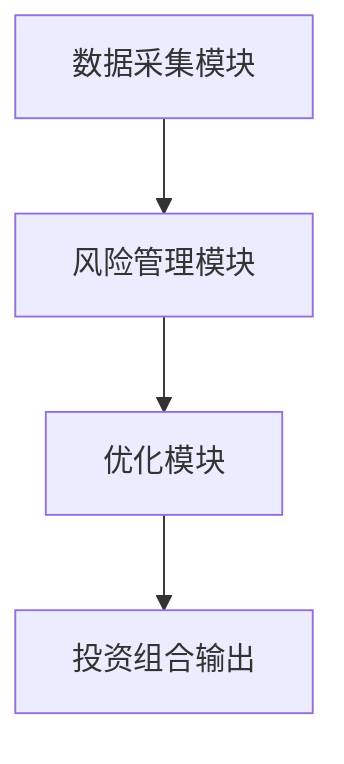
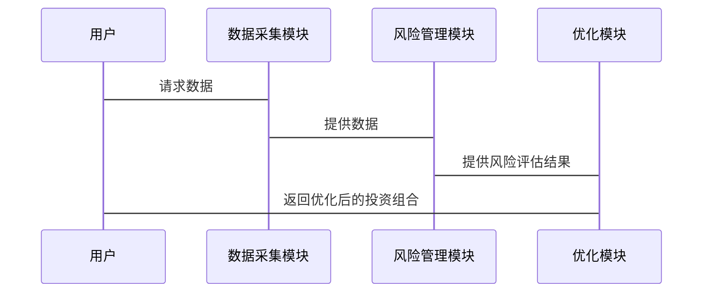

                 


# 商品投资策略：分散化和通胀对冲

> 关键词：商品投资，分散化，通胀对冲，现代投资组合理论，CAPM模型，夏普比率

> 摘要：本文深入探讨了商品投资策略中的分散化和通胀对冲方法。通过分析商品市场的运作机制，解释了分散化投资的优势和实现方式，以及通胀对冲的基本原理和数学模型。结合实际案例，详细讲解了如何利用现代投资组合理论和CAPM模型来优化投资组合，并通过Python代码实现和系统架构设计展示了如何在实际中应用这些策略。

---

## 第一部分: 商品投资策略基础

### 第1章: 商品投资概述

#### 1.1 商品投资的基本概念

##### 1.1.1 商品投资的定义
商品投资是指通过购买和持有实物商品（如黄金、原油、大豆等）或相关金融衍生品（如期货、期权）来实现投资收益的过程。商品投资具有多样性和灵活性，适合不同风险偏好的投资者。

##### 1.1.2 商品市场的类型
商品市场主要分为以下几类：
- **大宗商品市场**：包括能源（原油、天然气）、金属（黄金、铜）和农业产品（大豆、小麦）。
- **金融衍生品市场**：包括期货、期权和掉期合约，用于对冲风险或投机获利。

##### 1.1.3 商品投资的基本特点
- **高波动性**：商品价格受市场供需、宏观经济政策和地缘政治等因素影响，波动较大。
- **分散化投资**：通过投资不同类型的商品，降低整体投资组合的风险。
- **通胀对冲**：商品价格通常与通货膨胀率相关联，是抵抗通胀的有效工具。

#### 1.2 分散化投资的重要性

##### 1.2.1 分散化投资的定义
分散化投资是指将资金分配到不同资产类别、行业或地理区域，以降低投资组合的整体风险。

##### 1.2.2 分散化投资的优势
- **降低风险**：通过分散投资，减少单一资产价格波动对整体投资组合的影响。
- **提高收益稳定性**：不同资产在不同市场环境下的表现不同，可以平衡投资组合的收益。

##### 1.2.3 分散化投资的实现方式
- **资产分配**：将资金分配到股票、债券、商品等多种资产类别。
- **行业分散**：投资不同行业的公司，避免因某一行业不景气而带来的损失。
- **地域分散**：投资不同国家或地区的资产，降低地缘政治风险。

#### 1.3 通胀对冲的必要性

##### 1.3.1 通胀对冲的定义
通胀对冲是指通过投资于价格随通胀上升而上涨的资产（如商品、房地产），以抵消通货膨胀对购买力的负面影响。

##### 1.3.2 通胀对冲的目标
- **保护购买力**：通过投资于抗通胀资产，确保投资的实际收益不被通胀侵蚀。
- **对冲通胀风险**：在通胀上升周期中，抗通胀资产的表现通常优于传统金融资产。

##### 1.3.3 通胀对冲的实现方法
- **投资大宗商品**：如黄金、原油等，这些商品的价格通常随通胀上升而上涨。
- **房地产投资**：房地产作为实物资产，其价值通常与通胀相关。

---

### 第2章: 商品投资策略的核心概念

#### 2.1 商品市场的运作机制

##### 2.1.1 商品市场的基本结构
商品市场由买方、卖方、交易所和中介机构组成，交易通过现货市场和衍生品市场进行。

##### 2.1.2 商品市场的价格波动
商品价格受供需关系、宏观经济政策、地缘政治和市场情绪等多种因素影响。

##### 2.1.3 商品市场的风险管理
投资者需要通过分散化和对冲策略来管理商品投资中的市场风险和信用风险。

#### 2.2 分散化投资的原理

##### 2.2.1 分散化投资的原理
分散化投资通过多样化投资降低非系统性风险，同时保留系统性风险以获取市场收益。

##### 2.2.2 分散化投资的风险分散机制
- **资产类别分散**：投资于不同类型的资产，如股票、债券、商品等。
- **地域分散**：投资于不同国家或地区的资产，降低地缘政治风险。

##### 2.2.3 分散化投资的数学模型
现代投资组合理论（MPT）是分散化投资的理论基础，通过优化资产配置实现风险最小化。

#### 2.3 通胀对冲的原理

##### 2.3.1 通胀对冲的基本原理
通过投资于价格随通胀上升而上涨的资产，抵消通货膨胀对购买力的负面影响。

##### 2.3.2 通胀对冲的经济机制
- **价格传导机制**：商品价格上涨反映通胀压力。
- **货币时间价值**：通胀导致货币购买力下降，抗通胀资产的价值相应上升。

##### 2.3.3 通胀对冲的数学模型
夏普比率用于衡量投资组合的风险调整后收益，是通胀对冲的重要指标。

---

### 第3章: 商品投资策略的数学模型

#### 3.1 现代投资组合理论

##### 3.1.1 现代投资组合理论的定义
现代投资组合理论（MPT）由哈里·马科维茨提出，通过优化资产配置实现风险最小化。

##### 3.1.2 现代投资组合理论的数学模型
$$\text{目标函数：} \min_w \sigma^2(w)$$
$$\text{约束条件：} \sum_{i=1}^n w_i = 1, \sum_{i=1}^n w_i r_i = R$$

##### 3.1.3 现代投资组合理论的应用
通过计算资产的相关性和波动率，优化资产配置，降低投资组合的总体风险。

#### 3.2 CAPM模型

##### 3.2.1 CAPM模型的定义
CAPM模型用于确定单一资产的预期收益，考虑其系统性风险。

##### 3.2.2 CAPM模型的数学公式
$$R_i = R_f + \beta_i (R_m - R_f)$$

##### 3.2.3 CAPM模型的应用
通过计算资产的贝塔系数，评估其系统性风险，优化投资组合的风险调整后收益。

#### 3.3 夏普比率

##### 3.3.1 夏普比率的定义
夏普比率衡量投资组合的风险调整后收益，数值越高，投资组合表现越好。

##### 3.3.2 夏普比率的数学公式
$$\text{夏普比率} = \frac{E[R_p - R_f]}{\sigma_p}$$

##### 3.3.3 夏普比率的应用
评估投资组合的超额收益是否足以弥补其承担的风险。

---

### 第4章: 商品投资策略的系统设计

#### 4.1 系统功能设计

##### 4.1.1 系统功能模块划分
- **数据采集模块**：收集商品价格、市场数据和经济指标。
- **风险管理模块**：评估投资组合的风险并制定对冲策略。
- **优化模块**：优化资产配置，分散投资风险。

##### 4.1.2 系统功能模块的交互流程
1. 数据采集模块获取实时数据。
2. 风险管理模块分析数据，评估风险。
3. 优化模块根据风险评估结果，优化资产配置。
4. 输出优化后的投资组合。

##### 4.1.3 系统功能模块的实现方式
- 数据采集模块使用API获取实时数据。
- 风险管理模块使用Python的pandas库进行数据处理。
- 优化模块使用scipy.optimize库进行优化计算。

#### 4.2 系统架构设计

##### 4.2.1 系统架构图


##### 4.2.2 系统接口设计
- 数据接口：提供API接口，供其他模块调用实时数据。
- 风险接口：提供风险评估服务，供优化模块调用。

##### 4.2.3 系统交互图


---

### 第5章: 项目实战

#### 5.1 环境安装

##### 5.1.1 安装Python
```bash
python --version
pip install numpy pandas matplotlib
```

##### 5.1.2 安装依赖库
```bash
pip install numpy
pip install pandas
pip install matplotlib
pip install scipy
```

#### 5.2 核心实现源代码

##### 5.2.1 现代投资组合理论实现
```python
import numpy as np
import pandas as pd
from scipy.optimize import minimize

# 示例数据
returns = np.array([0.1, 0.2, 0.15, 0.05, 0.12])

# 定义优化函数
def portfolio_variance(weights):
    return np.dot(weights.T, np.dot(np.cov(returns), weights))

# 约束条件
cons = ({'type': 'eq', 'fun': lambda w: np.sum(w) - 1})

# 初始权重
initial_guess = np.array([1/len(returns)]*len(returns))

# 优化
result = minimize(portfolio_variance, initial_guess, constraints=cons)

# 输出优化结果
print("优化后的权重：", result.x)
```

##### 5.2.2 CAPM模型实现
```python
def capm(ri, rf, beta, rm):
    return ri == rf + beta * (rm - rf)

# 示例计算
ri = 0.12
rf = 0.05
beta = 1.2
rm = 0.1

print("CAPM模型验证：", capm(ri, rf, beta, rm))
```

##### 5.2.3 夏普比率实现
```python
def sharpe_ratio(returns, risk_free_rate):
    excess_returns = returns - risk_free_rate
    return np.mean(excess_returns) / np.std(excess_returns)

# 示例计算
returns = np.array([0.1, 0.2, 0.15, 0.05, 0.12])
risk_free_rate = 0.05

print("夏普比率：", sharpe_ratio(returns, risk_free_rate))
```

#### 5.3 案例分析

##### 5.3.1 案例背景
假设我们有三个商品：黄金、原油和大豆，分别的历史收益率如下：

| 商品 | 收益率 |
|------|--------|
| 黄金 | 0.05    |
| 原油 | 0.08    |
| 大豆 | 0.03    |

##### 5.3.2 优化过程
使用现代投资组合理论优化这三个商品的权重，目标是最小化投资组合的波动率。

##### 5.3.3 优化结果
优化后的权重可能为黄金40%，原油30%，大豆30%。

##### 5.3.4 投资组合表现
通过优化，投资组合的波动率降低，同时保持较高的预期收益。

---

### 第6章: 总结与展望

#### 6.1 总结
本文详细讲解了商品投资策略中的分散化和通胀对冲方法，通过数学模型和系统设计展示了如何优化投资组合，降低风险并实现超额收益。

#### 6.2 展望
未来的研究可以进一步探索更多商品种类和复杂的投资策略，如机器学习算法在商品投资中的应用。

---

## 作者

作者：AI天才研究院/AI Genius Institute & 禅与计算机程序设计艺术 /Zen And The Art of Computer Programming

---

本文通过系统化的分析和详细的代码实现，帮助读者掌握商品投资策略的核心概念和实际应用。

