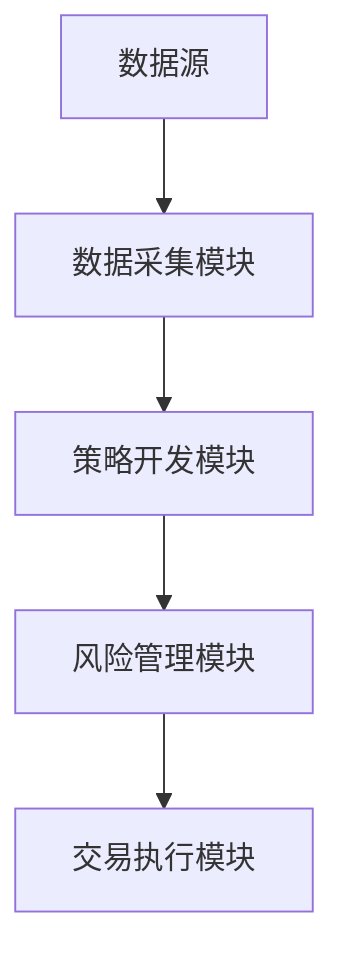

                 


# 商品投资：在通胀环境中的对冲作用

> 关键词：商品投资，通胀，对冲，风险管理，商品市场，资产配置

> 摘要：本文深入探讨商品投资在通胀环境中的对冲作用，分析商品投资的基本概念、通胀对经济的影响、商品投资的对冲机制，以及在实际投资中的应用策略。通过数学模型和系统架构的分析，结合实际案例，为投资者提供科学的对冲策略和风险管理方法。

---

# 第一部分: 商品投资与通胀环境的背景介绍

## 第1章: 商品投资的基本概念

### 1.1 商品投资的定义与分类

#### 1.1.1 商品投资的定义
商品投资是指通过购买和持有实物商品（如黄金、原油、农产品等）或其衍生品（如期货、期权）来实现投资收益的活动。商品投资的本质是利用商品价格波动带来的收益，通常用于对冲通货膨胀或资产保值。

#### 1.1.2 商品的分类与特点
商品可以分为以下几类：
1. **能源类**：原油、天然气等，价格受供需关系和地缘政治影响较大。
2. **金属类**：黄金、白银、铜等，黄金常被视为“避险资产”。
3. **农产品类**：小麦、大豆、玉米等，价格受天气和政策影响。
4. **其他工业品**：塑料、橡胶等，价格受工业需求影响。

#### 1.1.3 商品投资与传统投资的区别
- **传统投资**：主要指股票、债券等金融资产，收益来源包括股息、利息和资本增值。
- **商品投资**：收益来源主要是商品价格的波动，具有更强的实物属性。

### 1.2 通胀的定义与影响

#### 1.2.1 通胀的定义
通货膨胀是指物价总水平在一段时间内持续上涨，货币购买力下降的经济现象。通常用消费者价格指数（CPI）和生产者价格指数（PPI）来衡量。

#### 1.2.2 通胀对经济的影响
1. **消费者影响**：购买力下降，生活成本增加。
2. **企业影响**：成本上升，利润减少，投资意愿下降。
3. **经济影响**：可能导致经济不稳定，货币贬值，资本外流。

#### 1.2.3 通胀对投资决策的影响
- **权益投资**：通胀初期企业利润可能上升，但长期通胀会导致企业成本上升，利润下降。
- **债券投资**：通胀会导致债券的实际收益率下降，债券价格下跌。
- **商品投资**：商品价格通常会随通胀上升，因此商品投资成为对冲通胀的有效工具。

### 1.3 商品投资在对冲通胀中的作用

#### 1.3.1 商品投资的对冲机制
商品价格通常与通胀呈正相关关系，当通胀上升时，商品价格也会上涨，从而抵消通胀对其他资产的负面影响。

#### 1.3.2 商品价格与通胀的关系
商品价格的波动往往反映了通胀的变化。例如，原油价格上涨可能导致整体通胀上升，而粮食价格上涨则直接影响食品价格指数。

#### 1.3.3 商品投资在资产配置中的地位
商品投资可以作为资产配置的重要组成部分，通过分散投资降低风险，同时在通胀上升时提供超额收益。

---

## 第2章: 商品投资的基本原理

### 2.1 商品市场的运作机制

#### 2.1.1 商品交易所的运作
商品交易所是商品交易的场所，提供现货和期货交易。期货交易通过标准化合约，允许投资者在未来以固定价格买入或卖出商品。

#### 2.1.2 商品期货与现货市场的区别
- **现货市场**：即时买卖，价格反映当前市场供需。
- **期货市场**：通过合约约定未来交割价格和时间，用于套期保值和投机。

#### 2.1.3 商品价格的决定因素
1. **供需关系**：商品的供给和需求直接决定价格。
2. **市场情绪**：投资者情绪影响短期价格波动。
3. **宏观经济因素**：如货币政策、地缘政治、自然灾害等。

### 2.2 商品价格波动的分析

#### 2.2.1 商品价格波动的周期性
商品价格通常呈现周期性波动，受供需、政策和市场情绪的影响。例如，原油价格受OPEC产量政策和地缘政治影响较大。

#### 2.2.2 商品价格波动的影响因素
1. **供需失衡**：如农产品收成不佳导致价格上涨。
2. **政策变化**：如政府出台能源补贴政策。
3. **技术进步**：如农业技术进步提高产量。

#### 2.2.3 商品价格波动的预测方法
1. **技术分析**：通过价格走势和成交量预测未来价格。
2. **基本面分析**：分析供需、宏观经济等因素预测价格。
3. **统计套利**：利用商品价格差异进行套利。

### 2.3 商品投资的风险与收益

#### 2.3.1 商品投资的主要风险
1. **价格波动风险**：商品价格波动大，可能导致投资损失。
2. **流动性风险**：部分商品市场流动性较低，难以快速变现。
3. **政策风险**：政府政策变化可能影响商品价格。

#### 2.3.2 商品投资的收益来源
1. **价格波动收益**：通过投机或套期保值获得收益。
2. **持有成本**：如仓储费用和利息成本。

#### 2.3.3 商品投资的风险管理
1. **分散投资**：通过投资不同种类的商品降低风险。
2. **杠杆使用**：谨慎使用杠杆，避免过度放大风险。
3. **止损策略**：设置止损点，控制投资损失。

---

## 第3章: 对冲通胀的基本理论

### 3.1 对冲的定义与原理

#### 3.1.1 对冲的定义
对冲是指通过投资相关资产来抵消另一部分资产的价格波动风险，从而降低整体投资组合的波动性。

#### 3.1.2 对冲的基本原理
通过建立相反的头寸，抵消原有投资的不利影响。例如，买入股票同时卖出股指期货，以对冲市场风险。

#### 3.1.3 对冲在投资中的应用
1. **市场中性策略**：通过做多和做空平衡市场风险。
2. **套利策略**：利用资产价格差异进行无风险套利。

### 3.2 商品投资作为通胀对冲工具的理论基础

#### 3.2.1 商品价格与通胀的关系
商品价格上涨通常反映通胀压力，因此商品投资可以有效对冲通胀带来的资产贬值风险。

#### 3.2.2 商品投资对冲通胀的机制
通过持有商品头寸，投资者可以抵消通胀对其他资产（如股票、债券）的负面影响。

#### 3.2.3 商品投资在资产配置中的作用
商品投资可以作为资产配置的重要组成部分，通过分散化降低投资组合的整体风险。

---

## 第4章: 商品投资的对冲策略

### 4.1 商品投资的对冲策略分类

#### 4.1.1 空头对冲策略
- **定义**：卖出商品期货，预期未来价格下跌。
- **适用场景**：通胀预期下降，商品价格可能下跌。

#### 4.1.2 多头对冲策略
- **定义**：买入商品期货，预期未来价格上涨。
- **适用场景**：通胀预期上升，商品价格上涨。

#### 4.1.3 组合对冲策略
- **定义**：通过多种商品组合，分散风险，增强收益。
- **适用场景**：复杂市场环境下，利用多种商品的波动性进行对冲。

### 4.2 商品投资对冲策略的选择

#### 4.2.1 根据市场环境选择策略
- **通胀上升**：选择多头策略，投资能源、农产品等价格上涨的商品。
- **通胀下降**：选择空头策略，卖出预期价格下跌的商品。

#### 4.2.2 根据资产配置选择策略
- **保守型投资者**：选择黄金等避险商品，降低投资组合风险。
- **激进型投资者**：选择高波动商品，追求高收益。

#### 4.2.3 根据风险承受能力选择策略
- **低风险承受能力**：选择波动小的商品，如黄金、白银。
- **高风险承受能力**：选择波动大的商品，如原油、农产品。

---

## 第5章: 商品投资的数学模型与算法

### 5.1 商品价格波动的数学模型

#### 5.1.1 随机游走模型
假设商品价格的变化是随机的，可以用布朗运动模型描述价格波动。

$$ S(t) = S(0) + \mu t + \sigma W(t) $$

其中，$\mu$ 是期望回报率，$\sigma$ 是波动率，$W(t)$ 是布朗运动。

#### 5.1.2 马尔可夫链模型
用于分析商品价格的短期波动，假设未来价格只依赖当前状态。

#### 5.1.3 GARCH模型
用于估计商品价格的 volatility，常用于风险管理。

$$ \sigma^2_t = a + b \sigma^2_{t-1} + c r^2_{t-1} $$

其中，$r_{t-1}$ 是收益率，$a$、$b$、$c$ 是参数。

---

## 第6章: 商品投资的系统架构与风险管理

### 6.1 商品投资系统的架构设计

#### 6.1.1 系统功能模块
1. **数据采集模块**：收集商品价格、市场数据。
2. **策略开发模块**：设计和测试对冲策略。
3. **风险管理模块**：监控和管理投资风险。
4. **交易执行模块**：执行交易指令。

#### 6.1.2 系统架构图


### 6.2 风险管理策略

#### 6.2.1 头寸管理
- **固定比例**：按资产比例分配头寸。
- **风险调整后头寸**：根据波动率调整头寸大小。

#### 6.2.2 止损策略
- **固定比例止损**：当价格下跌达到设定比例时止损。
- **技术指标止损**：根据技术指标（如RSI、MACD）设置止损点。

#### 6.2.3 风险价值（VaR）
- **VaR计算**：估计在给定置信水平下的最大损失。

---

## 第7章: 商品投资的项目实战

### 7.1 项目背景与目标
通过投资商品期货，构建一个对冲通胀的投资组合，实现稳健收益。

### 7.2 实战环境与工具
1. **数据源**：使用彭博、路透等金融数据平台。
2. **交易工具**：使用MetaTrader、TradingView等交易软件。
3. **编程工具**：使用Python、R进行数据分析和策略开发。

### 7.3 核心实现代码

```python
import pandas as pd
import numpy as np

# 示例：计算商品价格波动率
def calculate_volatility(prices):
    returns = prices.pct_change().dropna()
    volatility = returns.std() * np.sqrt(252)  # 年化波动率
    return volatility

# 数据加载与处理
data = pd.read_csv('commodity_prices.csv')
prices = data['price'].values
volatility = calculate_volatility(data)

print(f"年化波动率: {volatility:.2%}")
```

### 7.4 实战案例分析
以黄金为例，分析在通胀上升时的对冲策略。

#### 7.4.1 案例背景
2008年金融危机期间，黄金价格上涨，成为有效的通胀对冲工具。

#### 7.4.2 案例分析
通过买入黄金期货，对冲股票投资的通胀风险，实现资产保值。

### 7.5 项目小结
通过实战项目，验证了商品投资在对冲通胀中的有效性，同时也发现了风险管理的重要性。

---

## 第8章: 商品投资的最佳实践与注意事项

### 8.1 最佳实践 tips
1. **分散投资**：投资多种商品，降低风险。
2. **长期持有**：避免频繁交易，降低交易成本。
3. **关注宏观因素**：关注货币政策、地缘政治等宏观因素对商品价格的影响。

### 8.2 小结
商品投资是应对通胀的有效工具，但需要结合市场环境和自身风险承受能力进行合理配置。

### 8.3 注意事项
1. **避免过度杠杆**：杠杆放大收益的同时也放大风险。
2. **谨慎选择交易时机**：商品价格波动大，需准确判断市场趋势。
3. **持续学习与调整**：市场环境不断变化，需及时调整投资策略。

---

## 第9章: 结论与展望

### 9.1 结论
商品投资是应对通胀的有效工具，通过合理的资产配置和对冲策略，可以在通胀环境中实现资产保值和增值。

### 9.2 展望
随着全球化和科技发展，商品投资将更加多元化和智能化。未来，人工智能和大数据分析将为商品投资提供更多的机会和挑战。

---

# 作者

作者：AI天才研究院/AI Genius Institute & 禅与计算机程序设计艺术 /Zen And The Art of Computer Programming

---

感谢您的阅读！如果需要进一步探讨商品投资的对冲策略，欢迎随时联系！

