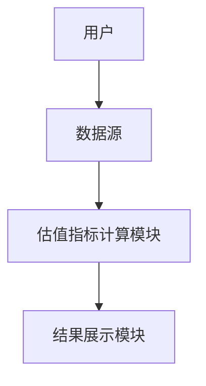

                 


# 国际市场估值指标的局限性探讨

> 关键词：估值指标、国际市场、市盈率、市净率、局限性分析

> 摘要：本文探讨了国际市场中常用估值指标的局限性，分析了这些指标在不同市场环境下的表现，揭示了其在实际应用中的不足之处，并提出了改进的建议。

---

# 第1章 引言

## 1.1 研究背景

在金融市场中，估值指标是投资者评估资产价值的重要工具。然而，随着全球化的发展，国际市场环境复杂多变，传统的估值指标在应用中暴露出诸多局限性。

---

## 1.2 研究意义

探讨估值指标的局限性有助于投资者更好地理解其适用范围，避免在投资决策中犯下代价高昂的错误。

---

# 第2章 估值指标的基本概念与问题背景

## 2.1 估值指标的定义与分类

### 2.1.1 估值指标的基本定义

估值指标是衡量资产价值的量化工具，常用的指标包括市盈率（P/E）、市净率（P/B）、市销率（P/S）和股息率（Dividend Yield）。

---

## 2.2 估值指标的理论基础

### 2.2.1 资产定价理论

资产的理论价值应反映其未来现金流的现值，而估值指标则试图将这些理论价值与市场价格进行对比。

---

# 第3章 估值指标的核心概念与属性特征

## 3.1 主流估值指标的定义与属性

### 3.1.1 市盈率（P/E）

市盈率 = 股价 / 每股收益（EPS）

- **优点**：反映市场对收益的预期，适合评估盈利稳定的公司。
- **缺点**：无法反映资产质量，且在收益为负时失去意义。

### 3.1.2 市净率（P/B）

市净率 = 股价 / 每股净资产（BPS）

- **优点**：适合评估金融资产或资产密集型企业。
- **缺点**：忽视了企业的盈利能力和成长性。

---

## 3.2 估值指标的属性特征对比

| 指标   | 定义                     | 优点             | 缺点             |
|--------|--------------------------|------------------|------------------|
| P/E    | 股价/每股收益           | 反映盈利能力     | 忽视资产质量     |
| P/B    | 股价/每股净资产         | 反映资产价值     | 忽视盈利能力和成长性 |

---

# 第4章 估值指标的算法原理与数学模型

## 4.1 市盈率（P/E）的计算与分析

### 4.1.1 计算公式

$$ P/E = \frac{Stock Price}{Earnings Per Share} $$

### 4.1.2 举例说明

假设某公司股价为50元，每股收益为5元，则市盈率为10。

---

## 4.2 市净率（P/B）的计算与分析

### 4.2.1 计算公式

$$ P/B = \frac{Stock Price}{Book Value Per Share} $$

---

# 第5章 系统分析与架构设计方案

## 5.1 问题场景介绍

在不同市场环境下，估值指标的表现差异显著。例如，在新兴市场中，市盈率可能被高估，而在成熟市场中，市净率可能更稳定。

---

## 5.2 系统功能设计

### 5.2.1 领域模型类图


---

## 5.3 系统架构图



---

# 第6章 项目实战

## 6.1 环境安装

- 安装Python和相关库（如pandas、numpy）

## 6.2 核心实现源代码

```python
import pandas as pd

def calculate_pe_ticker(ticker):
    df = pd.get_data(ticker)
    pe_ratio = df['Close'] / df['Earnings Per Share']
    return pe_ratio

ticker = 'AAPL'
pe = calculate_pe_ticker(ticker)
print(f"{ticker}的市盈率为：{pe}")
```

---

## 6.3 案例分析

以苹果公司为例，分析市盈率和市净率在国际市场中的表现，并讨论其局限性。

---

# 第7章 最佳实践与小结

## 7.1 小结

估值指标在国际市场中的应用受到多方面限制，投资者需结合市场环境和其他因素进行综合判断。

---

## 7.2 注意事项

- 考虑市场波动和经济周期的影响
- 结合公司基本面进行综合分析

---

## 7.3 未来展望

未来，随着人工智能的发展，更复杂的估值模型将被开发，以克服现有指标的局限性。

---

# 附录

## 附录A 术语表

- 市盈率（P/E）：股价与每股收益的比率
- 市净率（P/B）：股价与每股净资产的比率

---

## 附录B 参考文献

- Fama, E. (1970). Efficient Capital Markets: A Review of Theory and Empirical Work.
- Graham, B. (1949). The Intelligent Investor.

---

# 作者

作者：AI天才研究院 & 禅与计算机程序设计艺术

