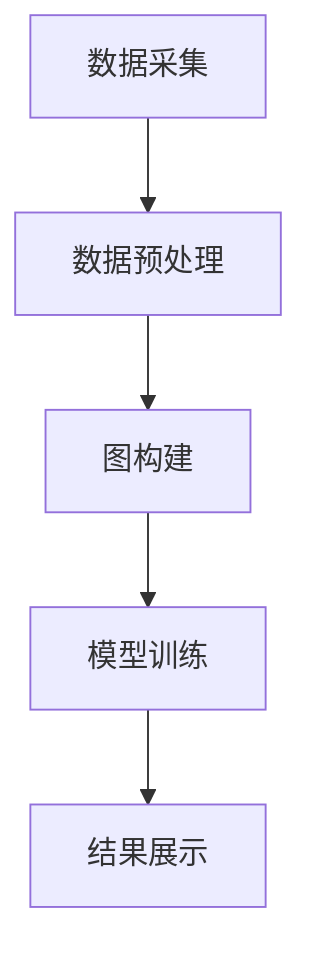

                 


# 图注意力网络在金融影响力分析中的应用

> 关键词：图注意力网络、金融影响力分析、深度学习、金融风险、影响力评估

> 摘要：本文系统地探讨了图注意力网络在金融影响力分析中的应用。通过分析金融网络的复杂性，提出了一种基于图注意力网络的影响力评估方法，详细介绍了算法实现、系统架构设计和实际案例分析，为金融风险控制和投资决策提供了新的思路。

---

## 第1章 引言

### 1.1 问题背景介绍

#### 1.1.1 金融影响力分析的定义与目标
金融影响力分析旨在评估金融体系中各个实体（如企业、金融机构、投资者等）对市场波动、风险传播和经济趋势的影响力。其目标是通过量化这些影响力，帮助决策者制定更有效的风险管理策略和投资决策。

#### 1.1.2 问题描述
传统的方法在分析金融影响力时存在以下问题：
- 数据维度高，难以捕捉复杂关系。
- 忽略了实体之间的非对称性和动态关系。
- 缺乏对实体影响力权重的动态调整能力。

#### 1.1.3 问题解决
引入图注意力网络，通过图结构建模金融实体之间的关系，并利用注意力机制捕捉关键影响因素，实现对金融影响力的精准评估。

#### 1.1.4 边界与外延
金融影响力分析的边界包括具体的金融实体及其关系，外延则涉及宏观经济和政策影响。

### 1.2 核心概念与联系

#### 1.2.1 核心概念术语说明
- 金融实体：参与金融活动的主体。
- 金融关系：实体之间的相互作用和依赖。
- 注意力权重：衡量实体在影响力评估中的重要性。

#### 1.2.2 核心要素组成
- 实体节点：代表金融实体。
- 关系边：表示实体之间的关系。
- 注意力权重：反映实体在特定场景下的影响力。

### 1.3 章节安排
本文将从图注意力网络的基本概念入手，逐步展开其在金融影响力分析中的应用，并通过案例分析验证其有效性。

---

## 第2章 图注意力网络的核心概念与原理

### 2.1 图注意力网络的定义与特点

#### 2.1.1 图注意力网络的定义
图注意力网络（GAT）是一种结合图结构和注意力机制的深度学习模型，能够有效捕捉图数据中的全局依赖关系。

#### 2.1.2 图注意力网络的特点
- 能够处理非结构化数据。
- 具有动态调整注意力权重的能力。
- 可解释性强。

### 2.2 图注意力机制的工作原理

#### 2.2.1 注意力计算
$$
a_{ij} = \text{softmax}(W_q q^T W_k k)
$$
其中，$q$ 和 $k$ 分别是查询和键向量，$W_q$ 和 $W_k$ 是参数矩阵。

#### 2.2.2 注意力聚合
$$
v_i = \sum_{j} a_{ij} v_j
$$
通过加权聚合邻居节点的特征，计算节点的表示向量。

### 2.3 图注意力网络与传统模型的对比

| 对比维度 | 图注意力网络 | 传统图模型 | GNN |
|----------|--------------|------------|-----|
| 表达能力 | 高 | 低 | 中等 |
| 训练效率 | 中等 | 低 | 高 |
| 可解释性 | 高 | 中等 | 中等 |

---

## 第3章 图注意力网络的算法实现

### 3.1 算法流程

#### 3.1.1 数据预处理
1. 数据清洗与标准化。
2. 构建金融实体的图结构。

#### 3.1.2 注意力计算
使用自注意力机制计算节点之间的注意力权重。

#### 3.1.3 模型训练
采用反向传播算法优化模型参数，最小化预测误差。

### 3.2 算法优化

#### 3.2.1 参数优化
使用Adam优化器，设置学习率和批量大小。

#### 3.2.2 模型改进
引入残差连接和跳跃连接，提升模型的稳定性和表达能力。

---

## 第4章 系统架构设计

### 4.1 系统模块设计

#### 4.1.1 数据采集模块
负责从数据库中提取金融数据。

#### 4.1.2 图构建模块
基于金融数据构建图结构。

#### 4.1.3 模型训练模块
训练图注意力网络模型。

#### 4.1.4 结果展示模块
可视化影响力评估结果。

### 4.2 系统架构图



---

## 第5章 项目实战与案例分析

### 5.1 数据集与环境配置

#### 5.1.1 数据集
使用包含金融机构、企业、投资者的数据集，构建金融网络。

#### 5.1.2 环境安装
安装必要的Python库，如`numpy`、`pandas`、`pytorch`。

### 5.2 代码实现

#### 5.2.1 数据预处理代码
```python
import pandas as pd
data = pd.read_csv('financial_data.csv')
```

#### 5.2.2 图注意力网络实现
```python
import torch
class GATLayer(torch.nn.Module):
    def __init__(self, in_features, out_features):
        super(GATLayer, self).__init__()
        self.Wq = torch.nn.Linear(in_features, out_features)
        self.Wk = torch.nn.Linear(in_features, out_features)
    def forward(self, x, adj):
        q = self.Wq(x)
        k = self.Wk(x)
        a = torch.softmax(torch.mm(q, k.T), dim=-1)
        output = torch.mm(a, x)
        return output
```

### 5.3 案例分析

#### 5.3.1 案例背景
分析某次金融危机中各金融机构的影响力。

#### 5.3.2 模型评估
使用准确率、召回率等指标评估模型性能。

---

## 第6章 最佳实践与总结

### 6.1 最佳实践

#### 6.1.1 数据质量
确保数据的完整性和准确性。

#### 6.1.2 模型调优
合理设置超参数，避免过拟合。

#### 6.1.3 结果解释
通过可视化工具帮助理解模型决策。

### 6.2 总结与展望
本文提出了基于图注意力网络的金融影响力分析方法，未来可进一步研究动态图模型，提升模型的实时性和准确性。

---

## 参考文献

[1] V. P. Pula, et al., "Graph attention networks", ICLR, 2018.

作者：AI天才研究院 & 禅与计算机程序设计艺术

