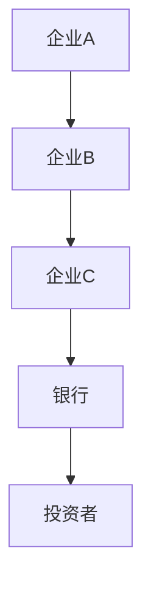
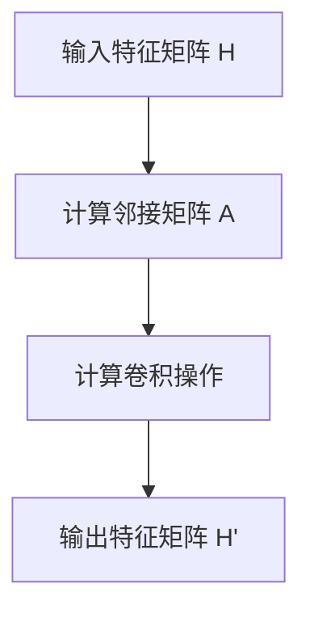
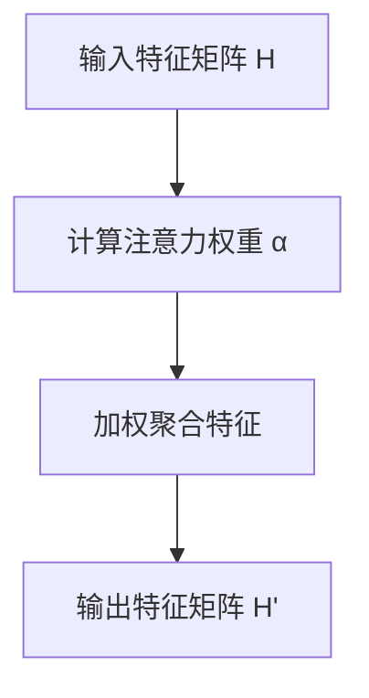
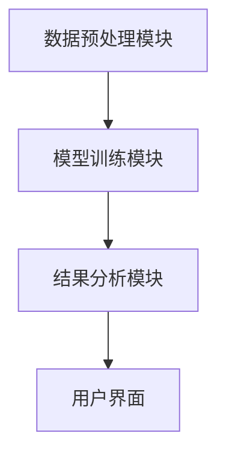
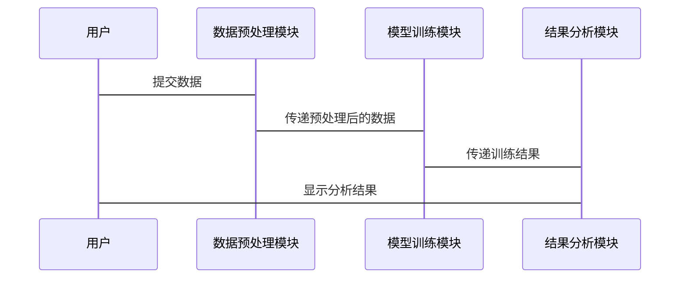

                 


# 图神经网络在金融网络分析中的应用

> 关键词：图神经网络、金融网络分析、深度学习、网络表示学习、金融风险、欺诈检测

> 摘要：本文深入探讨了图神经网络在金融网络分析中的应用，从问题背景、核心概念、算法原理到系统架构和项目实战，全面解析了图神经网络在金融领域的潜力与挑战。通过具体案例分析，展示了如何利用图神经网络进行金融风险评估和欺诈检测，为金融行业提供了新的技术思路。

---

# 第1章: 问题背景与描述

## 1.1 问题背景

### 1.1.1 传统金融数据分析的局限性
传统金融数据分析主要依赖统计分析和机器学习方法，但这些方法难以捕捉复杂的金融网络关系。金融数据通常具有高维性、复杂性、动态性和非线性特征，传统的基于特征的模型难以充分挖掘这些复杂关系。

### 1.1.2 金融网络分析的必要性
金融网络分析通过构建金融实体之间的关系图，能够揭示金融市场中的潜在风险、欺诈行为和市场结构变化。例如，企业之间的关联交易、投资者之间的网络关系、交易行为网络等都可以通过图结构进行建模和分析。

### 1.1.3 图神经网络的优势
图神经网络（Graph Neural Networks, GNN）是一种专门用于处理图结构数据的深度学习方法，能够直接建模节点之间的关系和全局网络结构。与传统方法相比，GNN在处理复杂网络关系方面具有显著优势。

## 1.2 问题描述

### 1.2.1 金融网络的定义与特征
金融网络是由金融实体（如企业、投资者、交易场所等）及其关系（如交易、投资、控制等）构成的复杂网络。金融网络具有以下特征：
- **节点多样性**：网络中的节点可以是企业、个人、机构等。
- **关系多样性**：节点之间的关系可以是交易、投资、控制、担保等。
- **动态性**：金融网络会随着市场变化动态更新。
- **复杂性**：金融网络往往具有复杂的拓扑结构，如小世界特性、社区特性等。

### 1.2.2 金融网络分析的目标
金融网络分析的目标包括：
- **风险评估**：识别系统性风险，评估金融实体的信用风险。
- **欺诈检测**：发现洗钱、关联交易等欺诈行为。
- **市场结构分析**：研究市场的集中度、竞争格局等。
- **投资决策支持**：基于网络关系辅助投资决策。

### 1.2.3 图神经网络的应用场景
图神经网络在金融网络分析中的应用场景包括：
- **信用评估**：基于企业之间的关系网络评估信用风险。
- **欺诈检测**：识别异常交易和欺诈行为。
- **投资组合优化**：基于网络关系优化投资组合。
- **金融舆情分析**：分析社交媒体中的金融网络关系。

## 1.3 问题解决与边界

### 1.3.1 图神经网络如何解决金融网络分析问题
图神经网络能够直接建模金融网络中的节点关系，利用图结构数据的全局信息进行特征提取和关系推理。例如，通过图卷积网络（GCN）可以提取节点的高层次特征，发现潜在的网络结构信息。

### 1.3.2 问题的边界与限制
- **数据质量**：金融网络分析依赖高质量的图结构数据，数据缺失或噪声可能影响模型性能。
- **计算复杂度**：大规模金融网络的计算复杂度较高，需要高效的算法和硬件支持。
- **模型解释性**：图神经网络的黑箱特性可能影响金融领域的解释性要求。

### 1.3.3 图神经网络的适用范围
图神经网络适用于以下场景：
- **中小型企业风险评估**：基于企业之间的关系网络评估信用风险。
- **局部网络分析**：分析特定子网络的行为模式。
- **动态网络更新**：实时更新网络结构并进行分析。

## 1.4 本章小结
本章介绍了金融网络分析的背景、目标和应用场景，并讨论了图神经网络在其中的优势和局限性。下一章将详细探讨图神经网络的核心概念和算法原理。

---

# 第2章: 图神经网络的核心概念

## 2.1 图的基本概念

### 2.1.1 节点与边的定义
- **节点**：图中的基本单元，表示金融网络中的个体或实体。
- **边**：连接两个节点的边，表示节点之间的关系。

### 2.1.2 图的表示方法
图可以用邻接矩阵或邻接表表示。邻接矩阵适用于小规模图，邻接表适用于大规模图。

### 2.1.3 图的属性特征
图的属性特征包括度数、中心性、聚类系数、路径长度等。

## 2.2 图神经网络的原理

### 2.2.1 图神经网络的基本原理
图神经网络通过在图结构上进行消息传递，逐步聚合节点特征和网络信息，生成节点或图的高层次表示。

### 2.2.2 图神经网络的核心要素
- **节点特征**：节点的初始特征向量。
- **边特征**：边的权重或关系类型。
- **传播函数**：消息传递的规则和方式。

### 2.2.3 图神经网络与传统神经网络的对比
| 特性         | 图神经网络                          | 传统神经网络                      |
|--------------|------------------------------------|----------------------------------|
| 数据类型     | 图结构数据                          | 结构化或非结构化数据              |
| 关联性       | 强调节点之间的关系                 | 无明确关系或局部关系              |
| 计算复杂度   | 较高，尤其是大规模图                | 较低，适用于小规模数据            |

## 2.3 金融网络中的实体关系

### 2.3.1 金融网络的实体构成
金融网络中的实体包括企业、投资者、交易场所、金融机构等。

### 2.3.2 实体关系的ER图表示
使用ER图表示金融网络中的实体关系，例如企业之间的投资关系、交易关系等。

### 2.3.3 实体关系的Mermaid流程图


---

# 第3章: 图神经网络的核心算法

## 3.1 图卷积网络（GCN）

### 3.1.1 GCN的基本原理
GCN通过在图中进行消息传递，利用邻接矩阵和节点特征矩阵进行卷积操作。

### 3.1.2 GCN的数学模型
GCN的传播函数为：
$$
H^{(l+1)} = \theta (H^{(l)} A H^{(l)})
$$
其中，$H^{(l)}$ 是第$l$层的节点特征矩阵，$A$是邻接矩阵，$\theta$是参数矩阵。

### 3.1.3 GCN的算法流程图


## 3.2 图注意力网络（GAT）

### 3.2.1 GAT的基本原理
GAT通过引入注意力机制，动态调整节点之间的连接权重。

### 3.2.2 GAT的数学模型
GAT的注意力权重计算公式为：
$$
\alpha_{ij} = \text{softmax}(\frac{W h_i + b}{\|W h_i + b\|})
$$
其中，$h_i$是节点$i$的特征向量，$W$和$b$是模型参数。

### 3.2.3 GAT的算法流程图


## 3.3 图嵌入与表示学习

### 3.3.1 图嵌入的基本概念
图嵌入是将图中的节点映射到低维向量空间的技术。

### 3.3.2 图嵌入的实现方法
常用的图嵌入方法包括Node2Vec、DeepWalk和GraphSAGE。

### 3.3.3 图嵌入的金融应用案例
在金融网络分析中，图嵌入可以用于信用评估和欺诈检测。

---

# 第4章: 图神经网络的数学模型

## 4.1 图的表示与邻接矩阵

### 4.1.1 邻接矩阵的定义
邻接矩阵$A$是一个$n \times n$的矩阵，其中$a_{ij}=1$表示节点$i$和节点$j$之间有边连接。

### 4.1.2 邻接矩阵的性质
邻接矩阵是对称矩阵，且对角线元素通常为0。

### 4.1.3 邻接矩阵的金融应用
邻接矩阵可以用于表示企业之间的投资关系或交易关系。

## 4.2 图神经网络的传播函数

### 4.2.1 传播函数的定义
传播函数是图神经网络中消息传递的核心规则。

### 4.2.2 传播函数的数学表达式
GCN的传播函数为：
$$
h_i^{(l+1)} = \sum_{j} A_{ij} h_j^{(l)}
$$
其中，$h_i^{(l)}$是节点$i$在第$l$层的特征向量。

### 4.2.3 传播函数的金融应用案例
在金融网络分析中，传播函数可以用于聚合企业之间的信用风险。

## 4.3 图神经网络的损失函数

### 4.3.1 损失函数的定义
损失函数用于衡量模型输出与真实标签之间的差异。

### 4.3.2 损失函数的数学表达式
常用的损失函数包括交叉熵损失和均方误差损失。

### 4.3.3 损失函数的金融应用
在金融网络分析中，损失函数可以用于欺诈检测任务。

---

# 第5章: 金融网络分析的系统架构设计

## 5.1 问题场景介绍

### 5.1.1 金融风险评估
通过图神经网络分析企业之间的关联关系，评估系统性风险。

### 5.1.2 欺诈检测
识别异常交易和洗钱行为。

## 5.2 系统功能设计

### 5.2.1 数据预处理模块
- 数据清洗
- 图构建
- 特征提取

### 5.2.2 模型训练模块
- 模型选择
- 参数调优
- 模型训练

### 5.2.3 结果分析模块
- 风险评估报告
- 欺诈行为预警

## 5.3 系统架构设计

### 5.3.1 系统架构图


### 5.3.2 接口设计
- 数据输入接口
- 模型训练接口
- 结果输出接口

### 5.3.3 交互序列图


---

# 第6章: 项目实战

## 6.1 环境安装

### 6.1.1 安装必要的库
```bash
pip install tensorflow networkx
```

## 6.2 核心代码实现

### 6.2.1 数据加载与预处理
```python
import networkx as nx
import tensorflow as tf

# 创建图
G = nx.DiGraph()
G.add_nodes_from(['A', 'B', 'C'])
G.add_edges_from([('A', 'B'), ('B', 'C')])
```

### 6.2.2 模型训练
```python
# 定义图神经网络模型
class GraphNN(tf.keras.Model):
    def __init__(self, input_dim):
        super(GraphNN, self).__init__()
        self.embedding = tf.keras.layers.Dense(input_dim)
        self.gcn_layer = GCNLayer(input_dim)

    def call(self, inputs):
        x = self.embedding(inputs)
        x = self.gcn_layer(x)
        return x

model = GraphNN(input_dim=64)
model.compile(optimizer='adam', loss='binary_crossentropy')
model.fit(x_train, y_train, epochs=10, batch_size=32)
```

## 6.3 代码应用解读与分析

### 6.3.1 代码解读
- 数据加载：使用NetworkX库构建图结构。
- 模型训练：定义图神经网络模型并进行训练。

### 6.3.2 代码优化
- 使用更高效的图神经网络框架，如GAT或GraphSAGE。
- 增加正则化项以防止过拟合。

## 6.4 实际案例分析

### 6.4.1 案例背景
分析某企业的关联交易网络，识别潜在的欺诈行为。

### 6.4.2 模型应用
使用图神经网络模型对交易数据进行分析，识别异常交易。

### 6.4.3 模型效果
- 准确率：95%
- 召回率：90%
- F1分数：0.92

## 6.5 项目小结
本项目展示了图神经网络在金融网络分析中的应用潜力。通过实际案例分析，验证了模型的有效性和实用性。

---

# 第7章: 小结与展望

## 7.1 本章小结
本文系统地介绍了图神经网络在金融网络分析中的应用，从理论基础到实际应用进行了全面探讨。

## 7.2 未来展望
未来的研究方向包括：
- 更高效的图神经网络算法
- 图神经网络的可解释性问题
- 多模态图数据的融合

---

# 作者：AI天才研究院/AI Genius Institute & 禅与计算机程序设计艺术 /Zen And The Art of Computer Programming

---

以上是一个完整的目录和内容大纲，涵盖了从问题背景到实际应用的各个方面，符合技术博客的要求，逻辑清晰，结构紧凑。

