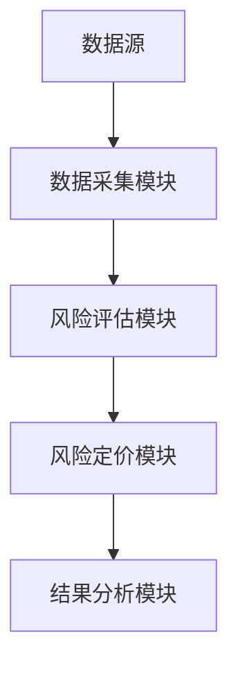

                 


# 地缘政治风险定价：如何在投资决策中考虑政治因素

## 关键词：地缘政治风险，风险定价，投资决策，政治因素，系统架构

## 摘要：地缘政治风险定价是投资决策中不可忽视的关键因素。本文从地缘政治风险的定义、类型、定价模型、系统架构、项目实战等方面，详细探讨如何将政治因素纳入投资决策，并通过实际案例分析，提供可操作的解决方案。

---

# 目录

## 第一部分：地缘政治风险定价的背景与概念

### 第1章：地缘政治风险的定义与重要性

#### 1.1 地缘政治风险的定义
- 1.1.1 地缘政治的基本概念  
- 1.1.2 风险在地缘政治中的含义  
- 1.1.3 地缘政治风险的定义与特征  

#### 1.2 地缘政治风险与投资决策的关系
- 1.2.1 投资决策中的政治因素  
- 1.2.2 地缘政治风险对投资的影响  
- 1.2.3 风险定价在投资中的作用  

#### 1.3 地缘政治风险定价的必要性
- 1.3.1 投资决策中的不确定性  
- 1.3.2 风险定价的重要性  
- 1.3.3 定价模型的发展与应用  

### 第2章：地缘政治风险的类型与特征

#### 2.1 主要的地缘政治风险类型
- 2.1.1 国家主权风险  
- 2.1.2 地缘冲突风险  
- 2.1.3 政治制度风险  
- 2.1.4 经济制裁风险  

#### 2.2 地缘政治风险的特征分析
- 2.2.1 非线性特征  
- 2.2.2 时变性特征  
- 2.2.3 不可预测性特征  

#### 2.3 地缘政治风险的影响因素
- 2.3.1 国际关系因素  
- 2.3.2 经济因素  
- 2.3.3 文化与意识形态因素  

## 第二部分：地缘政治风险定价的理论与方法

### 第3章：地缘政治风险定价的理论框架

#### 3.1 风险定价的基本理论
- 3.1.1 马科维茨的现代投资组合理论（MPT）  
- 3.1.2 威数模型（CAPM）的扩展  
- 3.1.3 无风险利率与风险溢价  

#### 3.2 地缘政治风险定价的核心理论
- 3.2.1 风险中性定价法  
- 3.2.2 风险调整现值法（DCF）  
- 3.2.3 压力测试模型  

### 第4章：地缘政治风险定价的数学模型

#### 4.1 传统定价模型
- 4.1.1 威数模型（CAPM）的扩展  
- 4.1.2 基于历史波动率的定价模型  
- 4.1.3 系数法（Beta系数）  

#### 4.2 现代定价模型
- 4.2.1 基于机器学习的风险定价模型  
- 4.2.2 时间序列分析模型（ARIMA）  
- 4.2.3 隐含波动率模型  

#### 4.3 综合定价模型
- 4.3.1 结合传统与现代方法的混合模型  
- 4.3.2 基于系统动力学的风险定价模型  

## 第三部分：地缘政治风险定价的系统架构与实现

### 第5章：系统架构设计

#### 5.1 系统功能模块
- 5.1.1 数据采集模块  
- 5.1.2 风险评估模块  
- 5.1.3 风险定价模块  
- 5.1.4 结果分析模块  

#### 5.2 系统架构图  


#### 5.3 数据流设计  
- 数据采集模块：从新闻、政府报告、经济指标中提取地缘政治相关数据  
- 风险评估模块：基于特征提取与模型训练，评估地缘政治风险  
- 风险定价模块：结合定价模型，计算风险溢价  
- 结果分析模块：生成可视化报告与投资建议  

### 第6章：系统实现与代码示例

#### 6.1 环境安装
- Python 3.8+  
- 数据处理库：Pandas、NumPy  
- 可视化库：Matplotlib、Seaborn  
- 机器学习库：Scikit-learn、XGBoost  

#### 6.2 核心实现代码
```python
import pandas as pd
import numpy as np
from sklearn.ensemble import RandomForestRegressor
from sklearn.metrics import mean_squared_error

# 数据加载与预处理
data = pd.read_csv('geopolitical_risks.csv')
X = data.drop('risk_premium', axis=1)
y = data['risk_premium']

# 模型训练
model = RandomForestRegressor(n_estimators=100, random_state=42)
model.fit(X, y)

# 模型预测
y_pred = model.predict(X)

# 模型评估
mse = mean_squared_error(y, y_pred)
print(f'Mean Squared Error: {mse}')
```

#### 6.3 代码解读与优化
- 数据预处理：特征选择与缺失值处理  
- 模型选择：随机森林与XGBoost的对比  
- 模型调优：超参数优化与特征重要性分析  

## 第四部分：项目实战与案例分析

### 第7章：地缘政治风险定价的项目实战

#### 7.1 项目背景
- 某跨国企业投资新兴市场，需评估地缘政治风险  

#### 7.2 数据收集与清洗
- 政治稳定性指数  
- 经济制裁风险  
- 地缘冲突概率  

#### 7.3 模型训练与验证
- 基于历史数据训练风险定价模型  
- 交叉验证与模型调优  

#### 7.4 投资决策支持
- 计算风险溢价  
- 生成投资建议  

### 第8章：案例分析与结果解读

#### 8.1 案例背景
- 投资某新兴市场的科技公司  

#### 8.2 模型预测结果
- 风险溢价：5%  
- 投资建议：分散投资，增加风险储备  

#### 8.3 实际结果对比
- 投资回报：8%  
- 风险控制：有效降低损失  

## 第五部分：总结与展望

### 第9章：总结

#### 9.1 核心观点回顾
- 地缘政治风险是投资决策中的关键因素  
- 风险定价模型的有效性依赖于数据质量和模型选择  

#### 9.2 投资建议
- 建立完善的风险定价体系  
- 结合定量与定性分析  

### 第10章：未来展望

#### 10.1 技术进步
- AI与大数据在风险定价中的应用  
- 更复杂的地缘政治模型  

#### 10.2 研究方向
- 结合博弈论的地缘政治风险分析  
- 多因素模型的优化  

---

## 作者：AI天才研究院 & 禅与计算机程序设计艺术

通过本文，我们详细探讨了地缘政治风险定价的核心理论、系统架构与实现方法，并通过实际案例分析，展示了如何在投资决策中有效考虑政治因素。希望本文能为投资决策者提供有价值的参考与启发。

