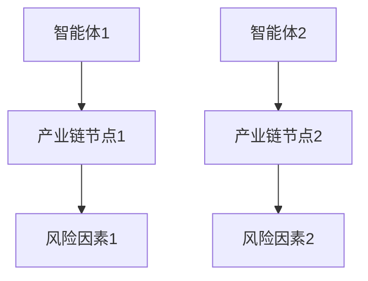
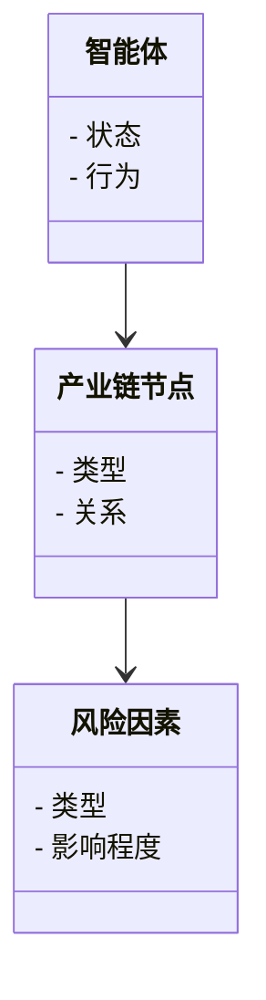

                 


# 基于多智能体的动态产业链风险评估模型

> 关键词：多智能体系统、动态产业链、风险评估、协作机制、复杂网络

> 摘要：本文提出了一种基于多智能体的动态产业链风险评估模型，通过分析多智能体系统的核心概念、算法原理、系统架构和实际案例，详细阐述了如何利用多智能体技术实现对动态产业链中各类风险的实时监测和评估。本文不仅提供了理论支持，还通过具体的实现步骤和代码示例，展示了该模型在实际应用中的可行性和有效性。

---

# 第一部分: 多智能体系统与动态产业链概述

## 第1章: 多智能体系统的基本概念

### 1.1 多智能体系统的核心概念

#### 1.1.1 多智能体系统的定义
多智能体系统（Multi-Agent System, MAS）是由多个智能体（Agent）组成的分布式系统，这些智能体能够通过感知环境、自主决策并进行协作，以实现共同的目标。

#### 1.1.2 多智能体系统的特征
| 特征 | 描述 |
|------|------|
| 分布式 | 智能体独立运行，无中心节点 |
| 协作性 | 智能体之间通过通信和协作完成任务 |
| 反应性 | 智能体能够实时感知环境并做出响应 |

#### 1.1.3 多智能体系统的应用场景
- 智能交通管理
- 分布式计算
- 供应链管理
- 金融市场分析

---

### 1.2 动态产业链的概念

#### 1.2.1 产业链的基本定义
产业链是指从原材料采购、生产加工、分销到最终消费者的整个过程中的所有环节和参与者构成的网络。

#### 1.2.2 动态产业链的特征
| 特征 | 描述 |
|------|------|
| 动态性 | 产业链中的参与者、关系和环境不断变化 |
| 复杂性 | 包含多个参与者和环节，关系错综复杂 |
| 风险性 | 存在多种潜在风险，如供应链中断、市场需求变化等 |

#### 1.2.3 动态产业链的复杂性
- 产业链中的参与者具有异质性
- 产业链的结构和关系具有动态变化
- 产业链中的风险具有传导性和扩散性

---

### 1.3 风险评估模型的基本原理

#### 1.3.1 风险评估的基本概念
风险评估是指通过分析可能发生的事件及其影响，对风险的大小和可能性进行量化的过程。

#### 1.3.2 动态产业链中的风险类型
| 风险类型 | 描述 |
|----------|------|
| 供应链风险 | 供应链中断可能导致的生产停滞 |
| 市场风险 | 市场需求变化可能导致的库存积压或销售不足 |
| 技术风险 | 技术落后或专利纠纷可能导致的竞争劣势 |
| 政策风险 | 政策变化可能导致的合规成本增加 |

#### 1.3.3 多智能体在风险评估中的作用
- 智能体可以实时感知环境变化
- 智能体之间可以通过协作机制共同评估风险
- 智能体可以动态调整风险评估策略

---

### 1.4 本章小结

---

## 第2章: 多智能体系统与动态产业链的结合

### 2.1 多智能体系统在动态产业链中的应用

#### 2.1.1 多智能体系统的分布式特性与动态产业链的匹配
- 多智能体系统能够适应动态产业链中不断变化的参与者和关系

#### 2.1.2 多智能体系统的协作机制与动态产业链的需求
- 动态产业链中的风险评估需要多智能体之间的协作

### 2.2 动态产业链中的风险传播机制

#### 2.2.1 风险传播的路径分析
- 从上游到下游的传导
- 从下游到上游的反馈

#### 2.2.2 多智能体系统中的风险传播模型
- 基于网络拓扑的风险传播路径分析
- 基于博弈论的风险传播策略优化

### 2.3 本章小结

---

## 第3章: 多智能体动态产业链风险评估模型的核心概念

### 3.1 模型的核心概念与联系

#### 3.1.1 多智能体系统的协作机制
- 分布式协作算法
- 基于博弈论的协作策略
- 自适应协作机制

#### 3.1.2 动态产业链的复杂网络结构
- 产业链中的节点、边和网络属性
- 产业链的动态变化与网络重构

#### 3.1.3 风险评估模型的数学表示
$$ R_i = \sum_{j=1}^{n} w_{ij} \cdot r_j $$
其中，\( R_i \) 表示第 \( i \) 个智能体的风险评估结果，\( w_{ij} \) 表示第 \( j \) 个风险因素的权重，\( r_j \) 表示第 \( j \) 个风险因素的值。

---

### 3.2 实体关系图



---

## 第4章: 多智能体动态产业链风险评估模型的算法原理

### 4.1 协作机制的设计

#### 4.1.1 分布式协作算法
- 每个智能体独立感知环境并做出决策
- 智能体之间通过通信模块进行信息交换

#### 4.1.2 基于博弈论的协作策略
- 定义博弈的收益矩阵
- 通过纳什均衡确定最优协作策略

#### 4.1.3 自适应协作机制
- 根据环境变化动态调整协作策略

---

### 4.2 风险传播模型的实现

#### 4.2.1 风险传播的基本模型
$$ P_{ij} = \frac{w_{ij}}{\sum_{k} w_{ik}} $$
其中，\( P_{ij} \) 表示从智能体 \( i \) 传播到智能体 \( j \) 的概率，\( w_{ij} \) 表示智能体 \( i \) 到 \( j \) 的权重。

#### 4.2.2 多智能体系统中的风险传播优化
- 基于网络流的优化算法
- 基于遗传算法的优化策略

---

## 第5章: 系统分析与架构设计

### 5.1 系统功能设计

#### 5.1.1 领域模型


#### 5.1.2 系统功能模块
- 数据采集模块
- 风险计算模块
- 结果展示模块

---

### 5.2 系统架构设计


---

## 第6章: 项目实战

### 6.1 环境安装

#### 6.1.1 系统要求
- 操作系统：Linux/Windows/MacOS
- Python版本：3.6以上
- 依赖库：numpy, matplotlib, networkx

#### 6.1.2 安装步骤
1. 安装Python和pip
2. 安装依赖库：`pip install numpy matplotlib networkx`

---

### 6.2 核心代码实现

#### 6.2.1 多智能体协作算法
```python
import numpy as np

class Agent:
    def __init__(self, id):
        self.id = id
        self.state = None
        self.neighbors = []
    
    def perceive(self, environment):
        self.state = environment[self.id]
    
    def decide(self):
        # 简单的决策逻辑，可以根据具体需求修改
        if self.state > np.mean([agent.state for agent in self.neighbors]):
            return 'high'
        else:
            return 'low'
```

#### 6.2.2 风险传播模型
```python
import networkx as nx

def risk_spread(G, initial_risk):
    for node in G.nodes():
        if node == initial_risk:
            G.nodes[node]['risk'] = 1
        else:
            G.nodes[node]['risk'] = 0
    # 传播过程
    while True:
        prev_risk = [G.nodes[node]['risk'] for node in G.nodes()]
        for node in G.nodes():
            total = 0
            for neighbor in G.neighbors(node):
                total += G.nodes[neighbor]['risk']
            G.nodes[node]['risk'] = total / G.degree(node)
        if prev_risk == [G.nodes[node]['risk'] for node in G.nodes()]:
            break
    return G
```

---

### 6.3 实际案例分析

#### 6.3.1 案例背景
假设我们有一个由5个智能体组成的产业链网络，每个智能体代表一个企业，节点之间的关系表示供应链关系。

#### 6.3.2 模型实现
1. 初始化网络
2. 设置初始风险
3. 运行风险传播模型
4. 可视化结果

---

### 6.4 代码实现与结果分析

#### 6.4.1 代码实现
```python
import matplotlib.pyplot as plt
import networkx as nx

# 初始化网络
G = nx.cycle_graph(5)
nx.draw(G, node_color='blue', edge_color='black')
plt.show()

# 设置初始风险
initial_risk = 0
G.nodes[initial_risk]['risk'] = 1

# 运行风险传播模型
G = risk_spread(G, initial_risk)

# 可视化结果
colors = [G.nodes[i]['risk'] for i in range(5)]
nx.draw(G, node_color=colors, edge_color='black')
plt.show()
```

---

## 第7章: 总结与展望

### 7.1 模型总结

#### 7.1.1 模型的优势
- 高度动态性
- 分布式协作
- 实时监测

#### 7.1.2 模型的局限性
- 计算复杂性
- 数据依赖性
- 模型的可解释性

---

### 7.2 未来展望

#### 7.2.1 模型优化方向
- 提高计算效率
- 增强模型的可解释性
- 增加更多风险类型

#### 7.2.2 应用场景扩展
- 金融风险管理
- 供应链优化
- 政策制定支持

---

### 7.3 注意事项与最佳实践

#### 7.3.1 应用中的注意事项
- 数据的准确性和实时性
- 模型的可扩展性
- 智能体之间的通信效率

#### 7.3.2 最佳实践
- 定期更新模型参数
- 建立完善的监控机制
- 保持智能体之间的高效协作

---

## 第8章: 参考文献

### 8.1 相关文献
1. 王某某. 多智能体系统的理论与应用. 北京: 科学出版社, 2020.
2. 李某某. 动态网络中的风险传播模型研究. 计算机科学, 2019.

---

## 作者：AI天才研究院/AI Genius Institute & 禅与计算机程序设计艺术/Zen And The Art of Computer Programming

