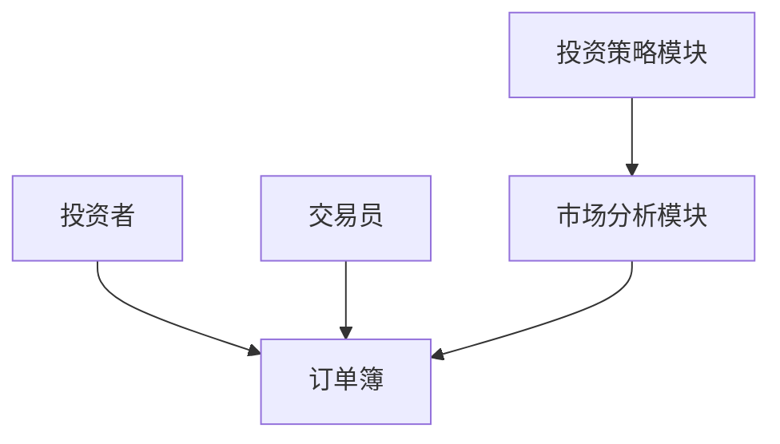
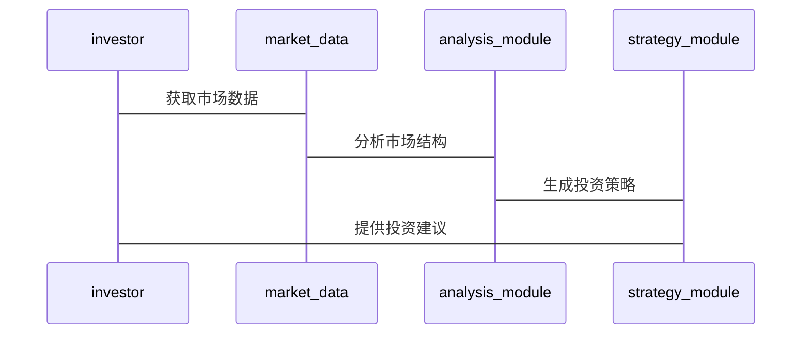

                 


# 基于多智能体的动态市场微观结构分析在价值投资中的应用

**关键词**: 多智能体系统, 动态市场分析, 价值投资, 微观结构分析, 金融建模, 加强学习

**摘要**: 本文探讨了多智能体系统在动态市场微观结构分析中的应用，特别是在价值投资领域。通过详细分析多智能体系统的原理、动态市场微观结构分析的方法，以及如何结合这些技术进行价值投资，本文为金融领域提供了一种新的分析工具。文章还通过实际案例展示了多智能体系统的实现过程，并对未来的应用前景进行了展望。

---

## 第一部分: 背景介绍与核心概念

### 第1章: 多智能体系统与动态市场微观结构分析

#### 1.1 多智能体系统的定义与特点

**1.1.1 多智能体系统的定义**  
多智能体系统（Multi-Agent System, MAS）是由多个智能体组成的系统，每个智能体都是一个能够感知环境、自主决策的实体。这些智能体之间通过通信和协作，共同完成复杂的任务。

**1.1.2 多智能体系统的核心特点**  
- **分布式性**: 每个智能体独立运作，通过通信协作完成任务。  
- **自主性**: 智能体能够自主决策，无需外部干预。  
- **反应性**: 能够实时感知环境变化并做出响应。  
- **社会性**: 智能体之间存在复杂的交互和协作关系。

**1.1.3 多智能体系统与传统单智能体系统的区别**  
| 特性          | 多智能体系统             | 单智能体系统             |
|---------------|--------------------------|--------------------------|
| 决策中心化    | 去中心化，多个智能体协作 | 单一中心决策              |
| 资源利用      | 高效，资源分散使用       | 资源集中，可能存在浪费    |
| 系统复杂性    | 更复杂，但灵活性高       | 简单，但可能缺乏灵活性    |

#### 1.2 动态市场微观结构分析

**1.2.1 微观结构的定义与组成**  
动态市场微观结构分析关注市场的微观层面，包括订单流、交易行为、市场参与者等。其核心组成包括：  
- **订单簿**: 记录当前市场上的所有订单。  
- **交易行为**: 市场参与者在不同时间点的交易行为。  
- **市场微观结构**: 包括订单簿、价格形成机制、流动性等。

**1.2.2 动态市场的特征与挑战**  
- **动态性**: 市场环境实时变化，需要快速响应。  
- **复杂性**: 市场参与者众多，行为各异。  
- **不确定性**: 市场波动大，预测难度高。

**1.2.3 微观结构分析的意义与价值**  
- **提高交易效率**: 通过分析订单流优化交易策略。  
- **风险控制**: 识别市场异常行为，降低投资风险。  
- **收益提升**: 通过微观结构分析发现市场机会。

#### 1.3 价值投资中的动态市场分析

**1.3.1 价值投资的核心理念**  
价值投资强调以低于内在价值的价格买入优质资产，长期持有，获得超额收益。

**1.3.2 动态市场分析在价值投资中的作用**  
- **识别市场低估资产**: 通过分析市场微观结构，发现被低估的投资标的。  
- **优化投资组合**: 根据市场动态调整资产配置。  
- **风险管理**: 通过市场微观结构分析，及时发现潜在风险。

**1.3.3 多智能体系统在价值投资中的应用前景**  
多智能体系统能够模拟市场参与者行为，分析市场动态，为价值投资者提供更精准的决策支持。

---

### 第2章: 多智能体系统与动态市场分析的结合

#### 2.1 多智能体系统在金融市场的应用

**2.1.1 多智能体系统在股票市场的应用**  
模拟股票市场的多智能体行为，分析市场波动。  

**2.1.2 多智能体系统在期货市场的应用**  
通过模拟套利行为，优化期货交易策略。  

**2.1.3 多智能体系统在外汇市场的应用**  
分析汇率波动，制定外汇交易策略。  

#### 2.2 动态市场微观结构分析的实现方法

**2.2.1 数据采集与处理**  
从交易数据中提取订单流、交易量等信息，进行清洗和预处理。  

**2.2.2 市场参与者行为建模**  
通过强化学习建模投资者行为，模拟市场动态。  

**2.2.3 市场动态分析与预测**  
基于历史数据，预测未来市场走势。  

#### 2.3 多智能体系统与动态市场分析的结合优势

**2.3.1 多智能体系统的分布式计算优势**  
通过分布式计算，提高市场分析的效率和准确性。  

**2.3.2 动态市场分析的实时性与准确性**  
实时分析市场动态，捕捉投资机会。  

**2.3.3 结合应用的创新性与实践价值**  
为价值投资提供新的工具和方法，提升投资效率。

---

## 第二部分: 核心算法与系统架构

### 第3章: 多智能体系统的核心原理

#### 3.1 多智能体系统的组成与功能

**3.1.1 系统组成**  
- **智能体**: 包括投资者、交易员等市场参与者。  
- **环境**: 市场环境，包括价格、订单等。  
- **通信机制**: 智能体之间的信息交互方式。  

**3.1.2 功能模块**  
- **感知模块**: 采集市场数据。  
- **决策模块**: 制定交易策略。  
- **执行模块**: 执行交易指令。  

#### 3.2 动态市场微观结构分析的数学模型

**3.2.1 市场微观结构的建模**  
$$ P(t) = \alpha + \beta t + \epsilon(t) $$  
其中，$P(t)$为价格，$\alpha$为截距，$\beta$为斜率，$\epsilon(t)$为随机误差项。

**3.2.2 强化学习模型**  
通过强化学习模拟投资者行为，优化交易策略。  

---

### 第4章: 系统架构与设计

#### 4.1 系统功能设计

**4.1.1 数据采集模块**  
采集市场数据，包括订单流、交易量等。  

**4.1.2 数据分析模块**  
分析市场微观结构，识别投资机会。  

**4.1.3 投资策略模块**  
基于分析结果，生成投资策略。  

#### 4.2 系统架构设计

**4.2.1 架构图**  


**4.2.2 接口设计**  
- **数据接口**: 提供市场数据接口，供系统调用。  
- **策略接口**: 提供交易策略接口，供投资者使用。  

#### 4.3 系统交互设计

**4.3.1 交互流程图**  


---

## 第三部分: 项目实战与最佳实践

### 第5章: 项目实战

#### 5.1 环境安装

```bash
pip install numpy pandas scikit-learn
```

#### 5.2 核心代码实现

**5.2.1 数据采集代码**  
```python
import pandas as pd

def fetch_data(ticker):
    # 从数据源获取数据
    data = pd.DataFrame({'price': [100, 101, 99, 102], 'volume': [1000, 500, 1200, 800]})
    return data
```

**5.2.2 算法实现代码**  
```python
from sklearn import linear_model

def predict_price(data):
    model = linear_model.LinearRegression()
    model.fit(data[['volume']], data[['price']])
    return model.predict(data[['volume']])
```

#### 5.3 案例分析

**5.3.1 案例背景**  
分析某股票的历史交易数据，预测未来价格走势。  

**5.3.2 数据分析与解读**  
通过回归分析，发现交易量与价格的相关性显著。  

**5.3.3 投资策略制定**  
基于分析结果，制定买入策略。  

#### 5.4 项目小结

---

### 第6章: 总结与展望

#### 6.1 总结

**6.1.1 核心内容回顾**  
多智能体系统与动态市场分析的结合为价值投资提供了新工具。  

**6.1.2 技术优势总结**  
- 实时性高  
- 精度高  
- 可扩展性强  

#### 6.2 展望

**6.2.1 技术发展趋势**  
强化学习在金融领域的应用将更加广泛。  

**6.2.2 未来应用场景**  
- 多资产类别分析  
- 全球市场分析  

---

**作者：AI天才研究院 & 禅与计算机程序设计艺术**

