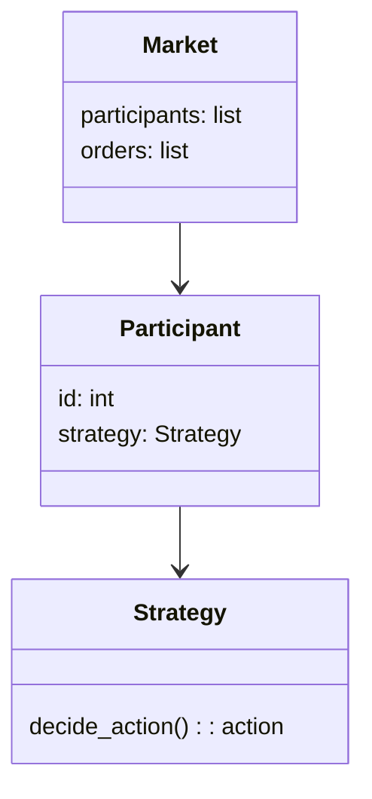

                 


# 基于多智能体的市场微观结构分析

> 关键词：多智能体系统，市场微观结构，博弈论，系统架构，算法实现

> 摘要：本文深入探讨了基于多智能体的市场微观结构分析，从理论基础到实际应用，系统地介绍了多智能体系统在市场分析中的原理、算法、系统架构及项目实现。文章首先阐述了多智能体系统的定义、特点及其在市场微观结构分析中的应用前景；接着分析了市场微观结构的核心算法与数学模型；然后详细设计了基于多智能体的市场分析系统架构；最后通过项目实战展示了系统的实现与应用案例。文章结合理论与实践，为读者提供了一个全面的视角，帮助理解多智能体系统在市场分析中的重要作用。

---

## 第1章: 多智能体系统与市场微观结构分析的背景

### 1.1 多智能体系统的定义与特点

#### 1.1.1 多智能体系统的定义
多智能体系统（Multi-Agent System, MAS）是由多个智能体（Agent）组成的复杂系统。智能体是能够感知环境、自主决策并采取行动的实体。多智能体系统通过智能体之间的协作与互动，完成复杂的任务。

#### 1.1.2 多智能体系统的核心特点
- **自主性**：智能体能够自主决策，无需外部干预。
- **反应性**：智能体能够实时感知环境并做出反应。
- **协作性**：多个智能体协同工作，共同完成目标。
- **分布性**：智能体分布在网络中，不存在集中控制节点。

#### 1.1.3 多智能体系统与传统单智能体系统的区别
| 特性                | 多智能体系统                  | 单智能体系统                  |
|---------------------|-----------------------------|-----------------------------|
| 系统结构            | 分布式、去中心化             | 集中式、单点控制             |
| 智能体数量          | 多个                        | 单个                        |
| 协作方式            | 智能体之间协作完成任务      | 单智能体独立完成任务          |
| 复杂性              | 高                         | 低                         |

### 1.2 市场微观结构分析的定义与范围

#### 1.2.1 市场微观结构的定义
市场微观结构是指市场中的参与者（如买方、卖方、经纪人等）及其互动方式。通过分析这些互动，可以理解市场的动态行为和价格形成的机制。

#### 1.2.2 市场微观结构分析的核心要素
- **参与者**：买方、卖方、经纪人等。
- **交易规则**：订单匹配规则、价格优先规则等。
- **信息流动**：市场信息的传播与扩散。
- **互动行为**：参与者之间的博弈行为。

#### 1.2.3 市场微观结构分析的边界与外延
- **边界**：仅关注市场内部的参与者及其互动，不涉及外部因素（如宏观经济政策）。
- **外延**：可以扩展到金融市场、拍卖市场等不同类型的市场。

### 1.3 多智能体系统在市场微观结构分析中的应用前景

#### 1.3.1 多智能体系统在金融市场中的应用
- **高频交易**：通过智能体快速执行交易策略。
- **市场模拟**：模拟市场行为，预测价格波动。

#### 1.3.2 市场微观结构分析的挑战与机遇
- **挑战**：市场环境复杂，智能体之间的互动难以预测。
- **机遇**：多智能体系统能够模拟复杂的市场行为，为交易策略提供支持。

#### 1.3.3 多智能体系统的优势与局限性
- **优势**：能够模拟真实市场环境，提供高精度的预测。
- **局限性**：需要大量的计算资源，且模型的准确性依赖于参数设置。

---

## 第2章: 多智能体系统的核心概念与原理

### 2.1 多智能体系统的组成与结构

#### 2.1.1 多智能体系统的组成要素
- **智能体**：能够感知环境并采取行动的实体。
- **环境**：智能体所处的外部环境，包括其他智能体和静态实体。
- **通信机制**：智能体之间的信息交换方式。

#### 2.1.2 多智能体系统的层次结构
- **物理层**：智能体的物理实现，如计算机节点。
- **逻辑层**：智能体的行为逻辑和决策规则。
- **通信层**：智能体之间的信息交互方式。

#### 2.1.3 多智能体系统的通信机制
- **直接通信**：智能体之间直接交换信息。
- **间接通信**：通过中间媒介（如消息队列）进行通信。

### 2.2 多智能体系统的协作与协调

#### 2.2.1 多智能体协作的基本原理
- **协作目标**：智能体共同完成一个任务。
- **协作方式**：通过通信和协调实现任务分配。

#### 2.2.2 协调机制的实现方法
- **基于规则的协调**：制定规则以指导智能体的协作。
- **基于协商的协调**：智能体通过协商达成一致。

#### 2.2.3 典型的协作算法与协议
- **分布式协调协议**：如一致性算法（Consensus）。
- **任务分配算法**：如贪心算法。

### 2.3 多智能体系统的建模与仿真

#### 2.3.1 多智能体系统的建模方法
- **基于状态的建模**：描述智能体的状态和行为。
- **基于规则的建模**：定义智能体的行为规则。

#### 2.3.2 市场微观结构的仿真模型
- **订单簿模型**：模拟订单的生成与匹配。
- **价格动态模型**：模拟价格的变化趋势。

#### 2.3.3 建模工具与仿真平台的选择
- **工具**：如NetLogo、Repast、AnyLogic。
- **平台**：如JADE、Jason、CORBA。

---

## 第3章: 市场微观结构分析的核心算法

### 3.1 基于多智能体的市场行为建模

#### 3.1.1 市场参与者的智能体建模
- **买方智能体**：根据价格和时间决策是否购买。
- **卖方智能体**：根据价格和时间决策是否出售。

#### 3.1.2 市场行为的动态建模方法
- **动态博弈论**：模拟市场的竞争与合作。

#### 3.1.3 市场互动的博弈论模型
- **纳什均衡**：市场参与者在均衡状态下不再改变策略。

### 3.2 市场微观结构分析的数学模型

#### 3.2.1 市场微观结构的数学表达
$$ P(t) = P_0 + \alpha \cdot t $$
其中，\( P(t) \) 表示价格，\( t \) 表示时间，\( \alpha \) 表示价格变化率。

#### 3.2.2 市场动态的微分方程模型
$$ \frac{dP}{dt} = \beta \cdot (Q_d - Q_s) $$
其中，\( Q_d \) 表示需求，\( Q_s \) 表示供给，\( \beta \) 表示价格敏感系数。

#### 3.2.3 市场均衡的纳什均衡分析
- **纳什均衡**：市场参与者在均衡状态下，任何单个参与者单方面改变策略都不会带来收益增加。

### 3.3 市场微观结构分析的算法实现

#### 3.3.1 基于多智能体的市场模拟算法
```python
class Agent:
    def __init__(self, id, strategy):
        self.id = id
        self.strategy = strategy
    def act(self, market_info):
        # 根据市场信息采取行动
        pass

class Market:
    def __init__(self, agents):
        self.agents = agents
    def simulate(self, steps):
        for _ in range(steps):
            for agent in self.agents:
                agent.act(get_market_info())
```

#### 3.3.2 市场动态的数值模拟方法
- **蒙特卡洛模拟**：通过随机采样模拟市场行为。

#### 3.3.3 市场行为的机器学习预测模型
- **神经网络模型**：用于预测价格变化。

---

## 第4章: 基于多智能体的市场微观结构分析系统设计

### 4.1 系统架构设计

#### 4.1.1 系统功能模块划分
- **数据采集模块**：采集市场数据。
- **智能体模块**：实现智能体的行为。
- **通信模块**：实现智能体之间的通信。

#### 4.1.2 系统架构的分层设计
- **数据层**：存储市场数据。
- **逻辑层**：实现智能体的行为逻辑。
- **通信层**：实现智能体之间的通信。

#### 4.1.3 系统架构的通信机制
- **消息队列**：通过队列实现异步通信。

### 4.2 系统功能设计

#### 4.2.1 领域模型类图


#### 4.2.2 系统架构图


---

## 第5章: 项目实战

### 5.1 环境安装

#### 5.1.1 系统环境
- 操作系统：Linux/Windows/MacOS
- 开发工具：Python、Jupyter Notebook
- 第三方库：numpy、pandas、matplotlib

### 5.2 系统核心实现源代码

#### 5.2.1 智能体类实现
```python
class Agent:
    def __init__(self, id, strategy):
        self.id = id
        self.strategy = strategy
    def act(self, market_info):
        return self.strategy.decide_action(market_info)
```

#### 5.2.2 策略类实现
```python
class Strategy:
    def decide_action(self, market_info):
        # 示例策略：根据价格变化决定行动
        if market_info['price'] > self.threshold:
            return 'sell'
        else:
            return 'hold'
```

#### 5.2.3 市场模拟类实现
```python
class MarketSimulator:
    def __init__(self, agents):
        self.agents = agents
        self.time = 0
    def step(self):
        for agent in self.agents:
            action = agent.act(self.get_market_info())
            self.update_market_info(agent.id, action)
        self.time += 1
    def get_market_info(self):
        return {
            'price': self.current_price,
            'time': self.time
        }
```

### 5.3 代码应用解读与分析

#### 5.3.1 代码功能解读
- **Agent类**：表示市场参与者，根据策略采取行动。
- **Strategy类**：定义智能体的行为策略。
- **MarketSimulator类**：模拟市场环境，协调智能体的行动。

#### 5.3.2 代码实现细节
- **策略的可扩展性**：通过策略类实现策略的插拔式更换。
- **市场的动态性**：通过模拟时间步推进，更新市场信息。

### 5.4 实际案例分析

#### 5.4.1 案例背景
假设我们有一个股票市场，包含多个参与者，每个参与者根据价格变化采取买卖行动。

#### 5.4.2 案例实现
```python
agents = [Agent(1, Strategy(threshold=100)), Agent(2, Strategy(threshold=90))]
market = MarketSimulator(agents)
market.run(10)
```

#### 5.4.3 案例分析
- **初始价格**：100
- **时间步1**：价格为101，Agent 1卖出，Agent 2卖出。
- **时间步2**：价格为102，Agent 1卖出，Agent 2卖出。
- ...（后续步骤根据策略执行）

---

## 第6章: 总结与展望

### 6.1 最佳实践 tips
- **模块化设计**：将系统划分为独立的模块，便于维护和扩展。
- **策略多样化**：设计多种策略以应对不同的市场环境。
- **性能优化**：通过并行计算提高系统的运行效率。

### 6.2 小结
本文详细介绍了基于多智能体的市场微观结构分析，从理论到实践，系统地阐述了多智能体系统在市场分析中的应用。通过案例分析，展示了系统的实现与应用效果。

### 6.3 注意事项
- **数据质量**：确保输入数据的准确性和完整性。
- **模型鲁棒性**：设计鲁棒的算法以应对市场的不确定性。
- **系统安全性**：确保系统的安全性，防止数据泄露和网络攻击。

### 6.4 拓展阅读
- **推荐书籍**：《Multi-Agent Systems: Algorithmic, Complexity, and Synthesis》
- **推荐论文**：探讨多智能体系统在金融市场中的应用研究。

---

作者：AI天才研究院/AI Genius Institute & 禅与计算机程序设计艺术 /Zen And The Art of Computer Programming

