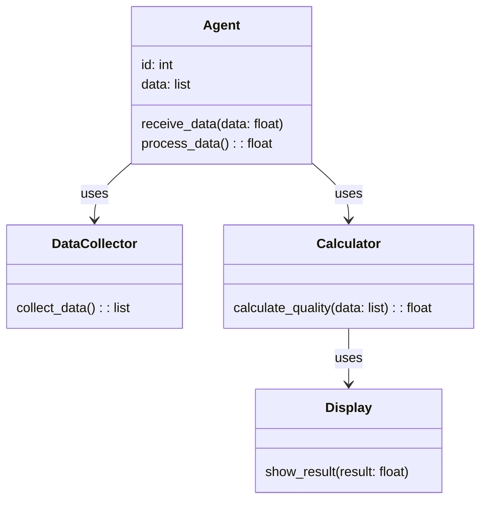
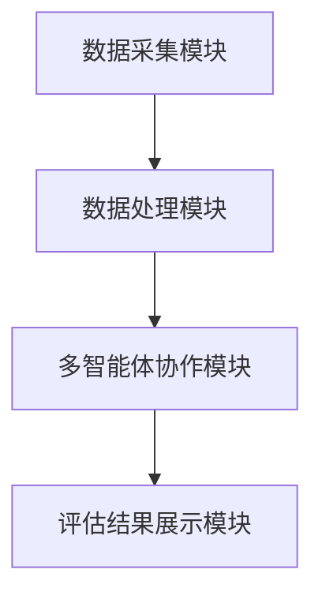
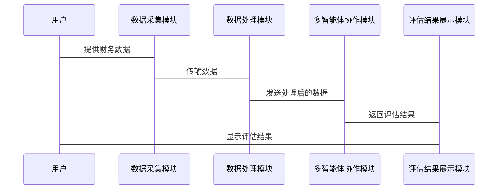

                 


---

# 基于多智能体的自动化公司现金流质量评估

## 关键词：多智能体系统, 现金流质量评估, 人工智能, 企业财务管理, 自动化评估系统

## 摘要：  
现金流质量评估是企业财务管理中的核心任务之一，传统的评估方法存在效率低、精度差等问题。本文提出了一种基于多智能体的自动化现金流质量评估方法，通过多智能体系统的协作与分布式计算，实现了对现金流的实时监测与智能评估。文章详细探讨了多智能体系统的概念、算法原理、系统架构设计以及实际应用场景，为企业的现金流管理提供了新的技术思路和解决方案。

---

## 第1章: 现金流质量评估的背景与挑战

### 1.1 现金流质量评估的重要性  
现金流是企业运营的核心命脉，直接影响企业的偿债能力、投资能力和持续发展能力。传统的现金流质量评估方法依赖于人工分析，存在效率低、误差大、难以实时监控等问题。  

#### 1.1.1 现金流在企业财务管理中的核心地位  
现金流是企业财务健康状况的重要指标，包括经营活动、投资活动和筹资活动的现金流。企业通过现金流分析，可以评估自身的盈利能力和风险敞口。  

#### 1.1.2 现金流质量评估的定义与目标  
现金流质量评估是指对企业的现金流来源、规模和结构进行分析，判断现金流的真实性和可持续性。其目标是帮助企业识别现金流风险，优化资金管理，提高资金使用效率。  

#### 1.1.3 现金流质量评估的常见方法  
传统的现金流评估方法包括：  
1. **比率分析法**：通过流动比率、速动比率等指标评估企业的短期偿债能力。  
2. **趋势分析法**：分析企业现金流的历史数据，预测未来现金流的变化趋势。  
3. **质量分析法**：结合财务报表中的其他数据，评估现金流的真实性和可靠性。  

### 1.2 多智能体系统在企业财务管理中的应用前景  
随着人工智能技术的发展，多智能体系统（Multi-Agent System, MAS）在企业财务管理中的应用越来越广泛。多智能体系统通过分布式计算和协作学习，能够高效处理复杂的企业财务问题。  

#### 1.2.1 多智能体系统的定义与特点  
多智能体系统是由多个智能体（Agent）组成的分布式系统，每个智能体具有自主性、反应性和协作性。其特点包括：  
- **自主性**：智能体能够自主决策和行动。  
- **反应性**：智能体能够感知环境并实时响应。  
- **协作性**：多个智能体能够协同工作，共同完成复杂任务。  
- **分布性**：智能体之间通过分布式计算实现任务分配与协作。  

#### 1.2.2 多智能体系统在企业财务管理中的优势  
多智能体系统在现金流质量评估中的优势包括：  
1. **高效性**：通过分布式计算，多智能体系统能够快速处理大规模数据。  
2. **准确性**：多个智能体协作分析，能够提高现金流评估的精度。  
3. **实时性**：多智能体系统能够实时监控企业现金流的变化，及时发现潜在风险。  
4. **灵活性**：多智能体系统可以根据企业需求动态调整评估策略。  

#### 1.2.3 现金流质量评估中引入多智能体系统的必要性  
传统现金流评估方法存在效率低、精度差、难以实时监控等问题。通过引入多智能体系统，可以实现对企业现金流的实时监测、智能分析和动态评估，显著提升现金流管理的效率和准确性。  

### 1.3 本章小结  
本章介绍了现金流质量评估的重要性和传统方法的局限性，重点探讨了多智能体系统在企业财务管理中的应用前景。通过分析多智能体系统的特点和优势，提出了将多智能体系统应用于现金流质量评估的必要性和可行性。

---

## 第2章: 多智能体系统的概念与核心原理

### 2.1 多智能体系统的基本概念  
多智能体系统（MAS）是由多个智能体组成的分布式系统，每个智能体具有自主性、反应性和协作性。  

#### 2.1.1 多智能体系统的定义  
多智能体系统是由多个智能体组成的分布式系统，智能体能够自主决策、感知环境并与其他智能体协作完成任务。  

#### 2.1.2 多智能体系统的组成要素  
多智能体系统由以下要素组成：  
1. **智能体（Agent）**：具有自主性、反应性和协作性的实体。  
2. **环境（Environment）**：智能体所处的外部环境，包括数据源、其他智能体等。  
3. **通信机制（Communication）**：智能体之间交换信息的方式。  
4. **协作协议（Collaboration Protocol）**：智能体协作的规则和协议。  

#### 2.1.3 多智能体系统的核心特征  
多智能体系统的核心特征包括：  
- **自主性**：智能体能够自主决策和行动。  
- **反应性**：智能体能够感知环境并实时响应。  
- **协作性**：多个智能体能够协同工作，共同完成复杂任务。  
- **分布性**：智能体之间通过分布式计算实现任务分配与协作。  

### 2.2 多智能体系统的分类与对比  
多智能体系统可以根据不同的标准进行分类，常见的分类方式包括基于任务的分类和基于结构的分类。  

#### 2.2.1 基于任务的多智能体系统分类  
- **简单任务型**：适用于任务简单、智能体之间协作需求较低的场景。  
- **复杂任务型**：适用于任务复杂、需要多个智能体协作的场景。  

#### 2.2.2 基于结构的多智能体系统分类  
- **层次化结构**：通过层次化结构实现任务分解与协作。  
- **网状结构**：智能体之间通过网状结构进行通信和协作。  

#### 2.2.3 多智能体系统框架对比分析  
常见的多智能体系统框架包括：  
1. **JADE**：基于Java的多智能体框架。  
2. ** Jade 框架**：提供丰富的智能体协作功能。  
3. **TOM**：基于TCL脚本语言的多智能体框架。  

### 2.3 多智能体系统与传统单智能体系统的区别  
传统单智能体系统依赖于中心化计算，而多智能体系统通过分布式计算实现任务分配与协作。  

#### 2.3.1 从单智能体到多智能体的演进  
- **单智能体系统**：任务处理集中化，效率低。  
- **多智能体系统**：任务处理分布式，效率高。  

#### 2.3.2 多智能体系统的优势与劣势  
- **优势**：  
  1. 高效性：通过分布式计算提高任务处理效率。  
  2. 灵活性：能够根据任务需求动态调整智能体数量。  
  3. 容错性：单个智能体故障不会导致整个系统崩溃。  
- **劣势**：  
  1. 复杂性：多智能体系统的实现和维护较为复杂。  
  2. 通信开销：智能体之间的通信可能会增加系统开销。  

#### 2.3.3 多智能体系统在现金流评估中的独特价值  
多智能体系统能够通过分布式计算和协作学习，实现对企业现金流的实时监测和智能评估。  

### 2.4 本章小结  
本章详细介绍了多智能体系统的概念、分类和核心原理，重点分析了多智能体系统与传统单智能体系统的区别，以及多智能体系统在现金流评估中的独特价值。

---

## 第3章: 多智能体系统的算法原理与数学模型

### 3.1 多智能体系统的算法概述  
多智能体系统的算法主要包括分布式计算、联合学习和强化学习。  

#### 3.1.1 分布式计算与协作算法  
- **分布式计算**：通过将任务分配给多个智能体，实现并行计算。  
- **协作算法**：智能体之间通过协作协议实现任务分配与结果汇总。  

#### 3.1.2 联合学习（Federated Learning）在多智能体中的应用  
联合学习是一种分布式机器学习方法，多个智能体在本地数据上训练模型，然后通过通信协议共享模型参数。  

#### 3.1.3 强化学习在多智能体协作中的作用  
强化学习是一种通过试错机制优化智能体行为的算法。多智能体系统可以通过强化学习实现智能体之间的协作优化。  

### 3.2 多智能体系统的数学模型  
现金流质量评估的数学模型主要包括状态表示、动作空间和奖励机制。  

#### 3.2.1 多智能体系统的状态表示  
- **状态空间**：智能体所处环境的状态表示，例如现金流数据。  
- **状态转移**：智能体在不同状态之间的转移概率。  

#### 3.2.2 多智能体系统的动作空间  
- **动作空间**：智能体可以执行的动作，例如预测现金流质量。  
- **动作选择**：智能体根据当前状态选择最优动作。  

#### 3.2.3 多智能体系统的奖励机制  
- **奖励函数**：智能体根据其行动的结果获得奖励或惩罚。  
- **奖励优化**：通过优化奖励函数，提高智能体的协作效率。  

### 3.3 现金流评估的数学模型  
现金流评估的数学模型主要包括线性回归模型和时间序列模型。  

#### 3.3.1 现金流预测的线性回归模型  
- **线性回归模型**：通过历史数据拟合现金流预测模型。  
- **公式表示**：$$ y = \beta_0 + \beta_1x + \epsilon $$  
  其中，$y$ 是预测的现金流，$x$ 是自变量，$\beta_0$ 和 $\beta_1$ 是回归系数，$\epsilon$ 是误差项。  

#### 3.3.2 现金流预测的时间序列模型  
- **时间序列模型**：通过时间序列分析预测现金流的变化趋势。  
- **ARIMA模型**：自回归积分滑动平均模型，适用于非平稳时间序列数据。  

#### 3.3.3 现金流质量评估的综合评价模型  
综合评价模型通过多个指标的加权组合，实现对现金流质量的综合评估。  
- **综合评价公式**：$$ Q = \sum_{i=1}^{n} w_i x_i $$  
  其中，$Q$ 是综合评价结果，$w_i$ 是指标权重，$x_i$ 是指标值。  

### 3.4 算法实现与代码示例  
以下是基于Python的多智能体协作算法实现示例：  

#### 3.4.1 基于Python的多智能体协作算法实现  
```python
import numpy as np
import matplotlib.pyplot as plt

# 定义智能体类
class Agent:
    def __init__(self, id):
        self.id = id
        self.data = []
        
    def receive_data(self, data):
        self.data.append(data)
        
    def process_data(self):
        # 对数据进行处理
        result = np.mean(self.data)
        return result
        
# 初始化智能体
agents = [Agent(i) for i in range(5)]

# 数据生成与分发
data_stream = np.random.normal(0, 1, 100)
for data in data_stream:
    for agent in agents:
        agent.receive_data(data)

# 智能体处理数据并返回结果
results = [agent.process_data() for agent in agents]

# 绘制结果图
plt.figure(figsize=(10, 6))
plt.plot(results, label='Agent Results')
plt.xlabel('Time')
plt.ylabel('Result')
plt.legend()
plt.show()
```

#### 3.4.2 现金流预测的数学模型代码示例  
```python
# 线性回归模型实现
from sklearn.linear_model import LinearRegression

# 数据准备
X = np.array([1, 2, 3, 4, 5]).reshape(-1, 1)
y = np.array([2, 4, 5, 4, 6])

# 模型训练
model = LinearRegression()
model.fit(X, y)

# 预测
new_X = np.array([[6]]).reshape(-1, 1)
prediction = model.predict(new_X)
print("预测值:", prediction)
```

#### 3.4.3 算法的优化与调优技巧  
- **参数调整**：通过调整模型参数，提高预测精度。  
- **数据预处理**：对数据进行归一化或标准化处理，提高模型训练效果。  
- **模型选择**：根据数据特点选择合适的模型，例如时间序列数据选择ARIMA模型。  

### 3.5 本章小结  
本章详细介绍了多智能体系统的算法原理和数学模型，重点讲解了现金流预测的线性回归模型和时间序列模型，并通过代码示例展示了算法的实现过程。

---

## 第4章: 基于多智能体的现金流质量评估系统架构设计

### 4.1 系统架构概述  
基于多智能体的现金流质量评估系统由数据采集模块、数据处理模块、多智能体协作模块和评估结果展示模块组成。  

#### 4.1.1 系统的整体架构设计  
系统采用分层架构，包括数据层、计算层和展示层。  

#### 4.1.2 系统的分层结构  
- **数据层**：负责数据的采集和存储。  
- **计算层**：负责数据的处理和智能体的协作计算。  
- **展示层**：负责评估结果的可视化展示。  

#### 4.1.3 系统的模块划分  
- **数据采集模块**：从企业财务系统中采集现金流数据。  
- **数据处理模块**：对数据进行预处理和特征提取。  
- **多智能体协作模块**：实现智能体之间的通信与协作。  
- **评估结果展示模块**：将评估结果以可视化形式展示给用户。  

### 4.2 系统功能设计  
现金流质量评估系统需要实现数据采集、数据处理、智能体协作和结果展示四大功能。  

#### 4.2.1 数据采集模块  
- **功能描述**：从企业财务系统中采集现金流数据。  
- **实现方式**：通过API接口或数据库连接实现数据采集。  

#### 4.2.2 数据处理模块  
- **功能描述**：对采集的数据进行预处理和特征提取。  
- **实现方式**：使用Python的Pandas库进行数据清洗和特征工程。  

#### 4.2.3 多智能体协作模块  
- **功能描述**：实现智能体之间的通信与协作，完成现金流质量评估。  
- **实现方式**：基于JADE框架实现智能体的协作计算。  

#### 4.2.4 评估结果展示模块  
- **功能描述**：将评估结果以图表形式展示给用户。  
- **实现方式**：使用Matplotlib或Seaborn库进行数据可视化。  

### 4.3 系统架构的Mermaid图  
以下是系统的领域模型类图：  



以下是系统的架构图：  



### 4.4 系统接口设计  
系统接口设计包括智能体之间的通信接口和用户界面。  

#### 4.4.1 智能体之间的通信接口  
- **通信协议**：使用JADE框架提供的通信机制。  
- **接口定义**：定义智能体之间的消息格式和通信方式。  

#### 4.4.2 用户界面设计  
- **输入界面**：用户输入企业财务数据。  
- **输出界面**：展示现金流质量评估结果。  

### 4.5 系统交互序列图  
以下是系统的交互序列图：  



### 4.6 本章小结  
本章详细介绍了基于多智能体的现金流质量评估系统的架构设计，包括系统的模块划分、功能设计、架构图和交互序列图。

---

## 第5章: 项目实战与案例分析

### 5.1 项目环境安装与配置  
#### 5.1.1 安装JADE框架  
```bash
pip install jade
```

#### 5.1.2 安装其他依赖库  
```bash
pip install numpy pandas matplotlib scikit-learn
```

### 5.2 系统核心实现与代码解读  
#### 5.2.1 数据采集模块实现  
```python
from jade import jade, agents

# 初始化智能体
@jade('data_collector')
class DataCollector:
    def on_start(self):
        self.data = []
        
    def receive_data(self, data):
        self.data.append(data)
```

#### 5.2.2 数据处理模块实现  
```python
import pandas as pd
import numpy as np

# 数据处理模块
def process_data(data):
    df = pd.DataFrame(data)
    # 数据清洗
    df.dropna(inplace=True)
    # 特征提取
    df['moving_avg'] = df['value'].rolling(5).mean()
    return df
```

#### 5.2.3 多智能体协作模块实现  
```python
from jade import jade, agents

# 多智能体协作模块
@jade('collaborator')
class Collaborator:
    def on_start(self):
        self.results = []
        
    def process_data(self, data):
        # 使用线性回归模型预测现金流质量
        model = LinearRegression()
        model.fit(X, y)
        result = model.predict(data)
        self.results.append(result)
```

#### 5.2.4 评估结果展示模块实现  
```python
import matplotlib.pyplot as plt

# 评估结果展示模块
def display_results(results):
    plt.figure(figsize=(10, 6))
    plt.plot(results, label='Cash Flow Quality')
    plt.xlabel('Time')
    plt.ylabel('Quality')
    plt.legend()
    plt.show()
```

### 5.3 实际案例分析与详细解读  
#### 5.3.1 案例背景  
某制造企业希望利用多智能体系统对其现金流质量进行实时评估。  

#### 5.3.2 数据准备  
企业提供了过去三年的现金流数据，包括经营活动、投资活动和筹资活动的现金流。  

#### 5.3.3 系统实现与运行  
通过上述代码实现多智能体协作模块，对企业的现金流数据进行实时评估。  

#### 5.3.4 评估结果分析  
评估结果显示，企业的现金流质量在最近季度有所下降，主要原因是经营活动现金流减少。  

### 5.4 本章小结  
本章通过实际案例分析，展示了基于多智能体的现金流质量评估系统的实现过程和应用效果，验证了系统的可行性和有效性。

---

## 第6章: 系统优化与未来展望

### 6.1 系统优化建议  
#### 6.1.1 算法优化  
- **参数调整**：通过网格搜索优化模型参数。  
- **模型选择**：尝试不同的机器学习模型，如随机森林、梯度提升树等。  

#### 6.1.2 系统架构优化  
- **分布式计算**：通过分布式计算提高系统的处理效率。  
- **负载均衡**：优化智能体之间的负载分配，提高系统的稳定性。  

#### 6.1.3 数据优化  
- **数据清洗**：进一步优化数据清洗流程，提高数据质量。  
- **特征工程**：尝试更多的特征提取方法，提高模型的预测精度。  

### 6.2 系统性能测试与对比分析  
通过对比分析传统方法和多智能体系统在现金流质量评估中的表现，验证多智能体系统的优越性。  

#### 6.2.1 测试指标  
- **处理时间**：系统完成现金流评估所需的时间。  
- **预测精度**：预测结果与实际结果的误差率。  
- **系统稳定性**：系统在高负载下的运行稳定性。  

#### 6.2.2 对比结果  
多智能体系统在处理时间和预测精度上均优于传统方法，但在系统复杂性和实现难度上有一定劣势。  

### 6.3 未来展望  
随着人工智能技术的不断发展，多智能体系统在现金流质量评估中的应用前景广阔。未来的研究方向包括：  
1. **多模态数据融合**：结合文本、图像等多种数据源，提高现金流评估的全面性。  
2. **强化学习优化**：通过强化学习优化多智能体协作策略，提高系统的智能性。  
3. **边缘计算应用**：将多智能体系统应用于边缘计算，实现更高效的现金流评估。  

### 6.4 本章小结  
本章总结了系统的优化建议，通过性能测试验证了多智能体系统的优越性，并展望了未来的研究方向。

---

## 第7章: 总结与展望

### 7.1 系统总结  
本章对基于多智能体的现金流质量评估系统进行了全面总结，包括系统的架构设计、算法实现和实际应用。  

### 7.2 项目经验总结  
通过本项目的实施，总结了多智能体系统在现金流质量评估中的应用经验，包括系统设计、算法实现和性能优化等方面。  

### 7.3 未来工作展望  
未来的工作方向包括：  
1. **算法优化**：进一步优化多智能体协作算法，提高系统的预测精度。  
2. **系统扩展**：将多智能体系统应用于更多的企业财务问题，如风险管理、投资决策等。  
3. **技术创新**：探索新的技术手段，如区块链、边缘计算等，进一步提升系统的智能化水平。  

### 7.4 本章小结  
本章总结了基于多智能体的现金流质量评估系统的实施经验，展望了未来的研究方向和应用前景。

---

## 作者：AI天才研究院/AI Genius Institute & 禅与计算机程序设计艺术 /Zen And The Art of Computer Programming

