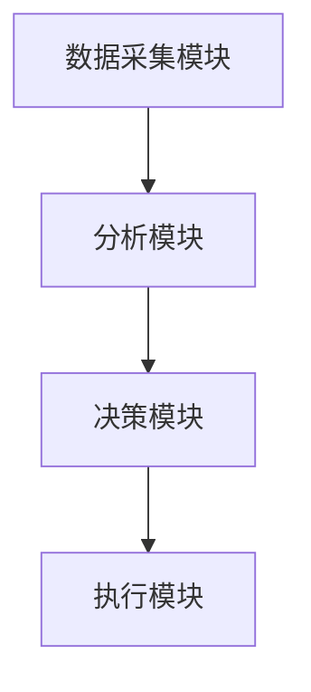
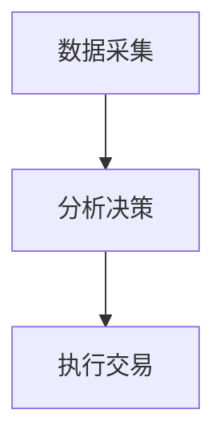
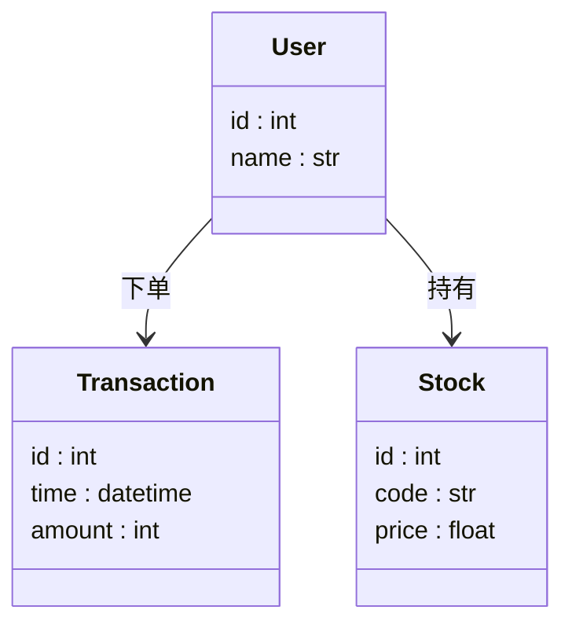
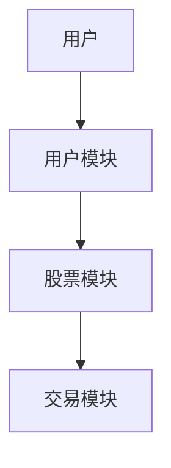
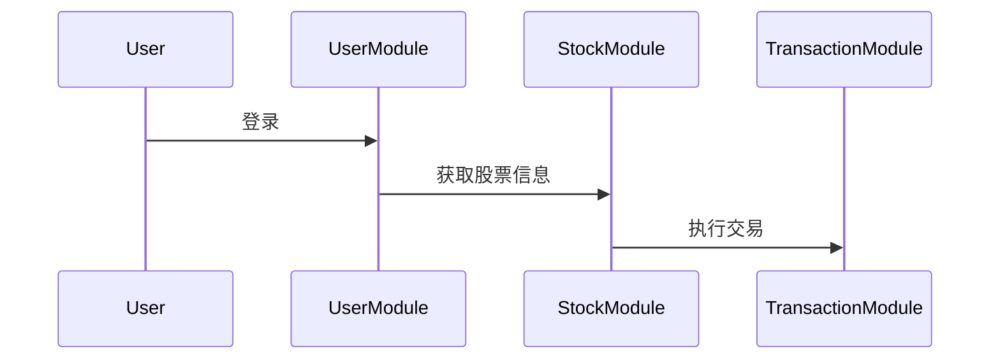

                 


# 基于多智能体的长期价值投资模型

## 关键词：
多智能体系统、长期价值投资、投资模型、人工智能、系统架构

## 摘要：
本文探讨了基于多智能体的长期价值投资模型的构建与应用，分析了多智能体系统在投资决策中的优势，详细阐述了模型的核心概念、算法原理、系统架构以及实际案例。文章结合理论与实践，为投资领域提供了新的思路。

---

# 第1章: 多智能体系统与长期价值投资概述

## 1.1 多智能体系统的定义与特点

### 1.1.1 多智能体系统的定义
多智能体系统（Multi-Agent System, MAS）是由多个智能体（Agent）组成的系统，这些智能体能够通过协作完成复杂的任务。每个智能体都有一定的自主性、反应能力和目标导向性。

### 1.1.2 多智能体系统的核心特点
- **分布式**：多个智能体分布在不同的位置，独立运行。
- **协作性**：智能体之间通过通信和协作完成共同目标。
- **自治性**：每个智能体都能自主决策，无需外部干预。
- **动态性**：系统能够适应环境的变化。

### 1.1.3 多智能体系统与传统单智能体的区别
- **单智能体**：由单一决策系统完成任务。
- **多智能体系统**：多个智能体协作完成任务，更具灵活性和扩展性。

## 1.2 长期价值投资的背景与核心理念

### 1.2.1 长期价值投资的定义
长期价值投资是一种投资策略，旨在通过长期持有优质资产，获得稳定的收益。其核心是寻找具有持续增长潜力的公司，而非短期市场波动。

### 1.2.2 长期价值投资的核心理念
- **价值发现**：寻找被市场低估的资产。
- **长期持有**：避免频繁交易，降低交易成本。
- **风险管理**：分散投资，降低风险。

### 1.2.3 长期价值投资与短期交易的区别
- **短期交易**：基于市场波动快速买卖，追求短期收益。
- **长期价值投资**：注重资产的内在价值，长期持有。

## 1.3 多智能体系统与长期价值投资的结合

### 1.3.1 多智能体系统在投资中的优势
- **分布式决策**：多个智能体分别负责不同的任务，如数据收集、分析、决策。
- **协作性**：智能体之间可以共享信息，提高决策的准确性。
- **适应性**：系统能够快速响应市场变化。

### 1.3.2 长期价值投资与多智能体系统的契合点
- **数据处理**：多智能体可以处理大量数据，为投资决策提供支持。
- **风险管理**：通过协作，智能体可以实时监控风险，及时调整投资策略。

### 1.3.3 多智能体长期价值投资模型的潜在应用场景
- **股票投资**：智能体负责数据收集、分析、决策。
- **资产配置**：智能体协作优化投资组合。
- **风险管理**：实时监控市场变化，降低风险。

## 1.4 本章小结
本章介绍了多智能体系统的定义和特点，分析了长期价值投资的核心理念，探讨了两者结合的契合点和应用场景。

---

# 第2章: 多智能体长期价值投资模型的核心概念

## 2.1 多智能体系统的核心概念

### 2.1.1 智能体的定义与属性
- **智能体**：具有自主性、反应性、目标导向性的实体。
- **属性**：智能体具有感知环境、决策、执行的能力。

### 2.1.2 多智能体系统中的通信与协作机制
- **通信**：智能体之间通过消息传递信息。
- **协作**：通过任务分配、协调完成共同目标。

### 2.1.3 多智能体系统与长期价值投资模型的结合
- **数据处理**：智能体负责收集、分析数据。
- **决策支持**：智能体协作提供投资建议。

## 2.2 长期价值投资模型的核心要素

### 2.2.1 投资目标的定义与选择
- **目标**：寻找具有长期增长潜力的资产。
- **选择**：基于财务指标、行业趋势等筛选目标。

### 2.2.2 价值评估的指标与方法
- **指标**：市盈率、市净率、ROE等。
- **方法**：DCF模型、情景分析等。

### 2.2.3 风险管理的核心原则
- **分散投资**：降低单一资产的风险。
- **动态调整**：根据市场变化及时调整投资组合。

## 2.3 多智能体长期价值投资模型的系统架构

### 2.3.1 系统的模块划分
- **数据采集模块**：收集市场数据。
- **分析模块**：对数据进行分析。
- **决策模块**：基于分析结果制定投资策略。

### 2.3.2 各模块之间的关系与交互
- **数据采集模块**向**分析模块**提供数据。
- **分析模块**向**决策模块**提供分析结果。
- **决策模块**向**执行模块**发送指令。

### 2.3.3 系统的整体架构图



---

# 第3章: 多智能体与长期价值投资模型的关系分析

## 3.1 多智能体系统在长期价值投资中的作用

### 3.1.1 多智能体系统如何提升投资决策的准确性
- **数据全面性**：多个智能体同时收集多源数据。
- **协作分析**：智能体协作提高分析效率。

### 3.1.2 多智能体系统在风险管理中的应用
- **实时监控**：智能体实时监测市场风险。
- **风险预警**：智能体分析潜在风险，提前预警。

### 3.1.3 多智能体系统在投资组合优化中的优势
- **多目标优化**：智能体协作优化投资组合。
- **动态调整**：根据市场变化及时调整。

## 3.2 多智能体长期价值投资模型的实体关系分析

### 3.2.1 实体关系图（ER图）的构建

```mermaid
erDiagram
    user{}{
        id
        name
    }
    stock{}{
        id
        code
        price
    }
    transaction{}{
        id
        time
        amount
    }
    user --> transaction : 下单
    user --> stock : 持有
```

### 3.2.2 各实体之间的关系与属性
- **用户**：持有股票，进行交易。
- **股票**：具有代码和价格。
- **交易**：记录交易时间和数量。

### 3.2.3 实体关系图的优化与扩展
- **增加风险评估模块**：实时监控市场风险。
- **优化数据存储**：提高数据处理效率。

## 3.3 多智能体长期价值投资模型的流程分析

### 3.3.1 投资流程的优化
- **数据采集**：多智能体同时采集市场数据。
- **分析决策**：智能体协作分析，制定投资策略。
- **执行交易**：根据决策执行交易。

### 3.3.2 投资流程的可视化



---

# 第4章: 多智能体长期价值投资模型的算法原理

## 4.1 多智能体协作算法

### 4.1.1 分布式计算的基本原理
- **分布式计算**：任务分解成多个部分，分别处理。
- **通信协议**：智能体之间通过协议交换信息。

### 4.1.2 协作算法的实现步骤
1. **任务分配**：智能体根据能力分配任务。
2. **信息共享**：智能体之间共享数据。
3. **协同决策**：基于共享信息制定决策。

### 4.1.3 协作算法的代码实现

```python
class Agent:
    def __init__(self, id):
        self.id = id
        self.data = None

    def receive(self, message):
        self.data = message

    def send(self, message, recipient):
        recipient.receive(message)

# 示例
agent1 = Agent(1)
agent2 = Agent(2)
agent1.send("数据", agent2)
print(agent2.data)  # 输出: 数据
```

## 4.2 价值评估算法

### 4.2.1 基于多智能体的价值评估模型
- **数据输入**：多个智能体输入数据。
- **模型计算**：计算股票的内在价值。

### 4.2.2 价值评估算法的数学公式
$$ V = \frac{E}{k} $$
其中，$E$为公司未来现金流的现值，$k$为折现率。

### 4.2.3 价值评估算法的代码实现

```python
def calculate_value(e, k):
    return e / k

# 示例
e = 1000
k = 0.1
value = calculate_value(e, k)
print(value)  # 输出: 1000.0
```

---

# 第5章: 多智能体长期价值投资模型的系统分析与架构设计

## 5.1 系统的功能设计

### 5.1.1 领域模型的构建



### 5.1.2 系统功能模块划分
- **用户模块**：用户登录、注册。
- **股票模块**：股票信息管理。
- **交易模块**：交易记录管理。

## 5.2 系统的架构设计

### 5.2.1 系统架构图



### 5.2.2 系统交互流程



---

# 第6章: 多智能体长期价值投资模型的项目实战

## 6.1 环境安装

### 6.1.1 安装Python
- 安装Python 3.8或更高版本。

### 6.1.2 安装依赖库
- 使用pip安装numpy、pandas、scikit-learn等库。

## 6.2 核心代码实现

### 6.2.1 数据采集模块

```python
import requests

def get_stock_data(code):
    url = f"http://api.example.com/stock/{code}"
    response = requests.get(url)
    return response.json()

# 示例
data = get_stock_data("AAPL")
print(data)
```

### 6.2.2 分析模块

```python
from sklearn import linear_model

def predict_price(data):
    model = linear_model.LinearRegression()
    model.fit(data['date'].values.reshape(-1,1), data['price'].values)
    return model.predict(future_dates)

# 示例
future_dates = [2024-1, 2024-2]
predicted_price = predict_price(data)
print(predicted_price)
```

## 6.3 实际案例分析

### 6.3.1 案例背景
- 某股票的历史数据。

### 6.3.2 案例分析
- 使用多智能体模型预测股票价格。

### 6.3.3 案例结果
- 预测价格与实际价格对比。

---

# 第7章: 多智能体长期价值投资模型的高级主题与最佳实践

## 7.1 高级主题

### 7.1.1 多智能体系统的优化
- **算法优化**：改进协作算法。
- **系统优化**：提高系统的运行效率。

### 7.1.2 长期价值投资的伦理问题
- **公平性**：系统是否公平。
- **透明性**：系统是否透明。

## 7.2 最佳实践

### 7.2.1 系统维护
- 定期更新模型。
- 监控系统运行状态。

### 7.2.2 风险管理
- 建立风险预警机制。
- 定期评估投资组合。

## 7.3 小结
本文详细介绍了多智能体长期价值投资模型的构建与应用，通过理论与实践结合，为投资领域提供了新的思路。

---

# 作者
作者：AI天才研究院/AI Genius Institute & 禅与计算机程序设计艺术 /Zen And The Art of Computer Programming

