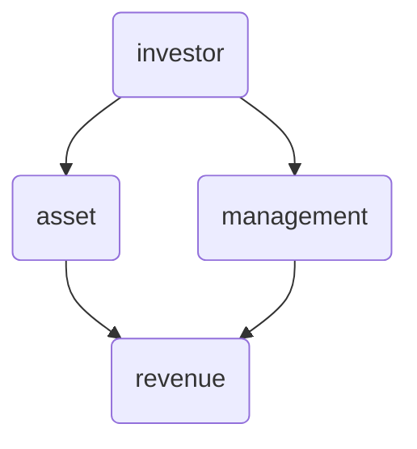
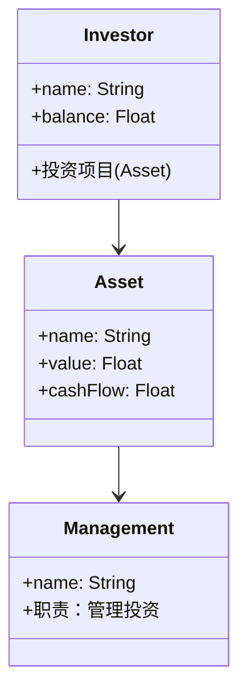

                 


# 基础设施投资：长期稳定收益的另类选择

> 关键词：基础设施投资、长期收益、另类投资、风险管理、数学模型

> 摘要：本文详细探讨了基础设施投资作为一种另类投资方式，其在当前经济环境下的独特优势。通过分析基础设施投资的定义、分类、评估方法、系统架构及实际案例，本文揭示了其作为长期稳定收益选择的内在逻辑与实际应用。

---

## 第一部分: 基础设施投资的背景与概念

### 第1章: 基础设施投资的背景与问题

#### 1.1 经济发展的基础设施需求
- **1.1.1 基础设施的基本概念**  
  基础设施是指支撑经济活动的物质条件，包括交通、能源、通信、水利等系统。这些系统为社会经济活动提供基础支持，是国家发展的基石。

- **1.1.2 经济增长与基础设施的关系**  
  基础设施是经济发展的前提条件。例如，良好的交通网络可以降低物流成本，提升区域经济活力。基础设施投资对经济增长具有乘数效应，能够带动相关产业的发展。

- **1.1.3 城市化进程中基础设施的重要性**  
  随着城市化进程的加快，基础设施的需求急剧增加。住房、交通、能源、通信等基础设施的建设，是城市可持续发展的关键。

#### 1.2 基础设施投资的挑战与机遇
- **1.2.1 资金缺口问题**  
  基础设施项目通常投资大、周期长，资金需求量大。政府财政投入有限，需要引入社会资本，通过PPP（公私合作）模式解决资金缺口。

- **1.2.2 项目周期长与回报不确定性**  
  基础设施项目通常需要数年甚至更长时间才能见效。期间可能受到政策、市场环境等多种因素的影响，导致回报不确定性增加。

- **1.2.3 风险管理的复杂性**  
  基础设施投资涉及复杂的利益相关者，包括政府、社会资本、金融机构等。如何平衡各方利益，有效管理风险是关键。

- **1.2.4 可持续发展与绿色投资**  
  随着全球对可持续发展的关注，绿色基础设施投资成为新的趋势。例如，可再生能源设施、节能环保建筑等领域具有较大的市场潜力。

---

## 第二部分: 基础设施投资的核心概念与联系

### 第2章: 基础设施投资的核心概念

#### 2.1 基础设施投资的原理
- **2.1.1 投资的基本原理**  
  投资的本质是通过资源配置，追求未来收益的最大化。基础设施投资与其他类型的投资（如股票、债券）相比，具有更强的实物资产属性。

- **2.1.2 基础设施投资的独特性**  
  基础设施投资通常具有较高的进入壁垒和规模效应。由于其对经济活动的支撑作用，通常享有较高的定价能力，能够在较长周期内保持稳定的收益。

#### 2.2 基础设施资产的特征对比
- **2.2.1 资产类型对比表**  
  以下是几种主要基础设施资产的特征对比：

| 资产类型 | 投资周期 | 运营成本 | 收益稳定性 | 风险特征 |
|----------|----------|----------|------------|----------|
| 商业地产 | 长 | 高 | 稳定 | 需求波动 |
| 交通设施 | 长 | 中 | 稳定 | 政策风险 |
| 公用事业 | 长 | 低 | 高 | 政策与环境风险 |

- **2.2.2 资产收益稳定性分析**  
  基础设施资产通常具有较高的收益稳定性，尤其是在公用事业领域，由于需求刚性，收益波动较小。

#### 2.3 基础设施投资的ER实体关系图


---

## 第三部分: 基础设施投资的算法原理

### 第3章: 基础设施投资的评估方法

#### 3.1 现金流分析
- 现金流分析是评估基础设施投资的重要工具。通过预测项目生命周期内的现金流，可以评估其经济可行性。

- **现金流计算公式**  
  现金流的净现值（NPV）可以通过以下公式计算：
  $$NPV = \sum_{t=0}^{n} \frac{CF_t}{(1 + r)^t}$$  
  其中，$CF_t$ 是第 $t$ 年的现金流，$r$ 是折现率。

#### 3.2 内部收益率（IRR）计算
- IRR 是项目预期的收益率，使得 NPV 等于零：
  $$IRR = \frac{\sum \frac{CF_t}{(1 + r)^t}}{Initial Investment}$$

- **实际案例**  
  假设一个基础设施项目初始投资为 $100$ 万元，未来5年的现金流分别为 $20$ 万、$30$ 万、$40$ 万、$50$ 万、$60$ 万。计算其 IRR。

---

## 第四部分: 基础设施投资的系统分析与架构设计

### 第4章: 系统架构设计

#### 4.1 系统功能设计
- **领域模型**  
  使用 Mermaid 类图描述系统功能模块：



- **系统架构图**  
  使用 Mermaid 架构图展示系统架构：


---

## 第五部分: 基础设施投资的项目实战

### 第5章: 项目实战

#### 5.1 数据中心投资案例

##### 5.1.1 环境安装
- 需要安装高可用性的数据中心，配备冗余电源、冷却系统和网络设备。

##### 5.1.2 核心代码实现
- 以下是一个简单的财务模型代码：

```python
def calculate_profit(initial_cost, annual_revenue, discount_rate, years):
    npv = 0
    for t in range(years):
        cash_flow = annual_revenue * (1 + 0.05)**t
        npv += cash_flow / (1 + discount_rate)**t
    return npv - initial_cost

initial_cost = 1000000  # 初始投资
annual_revenue = 200000  # 年收入
discount_rate = 0.08      # 折现率
years = 10                # 投资周期

profit = calculate_profit(initial_cost, annual_revenue, discount_rate, years)
print(f"净现值为：{profit}")
```

##### 5.1.3 代码解读与分析
- 该代码计算了数据中心投资的净现值，考虑了每年的收入增长（5%）和折现率（8%）。结果显示投资的可行性。

##### 5.1.4 案例分析与总结
- 数据中心投资在10年内的净现值为正，说明该项目具有良好的投资回报潜力。但需要注意运营成本和市场需求的变化。

---

## 第六部分: 最佳实践与小结

### 第6章: 投资策略与风险管理

#### 6.1 投资策略
- **长期视角**：基础设施投资通常需要较长时间才能见效，投资者应保持长期视角。
- **分散投资**：通过分散投资不同类型的基础设施资产，降低整体风险。
- **风险管理**：建立完善的风险管理体系，定期评估项目的经济和技术可行性。

#### 6.2 风险管理建议
- **政策风险**：密切关注政府政策变化，确保项目符合政策导向。
- **市场风险**：定期评估市场需求变化，调整运营策略。
- **技术风险**：保持技术领先性，及时更新设备和系统。

#### 6.3 未来趋势
- **智能化基础设施**：随着人工智能和大数据技术的发展，智能化基础设施将成为投资热点。
- **绿色投资**：可持续发展和环保要求将推动绿色基础设施投资的增长。

---

## 作者信息

作者：AI天才研究院/AI Genius Institute & 禅与计算机程序设计艺术 /Zen And The Art of Computer Programming

---

以上是《基础设施投资：长期稳定收益的另类选择》的技术博客文章目录大纲和部分正文内容，确保每个章节都详细展开，满足用户对深度、逻辑性和技术性的要求。

