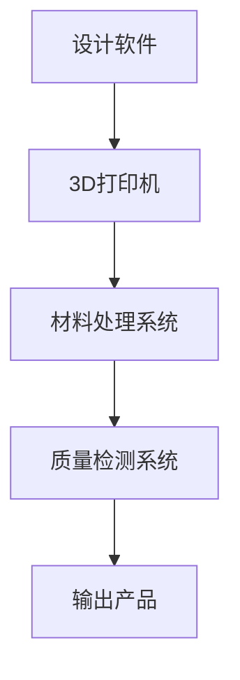

                 

# 增材制造技术在医疗领域的应用与投资机会

**关键词**: 增材制造，医疗应用，投资机会，3D打印，生物材料

**摘要**: 增材制造技术（3D打印）在医疗领域的应用正在迅速扩展，涵盖 prosthetics、orthotics、手术器械、医疗植入物和手术模型等多个方面。本文详细探讨了增材制造技术的核心原理、医疗应用案例、面临的挑战与解决方案，以及该领域的投资机会和未来发展趋势。

---

## 第一章: 增材制造技术概述

### 1.1 增材制造技术的定义与特点

增材制造（Additive Manufacturing，AM）是一种通过逐层堆叠材料来构建三维物体的制造技术，与传统减材制造（如铣削、锻造）不同，增材制造具有以下特点：

- **按需制造**：可以快速生产复杂形状的零部件，减少库存需求。
- **定制化生产**：能够根据患者需求定制个性化医疗产品。
- **材料利用率高**：相比传统制造，材料浪费更少。
- **技术门槛高**：需要高精度的设备和复杂的工艺控制。

### 1.2 医疗领域的增材制造技术应用背景

#### 1.2.1 医疗行业的技术需求

医疗行业对定制化和精准医疗的需求日益增长，传统的标准化医疗产品难以满足患者个性化需求。增材制造技术能够解决这一问题，为患者提供高度定制化的 prosthetics、orthotics 和植入物。

#### 1.2.2 增材制造技术在医疗领域的优势

- **快速原型制作**：能够快速生产复杂形状的医疗产品。
- **个性化定制**：满足患者个体化需求。
- **降低生产成本**：通过按需制造减少库存压力。

#### 1.2.3 医疗增材制造技术的市场现状

全球医疗增材制造市场近年来增长迅速，预计到2030年，市场规模将超过100亿美元。主要驱动因素包括技术进步、医疗需求增加以及政策支持。

### 1.3 增材制造技术的核心原理

增材制造技术的核心原理是通过数字化设计文件（如CAD模型）指导设备逐层堆叠材料，形成最终产品。主要技术包括：

- **层叠制造（Fused Deposition Modeling，FDM）**：通过加热和挤出热塑性材料层层堆叠。
- **立体光刻（Stereolithography，SLA）**：使用紫外线固化光敏树脂。
- **粉末床熔融（Powder Bed Fusion，PBF）**：通过激光或电子束熔化金属粉末。

### 1.4 增材制造技术的材料选择

在医疗领域，材料的选择至关重要，需要考虑生物相容性、强度、耐用性和可加工性。常用的材料包括：

- **金属材料**：如钛合金和钴铬合金，常用于植入物和假肢。
- **塑料与复合材料**：如聚酰胺（PA）和碳纤维复合材料，适用于 prosthetics 和 orthotics。
- **生物相容性材料**：如生物可降解聚合物，用于可吸收植入物。

---

## 第二章: 增材制造技术在医疗领域的应用案例

### 2.1 假肢与 prosthetics 的应用

#### 2.1.1 增材制造技术在 prosthetics 设计中的应用

增材制造技术能够生产高度定制化的 prosthetics，满足患者个性化需求。例如，3D打印技术可以制造轻量化、高强度的 prosthetics，显著提高患者的舒适度和运动能力。

#### 2.1.2 假肢的定制化生产

通过增材制造技术，医疗团队可以根据患者的肢体尺寸和形状定制 prosthetics，减少传统假肢的不适感和调整周期。

#### 2.1.3 假肢的性能优化

增材制造技术可以通过优化结构设计，提高 prosthetics 的耐用性和舒适性。例如，通过拓扑优化设计可以减少材料用量，同时提高强度。

### 2.2 正畸与 orthotics 的应用

#### 2.2.1 增材制造技术在 orthotics 设计中的应用

增材制造技术可以生产复杂的正畸辅助器具，如定制化鞋垫和支具。这些产品可以根据患者的足部形状和步态进行优化设计。

#### 2.2.2 正畸辅助器具的定制化生产

通过增材制造技术，医疗团队可以快速生产定制化的 orthotics，帮助患者改善步态和矫正姿势。

#### 2.2.3 正畸辅助器具的性能优化

增材制造技术可以通过优化结构设计和材料选择，提高 orthotics 的耐用性和矫正效果。

### 2.3 手术器械与工具的应用

#### 2.3.1 增材制造技术在手术器械设计中的应用

增材制造技术可以生产复杂的手术器械，如手术钳和剪刀。这些器械可以通过3D打印技术实现高度定制化和复杂结构。

#### 2.3.2 手术器械的定制化生产

通过增材制造技术，医疗团队可以根据手术需求快速生产定制化的手术器械，提高手术效率和精确度。

#### 2.3.3 手术器械的性能优化

增材制造技术可以通过优化结构设计和材料选择，提高手术器械的强度和耐用性。

### 2.4 医疗植入物的应用

#### 2.4.1 增材制造技术在医疗植入物设计中的应用

增材制造技术可以生产复杂的医疗植入物，如骨科植入物和牙科种植体。这些植入物可以通过3D打印技术实现高度定制化和复杂结构。

#### 2.4.2 植入物的定制化生产

通过增材制造技术，医疗团队可以根据患者的骨骼结构和生理需求定制植入物，提高手术成功率和患者康复效果。

#### 2.4.3 植入物的性能优化

增材制造技术可以通过优化结构设计和材料选择，提高植入物的生物相容性和耐用性。

### 2.5 医疗模型与手术规划的应用

#### 2.5.1 增材制造技术在医疗模型设计中的应用

增材制造技术可以生产高度精确的医疗模型，用于手术规划和术前模拟。这些模型可以帮助医生更好地理解患者解剖结构，制定个性化手术方案。

#### 2.5.2 医疗模型的定制化生产

通过增材制造技术，医疗团队可以根据患者的具体情况快速生产定制化的医疗模型，提高手术精确度和安全性。

#### 2.5.3 医疗模型的性能优化

增材制造技术可以通过优化结构设计和材料选择，提高医疗模型的精度和耐用性。

---

## 第三章: 增材制造技术在医疗领域的挑战与解决方案

### 3.1 技术挑战

#### 3.1.1 材料选择的挑战

医疗领域对材料的生物相容性和 durability 要求较高，选择合适的材料是增材制造技术应用中的重要挑战。

#### 3.1.2 制造精度的挑战

增材制造技术需要高精度的设备和工艺控制，以确保医疗产品的质量和性能。

#### 3.1.3 制造成本的挑战

增材制造技术的设备和材料成本较高，可能限制其在医疗领域的广泛应用。

### 3.2 解决方案

#### 3.2.1 材料创新的解决方案

通过研发新型生物相容性材料和可降解材料，可以解决材料选择的挑战。

#### 3.2.2 制造精度优化的解决方案

通过改进设备性能和工艺控制，可以提高增材制造技术的制造精度。

#### 3.2.3 成本控制的解决方案

通过规模经济和技术创新，可以降低增材制造技术的生产成本。

---

## 第四章: 增材制造技术在医疗领域的投资机会

### 4.1 医疗增材制造市场的现状与趋势

#### 4.1.1 市场规模分析

全球医疗增材制造市场近年来增长迅速，预计到2030年，市场规模将超过100亿美元。

#### 4.1.2 市场增长驱动因素

- **技术进步**：增材制造技术的成熟和成本降低。
- **医疗需求增加**：患者对个性化医疗的需求增加。
- **政策支持**：政府对增材制造技术在医疗领域的应用提供政策支持。

#### 4.1.3 市场未来发展趋势

- **技术创新**：新型材料和工艺的不断研发。
- **个性化医疗**：增材制造技术在个性化医疗产品中的应用将更加广泛。
- **全球扩张**：医疗增材制造技术将在全球范围内进一步推广和应用。

### 4.2 投资机会分析

#### 4.2.1 医疗增材制造技术的核心优势

- **技术门槛高**：需要高精度设备和复杂工艺。
- **市场需求大**：医疗行业对个性化医疗产品的需求不断增加。
- **利润率高**：增材制造技术可以提高生产效率和降低成本。

#### 4.2.2 投资策略建议

- **技术驱动型投资**：投资于具有技术创新能力的企业。
- **市场导向型投资**：关注具有较大市场需求的医疗产品。
- **合作伙伴关系**：与医疗设备制造商和医院建立合作关系。

---

## 附录: 增材制造技术在医疗领域的数学模型与系统架构

### 附录1: 增材制造技术的数学模型

在增材制造技术中，材料的性能可以通过以下数学模型进行评估：

$$
\text{杨氏模量} = \frac{\text{应力}}{\text{应变}}
$$

通过数学模型可以优化材料选择和结构设计，提高增材制造产品的性能。

### 附录2: 增材制造技术的系统架构

增材制造系统的架构包括设计软件、3D打印机、材料处理系统和质量检测系统。以下是系统的架构图：

---

## 总结

增材制造技术在医疗领域的应用前景广阔，从 prosthetics 到医疗植入物，从手术器械到医疗模型，增材制造技术正在改变医疗行业的生产方式和产品设计。随着技术的进步和市场的扩展，增材制造技术在医疗领域的投资机会也将不断增加。

---

**作者：AI天才研究院/AI Genius Institute & 禅与计算机程序设计艺术 /Zen And The Art of Computer Programming**

