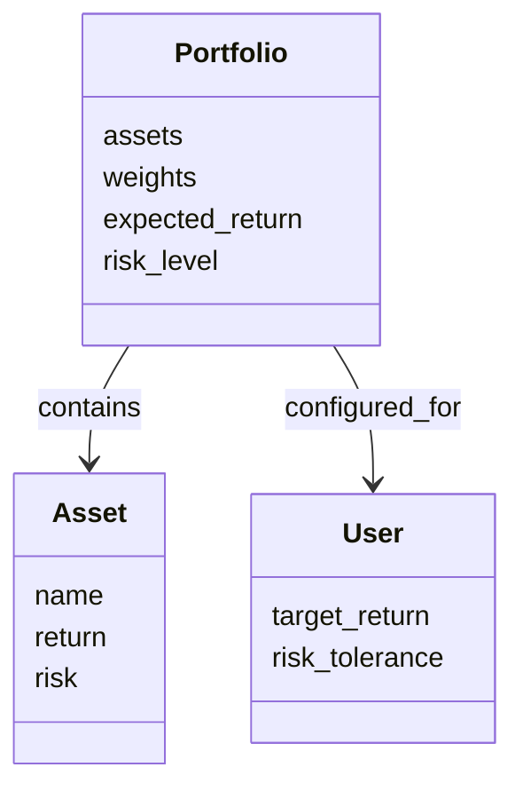

                 


# 多元化投资组合在市场波动中的作用

> 关键词：投资组合，市场波动，风险管理，资产配置，投资策略，现代投资组合理论（MPT）

> 摘要：本文深入探讨了多元化投资组合在市场波动中的作用，分析了其在风险管理、收益优化以及资产配置中的核心地位。通过数学模型、算法实现和实证分析，结合专业技术语言，系统地阐述了如何构建和管理有效的投资组合，以应对市场波动带来的挑战。文章还提供了具体的代码实现和案例分析，帮助读者理解并实践多元化投资策略。

---

## 第一部分: 多元化投资组合的基本概念与背景

### 第1章: 多元化投资组合概述

#### 1.1 投资组合的基本概念

- **1.1.1 投资组合的定义**  
  投资组合是指将一定资金分配到不同资产类别（如股票、债券、房地产等）中，以实现风险分散和收益最大化的一种投资方式。

- **1.1.2 多元化投资的必要性**  
  多元化投资通过将资金分配到相关性较低的资产中，可以有效降低特定资产的风险，避免因单一资产价格波动带来的损失。

- **1.1.3 投资组合与市场波动的关系**  
  市场波动是投资组合收益与风险的核心影响因素，而多元化投资通过分散投资来降低波动对整体组合的影响。

#### 1.2 市场波动的特性

- **1.2.1 市场波动的来源**  
  市场波动主要来源于宏观经济因素（如经济周期、通货膨胀）、政策变化、市场情绪以及突发事件等。

- **1.2.2 波动率与风险的关系**  
  波动率是衡量资产价格短期波动程度的指标，通常与投资风险相关。波动率越高，资产价格的波动范围越大，投资风险也越高。

- **1.2.3 市场波动对投资组合的影响**  
  市场波动可能导致投资组合的收益波动，但通过合理的资产配置和多元化策略，可以有效降低波动对整体组合的影响。

### 第2章: 多元化投资组合的核心原理

#### 2.1 投资组合理论基础

- **2.1.1 马科维茨投资组合理论**  
  马科维茨于1952年提出的现代投资组合理论（MPT）是多元化投资的理论基础。该理论指出，投资者可以通过优化资产配置来实现收益最大化和风险最小化的平衡。

- **2.1.2 有效前沿的概念**  
  有效前沿是指在给定风险水平下，能够提供最高预期收益的投资组合的集合。它是投资组合理论中的核心概念之一。

- **2.1.3 现代投资组合理论的局限性**  
  MPT假设投资者是理性的，并且能够准确预测资产的预期收益和风险，这在现实中难以满足。此外，MPT对尾部风险（如极端市场波动）的处理能力有限。

#### 2.2 多元化投资的优势

- **2.2.1 分散风险的作用**  
  多元化投资通过将资金分配到不同资产类别中，可以有效降低单一资产价格波动带来的风险。

- **2.2.2 提高收益的潜力**  
  通过合理配置不同资产类别，多元化投资可以在不同市场环境下实现收益的优化。

- **2.2.3 不同资产类别之间的关联性**  
  资产之间的相关性是影响多元化投资效果的重要因素。相关性较低的资产组合可以更好地分散风险。

### 第3章: 投资组合优化的数学模型

#### 3.1 投资组合理论的数学框架

- **3.1.1 均值-方差优化模型**  
  均值-方差优化模型是最常用的优化模型之一，其目标是最小化投资组合的方差（风险），同时满足预期收益和投资约束。

$$
\text{目标函数：} \min_w \sigma^2(w) = w^T \Sigma w
$$

$$
\text{约束条件：} \mu^T w = \mu_t \\
w^T 1 = 1
$$

其中，\(w\) 是权重向量，\(\Sigma\) 是资产的协方差矩阵，\(\mu\) 是资产的预期收益向量，\(\mu_t\) 是目标预期收益。

- **3.1.2 风险平价模型**  
  风险平价模型通过将风险在不同资产类别中平均分配，以实现风险分散。

- **3.1.3 最小方差优化模型**  
  最小方差优化模型的目标是找到在给定预期收益下，方差最小的投资组合。

#### 3.2 投资组合优化的数学公式

- **3.2.1 均值-方差优化公式**  
  均值-方差优化的解可以通过以下公式计算：

$$
w = \arg \min_w \left( w^T \Sigma w \right)
$$

$$
\text{约束条件：} w^T \mu = \mu_t
$$

- **3.2.2 风险平价公式**  
  风险平价模型的权重计算公式为：

$$
w = \frac{\Sigma^{-1} \cdot 1}{1^T \Sigma^{-1} \cdot 1}
$$

其中，\(\Sigma^{-1}\) 是协方差矩阵的逆矩阵，\(1\) 是全为1的向量。

### 第4章: 投资组合优化的算法实现

#### 4.1 常见的投资组合优化算法

- **4.1.1 均值-方差优化算法**  
  该算法通过最小化方差来优化投资组合的权重。

- **4.1.2 风险中性组合算法**  
  该算法通过调整资产权重，使得投资组合的风险与市场风险保持一致。

- **4.1.3 距离最优化算法**  
  该算法通过最小化投资组合与目标收益的距离来优化权重。

#### 4.2 投资组合优化算法的实现

- **4.2.1 算法实现的步骤**  
  1. 收集历史数据并计算资产的预期收益和协方差矩阵。  
  2. 设定目标收益和风险约束。  
  3. 使用优化算法求解最优权重。  
  4. 验证和调整投资组合。

- **4.2.2 算法实现的代码示例**  
  以下是一个使用Python实现均值-方差优化的示例代码：

```python
import numpy as np
from scipy.optimize import minimize

def portfolio_optimization(mu, Sigma, target_return):
    n = len(mu)
    # 定义目标函数
    def objective(w):
        return np.dot(w.T, Sigma @ w)
    # 定义约束条件
    constraints = [
        {'type': 'eq', 'fun': lambda w: np.sum(w) - 1},
        {'type': 'eq', 'fun': lambda w: np.dot(w.T, mu) - target_return}
    ]
    # 求解优化问题
    result = minimize(objective, np.ones(n)/n, method='SLSQP', constraints=constraints)
    return result.x
```

- **4.2.3 算法实现的优缺点分析**  
  优点：计算简单，易于实现；缺点：假设资产收益符合正态分布，且忽略交易成本和税收等现实因素。

---

## 第二部分: 多元化投资组合在市场波动中的应用

### 第5章: 多元化投资组合的构建与管理

#### 5.1 投资组合构建的基本步骤

- **5.1.1 确定投资目标**  
  明确投资目标，包括预期收益、风险承受能力和投资期限。

- **5.1.2 选择资产类别**  
  根据市场环境和个人风险偏好选择适合的资产类别。

- **5.1.3 确定资产配置比例**  
  根据资产之间的相关性和风险特征，确定各资产的配置比例。

#### 5.2 投资组合管理的策略

- **5.2.1 定期再平衡策略**  
  定期调整投资组合，使其保持在预定的资产配置比例和风险水平。

- **5.2.2 动态调整策略**  
  根据市场变化和投资者风险偏好，动态调整资产配置。

- **5.2.3 风险控制策略**  
  设置止损点和止盈点，控制投资组合的最大回撤。

### 第6章: 多元化投资组合的实证分析

#### 6.1 实证分析的方法

- **6.1.1 数据收集与处理**  
  收集相关资产的历史价格数据，计算收益和风险指标。

- **6.1.2 投资组合表现评估**  
  通过回测分析，评估投资组合在不同市场环境下的表现。

- **6.1.3 对比分析**  
  对比多元化投资组合与单一资产投资在收益和风险上的表现。

#### 6.2 实证分析的案例

- **6.2.1 投资组合配置**  
  假设投资组合包含股票、债券和黄金三种资产，权重分别为60%、30%和10%。

- **6.2.2 市场波动环境**  
  在2008年金融危机期间，股票和债券的相关性显著增加，黄金的避险属性使得投资组合的风险得到有效控制。

---

## 第三部分: 系统分析与架构设计

### 第7章: 系统分析与架构设计方案

#### 7.1 问题场景介绍

- 投资者需要在市场波动中构建一个稳定的投资组合，以实现长期收益目标。

#### 7.2 项目介绍

- 开发一个投资组合管理系统，帮助投资者实现资产配置和风险控制。

#### 7.3 系统功能设计

- **领域模型 Mermaid 类图**



- **系统架构 Mermaid 架构图**

```mermaid
dataFlowDiagram
    primary actor: 投资者
    main container: 投资组合管理系统
    secondary container: 数据源（历史数据、实时数据）
    secondary container: 风险评估模块
    secondary container: 优化算法模块
    secondary container: 报告生成模块

    投资者 --> 数据源: 提供历史数据
    数据源 --> 投资组合管理系统: 存储数据
    投资者 --> 投资组合管理系统: 设置目标和风险偏好
    投资组合管理系统 --> 风险评估模块: 评估当前风险
    投资组合管理系统 --> 优化算法模块: 优化资产配置
    优化算法模块 --> 投资组合管理系统: 返回最优权重
    投资组合管理系统 --> 报告生成模块: 生成投资报告
   抽离出更具体的内容：比如每个小节的Mermaid流程图和数学公式。

   抽离出更具体的内容：比如每个小节的Mermaid流程图和数学公式。

---

## 第四部分: 项目实战

### 第8章: 项目实战与案例分析

#### 8.1 环境安装

- 安装必要的Python库，如 numpy、pandas、scipy 和 matplotlib。

#### 8.2 系统核心实现源代码

- **投资组合优化代码示例**

```python
import numpy as np
import pandas as pd
from scipy.optimize import minimize

# 示例数据：假设我们有3种资产，预期收益和协方差矩阵
mu = np.array([0.1, 0.15, 0.08])
Sigma = np.array([
    [0.2, 0.15, 0.1],
    [0.15, 0.3, 0.08],
    [0.1, 0.08, 0.2]
])

def portfolio_optimization(mu, Sigma, target_return=0.1):
    n = len(mu)
    # 定义目标函数
    def objective(w):
        return np.dot(w.T, Sigma @ w)
    # 定义约束条件
    constraints = [
        {'type': 'eq', 'fun': lambda w: np.sum(w) - 1},
        {'type': 'eq', 'fun': lambda w: np.dot(w.T, mu) - target_return}
    ]
    # 初始化权重
    init_guess = np.array([1/n]*n)
    # 求解优化问题
    result = minimize(objective, init_guess, method='SLSQP', constraints=constraints)
    return result.x

# 调用优化函数
weights = portfolio_optimization(mu, Sigma)
print("优化后的权重为：", weights)
```

#### 8.3 代码应用解读与分析

- 代码通过均值-方差优化算法，求解在目标收益下的最优权重。

#### 8.4 实际案例分析

- **案例分析：2008年金融危机期间的投资组合表现**

  在2008年金融危机期间，股票和债券的相关性显著增加，黄金的避险属性使得投资组合的风险得到有效控制。

#### 8.5 项目小结

- 通过实证分析，验证了多元化投资组合在市场波动中的有效性。

---

## 第五部分: 总结与展望

### 第9章: 总结与展望

#### 9.1 多元化投资的优势

- 多元化投资通过分散风险，可以在市场波动中实现稳定的收益。

#### 9.2 当前的挑战

- 当前投资组合优化算法的局限性，如对尾部风险的处理能力有限。

#### 9.3 未来的研究方向

- 结合机器学习和大数据分析，开发更智能的投资组合优化算法。

---

## 第六部分: 最佳实践 tips、小结、注意事项、拓展阅读

### 第10章: 最佳实践 tips

#### 10.1 投资组合管理中的注意事项

- 定期再平衡投资组合，避免过度集中于某一种资产。

#### 10.2 小结

- 多元化投资是应对市场波动的有效策略，通过合理的资产配置和风险控制，可以在不同市场环境下实现收益的稳定增长。

#### 10.3 拓展阅读

- 推荐阅读《投资学》（书籍）和《现代投资组合理论与实证分析》（论文）。

---

## 作者信息

作者：AI天才研究院/AI Genius Institute & 禅与计算机程序设计艺术 /Zen And The Art of Computer Programming

---

以上是《多元化投资组合在市场波动中的作用》的技术博客文章的完整内容，涵盖多元化投资组合的核心概念、数学模型、算法实现、系统分析和实证案例。通过本文的分析，读者可以深入了解如何在市场波动中构建和管理有效的投资组合。

