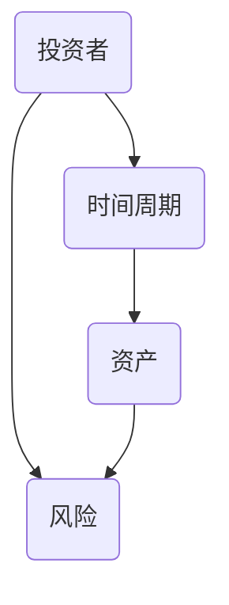
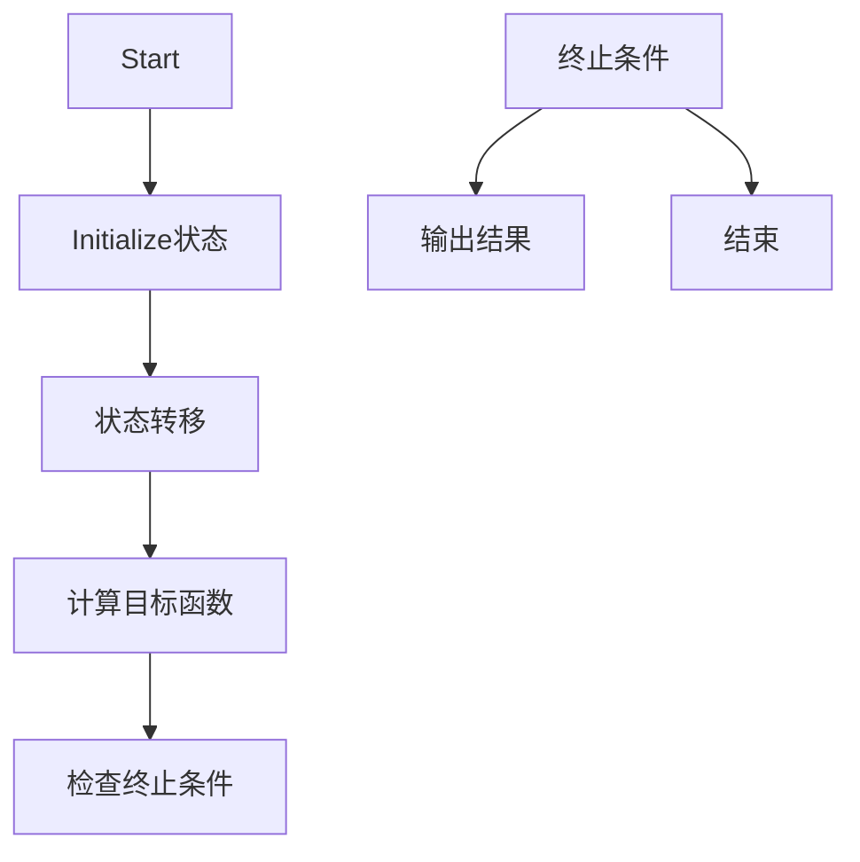
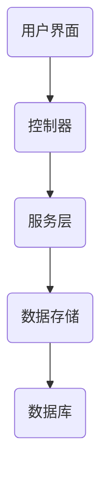

                 


# 多周期投资优化：考虑时间维度的资产配置

> 关键词：多周期投资优化、时间维度、资产配置、动态规划、数学模型、系统架构

> 摘要：本文深入探讨了多周期投资优化的核心概念、算法原理、系统架构以及实际应用。通过结合时间维度的资产配置策略，本文详细分析了动态规划算法在多周期投资优化中的应用，并通过实际案例展示了如何在不同时间框架下进行高效的资产配置。

---

## 第一部分：多周期投资优化概述

### 第1章：多周期投资优化的背景与问题背景

#### 1.1 多周期投资优化的背景
在现代金融领域，投资优化是一个核心问题，而多周期投资优化则是其重要分支。传统的投资优化通常基于单个时间周期（如一年或一个季度）进行资产配置，但在实际投资中，市场波动、经济周期和投资者风险偏好等因素会随着时间推移而变化。因此，多周期投资优化应运而生，旨在通过在多个时间周期内动态调整资产配置，以实现长期稳健的投资回报。

#### 1.2 多周期投资优化的定义与目标
多周期投资优化是一种考虑多个时间周期的资产配置方法，其目标是在不同时间框架下优化资产组合，以最大化投资收益并最小化风险。与单周期投资优化相比，多周期投资优化更注重时间维度上的动态调整和全局优化。

#### 1.3 多周期投资优化的应用场景
多周期投资优化广泛应用于机构投资、个人理财和资产管理等领域。例如，养老基金需要在长期投资中考虑多个时间周期的资产配置，以确保基金的保值和增值。此外，对冲基金和投资顾问也常采用多周期投资优化策略来管理客户资产。

---

### 第2章：多周期投资优化的核心概念与联系

#### 2.1 多周期投资优化的原理
多周期投资优化的核心原理是通过动态规划算法，在多个时间周期内逐步优化资产配置。动态规划通过将问题分解为子问题，逐步构建最优解，从而实现全局最优。

#### 2.2 多周期优化的核心概念对比
在多周期投资优化中，不同时间框架下的资产配置策略存在显著差异。例如，短期投资注重风险控制和流动性，而长期投资则更关注收益最大化和资产增值。以下是单周期与多周期优化的对比：

| 对比维度 | 单周期优化 | 多周期优化 |
|----------|------------|------------|
| 时间维度 | 单一时间周期 | 多个时间周期 |
| 资产配置 | 静态调整 | 动态调整 |
| 风险管理 | 短期风险管理 | 长期风险管理 |

#### 2.3 多周期投资优化的ER实体关系图



该图展示了投资者在不同时间周期内的资产配置与风险之间的关系。

---

## 第二部分：多周期投资优化的算法原理

### 第3章：动态规划算法在多周期投资优化中的应用

#### 3.1 状态转移方程的建立
动态规划的核心是状态转移方程。在多周期投资优化中，状态通常表示某个时间周期内的资产配置比例。假设在第 \( t \) 个周期，投资者持有的资产组合为 \( x_t \)，则状态转移方程可以表示为：

$$ x_{t+1} = f(x_t, r_t) $$

其中，\( r_t \) 表示第 \( t \) 个周期的市场收益。

#### 3.2 目标函数的定义
目标函数通常是最大化投资收益或最小化投资风险。在多周期投资优化中，目标函数可以表示为：

$$ \max_{x} \sum_{t=1}^{T} \left( r_t x_t - \lambda \sigma_t^2 \right) $$

其中，\( \lambda \) 是风险厌恶系数，\( \sigma_t^2 \) 是第 \( t \) 个周期的资产组合风险。

#### 3.3 算法流程图



---

### 第4章：多周期投资优化的数学模型与公式

#### 4.1 状态转移方程
在多周期投资优化中，状态转移方程是动态规划的核心。假设在第 \( t \) 个周期，投资者持有的资产组合为 \( x_t \)，则状态转移方程可以表示为：

$$ x_{t+1} = f(x_t, r_t) $$

其中，\( r_t \) 是第 \( t \) 个周期的市场收益。

#### 4.2 目标函数
目标函数通常表示为投资收益的对数效用函数：

$$ U(x) = \sum_{t=1}^{T} \ln(r_t x_t) $$

#### 4.3 约束条件
资产配置的比例必须满足非负性和单位约束：

$$ 0 \leq x_t \leq 1 $$
$$ \sum_{i=1}^{n} x_t^{(i)} = 1 $$

---

## 第三部分：多周期投资优化的系统分析与架构设计

### 第5章：系统分析与架构设计

#### 5.1 问题场景介绍
在多周期投资优化中，投资者需要在多个时间周期内动态调整资产配置。系统需要考虑市场波动、经济周期和投资者风险偏好等因素。

#### 5.2 系统架构设计



该图展示了多周期投资优化系统的架构，包括用户界面、控制器、服务层和数据存储。

---

## 第四部分：多周期投资优化的项目实战

### 第6章：项目实战

#### 6.1 环境安装
为了实现多周期投资优化，首先需要安装以下环境：

1. Python 3.8+
2. NumPy
3. Pandas
4. Matplotlib

#### 6.2 核心代码实现

```python
import numpy as np
import pandas as pd
import matplotlib.pyplot as plt

def dynamic_programming_optimization(n_periods, initial_asset):
    # 初始化状态
    states = np.zeros(n_periods + 1)
    states[0] = initial_asset

    for t in range(n_periods):
        # 状态转移
        states[t+1] = states[t] * (1 + np.random.normal(0, 0.1))

    return states

# 示例运行
n_periods = 10
initial_asset = 100
states = dynamic_programming_optimization(n_periods, initial_asset)

# 绘制资产变化图
plt.plot(states)
plt.xlabel('Period')
plt.ylabel('Asset Value')
plt.show()
```

#### 6.3 案例分析
假设我们有一个10年期的投资计划，初始资产为100万元。通过动态规划算法，我们可以计算出每个周期的最优资产配置比例，并绘制出资产变化的曲线。

---

## 第五部分：总结与展望

### 第7章：总结与展望

#### 7.1 最佳实践
- 定期评估和调整资产配置。
- 考虑市场波动和经济周期的影响。
- 使用动态规划算法优化多周期投资。

#### 7.2 小结
多周期投资优化是一种考虑时间维度的资产配置方法，通过动态规划算法实现全局最优。本文详细分析了其核心概念、算法原理和系统架构，并通过实际案例展示了其应用。

#### 7.3 注意事项
- 投资者应根据自身风险偏好和投资目标选择合适的时间框架。
- 数据的准确性和完整性对优化结果至关重要。
- 动态规划算法的时间复杂度较高，需注意计算效率。

#### 7.4 拓展阅读
- "Dynamic Programming and Stochastic Control" by Dimitri Bertsekas
- "Multi-Period Investment Optimization" by John C. Harsanyi

---

作者：AI天才研究院 & 禅与计算机程序设计艺术

