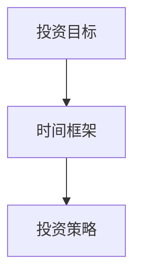
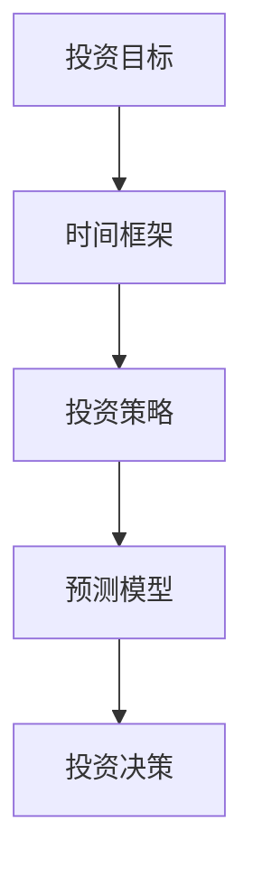

                 

# 目录大纲：《多时间框架分析：结合短中长期视角制定投资决策》

---

### 第一部分: 多时间框架分析的背景与基础

#### 第1章: 投资决策与时间框架概述

##### 1.1 投资决策的基本概念
- 1.1.1 投资决策的定义与分类
- 1.1.2 时间框架在投资决策中的重要性
- 1.1.3 多时间框架分析的意义与价值

##### 1.2 多时间框架分析的核心概念
- 1.2.1 短期、中期、长期的定义与特征
- 1.2.2 不同时间框架下的投资策略差异
- 1.2.3 多时间框架分析的边界与外延

##### 1.3 投资决策中的时间维度与空间维度
- 1.3.1 时间维度在投资决策中的作用
- 1.3.2 空间维度与多时间框架分析的结合
- 1.3.3 时间维度与空间维度的交互影响

---

### 第二部分: 多时间框架分析的理论基础

#### 第2章: 现代投资组合理论（MPT）与时间框架

##### 2.1 MPT的核心思想与假设
- 2.1.1 现代投资组合理论的基本原理
- 2.1.2 投资组合理论中的时间维度
- 2.1.3 时间框架对MPT的影响

##### 2.2 时间序列分析与多时间框架
- 2.2.1 时间序列分析的基本概念
- 2.2.2 短期、中期、长期时间序列的特征
- 2.2.3 时间序列分析在多时间框架中的应用

##### 2.3 预测模型与时间框架的关系
- 2.3.1 预测模型的基本原理
- 2.3.2 不同时间框架下预测模型的选择与优化
- 2.3.3 时间框架对预测精度的影响

---

### 第三部分: 多时间框架分析的核心概念与联系

#### 第3章: 多时间框架分析的核心概念

##### 3.1 多时间框架分析的核心概念
- 3.1.1 短期、中期、长期的定义与属性对比
- 3.1.2 多时间框架分析的系统性与动态性
- 3.1.3 时间框架与投资目标的关系

##### 3.2 多时间框架分析的ER实体关系图

---

### 第四部分: 多时间框架分析的数学模型与算法

#### 第4章: 多时间框架分析的数学模型

##### 4.1 动态规划在多时间框架中的应用
- 4.1.1 动态规划的基本原理
- 4.1.2 动态规划在短期、中期、长期投资决策中的应用
- 4.1.3 动态规划算法的实现步骤

##### 4.2 时间序列分析的算法流程
- 4.2.1 时间序列分析的步骤
- 4.2.2 短期、中期、长期预测模型的选择
- 4.2.3 时间序列分析算法的实现

##### 4.3 预测模型的数学公式
- 4.3.1 线性回归模型
  $$y = \beta_0 + \beta_1x + \epsilon$$
- 4.3.2 ARIMA模型
  $$\phi(\theta)y_t = \theta(B)w_t$$

---

### 第五部分: 多时间框架分析的系统架构设计

#### 第5章: 系统架构设计

##### 5.1 系统功能设计
- 5.1.1 系统功能模块划分
- 5.1.2 每个功能模块的实现方法
- 5.1.3 系统功能模块的交互流程

##### 5.2 系统架构设计

##### 5.3 系统接口设计
- 5.3.1 系统输入接口
- 5.3.2 系统输出接口
- 5.3.3 系统内部接口

---

### 第六部分: 项目实战与案例分析

#### 第6章: 项目实战

##### 6.1 环境安装与配置
- 6.1.1 系统运行环境的要求
- 6.1.2 开发工具的安装与配置
- 6.1.3 数据库的安装与配置

##### 6.2 核心代码实现
- 6.2.1 短期、中期、长期预测模型的实现
- 6.2.2 投资策略的实现
- 6.2.3 系统功能模块的实现

##### 6.3 案例分析与结果解读
- 6.3.1 实际案例的背景介绍
- 6.3.2 案例分析的过程与结果
- 6.3.3 结果解读与投资决策建议

---

### 第七部分: 总结与展望

#### 第7章: 总结与展望

##### 7.1 全文总结
- 7.1.1 多时间框架分析的核心内容
- 7.1.2 投资决策中的时间框架的重要性
- 7.1.3 多时间框架分析的未来发展方向

##### 7.2 未来展望
- 7.2.1 多时间框架分析的潜在研究领域
- 7.2.2 新技术对多时间框架分析的影响
- 7.2.3 多时间框架分析在其他领域的应用前景

---

### 附录

#### 附录A: 相关术语解释
- 1. 投资决策
- 2. 时间框架
- 3. 多时间框架分析
- 4. 投资策略
- 5. 时间序列分析

#### 附录B: 参考文献
- 1. 现代投资组合理论的相关文献
- 2. 时间序列分析的经典文献
- 3. 多时间框架分析的最新研究成果

---

### 作者：AI天才研究院/AI Genius Institute & 禅与计算机程序设计艺术 /Zen And The Art of Computer Programming

---

这个目录大纲涵盖了从理论到实践的各个方面，结合了多时间框架分析的背景、理论、数学模型、系统架构设计、项目实战以及案例分析，旨在为读者提供一个全面而深入的视角来理解和应用多时间框架分析方法。

