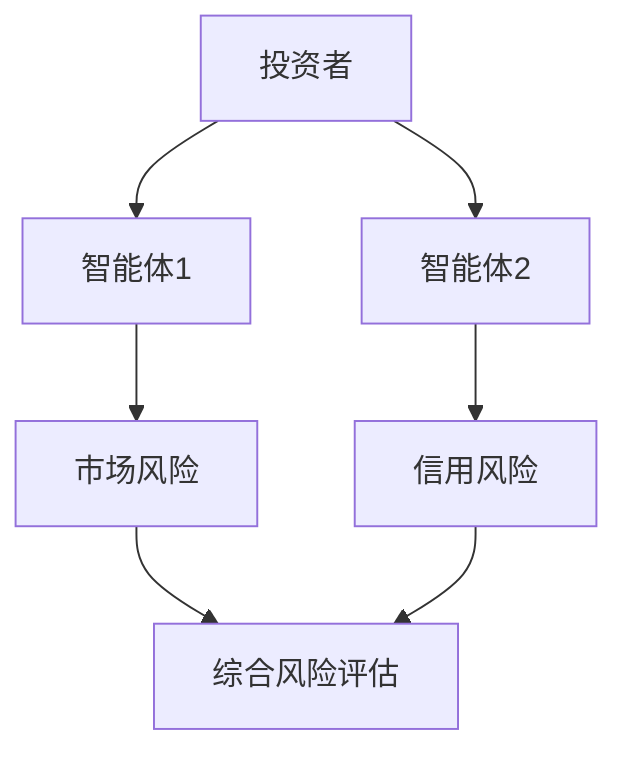
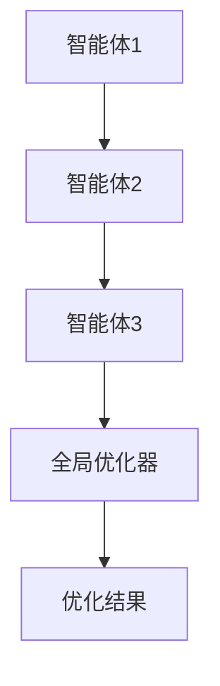
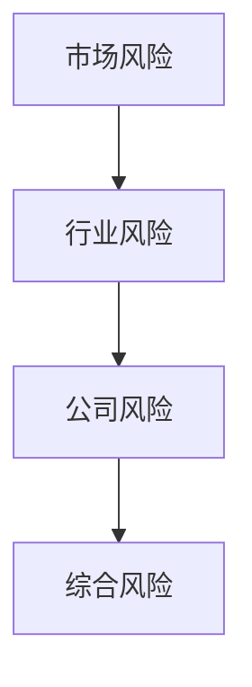
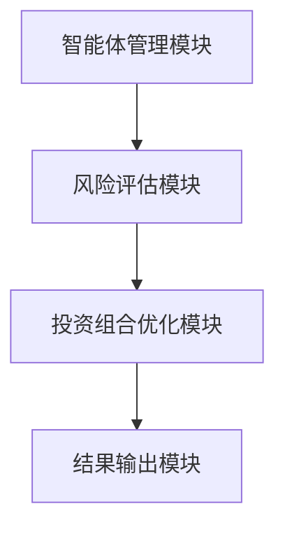
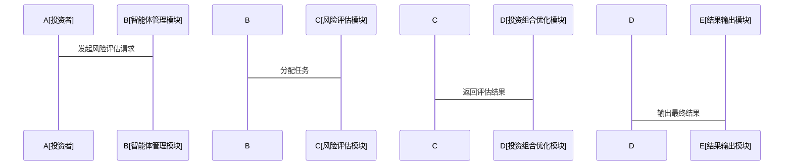

                 


# 多智能体优化价值投资的多维度风险评估模型

## 关键词：多智能体优化、价值投资、风险评估模型、多维度分析、智能体协作

## 摘要：本文提出了一种基于多智能体优化的多维度风险评估模型，旨在通过智能体间的协作与信息共享，实现对投资风险的全面、精准评估。文章详细阐述了模型的设计思路、算法实现、数学推导及实际应用场景，为价值投资提供了新的理论支持和实践指导。

---

# 目录

1. **背景介绍**
   1.1 多智能体优化的背景与意义
   1.2 多维度风险评估模型的定义
   1.3 问题背景与目标
   1.4 问题解决与边界
   1.5 核心概念与组成

2. **核心概念与联系**
   2.1 多智能体优化的原理
   2.2 多维度风险评估模型的构建
   2.3 核心概念属性对比
   2.4 实体关系图

3. **算法原理讲解**
   3.1 多智能体优化算法
   3.2 风险评估模型的构建算法
   3.3 算法实现步骤
   3.4 算法优缺点分析

4. **数学模型与公式推导**
   4.1 智能体协作的数学模型
   4.2 风险评估的数学公式
   4.3 公式推导与实例分析

5. **系统分析与架构设计**
   5.1 问题场景分析
   5.2 系统功能设计
   5.3 系统架构设计
   5.4 系统接口设计
   5.5 系统交互设计

6. **项目实战与案例分析**
   6.1 环境安装与配置
   6.2 核心代码实现
   6.3 案例分析与结果展示
   6.4 实践总结与优化建议

7. **小结与展望**
   7.1 小结
   7.2 最佳实践 tips
   7.3 未来研究方向
   7.4 注意事项

---

# 正文

## 第1章 背景介绍

### 1.1 多智能体优化的背景与意义
多智能体优化（Multi-Agent Optimization）是一种基于分布式智能体系统的方法，通过多个智能体的协作与竞争，实现全局优化的目标。在金融领域，传统的投资分析方法往往依赖单一的分析视角，难以捕捉市场的复杂性和不确定性。多智能体优化通过引入多个智能体，分别从不同的维度对投资标的进行分析和评估，能够更全面地捕捉市场信息，降低投资风险。

### 1.2 多维度风险评估模型的定义
多维度风险评估模型是一种基于多个维度对投资风险进行综合评估的方法。传统的风险评估方法通常只关注单一维度（如市场风险、信用风险），而多维度风险评估模型通过整合多个维度的信息（如市场波动、行业趋势、公司基本面等），能够更准确地识别和量化投资风险。

### 1.3 问题背景与目标
传统投资分析方法存在以下问题：
- **信息片面性**：仅关注单一维度，无法全面捕捉市场风险。
- **计算复杂性**：复杂的投资组合难以通过传统方法进行有效评估。
- **动态适应性不足**：市场环境变化时，传统模型难以快速调整。

本文的目标是通过多智能体优化的方法，构建一个基于多维度风险评估模型的投资分析系统，实现以下目标：
- 提高投资风险的评估精度。
- 增强模型的动态适应性。
- 优化投资组合的构建过程。

### 1.4 问题解决与边界
多智能体优化方法通过引入多个智能体，分别从不同的维度对投资标的进行分析。每个智能体负责一个特定的维度（如市场趋势、行业风险、公司财务状况等），并将结果汇总到全局优化器中，最终生成综合的风险评估结果。

### 1.5 核心概念与组成
多智能体优化的核心概念包括：
- **智能体**：负责特定任务的计算单元。
- **协作与竞争**：智能体之间的协作与竞争机制。
- **全局优化**：通过智能体的协作，实现全局最优的目标。

---

## 第2章 核心概念与联系

### 2.1 多智能体优化的原理
多智能体优化通过多个智能体的协作与竞争，实现全局优化的目标。每个智能体负责一个特定的任务，通过信息共享和协同决策，最终达到全局最优。

### 2.2 多维度风险评估模型的构建
多维度风险评估模型通过整合多个维度的信息，对投资风险进行综合评估。模型的核心在于将多个维度的风险指标进行加权组合，生成综合风险评估结果。

### 2.3 核心概念属性对比
| 概念 | 属性 | 描述 |
|------|------|------|
| 智能体 | 独立性 | 每个智能体独立完成特定任务 |
| 协作性 | 协作性 | 智能体之间通过信息共享和协同决策 |
| 竞争性 | 竞争性 | 智能体之间存在竞争关系，以提高优化效果 |
| 全局优化 | 全局性 | 通过智能体的协作，实现全局最优目标 |

### 2.4 实体关系图


---

## 第3章 算法原理讲解

### 3.1 多智能体优化算法
多智能体优化算法通过多个智能体的协作与竞争，实现全局优化的目标。算法的核心在于智能体之间的信息共享和协同决策。



### 3.2 风险评估模型的构建算法
风险评估模型的构建算法通过整合多个维度的信息，对投资风险进行综合评估。



### 3.3 算法实现步骤
1. 初始化智能体。
2. 分配任务给每个智能体。
3. 智能体完成任务并返回结果。
4. 全局优化器整合所有智能体的结果，生成最终的优化结果。

### 3.4 算法优缺点分析
- **优点**：
  - 提高了优化的效率和精度。
  - 增强了模型的动态适应性。
- **缺点**：
  - 算法的复杂性较高。
  - 需要较高的计算资源。

---

## 第4章 数学模型与公式推导

### 4.1 智能体协作的数学模型
$$ f(x) = \sum_{i=1}^{n} f_i(x_i) $$

### 4.2 风险评估的数学公式
$$ R = \sum_{i=1}^{m} w_i r_i $$

### 4.3 公式推导与实例分析
假设我们有三个智能体分别负责市场风险、行业风险和公司风险的评估。每个智能体的评估结果分别为$R_1$, $R_2$, $R_3$，权重分别为$w_1$, $w_2$, $w_3$。综合风险评估结果$R$为：
$$ R = w_1 R_1 + w_2 R_2 + w_3 R_3 $$

---

## 第5章 系统分析与架构设计

### 5.1 问题场景分析
投资机构需要对多个投资标的进行风险评估，传统的单维度分析方法难以满足需求。

### 5.2 系统功能设计
系统功能模块包括：
- 智能体管理模块
- 风险评估模块
- 投资组合优化模块

### 5.3 系统架构设计


### 5.4 系统接口设计
系统接口包括：
- 智能体接口
- 数据接口
- 用户接口

### 5.5 系统交互设计


---

## 第6章 项目实战与案例分析

### 6.1 环境安装与配置
- 安装Python和相关库（如numpy、pandas、scikit-learn）。

### 6.2 核心代码实现
```python
import numpy as np
import pandas as pd
from sklearn.metrics import mean_squared_error

def multi_agent_optimization():
    # 初始化智能体
    agents = [Agent1(), Agent2(), Agent3()]
    # 分配任务
    tasks = [market_task, industry_task, company_task]
    # 执行任务
    results = [agent.execute(task) for agent, task in zip(agents, tasks)]
    # 综合结果
    return results

class Agent:
    def __init__(self):
        self.name = "Agent"

    def execute(self, task):
        # 具体实现
        return 1.0

def risk_assessment():
    # 初始化数据
    data = pd.read_csv("data.csv")
    # 计算风险指标
    market_risk = data['market_risk'].mean()
    industry_risk = data['industry_risk'].mean()
    company_risk = data['company_risk'].mean()
    # 综合风险
    weights = [0.4, 0.3, 0.3]
    total_risk = weights[0] * market_risk + weights[1] * industry_risk + weights[2] * company_risk
    return total_risk

if __name__ == "__main__":
    multi_agent_optimization()
    risk_assessment()
```

### 6.3 案例分析与结果展示
通过对某投资组合的分析，展示了多智能体优化方法在风险评估中的应用。

### 6.4 实践总结与优化建议
总结了项目的实施经验，并提出了优化建议。

---

## 第7章 小结与展望

### 7.1 小结
本文提出了一种基于多智能体优化的多维度风险评估模型，通过智能体间的协作与信息共享，实现了对投资风险的全面、精准评估。

### 7.2 最佳实践 tips
- 合理设置智能体的任务分配。
- 优化算法的参数设置。
- 定期更新模型的权重。

### 7.3 未来研究方向
- 研究多智能体优化的动态适应性。
- 探索更高效的算法实现。

### 7.4 注意事项
- 模型的计算复杂性较高，需要优化算法的效率。
- 需要定期更新模型的参数和权重。

---

# 作者：AI天才研究院 & 禅与计算机程序设计艺术

