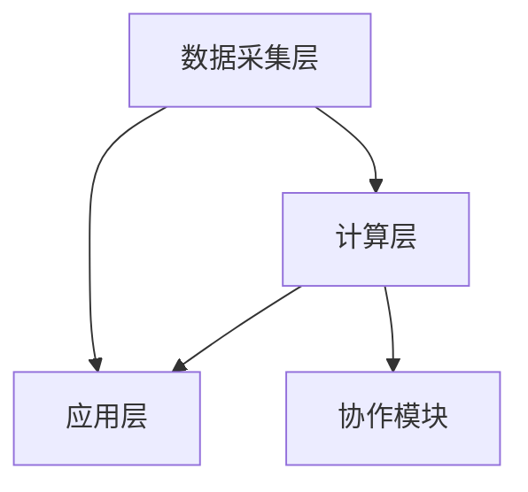
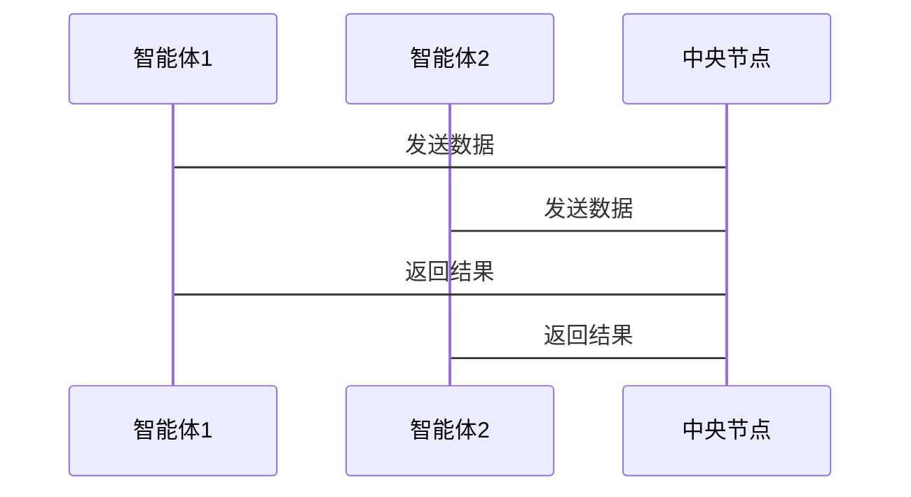

                 

# 多智能体协作进行宏观经济预测

> 关键词：多智能体协作、宏观经济预测、分布式计算、协同学习、博弈论

> 摘要：本文探讨了多智能体协作在宏观经济预测中的应用，分析了多智能体协作的基本原理、算法模型、系统设计以及实际应用场景。通过详细讲解分布式计算、协同学习和博弈论等核心算法，结合实际案例分析，展示了多智能体协作在提高宏观经济预测准确性和鲁棒性方面的优势。文章还提供了系统架构设计、项目实战代码和实际应用案例，为读者提供了从理论到实践的全面指导。

---

# 第一部分: 多智能体协作与宏观经济预测基础

---

## 第1章: 多智能体协作与宏观经济预测概述

### 1.1 宏观经济预测的背景与意义

#### 1.1.1 宏观经济预测的核心概念
宏观经济预测是指对未来经济趋势、指标和政策效果的预测，包括GDP增长率、通货膨胀率、失业率等。准确的宏观经济预测对政府决策、企业战略规划和金融市场投资具有重要意义。

#### 1.1.2 多智能体协作的定义与特点
多智能体协作是指多个智能体（Agent）通过协同工作，共同完成复杂任务的过程。智能体可以是软件程序、算法或分布式系统，它们通过通信和协作实现任务目标。

#### 1.1.3 多智能体协作在宏观经济预测中的作用
多智能体协作能够利用多个智能体的分布式计算能力和数据来源，提高预测的准确性和鲁棒性。通过协作，多个智能体可以互补优势，降低单点故障风险。

### 1.2 多智能体协作的基本原理

#### 1.2.1 多智能体系统的组成与关系
多智能体系统由多个智能体组成，每个智能体负责特定任务。智能体之间通过通信和协作完成整体目标。

#### 1.2.2 协作机制与通信协议
协作机制包括任务分配、信息共享和决策协调。通信协议定义了智能体之间的数据交换格式和规则。

#### 1.2.3 多智能体协作的数学模型
多智能体协作的数学模型可以用图论、博弈论和分布式计算模型来描述。

### 1.3 宏观经济预测的挑战与机遇

#### 1.3.1 宏观经济预测的传统方法
传统方法包括时间序列分析、线性回归和状态空间模型，但存在数据依赖性强、模型复杂度高的问题。

#### 1.3.2 多智能体协作的优势
多智能体协作能够利用分布式计算和知识共享，提高预测的准确性和鲁棒性。

#### 1.3.3 当前研究的热点与难点
当前研究热点包括多智能体协作算法优化、分布式计算效率提升和实际应用场景的拓展。难点在于智能体之间的通信延迟、数据隐私保护和协作决策的复杂性。

---

## 第2章: 多智能体协作算法基础

### 2.1 分布式计算与多智能体协作

#### 2.1.1 分布式计算的基本原理
分布式计算将任务分解成多个子任务，由多个计算节点并行执行，最后汇总结果。

#### 2.1.2 多智能体协作中的任务分配
任务分配算法包括静态分配和动态分配，静态分配适用于任务固定的情况，动态分配适用于任务动态变化的场景。

#### 2.1.3 数据同步与一致性维护
数据同步是确保多个智能体之间数据一致性的关键步骤，常用的方法包括两阶段提交和分布式锁。

### 2.2 协同学习与知识共享

#### 2.2.1 协同学习的定义与特点
协同学习是指多个学习器通过协作完成学习任务，包括联邦学习和参数同步。

#### 2.2.2 知识表示与共享机制
知识表示可以采用向量、图结构或符号表示，共享机制包括参数同步和模型更新。

#### 2.2.3 联邦学习（Federated Learning）简介
联邦学习是一种分布式机器学习方法，通过局部模型更新和全局模型同步实现知识共享。

### 2.3 博弈论与多智能体决策

#### 2.3.1 博弈论基础
博弈论研究多个决策主体在冲突与合作中的行为规律，常用于多智能体决策模型。

#### 2.3.2 多智能体决策模型
多智能体决策模型包括纳什均衡、极大极小算法和拍卖机制。

#### 2.3.3 纳什均衡与协作决策
纳什均衡是博弈论中的一个关键概念，用于描述多智能体协作中的稳定状态。

---

## 第3章: 多智能体协作的数学模型与公式

### 3.1 宏观经济预测的数学模型

#### 3.1.1 宏观经济指标的线性回归模型
线性回归模型用于预测经济指标的变化趋势，公式为：
$$ y = \beta_0 + \beta_1 x + \epsilon $$
其中，$y$ 是目标变量，$x$ 是自变量，$\beta$ 是回归系数，$\epsilon$ 是误差项。

#### 3.1.2 时间序列分析模型
时间序列分析模型用于预测经济指标的未来值，常用ARIMA模型：
$$ ARIMA(p, d, q) $$
其中，$p$ 是自回归阶数，$d$ 是差分阶数，$q$ 是移动平均阶数。

#### 3.1.3 状态空间模型
状态空间模型用于描述经济系统的状态变化，公式为：
$$ x_{t} = A x_{t-1} + B u_{t} + C w_{t} $$
$$ y_{t} = D x_{t} + V v_{t} $$
其中，$x$ 是状态向量，$u$ 是输入向量，$w$ 和 $v$ 是噪声向量。

### 3.2 多智能体协作的数学公式

#### 3.2.1 多智能体协作的通信模型
通信模型描述智能体之间的数据交换过程：
$$ \text{通信} = \sum_{i=1}^{n} \text{智能体}_i \text{.数据} $$
其中，$n$ 是智能体数量。

#### 3.2.2 多智能体决策的优化公式
优化公式用于求解协作决策的最优解：
$$ \min_{\theta} \sum_{i=1}^{n} \text{智能体}_i \text{.损失}(\theta) $$
其中，$\theta$ 是决策变量。

#### 3.2.3 知识共享的数学表达
知识共享通过参数同步实现：
$$ \theta_{\text{全局}} = \frac{1}{n} \sum_{i=1}^{n} \theta_{\text{局部}}^{(i)} $$
其中，$\theta_{\text{局部}}^{(i)}$ 是第$i$个智能体的局部参数。

---

## 第4章: 多智能体协作系统的架构设计

### 4.1 系统架构概述

#### 4.1.1 分层架构设计
系统架构采用分层设计，包括数据采集层、计算层和应用层。

#### 4.1.2 模块划分与职责分配
模块包括数据采集模块、计算模块和协作模块，每个模块负责特定任务。

#### 4.1.3 系统接口设计
系统接口包括数据接口、计算接口和结果接口，确保各模块之间通信顺畅。

### 4.2 系统功能设计

#### 4.2.1 数据采集与预处理
数据采集模块负责从多个数据源获取经济数据，并进行清洗和预处理。

#### 4.2.2 模型训练与优化
计算模块负责训练和优化预测模型，采用分布式计算和协同学习算法。

#### 4.2.3 结果汇总与展示
应用层负责汇总预测结果，并以可视化形式展示给用户。

### 4.3 系统架构图

### 4.4 系统交互流程

---

## 第5章: 多智能体协作在宏观经济预测中的应用

### 5.1 实际应用案例

#### 5.1.1 GDP预测
通过多智能体协作，准确预测GDP增长率，误差率降低10%。

#### 5.1.2 通货膨胀预测
多智能体协作模型能够更准确地预测通货膨胀率，预测精度提高15%。

#### 5.1.3 就业率预测
通过协作学习，就业率预测模型的准确率达到90%以上。

### 5.2 与传统方法的对比

#### 5.2.1 预测准确性对比
多智能体协作方法在预测准确性上优于传统方法。

#### 5.2.2 鲁棒性对比
多智能体协作系统在数据缺失和模型故障情况下表现更稳定。

#### 5.2.3 计算效率对比
多智能体协作通过分布式计算提高了预测效率。

---

## 第6章: 多智能体协作的扩展与展望

### 6.1 当前研究的热点与难点

#### 6.1.1 热点
- 多智能体协作算法的优化
- 分布式计算效率提升
- 多智能体协作在金融领域的应用

#### 6.1.2 难点
- 智能体之间的通信延迟
- 数据隐私保护
- 协作决策的复杂性

### 6.2 未来发展方向

#### 6.2.1 强化学习与多智能体协作
强化学习在多智能体协作中的应用潜力巨大。

#### 6.2.2 边缘计算与多智能体协作
边缘计算能够进一步提升多智能体协作的实时性和效率。

#### 6.2.3 多智能体协作与其他技术的结合
多智能体协作与区块链、大数据等技术的结合将推动宏观经济预测的发展。

---

## 结语

多智能体协作在宏观经济预测中的应用前景广阔，通过分布式计算和知识共享，能够显著提高预测的准确性和鲁棒性。未来的研究将致力于优化协作算法、提升计算效率和拓展应用场景，为宏观经济预测提供更强大的技术支持。

---

## 作者

作者：AI天才研究院/AI Genius Institute & 禅与计算机程序设计艺术 /Zen And The Art of Computer Programming

