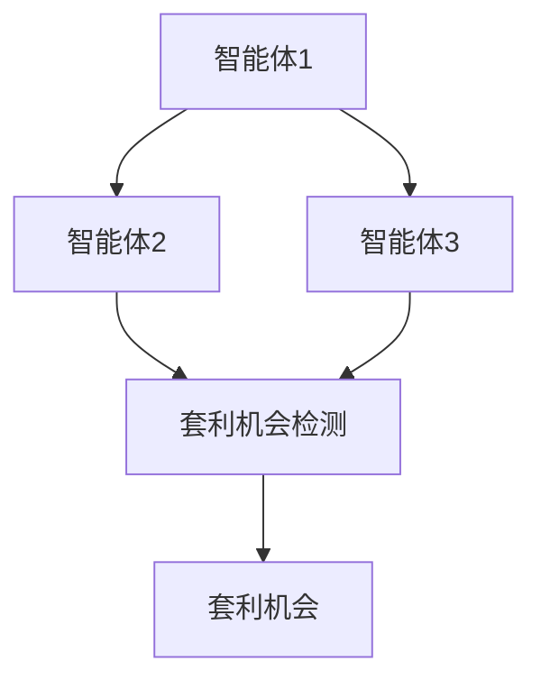
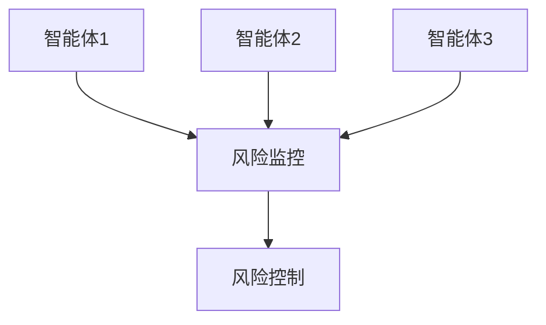
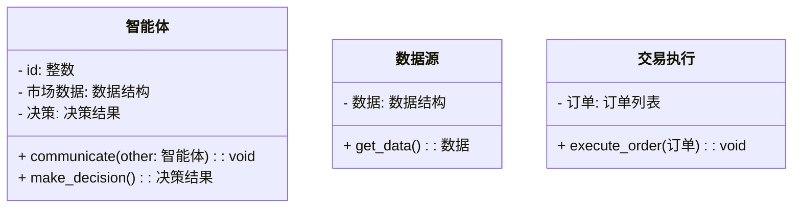
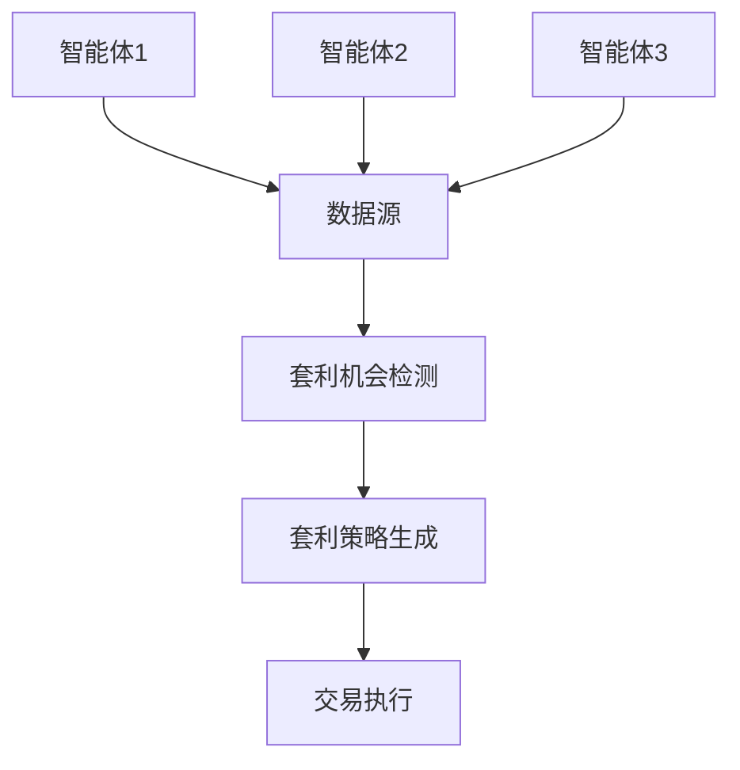
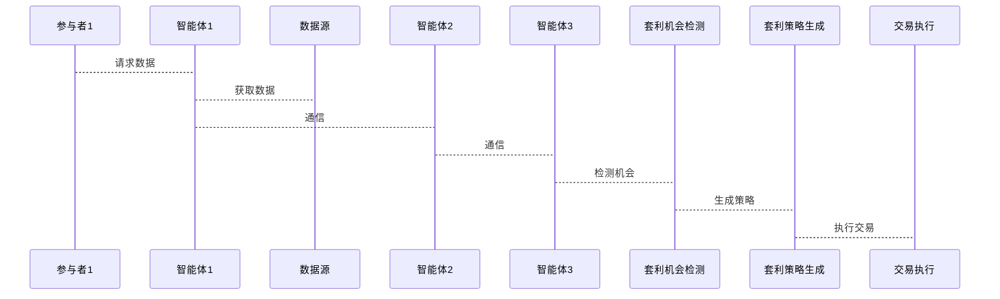

                 


# 多智能体协作进行跨市场套利

## 关键词
多智能体协作, 跨市場套利, 分布式系统, 人工智能, 套利算法

## 摘要
多智能体协作在跨市场套利中的应用是一种创新的金融技术，通过多个智能体的协同工作，能够在复杂的金融市场中快速识别套利机会并执行交易，从而实现收益最大化。本文将从多智能体协作的基本概念、跨市场套利的机制，到具体的算法实现和系统架构设计，全面分析多智能体协作在跨市场套利中的应用，并通过实际案例展示其优势和挑战。

---

# 第一部分: 多智能体协作与跨市场套利概述

## 第1章: 多智能体协作与跨市场套利概述

### 1.1 多智能体协作的定义与特点
#### 1.1.1 多智能体系统的定义
多智能体系统（Multi-Agent System, MAS）是由多个智能体组成的分布式系统，每个智能体都有一定的自主性、反应性和社会性，能够通过通信和协作完成复杂的任务。

#### 1.1.2 多智能体协作的核心特点
- **自主性**：每个智能体都能独立决策。
- **反应性**：智能体能够根据环境反馈实时调整行为。
- **分布式性**：任务分布在多个智能体之间，避免单点故障。
- **协作性**：智能体之间通过通信和协作完成共同目标。

#### 1.1.3 多智能体协作与传统单智能体的区别
| 特性 | 多智能体协作 | 单智能体 |
|------|-------------|----------|
| 决策 | 分布式决策 | 中央决策 | 
| 通信 | 智能体之间需要通信 | 无通信需求 |
| 效率 | 分工协作，效率高 | 可能效率较低 |

### 1.2 跨市場套利的定义与机制
#### 1.2.1 跨市場套利的定义
跨市场套利是指在不同市场之间利用价格差异进行买卖，以获取无风险或低风险利润的交易行为。

#### 1.2.2 跨市場套利的基本机制
1. 数据采集：从多个市场获取实时价格数据。
2. 价格比较：识别价格差异。
3. 套利机会检测：判断是否存在套利空间。
4. 执行交易：在价格差异消失前完成交易。

#### 1.2.3 跨市場套利的风险与收益
- **收益**：无风险或低风险利润。
- **风险**：市场波动、交易延迟、监管风险等。

### 1.3 多智能体协作在跨市场套利中的作用
#### 1.3.1 多智能体协作的优势
- **高效性**：多个智能体可以同时处理多个市场数据。
- **鲁棒性**：分布式结构能够避免单点故障。
- **实时性**：智能体之间可以快速通信，及时发现套利机会。

#### 1.3.2 多智能体协作在跨市场套利中的应用场景
- **外汇市场**：利用汇率差异进行套利。
- **股票市场**：利用价格差异进行套利。
- **加密货币市场**：利用价格波动进行套利。

#### 1.3.3 多智能体协作与跨市场套利的结合
- **智能体分工**：每个智能体负责不同的市场数据采集和分析。
- **协同决策**：多个智能体协同决策，识别套利机会。

### 1.4 本章小结
本章介绍了多智能体协作的基本概念、特点，以及跨市场套利的定义和机制。通过对比分析，揭示了多智能体协作在跨市场套利中的优势和应用场景。

---

## 第2章: 多智能体协作的核心概念与联系

### 2.1 多智能体协作的核心概念
#### 2.1.1 智能体的定义与属性
智能体是一种能够感知环境、做出决策并执行动作的实体，具有以下属性：
- **感知**：获取环境信息。
- **决策**：基于信息做出决策。
- **执行**：执行决策动作。

#### 2.1.2 多智能体协作的通信机制
- **同步通信**：智能体之间同步交换信息。
- **异步通信**：智能体之间异步交换信息。

#### 2.1.3 多智能体协作的决策模型
- **协商机制**：智能体之间通过协商达成一致决策。
- **共识机制**：智能体之间通过共识算法达成一致决策。

### 2.2 跨市場套利的核心概念
#### 2.2.1 套利机会的定义与检测
套利机会是指在不同市场之间存在价格差异，能够通过买卖操作获利的机会。套利机会检测需要考虑市场延迟、交易成本等因素。

#### 2.2.2 跨市場数据的获取与处理
- **数据源**：从多个市场获取实时价格数据。
- **数据处理**：清洗、转换和分析数据，识别套利机会。

#### 2.2.3 套利策略的制定与执行
- **套利策略**：根据市场情况制定具体的买卖策略。
- **策略执行**：通过智能体协作执行套利交易。

### 2.3 多智能体协作与跨市场套利的联系
#### 2.3.1 多智能体协作在套利机会发现中的应用
- **分布式数据采集**：多个智能体分别采集不同市场的数据。
- **数据融合**：将多个市场的数据进行融合，识别套利机会。

#### 2.3.2 多智能体协作在套利策略执行中的应用
- **分工协作**：每个智能体负责不同的交易执行。
- **风险控制**：通过协作机制控制套利风险。

#### 2.3.3 多智能体协作在套利风险控制中的应用
- **实时监控**：智能体实时监控市场变化，及时调整策略。
- **风险分散**：通过分布式交易降低风险。

### 2.4 本章小结
本章详细介绍了多智能体协作的核心概念和跨市场套利的核心机制，揭示了多智能体协作在跨市场套利中的重要性。

---

## 第3章: 多智能体协作的算法原理

### 3.1 多智能体协作的基本算法
#### 3.1.1 分布式计算算法
- **分布式计算**：任务分布在多个智能体之间，通过通信和协作完成。
- **分布式共识算法**：如分布式一致性算法、拜占庭容错等。

#### 3.1.2 博弈论模型
- **纳什均衡**：多个智能体在博弈中达到的一种稳定状态。
- **博弈树**：用于分析多个智能体之间的博弈过程。

#### 3.1.3 聚类与分类算法
- **聚类算法**：将市场数据进行聚类分析，识别价格趋势。
- **分类算法**：用于分类市场状态，识别套利机会。

### 3.2 跨市場套利的算法原理
#### 3.2.1 套利机会检测算法
- **价格差异检测**：通过计算不同市场的价格差异，识别套利机会。
- **价格波动预测**：基于历史数据预测未来的价格波动，提前发现套利机会。

#### 3.2.2 套利策略生成算法
- **基于规则的策略生成**：根据市场规则生成套利策略。
- **基于机器学习的策略生成**：利用机器学习算法生成套利策略。

#### 3.2.3 套利风险评估算法
- **风险指标计算**：计算套利交易的风险指标，如波动率、最大回撤等。
- **风险控制算法**：根据风险指标调整套利策略。

### 3.3 多智能体协作与跨市场套利的结合算法
#### 3.3.1 基于多智能体的套利机会发现算法


#### 3.3.2 基于多智能体的套利策略执行算法


#### 3.3.3 基于多智能体的套利风险控制算法


### 3.4 本章小结
本章介绍了多智能体协作的基本算法和跨市场套利的算法原理，展示了多智能体协作在跨市场套利中的具体应用。

---

## 第4章: 跨市場套利的数学模型与公式

### 4.1 多智能体协作的数学模型
#### 4.1.1 多智能体协作的通信模型
$$
\text{通信模型：} P_{i}(t) \rightarrow P_{j}(t+1)
$$

其中，$P_i(t)$ 表示智能体i在时间t的通信信息，$P_j(t+1)$ 表示智能体j在时间t+1的通信信息。

#### 4.1.2 多智能体协作的决策模型
$$
\text{决策模型：} D_i(t) = f(P_i(t), P_j(t))
$$

其中，$D_i(t)$ 表示智能体i在时间t的决策，$f$ 表示决策函数。

### 4.2 跨市場套利的数学模型
#### 4.2.1 跨市場套利的机会检测
$$
\text{机会检测：} \Delta p = p_1 - p_2
$$

其中，$\Delta p$ 表示两个市场之间的价格差异，$p_1$ 和 $p_2$ 分别表示两个市场的价格。

#### 4.2.2 跨市場套利的策略生成
$$
\text{策略生成：} s = \text{argmin}(r, c)
$$

其中，$s$ 表示套利策略，$r$ 表示套利机会的风险，$c$ 表示套利机会的成本。

#### 4.2.3 跨市場套利的风险评估
$$
\text{风险评估：} R = \sum_{i=1}^{n} w_i r_i
$$

其中，$R$ 表示总风险，$w_i$ 表示风险权重，$r_i$ 表示各个风险因素。

### 4.3 多智能体协作与跨市场套利的结合模型
#### 4.3.1 多智能体协作的套利机会检测模型
$$
\text{套利机会检测：} \Delta p_i = p_{i1} - p_{i2}, \quad i = 1,2,...,n
$$

其中，$p_{i1}$ 和 $p_{i2}$ 分别表示第i个市场的价格。

#### 4.3.2 多智能体协作的套利策略执行模型
$$
\text{策略执行：} s_i = \text{argmax}(\Delta p_i, R_i)
$$

其中，$s_i$ 表示第i个智能体的策略，$\Delta p_i$ 表示第i个市场的价格差异，$R_i$ 表示第i个市场的风险。

#### 4.3.3 多智能体协作的套利风险控制模型
$$
\text{风险控制：} \Delta R = \sum_{i=1}^{n} \lambda_i R_i
$$

其中，$\Delta R$ 表示总风险变化，$\lambda_i$ 表示风险控制系数，$R_i$ 表示第i个市场的风险。

### 4.4 本章小结
本章通过数学模型和公式，详细介绍了多智能体协作和跨市场套利的结合模型，为后续的算法实现提供了理论基础。

---

## 第5章: 系统分析与架构设计方案

### 5.1 问题场景介绍
多智能体协作进行跨市场套利的系统需要解决以下问题：
- **多市场数据采集**：从多个市场获取实时价格数据。
- **套利机会检测**：识别跨市场的套利机会。
- **套利策略执行**：根据机会执行套利交易。
- **风险控制**：实时监控和控制套利风险。

### 5.2 系统功能设计
#### 5.2.1 领域模型类图


#### 5.2.2 系统架构图


#### 5.2.3 系统接口设计
- **数据源接口**：提供实时市场数据。
- **套利机会检测接口**：返回套利机会列表。
- **套利策略执行接口**：根据策略执行交易。

#### 5.2.4 系统交互序列图


### 5.3 本章小结
本章通过系统分析和架构设计，展示了多智能体协作进行跨市场套利的系统结构和功能模块。

---

## 第6章: 项目实战

### 6.1 环境安装
- **Python环境**：安装Python 3.8以上版本。
- **库安装**：安装numpy、pandas、scikit-learn、multi-agent框架。

### 6.2 核心代码实现
#### 6.2.1 智能体类
```python
class Agent:
    def __init__(self, id):
        self.id = id
        self.market_data = {}
    
    def communicate(self, other):
        # 智能体之间通信，交换市场数据
        self.market_data.update(other.market_data)
    
    def make_decision(self):
        # 根据市场数据做出决策
        pass
```

#### 6.2.2 套利机会检测类
```python
class ArbitrageOpportunity:
    def __init__(self, market1, market2):
        self.market1 = market1
        self.market2 = market2
        self.price_diff = self.detect_price_diff()
    
    def detect_price_diff(self):
        return abs(self.market1.price - self.market2.price)
```

#### 6.2.3 交易执行类
```python
class TradeExecution:
    def __init__(self, order):
        self.order = order
    
    def execute(self):
        # 执行交易
        pass
```

### 6.3 案例分析与详细解读
#### 6.3.1 案例分析
假设我们有三个智能体，分别监测外汇市场、股票市场和加密货币市场。智能体之间通过通信，发现外汇市场的价格差异，执行套利交易。

#### 6.3.2 代码实现与分析
```python
# 初始化智能体
agent1 = Agent(1)
agent2 = Agent(2)
agent3 = Agent(3)

# 初始化数据源
market1 = MarketData('USD/EUR', 1.2)
market2 = MarketData('USD/JPY', 1.3)

# 智能体通信
agent1.communicate(agent2)
agent2.communicate(agent3)

# 检测套利机会
opportunity = ArbitrageOpportunity(market1, market2)
if opportunity.price_diff > 0.01:
    # 执行交易
    trade = TradeExecution(opportunity)
    trade.execute()
```

### 6.4 本章小结
本章通过实际案例和代码实现，展示了多智能体协作进行跨市场套利的具体过程和实现细节。

---

## 第7章: 最佳实践与总结

### 7.1 小结
多智能体协作在跨市场套利中的应用，通过多个智能体的分工协作，能够高效地识别套利机会，执行交易，并控制风险。

### 7.2 注意事项
- **数据延迟**：需要考虑数据获取的延迟问题。
- **交易成本**：需要考虑交易成本对套利收益的影响。
- **市场波动**：需要考虑市场波动对套利机会的影响。

### 7.3 拓展阅读
- **分布式系统**：深入学习分布式系统的设计与实现。
- **博弈论**：学习博弈论在多智能体协作中的应用。
- **机器学习**：研究机器学习算法在跨市场套利中的应用。

### 7.4 本章小结
本章总结了多智能体协作在跨市场套利中的应用，并提出了相关的注意事项和拓展阅读方向。

---

## 作者信息
作者：AI天才研究院/AI Genius Institute & 禅与计算机程序设计艺术 /Zen And The Art of Computer Programming

---

# 结语
通过本文的详细分析和实战案例，我们展示了多智能体协作在跨市场套利中的巨大潜力和实际应用价值。未来，随着人工智能和分布式技术的不断发展，多智能体协作在金融领域的应用将会更加广泛和深入。

