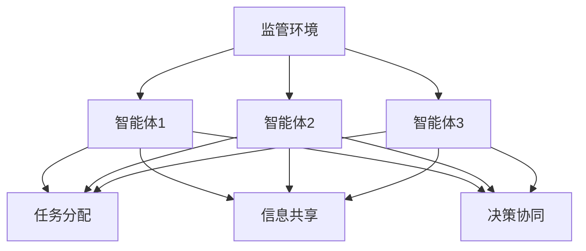
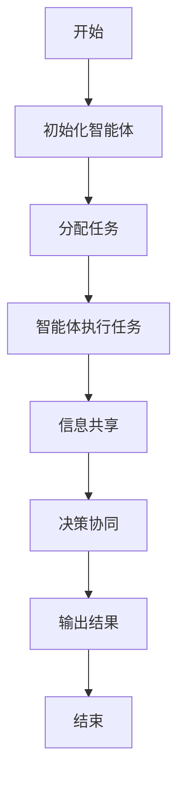
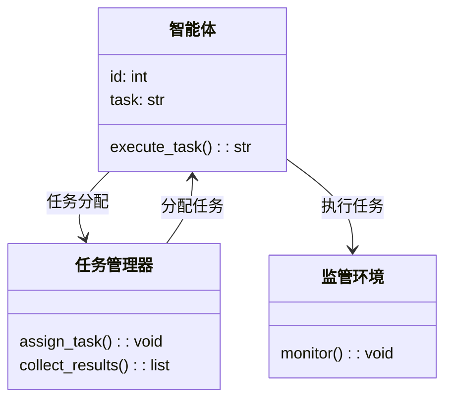
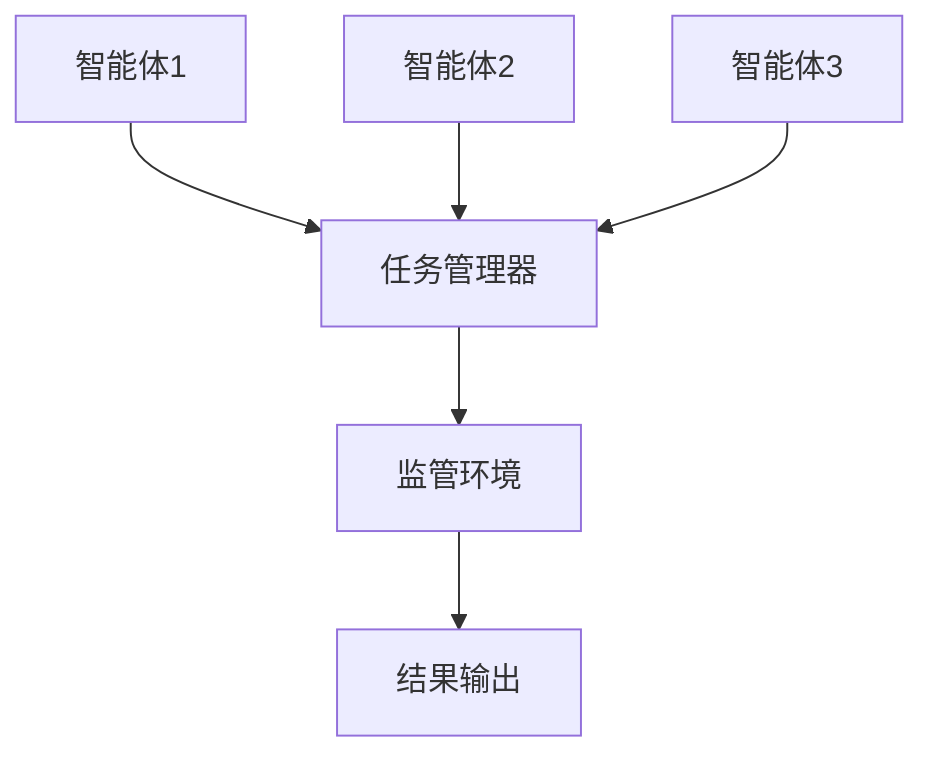
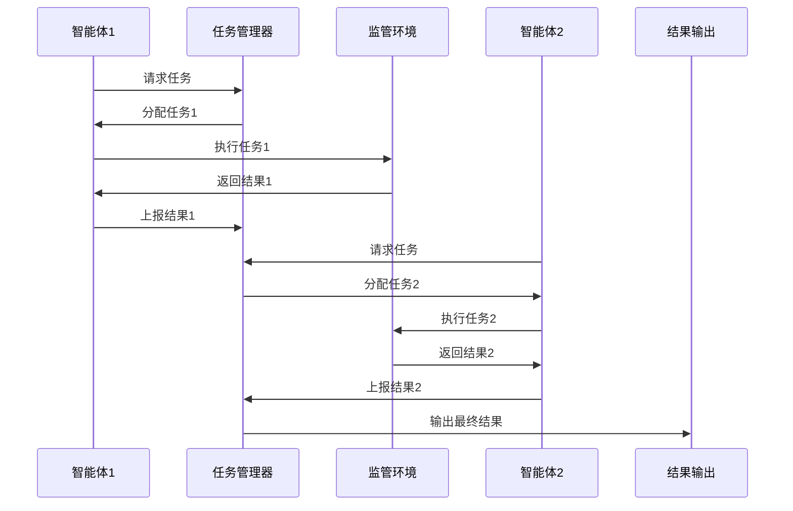

                 


```markdown
# 多智能体协同评估监管环境变化

> 关键词：多智能体、协同评估、监管环境、变化检测、系统设计

> 摘要：本文详细探讨了多智能体协同评估监管环境变化的技术与方法，从核心概念到算法原理，再到系统设计与项目实战，全面分析了多智能体协同在监管环境变化评估中的应用。文章通过丰富的图表和代码示例，结合实际案例，深入解读了多智能体协同的优势与挑战，为读者提供了全面的技术指导。

---

## 第一章：多智能体协同评估的背景与核心概念

### 1.1 多智能体系统的基本概念

#### 1.1.1 多智能体系统的定义
多智能体系统（Multi-Agent System, MAS）是指由多个相互作用的智能体组成的系统，这些智能体能够通过协同完成复杂的任务。与单智能体系统相比，MAS具有更高的灵活性和适应性。

#### 1.1.2 多智能体系统的特征
- **自主性**：每个智能体都有自己的目标和决策能力。
- **反应性**：智能体能够感知环境并实时响应。
- **协作性**：智能体之间通过通信和协调完成共同目标。
- **分布性**：智能体可以分布在不同的物理或虚拟环境中。

#### 1.1.3 多智能体与单智能体的区别
| 特性         | 单智能体         | 多智能体         |
|--------------|------------------|------------------|
| 独立性       | 高               | 较低             |
| 协作能力     | 无               | 高               |
| 效率         | 高               | 较低             |
| 适应性       | 低               | 高               |

### 1.2 监管环境变化的评估需求

#### 1.2.1 监管环境变化的定义
监管环境变化指的是法律法规、政策标准、市场规则等的变化，这些变化可能对企业的运营产生重大影响。

#### 1.2.2 监管环境变化的评估目标
- 提前识别潜在风险。
- 优化企业合规策略。
- 提高企业应对变化的灵活性。

#### 1.2.3 监管环境变化的评估方法
- **定性评估**：通过专家分析和案例研究。
- **定量评估**：利用数据分析和数学模型。
- **混合评估**：结合定性和定量方法。

### 1.3 多智能体协同在监管环境评估中的作用

#### 1.3.1 多智能体协同的优势
- **分布式感知**：多个智能体能够从不同角度感知环境。
- **协作决策**：通过协同提高决策的准确性和全面性。
- **快速响应**：智能体能够快速适应环境变化。

#### 1.3.2 多智能体协同在监管环境评估中的应用
- **风险预警**：通过智能体协同实时监测监管环境变化。
- **合规优化**：智能体协同为企业提供合规建议。
- **动态调整**：根据环境变化动态调整企业策略。

---

## 第二章：多智能体协同的核心概念与联系

### 2.1 多智能体协同的基本原理

#### 2.1.1 协同行为的定义
协同行为是指多个智能体为了共同目标而进行的合作行为。

#### 2.1.2 协同行为的分类
- **任务协同**：智能体分工合作完成任务。
- **信息协同**：智能体共享信息提高整体认知。
- **决策协同**：智能体共同制定决策。

#### 2.1.3 协同行为的实现机制
- **通信协议**：智能体之间通过特定协议进行信息交换。
- **任务分配**：根据智能体的能力分配任务。
- **激励机制**：通过激励措施促进智能体协作。

### 2.2 多智能体协同的关键属性

#### 2.2.1 智能体的自主性
智能体具有自主决策的能力，能够在没有外部干预的情况下完成任务。

#### 2.2.2 智能体的反应性
智能体能够实时感知环境并做出反应，适应环境变化。

#### 2.2.3 智能体的协作性
智能体之间能够通过通信和协调完成共同目标。

### 2.3 多智能体协同的实体关系图



---

## 第三章：多智能体协同的算法原理

### 3.1 协同算法的数学模型

#### 3.1.1 协同算法的数学表达
多智能体协同算法可以表示为：
$$ f(x) = \sum_{i=1}^{n} f_i(x_i) $$
其中，$x_i$ 表示第 $i$ 个智能体的状态，$f_i$ 表示第 $i$ 个智能体的目标函数。

#### 3.1.2 协同算法的优化方法
- **分布式优化**：每个智能体独立优化自己的目标函数。
- **集中式优化**：将所有智能体的目标函数集中优化。

#### 3.1.3 协同算法的收敛性分析
协同算法的收敛性可以通过数学证明来分析，例如：
$$ \lim_{t \to \infty} f(x_t) = f(x^*) $$

### 3.2 协同算法的流程图



### 3.3 协同算法的Python实现

```python
class Agent:
    def __init__(self, id):
        self.id = id
        self.task = None

    def receive_task(self, task):
        self.task = task

    def execute_task(self):
        # 模拟任务执行
        return f"Agent {self.id} completed task {self.task}"

# 初始化智能体
agents = [Agent(1), Agent(2), Agent(3)]

# 任务分配
tasks = ["环境监测", "数据收集", "风险评估"]
for i in range(len(agents)):
    agents[i].receive_task(tasks[i])

# 任务执行
results = []
for agent in agents:
    results.append(agent.execute_task())

# 信息共享
shared_info = {}
for i, result in enumerate(results):
    shared_info[i] = result

# 决策协同
decision = "所有任务完成，环境评估完成。"
print(decision)
```

---

## 第四章：多智能体协同的系统分析与架构设计

### 4.1 问题场景介绍

#### 4.1.1 监管环境变化的评估场景
企业需要实时监测监管环境变化，确保合规运营。

#### 4.1.2 监管环境变化评估的挑战
- 数据来源多样。
- 环境变化复杂。
- 需要快速响应。

### 4.2 项目介绍

#### 4.2.1 项目目标
构建一个多智能体协同系统，实时评估监管环境变化。

### 4.3 系统功能设计

#### 4.3.1 领域模型


### 4.4 系统架构设计

#### 4.4.1 系统架构图


### 4.5 系统交互设计

#### 4.5.1 系统交互流程


---

## 第五章：项目实战

### 5.1 环境安装

#### 5.1.1 安装Python
```bash
python --version
pip install --upgrade pip
```

#### 5.1.2 安装依赖
```bash
pip install mermaid
pip install matplotlib
```

### 5.2 系统核心实现

#### 5.2.1 智能体实现
```python
class Agent:
    def __init__(self, id):
        self.id = id
        self.task = None
```

#### 5.2.2 任务管理器实现
```python
class TaskManager:
    def __init__(self):
        self.agents = []

    def assign_task(self, agent, task):
        agent.receive_task(task)
```

### 5.3 代码应用解读与分析

#### 5.3.1 代码实现
```python
# 初始化智能体
agents = [Agent(1), Agent(2), Agent(3)]

# 任务分配
tasks = ["环境监测", "数据收集", "风险评估"]
for i in range(len(agents)):
    agents[i].receive_task(tasks[i])

# 任务执行
results = []
for agent in agents:
    results.append(agent.execute_task())

# 信息共享
shared_info = {}
for i, result in enumerate(results):
    shared_info[i] = result

# 决策协同
decision = "所有任务完成，环境评估完成。"
print(decision)
```

### 5.4 实际案例分析

#### 5.4.1 案例背景
某企业需要实时监测法律法规变化，优化合规策略。

#### 5.4.2 案例分析
通过多智能体协同，企业能够快速响应监管变化，降低合规风险。

### 5.5 项目小结

#### 5.5.1 项目成果
成功构建多智能体协同系统，实现监管环境变化的实时评估。

#### 5.5.2 经验总结
- 系统设计需充分考虑智能体的协同机制。
- 数据共享和隐私保护需重点关注。

---

## 第六章：总结与展望

### 6.1 最佳实践 tips

#### 6.1.1 系统设计 tips
- 明确智能体的目标和职责。
- 设计高效的通信协议。
- 优化任务分配算法。

#### 6.1.2 代码实现 tips
- 使用模块化设计，便于维护。
- 加强错误处理机制。
- 注重代码的可扩展性。

### 6.2 小结

#### 6.2.1 知识回顾
- 多智能体协同的基本概念。
- 监管环境变化评估的方法。
- 系统设计与实现的步骤。

### 6.3 注意事项

#### 6.3.1 实际应用中的注意事项
- 确保数据的准确性和实时性。
- 保护智能体的隐私和安全。
- 定期更新系统以适应环境变化。

### 6.4 拓展阅读

#### 6.4.1 推荐书籍
- 《Multi-Agent Systems: Algorithmic, Complexity Theoretic, and Game Theoretic Foundations》
- 《Multi-Agent Machine Learning: A Reinforcement Approach》

#### 6.4.2 推荐博客
- [Multi-Agent Systems Blog](https://www.masblog.com)
- [Game Theory and Multi-Agent Systems](https://www.gt-mas.com)

---

## 作者：AI天才研究院 & 禅与计算机程序设计艺术

本文由AI天才研究院（AI Genius Institute）与禅与计算机程序设计艺术（Zen And The Art of Computer Programming）联合创作，转载请注明出处。
```

