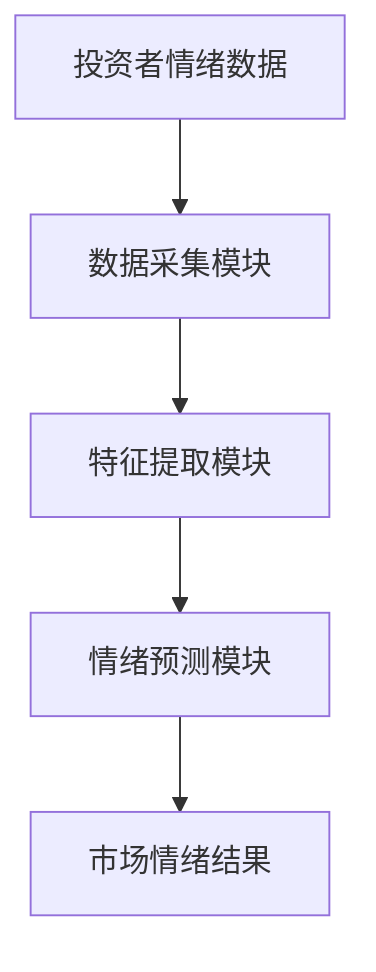

                 


# 多智能体系统在全球投资者情绪分析中的应用：把握市场脉搏

> **关键词**: 多智能体系统, 投资者情绪分析, 金融市场, 人工智能, 情感计算

> **摘要**: 本文探讨了多智能体系统在全球投资者情绪分析中的应用，通过分析投资者情绪对金融市场的影响，结合MAS（多智能体系统）的核心原理，提出了一种基于MAS的投资者情绪分析模型。文章详细阐述了MAS的定义、投资者情绪分析的理论基础、MAS在情绪分析中的具体应用，以及系统的架构设计和实际案例分析，旨在为投资者和相关技术研究者提供理论支持和实践指导。

---

# 第一部分: 多智能体系统与投资者情绪分析的背景介绍

## 第1章: 多智能体系统概述

### 1.1 多智能体系统的基本概念

#### 1.1.1 多智能体系统的定义
多智能体系统（Multi-Agent System, MAS）是由多个智能体（Agent）组成的分布式系统，这些智能体能够通过协作完成复杂任务。智能体是具有感知、决策、推理和行动能力的实体，能够独立工作并与其他智能体或环境进行交互。

#### 1.1.2 多智能体系统的组成部分
- **智能体（Agent）**: 具备自主性、反应性、目标导向和社交能力的实体。
- **环境（Environment）**: 智能体所处的外部世界，包括物理环境或信息空间。
- **通信机制**: 智能体之间或与环境交互的通信协议。
- **协作机制**: 智能体之间的协作规则和任务分配策略。

#### 1.1.3 多智能体系统的特点与优势
- **分布式计算**: 智能体独立运行，减少单点故障。
- **自主性**: 智能体能够自主决策，适应环境变化。
- **协作性**: 智能体通过协作完成复杂任务，提升整体效率。
- **动态性**: 系统能够动态调整以应对环境变化。

### 1.2 投资者情绪分析的定义与重要性

#### 1.2.1 投资者情绪分析的定义
投资者情绪分析是通过对市场参与者的情感、态度和意图的分析，评估市场情绪状态的过程。情绪分析可以帮助预测市场走势，辅助投资决策。

#### 1.2.2 投资者情绪分析的作用与意义
- **预测市场波动**: 情绪过度乐观或悲观可能导致市场泡沫或崩盘。
- **辅助投资决策**: 帮助投资者在市场情绪剧烈波动时做出理性决策。
- **风险预警**: 及时发现市场情绪异常，提前采取防范措施。

#### 1.2.3 全球投资者情绪分析的挑战与机遇
- **挑战**: 数据量大、实时性要求高、情绪复杂多样。
- **机遇**: 人工智能技术的发展为情绪分析提供了强大的工具支持。

---

## 第2章: 多智能体系统与投资者情绪分析的结合

### 2.1 多智能体系统在金融领域的应用背景

#### 2.1.1 金融数据分析的复杂性
金融市场数据具有高度动态性和不确定性，单靠传统方法难以捕捉市场全貌。

#### 2.1.2 多智能体系统在金融领域的优势
- **分布式计算**: 处理海量数据的能力。
- **协作性**: 多智能体协同分析，提升整体分析能力。
- **适应性**: 系统能够动态调整以应对市场变化。

#### 2.1.3 投资者情绪分析的多智能体系统解决方案
通过MAS的分布式计算和协作能力，实现对全球投资者情绪的实时监控和分析。

### 2.2 投资者情绪分析的核心问题与边界

#### 2.2.1 投资者情绪分析的核心问题
- **数据采集**: 如何获取高质量的情绪数据。
- **特征提取**: 如何从文本、交易数据中提取有效特征。
- **情绪预测**: 如何准确预测市场情绪。

#### 2.2.2 投资者情绪分析的边界与外延
- **边界**: 专注于市场情绪分析，不涉及具体投资策略。
- **外延**: 情绪分析可与其他金融模型结合，提供更全面的市场分析。

#### 2.2.3 多智能体系统在投资者情绪分析中的角色
- **数据采集**: 智能体负责从不同数据源采集情绪数据。
- **特征提取**: 智能体协作提取有效特征。
- **情绪预测**: 智能体通过协同学习完成情绪预测。

---

## 第3章: 多智能体系统与投资者情绪分析的理论基础

### 3.1 多智能体系统的理论基础

#### 3.1.1 代理理论
- **自主性**: 智能体能够自主决策。
- **反应性**: 智能体能够感知环境并做出反应。
- **目标导向**: 智能体的行为以目标为导向。

#### 3.1.2 协作与通信理论
- **协作机制**: 智能体之间通过协作完成任务。
- **通信协议**: 智能体之间的通信规则。

#### 3.1.3 分布式计算与协调理论
- **分布式计算**: 系统由多个智能体独立运行。
- **协调机制**: 智能体之间通过协调机制确保任务完成。

### 3.2 投资者情绪分析的理论基础

#### 3.2.1 情绪分析的语义理解
- **情感计算**: 通过自然语言处理技术分析文本中的情感倾向。
- **情感分类**: 将文本分为积极、消极或中性情绪。

#### 3.2.2 投资者行为与情绪的关系
- **情绪驱动行为**: 投资者情绪影响其投资决策。
- **行为反映情绪**: 投资者的交易行为可以反映市场情绪。

#### 3.2.3 大数据分析与情绪预测
- **大数据分析**: 通过分析海量数据预测市场情绪。
- **机器学习**: 使用机器学习算法训练情绪分析模型。

---

## 第4章: 多智能体系统的核心概念与原理

### 4.1 多智能体系统的组成与功能

#### 4.1.1 代理的定义与分类
- **定义**: 代理是具有智能性的实体。
- **分类**: 可分为简单反射型代理和基于模型的反射型代理。

#### 4.1.2 代理的协作机制
- **协作机制**: 智能体之间通过协作完成任务。
- **通信协议**: 智能体之间的通信规则。

#### 4.1.3 代理的通信协议
- **通信协议**: 包括消息格式、通信方式等。

### 4.2 多智能体系统的协同学习机制

#### 4.2.1 协同学习的基本原理
- **协同学习**: 多智能体通过协作学习完成任务。
- **知识共享**: 智能体之间共享知识以提高整体性能。

#### 4.2.2 协同学习的实现方法
- **分布式学习**: 智能体在分布式环境中学习。
- **集中式学习**: 智能体集中在一个环境中学习。

#### 4.2.3 协同学习的优缺点
- **优点**: 提高学习效率，增强系统鲁棒性。
- **缺点**: 需要复杂的协作机制，可能导致通信开销。

---

## 第5章: 投资者情绪分析的核心概念与特征

### 5.1 投资者情绪分析的特征提取

#### 5.1.1 文本数据的特征提取
- **文本预处理**: 包括分词、去除停用词等。
- **情感特征提取**: 通过自然语言处理技术提取情感特征。

#### 5.1.2 时间序列数据的特征提取
- **时间序列分析**: 通过分析历史数据预测未来情绪。
- **异常检测**: 检测情绪数据中的异常点。

### 5.2 投资者情绪分析的核心算法

#### 5.2.1 情感分类算法
- **支持向量机（SVM）**: 用于分类任务。
- **随机森林**: 用于分类和回归任务。

#### 5.2.2 情绪传播网络
- **网络分析**: 通过分析情绪传播网络预测市场情绪。

---

## 第6章: 多智能体系统与投资者情绪分析的算法原理

### 6.1 协同学习算法

#### 6.1.1 协同学习的基本原理
- **协同学习**: 多智能体通过协作学习完成任务。
- **知识共享**: 智能体之间共享知识以提高整体性能。

#### 6.1.2 协同学习的实现方法
- **分布式学习**: 智能体在分布式环境中学习。
- **集中式学习**: 智能体集中在一个环境中学习。

#### 6.1.3 协同学习的数学模型
$$ P(y|x) = \prod_{i=1}^{n} P(y|x_i) $$

---

## 第7章: 系统架构与实现

### 7.1 系统架构设计

#### 7.1.1 系统模块划分
- **数据采集模块**: 负责采集投资者情绪数据。
- **特征提取模块**: 负责提取情绪特征。
- **情绪预测模块**: 负责预测市场情绪。

#### 7.1.2 系统架构图


### 7.2 系统实现

#### 7.2.1 数据采集模块
- **数据源**: 包括社交媒体、新闻网站、交易数据等。
- **数据预处理**: 包括清洗、转换等。

#### 7.2.2 特征提取模块
- **文本特征提取**: 使用自然语言处理技术提取情感特征。
- **时间序列特征提取**: 提取情绪数据的时间序列特征。

#### 7.2.3 情绪预测模块
- **机器学习模型**: 使用支持向量机、随机森林等算法进行情绪预测。
- **深度学习模型**: 使用LSTM、Transformer等模型进行情绪预测。

---

## 第8章: 项目实战与优化

### 8.1 项目实战

#### 8.1.1 环境配置
- **Python版本**: 3.8+
- **依赖库**: numpy, pandas, scikit-learn, transformers

#### 8.1.2 代码实现
```python
from sklearn.svm import SVC
from sklearn.ensemble import RandomForestClassifier
from transformers import AutoTokenizer, AutoModelForTokenClassification
import torch

# 数据预处理
def preprocess(text):
    # 分词
    tokens = tokenizer(text)
    return tokens

# 情感分类
model = SVC()
model.fit(X_train, y_train)
```

#### 8.1.3 结果分析
- **准确率**: 模型在测试集上的准确率。
- **召回率**: 模型在测试集上的召回率。

### 8.2 系统优化

#### 8.2.1 算法优化
- **超参数调优**: 使用网格搜索优化模型性能。
- **模型集成**: 使用集成学习提高模型性能。

#### 8.2.2 系统优化
- **分布式计算**: 使用分布式计算优化系统性能。
- **缓存优化**: 优化数据访问速度。

---

## 第9章: 总结与展望

### 9.1 总结

### 9.2 未来展望

### 9.3 注意事项

### 9.4 拓展阅读

---

# 作者：AI天才研究院/AI Genius Institute & 禅与计算机程序设计艺术 /Zen And The Art of Computer Programming

