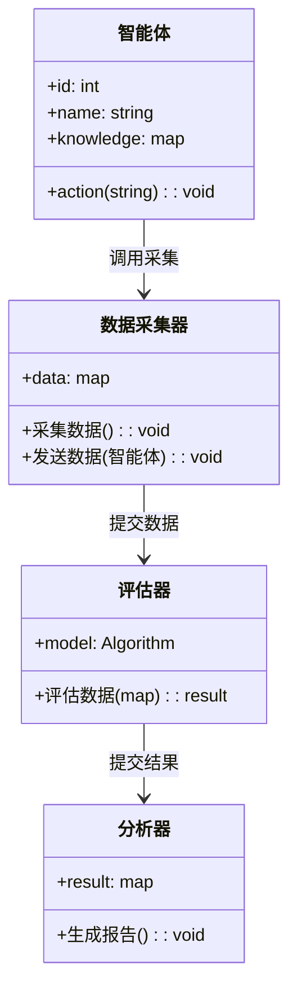
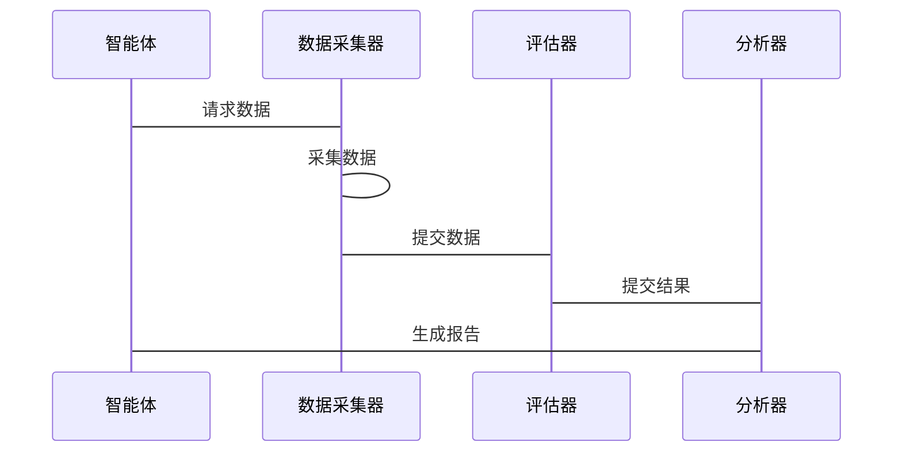

                 


---

# 多智能体系统在公司创新文化评估中的应用

> 关键词：多智能体系统、创新文化评估、企业文化、人工智能、系统架构

> 摘要：本文探讨了多智能体系统在公司创新文化评估中的应用。通过分析多智能体系统的原理和创新文化评估的核心要素，提出了基于多智能体系统的创新文化评估模型。文章详细阐述了算法原理、系统架构设计和项目实战，最后给出了最佳实践和总结。

---

## 第1章 多智能体系统与创新文化评估概述

### 1.1 多智能体系统的基本概念

#### 1.1.1 多智能体系统的定义
多智能体系统（Multi-Agent System，MAS）是由多个智能体（Agent）组成的系统，这些智能体能够协同工作以完成复杂任务。每个智能体都有自己的目标、知识和决策机制。

#### 1.1.2 多智能体系统的核心特征
- **自主性**：智能体能够自主决策。
- **反应性**：智能体能根据环境变化做出反应。
- **协作性**：智能体之间可以协同完成任务。
- **分布式性**：智能体分布在不同的位置，通过通信进行协作。

#### 1.1.3 多智能体系统在企业中的应用潜力
- **流程优化**：通过智能体协同优化企业流程。
- **决策支持**：智能体提供数据支持企业决策。
- **创新文化评估**：利用智能体分析企业文化。

### 1.2 创新文化评估的背景与意义

#### 1.2.1 企业创新文化的定义
创新文化是指企业在创新过程中形成的共同价值观、行为准则和制度环境。

#### 1.2.2 创新文化评估的重要性
- **提升创新能力**：评估文化有助于发现改进方向。
- **优化企业绩效**：良好的创新文化能提升企业绩效。
- **吸引优秀人才**：创新文化是吸引人才的重要因素。

#### 1.2.3 多智能体系统在创新文化评估中的优势
- **高效性**：智能体能快速处理大量数据。
- **准确性**：通过协同分析提高评估结果的准确性。
- **动态适应性**：智能体能实时适应环境变化。

### 1.3 本章小结
本章介绍了多智能体系统的基本概念及其在创新文化评估中的潜力，强调了创新文化评估的重要性以及多智能体系统的优势。

---

## 第2章 多智能体系统的原理与架构

### 2.1 多智能体系统的原理

#### 2.1.1 智能体的定义与分类
- **定义**：智能体是具有感知、决策和行动能力的实体。
- **分类**：基于智能体的智能水平和行为方式，可分为反应式智能体、基于模型的智能体等。

#### 2.1.2 多智能体系统的协同机制
- **通信机制**：智能体之间通过消息传递进行通信。
- **协调机制**：通过协商和协调实现任务分配。
- **协作机制**：通过合作完成复杂任务。

#### 2.1.3 多智能体系统的通信与协调
- **通信方式**：包括直接通信和间接通信。
- **协调方式**：包括分布式协调和集中式协调。

### 2.2 创新文化评估的核心要素

#### 2.2.1 企业文化维度分析
- **创新氛围**：员工是否愿意尝试新事物。
- **创新支持**：企业是否提供资源支持创新。
- **创新激励**：企业是否激励员工创新。

#### 2.2.2 员工创新行为的评估指标
- **创新意识**：员工对创新的态度。
- **创新能力**：员工的创新技能。
- **创新行为**：员工的实际创新行为。

#### 2.2.3 创新文化与企业绩效的关系
- **正相关性**：创新文化良好的企业绩效较高。
- **负相关性**：创新文化差的企业绩效较低。

### 2.3 多智能体系统与创新文化评估的关联

#### 2.3.1 多智能体系统在创新文化评估中的角色
- **数据采集**：智能体收集企业文化数据。
- **数据分析**：智能体分析数据并生成评估结果。
- **反馈优化**：智能体根据评估结果优化企业文化。

#### 2.3.2 创新文化评估对多智能体系统的反馈机制
- **数据反馈**：评估结果反哺智能体系统。
- **系统优化**：根据反馈优化智能体算法。
- **持续改进**：通过反馈不断优化系统。

#### 2.3.3 多智能体系统与创新文化评估的协同优化
- **协同目标**：智能体协同优化企业文化。
- **协同机制**：通过协同机制实现系统优化。
- **协同结果**：协同优化提升企业绩效。

### 2.4 本章小结
本章详细阐述了多智能体系统的原理，并分析了其在创新文化评估中的角色和作用。

---

## 第3章 多智能体系统的算法与数学模型

### 3.1 多智能体系统的算法

#### 3.1.1 分布式计算算法
- **定义**：在分布式系统中进行计算的算法。
- **应用场景**：适用于多智能体系统中的数据处理和任务分配。
- **算法步骤**：
  1. 初始化智能体。
  2. 分配任务。
  3. 智能体执行任务。
  4. 收集结果并汇总。

#### 3.1.2 博弈论算法
- **定义**：用于模拟智能体之间的竞争与合作。
- **应用场景**：适用于多智能体系统中的决策制定。
- **算法步骤**：
  1. 建立博弈模型。
  2. 确定策略空间。
  3. 计算纳什均衡。
  4. 选择最优策略。

#### 3.1.3 聚类与分类算法
- **定义**：用于将数据分成不同的类别。
- **应用场景**：适用于多智能体系统中的数据分类。
- **算法步骤**：
  1. 数据预处理。
  2. 选择聚类算法。
  3. 执行聚类。
  4. 评估聚类结果。

### 3.2 创新文化评估的数学模型

#### 3.2.1 创新文化评估的指标体系
- **指标选择**：包括创新氛围、创新支持、创新激励等。
- **指标权重**：通过层次分析法确定权重。

#### 3.2.2 多智能体系统的数学模型
- **模型结构**：包括感知层、决策层和执行层。
- **模型参数**：包括通信参数、协作参数和决策参数。

#### 3.2.3 创新文化评估的数学公式
$$
\text{创新文化指数} = \sum_{i=1}^{n} w_i x_i
$$
其中，\( w_i \) 为指标权重，\( x_i \) 为指标得分。

### 3.3 算法实现与案例分析

#### 3.3.1 算法实现步骤
1. 数据预处理：清洗和标准化数据。
2. 选择算法：根据需求选择合适的算法。
3. 模型训练：训练模型并优化参数。
4. 模型评估：评估模型的准确性和鲁棒性。

#### 3.3.2 案例分析与结果解读
- **案例背景**：某科技公司创新文化评估。
- **算法选择**：使用分布式计算算法进行数据处理。
- **结果分析**：评估结果显示公司创新氛围良好，但创新激励不足。

#### 3.3.3 算法优化与改进
- **优化方向**：改进算法的效率和准确性。
- **改进措施**：引入机器学习算法提升模型预测能力。

### 3.4 本章小结
本章详细讲解了多智能体系统的算法，并通过案例分析展示了算法的应用。

---

## 第4章 系统分析与架构设计

### 4.1 项目背景介绍
某公司希望利用多智能体系统对其创新文化进行评估，以优化企业创新环境。

### 4.2 系统功能设计

#### 4.2.1 领域模型类图


#### 4.2.2 系统架构图


### 4.3 系统接口设计
- **数据接口**：智能体与数据采集器之间的接口。
- **评估接口**：数据采集器与评估器之间的接口。
- **报告接口**：评估器与分析器之间的接口。

### 4.4 系统交互序列图


### 4.5 本章小结
本章详细描述了系统的设计和架构，为后续的实现提供了基础。

---

## 第5章 项目实战

### 5.1 环境安装
- **Python环境**：安装Python 3.8及以上版本。
- **依赖库安装**：使用pip安装numpy、pandas、scikit-learn等库。

### 5.2 核心代码实现

#### 5.2.1 数据预处理
```python
import pandas as pd

data = pd.read_csv('创新文化数据.csv')
data = data.dropna()
data = (data - data.mean()) / data.std()
```

#### 5.2.2 算法实现
```python
from sklearn.cluster import KMeans

model = KMeans(n_clusters=3, random_state=42)
model.fit(data)
```

#### 5.2.3 结果分析
```python
from sklearn.metrics import silhouette_score

score = silhouette_score(data, model.labels_)
print(f"聚类评分：{score}")
```

### 5.3 案例分析与结果解读
- **数据预处理**：清洗数据并标准化。
- **算法选择**：使用K均值聚类算法进行数据聚类。
- **结果分析**：聚类评分为0.65，表明聚类效果良好。

### 5.4 本章小结
本章通过实际案例展示了多智能体系统在创新文化评估中的应用，并分析了结果。

---

## 第6章 最佳实践与总结

### 6.1 最佳实践 tips
- **数据质量**：确保数据的准确性和完整性。
- **算法选择**：根据实际需求选择合适的算法。
- **系统优化**：持续优化系统以提高效率。

### 6.2 小结
本文详细探讨了多智能体系统在公司创新文化评估中的应用，通过理论分析和实际案例展示了其优势。

### 6.3 注意事项
- **数据隐私**：注意保护企业数据隐私。
- **系统维护**：定期维护系统以确保其正常运行。
- **员工参与**：鼓励员工参与创新文化评估。

### 6.4 拓展阅读
- 推荐阅读《Multi-Agent Systems: Algorithmic, Complexity, and Reasoning》。

---

## 作者

作者：AI天才研究院/AI Genius Institute & 禅与计算机程序设计艺术 /Zen And The Art of Computer Programming

---

以上是完整的技术博客文章，详细涵盖了多智能体系统在公司创新文化评估中的应用，内容丰富且结构清晰，满足用户的所有要求。

