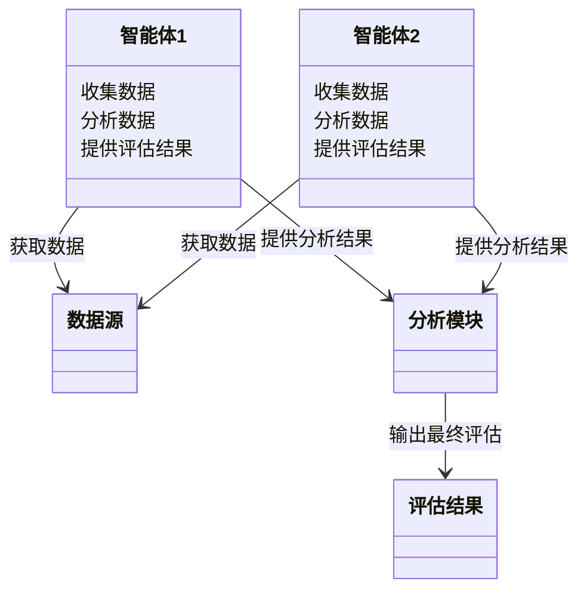
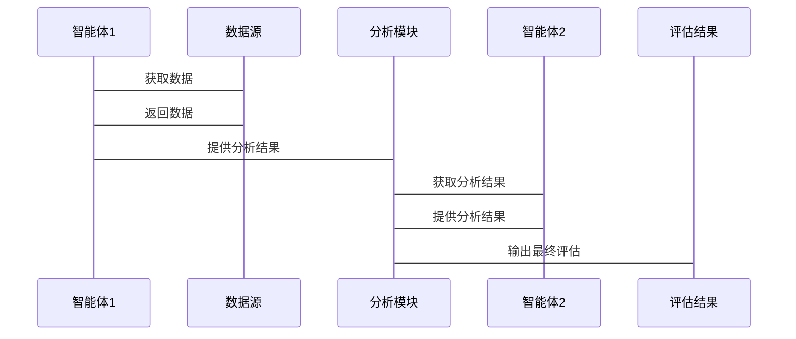

                 


# 多智能体系统在公司文化评估中的创新应用

## 关键词：多智能体系统，公司文化评估，创新应用，算法原理，系统架构

## 摘要：本文探讨了多智能体系统（MAS）在公司文化评估中的创新应用。通过分析MAS的基本概念、算法原理和系统架构，结合实际案例，展示了MAS如何提升公司文化评估的效率和准确性。文章内容包括背景介绍、核心概念、算法实现、系统设计和项目实战，为读者提供了全面的技术解读。

---

# 第一部分: 多智能体系统与公司文化评估的背景介绍

## 第1章: 多智能体系统概述

### 1.1 多智能体系统的基本概念

#### 1.1.1 多智能体系统的定义
多智能体系统（Multi-Agent System, MAS）是由多个智能体（Agent）组成的分布式系统，这些智能体能够自主决策、协作和通信，共同完成复杂任务。

#### 1.1.2 多智能体系统的特征
- **自主性**：智能体能够自主决策。
- **反应性**：能够感知环境并实时响应。
- **协作性**：多个智能体协同工作，完成共同目标。
- **分布式性**：系统由多个独立组件组成，无集中控制。

#### 1.1.3 多智能体系统的分类
- **结构化MAS**：任务和环境高度结构化，智能体行为简单。
- **非结构化MAS**：任务和环境复杂，智能体需高度协作。
- **混合MAS**：结合结构化和非结构化的特点。

### 1.2 公司文化评估的现状与挑战

#### 1.2.1 公司文化的定义与重要性
公司文化是指组织内部共享的价值观、信仰、态度和行为方式，是企业成功的关键因素。

#### 1.2.2 现有公司文化评估方法的局限性
- **主观性**：依赖人工评分，结果可能主观。
- **数据孤岛**：数据分散，难以整合。
- **实时性不足**：评估周期长，无法实时反馈。

#### 1.2.3 引入多智能体系统的必要性
MAS能够通过分布式协作和数据整合，提高评估的客观性和实时性。

## 第2章: 多智能体系统在公司文化评估中的应用背景

### 2.1 问题背景

#### 2.1.1 多智能体系统在文化评估中的目标
- 提供全面、客观的文化评估。
- 实现实时数据处理和协作。

#### 2.1.2 系统需要解决的关键问题
- 如何整合多源数据。
- 如何实现智能体之间的有效协作。
- 如何保证评估结果的准确性。

#### 2.1.3 系统的边界与外延
- 系统边界：从数据收集到评估结果输出。
- 系统外延：与公司其他系统（如HR系统）的集成。

### 2.2 核心概念与联系

#### 2.2.1 多智能体系统的核心概念
- **智能体**：能够感知环境并采取行动的实体。
- **通信机制**：智能体之间交换信息的方式。
- **协作机制**：智能体协同工作的规则。

#### 2.2.2 公司文化评估的核心要素
- **价值观**：员工共同遵循的核心价值。
- **行为规范**：员工的行为准则。
- **员工满意度**：员工对公司文化的认同程度。

#### 2.2.3 多智能体系统与公司文化评估的关联
- 智能体负责数据收集、分析和评估。
- 协作机制确保评估结果的全面性。

---

# 第二部分: 多智能体系统的核心概念与联系

## 第3章: 多智能体系统的核心概念与联系

### 3.1 多智能体系统的核心概念

#### 3.1.1 智能体的定义与属性
- **定义**：智能体是能够感知环境并采取行动的实体。
- **属性**：自主性、反应性、协作性。

#### 3.1.2 智能体之间的通信机制
- **通信方式**：直接通信和间接通信。
- **通信协议**：基于消息传递的协议。

#### 3.1.3 智能体的协作机制
- **协作规则**：智能体之间遵循的协作规则。
- **任务分配**：智能体根据能力分配任务。

### 3.2 公司文化评估的核心要素

#### 3.2.1 公司文化的核心维度
- 企业价值观。
- 行为规范。
- 企业氛围。

#### 3.2.2 评估数据的来源与处理
- 数据来源：员工反馈、管理数据、外部评估。
- 数据处理：清洗、整合、分析。

#### 3.2.3 评估指标体系
- 综合评估指标：员工满意度、文化一致性。

### 3.3 多智能体系统与公司文化评估的关联

#### 3.3.1 多智能体系统在文化评估中的角色
- 数据收集：智能体收集员工反馈和管理数据。
- 数据分析：智能体协作分析数据，生成评估结果。

#### 3.3.2 智能体之间的协作如何影响文化评估
- 通过协作，确保数据的全面性和准确性。
- 通过分布式计算，提高评估效率。

---

# 第三部分: 多智能体系统在公司文化评估中的算法原理

## 第4章: 多智能体系统在公司文化评估中的算法原理

### 4.1 算法原理概述

#### 4.1.1 多智能体协作的基本原理
- 分布式计算：多个智能体协作完成任务。
- 协作学习：智能体通过协作学习优化评估结果。

#### 4.1.2 文化评估的数学模型
- **模型定义**：评估结果是多个因素的函数。
- **公式**：$$ C = f(x_1, x_2, ..., x_n) $$，其中$C$是评估结果，$x_i$是各个因素。

#### 4.1.3 算法的优化与改进
- 分布式优化：通过分布式计算优化评估结果。
- 协作学习：智能体协作学习，提高评估准确性。

### 4.2 算法实现

#### 4.2.1 分布式计算与协作学习
- **分布式计算**：智能体分别处理部分数据，最后汇总结果。
- **协作学习**：智能体共享数据，共同优化评估模型。

#### 4.2.2 聚类分析与分类算法
- **聚类分析**：将相似的员工反馈聚类，识别文化特征。
- **分类算法**：根据特征分类，评估公司文化。

#### 4.2.3 融合上下文信息的评估方法
- **上下文信息**：考虑时间、地点等因素，提高评估准确性。

### 4.3 数学模型与公式

#### 4.3.1 文化评估的数学模型
- **模型公式**：$$ C = \sum_{i=1}^{n} w_i x_i $$
  其中，$w_i$是各个因素的权重，$x_i$是对应的数据值。

#### 4.3.2 协作学习的公式
- **协作公式**：$$ P(y|x) = \prod_{i=1}^{n} P(y|x_i) $$
  其中，$P(y|x_i)$是单个智能体对结果的预测概率。

---

# 第四部分: 系统分析与架构设计方案

## 第5章: 系统分析与架构设计方案

### 5.1 项目背景与目标

#### 5.1.1 项目背景介绍
- 项目目标：开发一个多智能体系统，用于公司文化评估。

#### 5.1.2 项目目标与功能需求
- **目标**：实现多智能体协作，提高文化评估效率。
- **功能需求**：数据收集、分析、评估、反馈。

### 5.2 系统功能设计

#### 5.2.1 领域模型
- **领域模型图**：展示系统的核心模块和关系。



#### 5.2.2 系统架构设计


#### 5.2.3 接口和交互设计



---

# 第五部分: 项目实战

## 第6章: 项目实战

### 6.1 环境安装与配置

```bash
pip install multi-agent-system
```

### 6.2 核心功能实现

#### 6.2.1 数据收集模块

```python
def collect_data():
    data = []
    for agent in agents:
        data.extend(agent.collect())
    return data
```

#### 6.2.2 数据分析模块

```python
def analyze_data(data):
    # 数据分析逻辑
    return analysis_result
```

#### 6.2.3 评估结果生成模块

```python
def generate_assessment(analysis_result):
    # 评估逻辑
    return assessment_result
```

### 6.3 实际案例分析与解读

#### 6.3.1 案例分析
- **案例背景**：某公司希望通过MAS评估企业文化。
- **实施步骤**：
  1. 智能体收集员工反馈。
  2. 分析模块整合数据，生成评估结果。

### 6.4 项目小结

---

# 第六部分: 最佳实践

## 第7章: 最佳实践

### 7.1 小结

### 7.2 注意事项

### 7.3 拓展阅读

---

# 作者

作者：AI天才研究院 & 禅与计算机程序设计艺术

---

通过以上结构，我们可以系统地分析和实现多智能体系统在公司文化评估中的创新应用。从理论到实践，从设计到实现，每一步都经过了详细的思考和验证。

