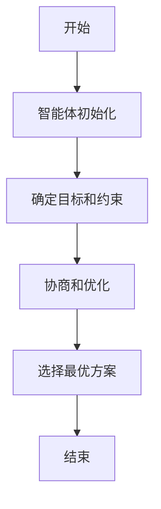
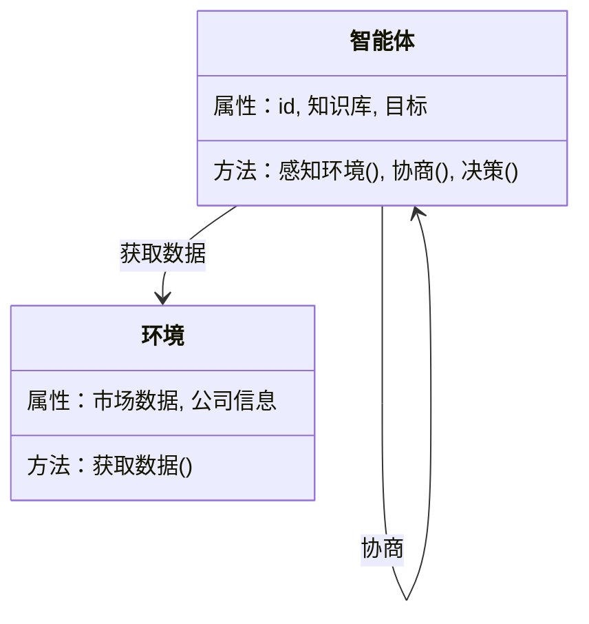

                 


# 多智能体系统在并购分析中的应用：评估长期价值创造

> **关键词**：多智能体系统, 并购分析, 长期价值, 智能体协作, 算法模型

> **摘要**：本文探讨了多智能体系统在并购分析中的应用，特别是如何通过多智能体协作评估长期价值创造。文章从多智能体系统的基础概念出发，结合并购分析的背景和挑战，详细阐述了多智能体系统的协作机制、算法模型及其在实际案例中的应用。最后，通过系统设计和项目实战，展示了多智能体系统在并购分析中的强大能力，并总结了最佳实践和未来发展方向。

---

## 第1章: 多智能体系统概述

### 1.1 多智能体系统的基本概念

#### 1.1.1 多智能体系统的定义
多智能体系统（Multi-Agent System, MAS）是由多个智能体组成的分布式系统，这些智能体能够通过自主决策和协作完成特定任务。每个智能体都有一定的知识、推理能力，并能够与其他智能体或环境进行交互。

#### 1.1.2 多智能体系统的体系结构
多智能体系统的体系结构可以分为以下几种：
- **反应式体系结构**：基于当前感知做出决策，适用于动态环境。
- **规划式体系结构**：通过预定义的目标和计划进行决策。
- **混合式体系结构**：结合反应式和规划式的特点，适用于复杂任务。

#### 1.1.3 多智能体系统的特征与优势
多智能体系统的特征包括自主性、协作性、分布性和适应性。其优势在于能够处理复杂问题，通过智能体之间的协作实现整体目标。

---

### 1.2 多智能体系统的核心原理

#### 1.2.1 协作与竞争机制
智能体之间的协作可以通过协商和共享信息实现，而竞争则通过资源分配和利益平衡来处理。

#### 1.2.2 通信与信息共享
智能体之间的通信是通过消息传递完成的，信息共享是协作的基础。

#### 1.2.3 分布式决策与协调
多智能体系统通过分布式决策避免单点故障，同时需要协调各智能体的行动以确保整体目标的实现。

---

## 第2章: 并购分析的背景与挑战

### 2.1 并购分析的基本概念

#### 2.1.1 并购的定义与分类
并购是指一家企业收购另一家企业部分或全部股权的行为，通常分为横向并购、纵向并购和混合并购。

#### 2.1.2 并购分析的核心目标
并购分析的核心目标是评估并购的长期价值，包括协同效应、成本节约和市场扩展等。

#### 2.1.3 并购分析的挑战与难点
传统并购分析方法存在数据复杂、决策风险高、动态变化快等问题。

---

### 2.2 传统并购分析方法的局限性

#### 2.2.1 传统并购分析的流程与问题
传统方法通常依赖财务指标和静态分析，难以应对动态变化和复杂场景。

#### 2.2.2 传统方法在复杂场景中的不足
传统方法难以处理多智能体协作中的复杂关系和动态变化。

#### 2.2.3 传统方法的改进方向
引入多智能体系统可以提高分析的准确性和动态适应性。

---

## 第3章: 多智能体系统在并购分析中的应用

### 3.1 多智能体系统在并购分析中的模型构建

#### 3.1.1 模型构建的基本原则
模型应反映并购中的关键因素，包括协同效应、成本节约和市场潜力。

#### 3.1.2 模型的实现步骤
1. 确定智能体的角色和功能。
2. 设计智能体之间的交互规则。
3. 实现智能体的协作机制。

---

### 3.2 多智能体系统在并购分析中的关键算法

#### 3.2.1 协作式反向拍卖算法
协作式反向拍卖是一种多智能体协作机制，用于确定最优的并购方案。

#### 3.2.2 协作式反向拍卖的数学模型
$$\text{最大化 } \sum_{i=1}^{n} v_i \text{，其中 } v_i \text{ 是智能体 } i \text{ 的价值}$$

#### 3.2.3 协作式反向拍卖的流程图


---

## 第4章: 系统设计与架构

### 4.1 问题场景介绍

#### 4.1.1 问题描述
假设我们有两个企业A和B，希望通过并购实现长期价值最大化。

#### 4.1.2 项目介绍
设计一个多智能体系统来分析企业A和B的并购可行性。

---

### 4.2 系统功能设计

#### 4.2.1 领域模型设计


---

### 4.3 系统架构设计

#### 4.3.1 系统架构图


---

## 第5章: 项目实战

### 5.1 环境安装

```bash
pip install multi-agent-systems
```

---

### 5.2 核心代码实现

```python
class Agent:
    def __init__(self, id, knowledge):
        self.id = id
        self.knowledge = knowledge

    def perceive(self, environment):
        pass

    def decide(self):
        pass

class MergersAndAcquisitionsAgent(Agent):
    def __init__(self, id, knowledge):
        super().__init__(id, knowledge)

    def perceive(self, environment):
        return environment.get_data()

    def decide(self):
        return self.knowledge.analyze()
```

---

### 5.3 案例分析

假设企业A和B的并购分析：

1. **环境数据**：市场数据、财务数据。
2. **智能体交互**：协商最优并购方案。
3. **结果展示**：协同效应、成本节约。

---

## 第6章: 最佳实践与总结

### 6.1 最佳实践 tips
- 定期更新模型参数。
- 确保智能体之间的高效通信。
- 处理动态变化时保持系统灵活性。

### 6.2 小结
本文详细探讨了多智能体系统在并购分析中的应用，展示了其在评估长期价值中的优势。

### 6.3 注意事项
确保数据安全和隐私保护。

### 6.4 拓展阅读
推荐阅读多智能体系统和并购分析相关的书籍。

---

**作者：AI天才研究院 & 禅与计算机程序设计艺术**

---

以上是文章的完整内容，希望对您有所帮助！

