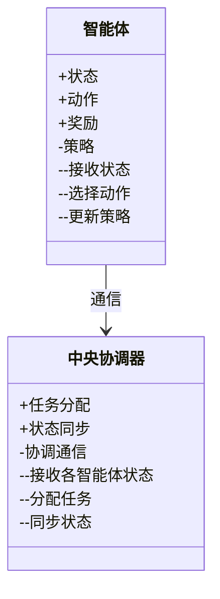

                 


# 多智能体系统在行业分析中的应用：深化价值投资研究

> 关键词：多智能体系统，价值投资，行业分析，分布式协作，人工智能

> 摘要：本文探讨多智能体系统在行业分析中的应用，特别是如何通过多智能体系统深化价值投资研究。文章从背景、核心概念、算法、系统架构、项目实战等方面详细分析，结合实际案例，展示了多智能体系统在提升行业分析和价值投资中的潜力和应用价值。

---

## 第一部分: 多智能体系统与价值投资的背景与基础

### 第1章: 多智能体系统的基本概念

#### 1.1 多智能体系统的核心概念
##### 1.1.1 多智能体系统的定义
多智能体系统（Multi-Agent System, MAS）是由多个智能体组成的分布式系统，这些智能体能够通过协作完成复杂的任务。每个智能体都有一定的自主性，能够感知环境、做出决策并与其他智能体进行通信和协作。

##### 1.1.2 多智能体系统的特点
- **自主性**：每个智能体能够独立决策。
- **反应性**：智能体能够实时感知环境并做出反应。
- **协作性**：多个智能体通过通信和协作完成共同目标。
- **分布式性**：智能体分布在不同的位置，任务分布执行。

##### 1.1.3 多智能体系统与传统单智能体系统的区别
| 特性         | 多智能体系统                     | 单智能体系统                     |
|--------------|----------------------------------|----------------------------------|
| 结构         | 分布式，多个智能体协作           | 集中式，单一智能体执行           |
| 任务处理     | 任务分解，多个智能体协同完成     | 单一智能体完成整个任务           |
| 通信         | 智能体之间需要通信和协作         | 无需与其他实体通信               |
| 灵活性       | 高，能够适应环境变化             | 较低，依赖单一决策机制           |

#### 1.2 价值投资的基本原理
##### 1.2.1 价值投资的定义
价值投资是一种投资策略，旨在通过分析企业的基本面，如财务状况、行业地位、盈利能力等，找到被市场低估的股票进行投资。

##### 1.2.2 价值投资的核心理念
- **内在价值**：股票的真正价值在于企业的盈利能力。
- **市场先生**：市场情绪波动会影响股票价格，但长期来看，价格会回归价值。
- **安全边际**：买入价格低于内在价值，以降低风险。

##### 1.2.3 多智能体系统与价值投资的结合
多智能体系统可以通过分布式计算和协作，帮助投资者更高效地分析行业数据、评估企业价值，从而优化投资决策。

---

### 第2章: 多智能体系统的协作机制

#### 2.1 多智能体系统的协作模型
##### 2.1.1 分布式协作模型
在分布式协作模型中，每个智能体独立运行，通过通信协议进行信息交换，共同完成任务。例如，在股票交易中，每个智能体可以专注于不同的市场数据和分析。

##### 2.1.2 集中式协作模型
集中式协作模型中，有一个中央协调器负责分配任务和协调智能体的协作。例如，在行业分析中，中央协调器可以收集各智能体的分析结果并生成综合报告。

##### 2.1.3 混合式协作模型
混合式协作模型结合了分布式和集中式的特点，适用于复杂任务。例如，在价值投资中，多个智能体分别负责财务分析、市场趋势预测和风险评估，中央协调器整合这些信息生成投资建议。

#### 2.2 多智能体系统的通信协议
##### 2.2.1 通信协议的定义
通信协议是智能体之间进行信息交换的规则，包括消息格式、传输方式和处理逻辑。

##### 2.2.2 常见的通信协议类型
- **HTTP/REST**：适用于基于API的通信。
- **WebSocket**：适用于实时通信。
- **gRPC**：适用于高效的RPC通信。

#### 2.3 多智能体系统的协调与同步
##### 2.3.1 分布式协调问题
在分布式系统中，智能体之间需要解决协调问题，如任务分配、冲突解决等。

##### 2.3.2 同步机制
通过同步机制确保所有智能体的状态一致，例如使用一致性算法（如Paxos或Raft）。

---

## 第二部分: 多智能体系统在价值投资中的算法与模型

### 第3章: 基于多智能体系统的行业分析算法

#### 3.1 Q-Learning算法
##### 3.1.1 Q-Learning的基本原理
Q-Learning是一种强化学习算法，通过智能体与环境的交互，学习最优策略。公式为：
$$ Q(s, a) = Q(s, a) + \alpha (r + \gamma \max Q(s', a')) - Q(s, a) $$

##### 3.1.2 Q-Learning在价值投资中的应用
智能体通过分析市场数据，学习最佳的买卖时机。

##### 3.1.3 Q-Learning的实现代码
```python
import numpy as np

class QLearning:
    def __init__(self, state_space, action_space, alpha=0.1, gamma=0.9):
        self.state_space = state_space
        self.action_space = action_space
        self.Q = np.zeros((state_space, action_space))
        self.alpha = alpha
        self.gamma = gamma

    def choose_action(self, state, epsilon=0.1):
        if np.random.random() < epsilon:
            return np.random.randint(self.action_space)
        return np.argmax(self.Q[state, :])

    def update(self, state, action, reward, next_state):
        self.Q[state, action] += self.alpha * (reward + self.gamma * np.max(self.Q[next_state, :]) - self.Q[state, action])
```

#### 3.2 联合学习（Collaborative Learning）
##### 3.2.1 联合学习的基本原理
联合学习是一种多智能体协作学习方法，通过智能体之间的信息共享，提升整体性能。

##### 3.2.2 联合学习的数学模型
$$ J = \sum_{i=1}^{n} J_i $$

其中，$J_i$ 是第i个智能体的目标函数。

##### 3.2.3 联合学习在价值投资中的应用
多个智能体分别分析不同的行业数据，最终生成综合投资建议。

---

## 第三部分: 多智能体系统的系统架构与设计

### 第4章: 系统架构设计

#### 4.1 系统功能设计
##### 4.1.1 领域模型


#### 4.2 系统架构设计
##### 4.2.1 分层架构


#### 4.3 系统接口设计
##### 4.3.1 RESTful API
- GET /agents 获取所有智能体信息
- POST /actions 执行动作
- PUT /states 更新状态

---

## 第四部分: 项目实战与案例分析

### 第5章: 项目实战

#### 5.1 环境安装
```bash
pip install numpy pandas scikit-learn flask
```

#### 5.2 核心代码实现
```python
from flask import Flask, jsonify
from agents import QLearningAgent

app = Flask(__name__)
agent = QLearningAgent(state_space=10, action_space=3)

@app.route('/analyze', methods=['POST'])
def analyze():
    data = request.json
    state = data['state']
    action = agent.choose_action(state)
    return jsonify({'action': action})

if __name__ == '__main__':
    app.run(debug=True)
```

#### 5.3 案例分析
以股票市场为例，分析多智能体系统如何协同完成行业分析和价值评估。

---

## 第五部分: 总结与展望

### 第6章: 总结

#### 6.1 核心内容回顾
多智能体系统通过分布式协作和强化学习，提升了行业分析和价值投资的效率和准确性。

#### 6.2 最佳实践 tips
- 合理设计通信协议和协作机制
- 定期更新模型和策略
- 注意数据隐私和安全

### 第7章: 展望

#### 7.1 未来发展方向
- 更复杂多智能体协作模型
- 结合区块链技术实现去中心化
- 更广泛的应用场景探索

---

## 作者信息

作者：AI天才研究院/AI Genius Institute & 禅与计算机程序设计艺术 /Zen And The Art of Computer Programming

---

本文通过详细分析多智能体系统的背景、核心概念、算法、系统架构和项目实战，展示了多智能体系统在行业分析和价值投资中的巨大潜力。希望本文能够为相关领域的研究者和从业者提供有价值的参考和启发。

