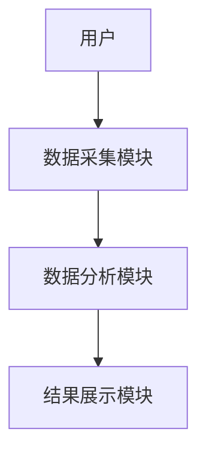
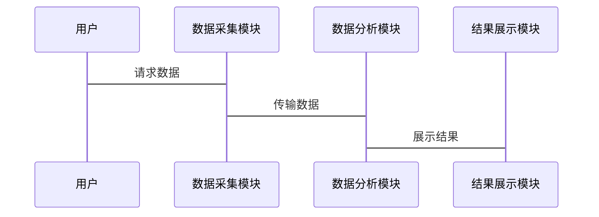

                 


# 多智能体系统在识别价值陷阱中的应用：防范投资风险

> 关键词：多智能体系统，价值陷阱，投资风险，算法原理，系统架构，项目实战

> 摘要：本文将探讨多智能体系统在识别价值陷阱中的应用，通过分析多智能体系统的算法原理、系统架构和项目实战，深入解读其在防范投资风险中的作用。文章内容涵盖多智能体系统的基础知识、价值陷阱的识别方法、算法实现、系统设计和实际案例分析，为读者提供全面的技术指导。

---

## 第1章: 多智能体系统概述

### 1.1 多智能体系统的基本概念

#### 1.1.1 多智能体系统的定义
多智能体系统（Multi-Agent Systems, MABS）是由多个智能体（Agent）组成的分布式系统，这些智能体能够自主决策、协作和通信，共同完成复杂任务。

#### 1.1.2 多智能体系统的特征
- **自主性**：智能体能够自主决策。
- **反应性**：能够实时感知环境并做出反应。
- **协作性**：智能体之间可以协作完成任务。
- **分布性**：系统由多个分散的智能体组成。

#### 1.1.3 多智能体系统的分类
- **基于任务的多智能体系统**：根据任务需求动态分配智能体。
- **基于角色的多智能体系统**：智能体根据角色分配任务。
- **混合式多智能体系统**：结合任务和角色的混合式系统。

### 1.2 多智能体系统的应用领域

#### 1.2.1 分布式计算与多智能体系统
分布式计算通过多智能体系统的协作，实现资源的高效利用。

#### 1.2.2 边缘计算与多智能体系统
边缘计算利用多智能体系统在边缘设备上的分布式计算能力，提升数据处理效率。

#### 1.2.3 价值识别与多智能体系统
多智能体系统通过协作分析，识别投资中的价值陷阱。

---

## 第2章: 价值陷阱的识别与防范

### 2.1 价值陷阱的定义与类型

#### 2.1.1 价值陷阱的概念
价值陷阱是指公司财务数据虚假或管理层欺诈，误导投资者的决策。

#### 2.1.2 价值陷阱的常见类型
- **财务造假**：虚构收入、隐瞒成本。
- **管理层欺诈**：通过关联交易转移资产。
- **行业风险**：行业政策变化导致的虚假利润。

#### 2.1.3 价值陷阱的识别特征
- **财务数据异常**：收入与成本不匹配。
- **管理层变更频繁**：管理层频繁变动可能隐藏问题。
- **行业政策变化**：行业政策变化可能导致公司财务数据虚假。

### 2.2 多智能体系统在价值识别中的作用

#### 2.2.1 多智能体系统的优势
- **分布式计算能力**：多个智能体协同工作，提升数据处理效率。
- **实时分析能力**：智能体能够实时感知市场变化，快速识别风险。

#### 2.2.2 多智能体系统在价值识别中的应用场景
- **数据挖掘与分析**：利用多智能体系统对财务数据进行深度挖掘，识别异常值。
- **自然语言处理**：通过自然语言处理技术分析公司公告，识别潜在风险。
- **知识图谱构建**：构建公司、行业和市场的知识图谱，辅助识别价值陷阱。

#### 2.2.3 多智能体系统与传统价值识别方法的对比
- **传统方法**：依赖人工分析，效率低，易出错。
- **多智能体系统**：自动化分析，高效准确，降低人为干扰。

---

## 第3章: 多智能体系统的算法原理

### 3.1 多智能体系统的任务分配算法

#### 3.1.1 分层任务分配算法
分层任务分配算法通过层次化结构，将任务分解为子任务，逐层分配给智能体。

#### 3.1.2 基于博弈论的任务分配算法
基于博弈论的算法通过智能体之间的博弈，实现任务的最优分配。

#### 3.1.3 分布式任务分配算法
分布式任务分配算法通过智能体之间的通信和协商，实现任务的动态分配。

### 3.2 多智能体系统的协作机制

#### 3.2.1 基于通信协议的协作机制
通过通信协议，智能体之间实现数据交换和协作。

#### 3.2.2 基于状态机的协作机制
状态机协作机制通过定义智能体的状态和转移规则，实现协作流程的自动化。

#### 3.2.3 基于规则的协作机制
基于规则的协作机制通过预定义的规则，指导智能体之间的协作行为。

### 3.3 多智能体系统的算法实现

#### 3.3.1 算法实现的步骤
1. **任务分解**：将整体任务分解为子任务。
2. **任务分配**：根据智能体的能力和负载，分配子任务。
3. **协作执行**：智能体协作完成分配的任务。
4. **结果汇总**：汇总各智能体的结果，形成最终的分析报告。

#### 3.3.2 算法实现的关键技术
- **任务分配算法**：如分层分配、博弈论分配等。
- **协作机制**：如通信协议、状态机、规则协作等。
- **数据通信**：智能体之间的数据交换和通信。

#### 3.3.3 算法实现的优化方法
- **负载均衡**：确保智能体之间的负载均衡，提升效率。
- **动态调整**：根据环境变化，动态调整任务分配和协作机制。

---

## 第4章: 价值陷阱识别的数学模型与公式

### 4.1 价值陷阱识别的数学模型

#### 4.1.1 基于统计学的数学模型
通过统计分析，识别财务数据中的异常值。

#### 4.1.2 基于机器学习的数学模型
利用机器学习算法，如支持向量机（SVM）和随机森林（Random Forest），进行分类和预测。

#### 4.1.3 基于深度学习的数学模型
使用深度学习模型，如循环神经网络（RNN）和卷积神经网络（CNN），进行特征提取和分类。

### 4.2 价值陷阱识别的关键公式

#### 4.2.1 统计模型公式
$$ P(X|Y) = \frac{P(Y|X)P(X)}{P(Y)} $$

#### 4.2.2 机器学习模型公式
$$ y = \sum_{i=1}^{n} w_i x_i + b $$

#### 4.2.3 深度学习模型公式
$$ z = \sigma(wx + b) $$

---

## 第5章: 系统架构与项目实战

### 5.1 系统架构设计

#### 5.1.1 系统功能设计
- **数据采集模块**：采集公司财务数据和公告信息。
- **数据分析模块**：利用多智能体系统分析数据，识别价值陷阱。
- **结果展示模块**：将分析结果以可视化方式展示。

#### 5.1.2 系统架构设计



#### 5.1.3 系统接口设计
- **数据接口**：与数据源进行数据交换。
- **用户接口**：用户与系统进行交互的界面。

#### 5.1.4 系统交互设计



### 5.2 项目实战

#### 5.2.1 环境搭建
- **安装Python**：Python 3.8以上版本。
- **安装依赖库**：如numpy、pandas、scikit-learn等。

#### 5.2.2 系统核心实现源代码

```python
import numpy as np
import pandas as pd
from sklearn import svm

# 数据采集模块
def collect_data():
    data = pd.read_csv('financial_data.csv')
    return data

# 数据分析模块
def analyze_data(data):
    # 使用SVM进行分类
    model = svm.SVC()
    model.fit(data.drop('label', axis=1), data['label'])
    return model

# 结果展示模块
def display_results(model, new_data):
    prediction = model.predict(new_data.drop('label', axis=1))
    print(f"预测结果: {prediction}")

# 主函数
def main():
    data = collect_data()
    model = analyze_data(data)
    new_data = pd.read_csv('new_financial_data.csv')
    display_results(model, new_data)

if __name__ == "__main__":
    main()
```

#### 5.2.3 实际案例分析
以某公司财务数据为例，展示如何利用多智能体系统识别价值陷阱。

---

## 第6章: 总结与展望

### 6.1 总结
多智能体系统通过协作和分布式计算，能够高效识别价值陷阱，帮助投资者防范投资风险。

### 6.2 展望
未来，多智能体系统将结合更多先进技术，如区块链和边缘计算，进一步提升价值识别的准确性和效率。

---

## 作者：AI天才研究院/AI Genius Institute & 禅与计算机程序设计艺术 /Zen And The Art of Computer Programming

