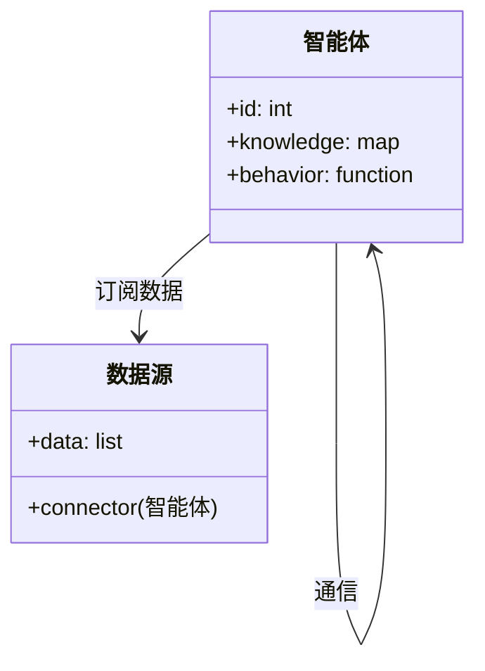
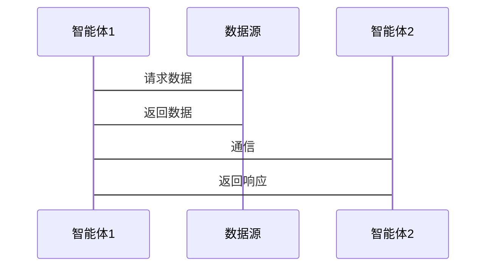

                 


---

# 多智能体系统增强价值投资的市场异常因子衰减分析

> 关键词：多智能体系统，价值投资，市场异常因子，衰减分析，异常检测

> 摘要：本文探讨了多智能体系统在价值投资中的应用，特别是其对市场异常因子的识别和衰减分析。通过结合多智能体系统的协作机制和异常检测算法，本文提出了一个创新的框架，以优化价值投资中的市场异常因子分析。

---

# 第一部分: 多智能体系统与价值投资概述

## 第1章: 多智能体系统基础

### 1.1 多智能体系统的定义与特点

#### 1.1.1 多智能体系统的定义
多智能体系统（Multi-Agent System, MAS）是由多个智能体组成的分布式系统，这些智能体通过协作完成复杂的任务。每个智能体都有自己的目标、知识和行为规则，能够独立决策并与其他智能体交互。

#### 1.1.2 多智能体系统的核心特点
- **分布式计算**：智能体独立运行，通过通信和协调完成任务。
- **协作性**：智能体之间通过协作提高整体系统的性能。
- **适应性**：智能体能够根据环境变化调整行为。

#### 1.1.3 多智能体系统的应用场景
- 金融投资
- 自动驾驶
- 智能物流

### 1.2 价值投资的基本概念

#### 1.2.1 价值投资的定义
价值投资是一种投资策略，旨在通过分析企业的基本面，寻找市场价格低于其内在价值的股票进行投资。

#### 1.2.2 价值投资的核心原则
- 买入低于内在价值的股票
- 长期持有的投资策略
- 独立思考，避免情绪化决策

#### 1.2.3 价值投资与市场异常因子的关系
市场异常因子（如市场情绪、突发事件）会影响股票价格，价值投资者需要识别这些因子并调整投资策略。

---

## 第2章: 市场异常因子概述

### 2.1 市场异常因子的定义

#### 2.1.1 什么是市场异常因子
市场异常因子是指影响股票价格波动，但无法通过基本面分析解释的因素，如市场情绪、突发事件等。

#### 2.1.2 市场异常因子的分类
- **情绪因子**：投资者情绪波动
- **事件因子**：公司公告、行业政策变化
- **技术因子**：市场交易量、价格走势

#### 2.1.3 市场异常因子的特征
- 不可预测性
- 影响短期价格波动
- 需要快速响应

### 2.2 价值投资中的市场异常因子分析

#### 2.2.1 价值投资与市场异常因子的关系
市场异常因子会影响价值投资的决策，但价值投资者需要识别这些因子，避免被短期波动影响。

#### 2.2.2 常见的市场异常因子类型
- **市场恐慌**：如金融危机期间的抛售潮
- **公司并购**：影响股价的突然变化
- **政策变化**：如税收政策调整

#### 2.2.3 市场异常因子对投资决策的影响
- 短期内影响股价，价值投资者需要长期视角
- 异常因子可能导致市场短期偏离基本面

---

# 第二部分: 多智能体系统与市场异常因子的结合

## 第3章: 多智能体系统在价值投资中的应用

### 3.1 多智能体系统在价值投资中的优势

#### 3.1.1 多智能体系统的分布式计算能力
多智能体系统能够同时处理多个市场的数据，提供全面的市场分析。

#### 3.1.2 多智能体系统的协作能力
通过协作，智能体可以互补优势，提高市场异常因子的识别能力。

#### 3.1.3 多智能体系统的自适应能力
智能体能够根据市场变化调整行为，适应市场的波动。

### 3.2 多智能体系统与市场异常因子的关系

#### 3.2.1 多智能体系统如何识别市场异常因子
通过实时数据分析和协作，智能体能够快速识别市场异常因子。

#### 3.2.2 多智能体系统如何预测市场异常因子
利用历史数据和机器学习算法，智能体可以预测未来可能的市场异常因子。

#### 3.2.3 多智能体系统如何优化市场异常因子的分析
通过协作和分布式计算，智能体能够更准确地分析市场异常因子。

---

## 第4章: 多智能体系统的协作机制

### 4.1 多智能体系统的协作模型

#### 4.1.1 分布式协作模型
智能体通过分布式计算和协作完成任务。

#### 4.1.2 基于规则的协作模型
智能体根据预定义的规则进行协作。

#### 4.1.3 基于学习的协作模型
智能体通过机器学习算法不断优化协作策略。

### 4.2 多智能体系统中的通信与协调

#### 4.2.1 智能体之间的通信机制
智能体通过消息传递进行通信，确保协作的有效性。

#### 4.2.2 协调策略的设计
设计有效的协调策略，确保智能体协作时的效率和准确性。

#### 4.2.3 协作中的冲突解决
在协作过程中，智能体可能会出现冲突，需要设计有效的冲突解决机制。

---

## 第5章: 多智能体系统的异常检测算法

### 5.1 异常检测的基本原理

#### 5.1.1 异常检测的定义
异常检测是识别数据中与正常模式不符的样本。

#### 5.1.2 异常检测的核心算法
- 基于统计的方法：如Z-score、IQR
- 基于机器学习的方法：如孤立森林、神经网络

#### 5.1.3 异常检测的应用场景
- 金融市场的异常交易检测
- 网络安全中的异常流量检测

### 5.2 多智能体系统的异常检测

#### 5.2.1 基于统计的异常检测
通过统计方法检测市场数据中的异常值。

#### 5.2.2 基于机器学习的异常检测
使用机器学习算法，如孤立森林，检测市场异常因子。

#### 5.2.3 基于知识的异常检测
结合领域知识，识别特定的市场异常因子。

---

## 第6章: 多智能体系统的数学模型与公式

### 6.1 多智能体系统的协作模型

#### 6.1.1 协作模型的数学表达
假设多个智能体协作完成任务，可以表示为：
$$
\text{协作效果} = \sum_{i=1}^{n} \text{智能体} i \text{的贡献}
$$

#### 6.1.2 协作模型的参数设置
参数设置需要根据具体场景调整，例如：
$$
\alpha_i = \text{智能体} i \text{的权重}
$$

#### 6.1.3 协作模型的优化方法
通过优化算法，如遗传算法，优化协作模型的参数。

### 6.2 市场异常因子的衰减模型

#### 6.2.1 衰减模型的数学表达
假设市场异常因子的影响随时间衰减，可以表示为：
$$
\text{影响强度} = \frac{1}{1 + e^{-t}}
$$
其中，\( t \) 表示时间。

---

## 第7章: 系统分析与架构设计

### 7.1 问题场景介绍

#### 7.1.1 项目背景
本文提出一个多智能体系统，用于分析市场异常因子的衰减。

#### 7.1.2 项目目标
设计一个多智能体系统，能够实时检测市场异常因子，并分析其影响的衰减。

### 7.2 系统功能设计

#### 7.2.1 领域模型（Mermaid 类图）


#### 7.2.2 系统架构设计（Mermaid 架构图）


#### 7.2.3 系统接口设计
- 智能体与数据源的接口
- 智能体之间的通信接口

#### 7.2.4 系统交互设计（Mermaid 序列图）


---

## 第8章: 项目实战

### 8.1 环境安装

#### 8.1.1 安装Python
```bash
python --version
pip install -r requirements.txt
```

#### 8.1.2 安装依赖库
```bash
pip install numpy
pip install scikit-learn
pip install matplotlib
```

### 8.2 系统核心实现源代码

#### 8.2.1 异常检测算法实现
```python
from sklearn.ensemble import IsolationForest

# 初始化异常检测模型
model = IsolationForest(n_estimators=100, contamination=0.05)

# 训练模型
model.fit(data)

# 预测异常值
outliers = model.predict(data)
```

#### 8.2.2 多智能体系统协作实现
```python
class Agent:
    def __init__(self, id):
        self.id = id
        self.knowledge = {}

    def receive_message(self, message):
        # 处理接收到的消息
        pass

# 初始化多个智能体
agents = [Agent(i) for i in range(5)]

# 智能体之间通信
for agent in agents:
    agent.receive_message("市场异常信号")
```

### 8.3 实际案例分析

#### 8.3.1 案例背景
分析某次金融危机中的市场异常因子。

#### 8.3.2 数据分析与解读
使用多智能体系统分析市场异常因子的衰减情况。

#### 8.3.3 案例结论
通过分析，发现市场异常因子的影响随时间逐渐衰减。

### 8.4 项目小结

---

## 第9章: 最佳实践、小结与注意事项

### 9.1 最佳实践 tips

#### 9.1.1 系统设计
- 确保智能体之间的通信高效
- 设计合理的协作策略

#### 9.1.2 算法优化
- 定期更新模型参数
- 提高算法的鲁棒性

### 9.2 小结

#### 9.2.1 项目总结
本文提出了一种基于多智能体系统的市场异常因子衰减分析方法，能够有效识别和预测市场异常因子。

#### 9.2.2 未来研究方向
- 研究更复杂的协作机制
- 探索更多类型的市场异常因子

### 9.3 注意事项

#### 9.3.1 系统维护
- 定期检查系统性能
- 及时更新数据源

#### 9.3.2 风险提示
- 市场异常因子的不可预测性
- 算法的局限性

---

# 结语

多智能体系统在价值投资中的应用前景广阔，通过结合市场异常因子的衰减分析，投资者可以更好地识别市场风险，优化投资策略。

---

作者：AI天才研究院/AI Genius Institute & 禅与计算机程序设计艺术 /Zen And The Art of Computer Programming

