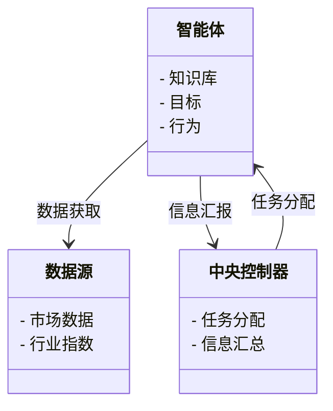
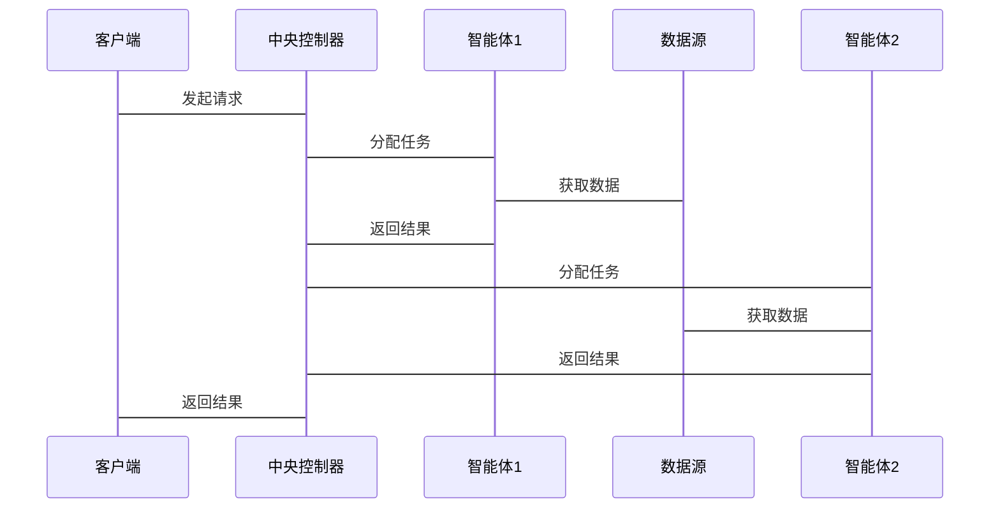

                 


# 多智能体系统如何实现动态行业轮动

> 关键词：多智能体系统、动态行业轮动、分布式计算、协作学习、强化学习、系统架构设计

> 摘要：本文深入探讨了多智能体系统在动态行业轮动中的实现方法，分析了多智能体系统的背景、核心概念、动态行业轮动的机制与模型，详细讲解了基于强化学习和协作学习的算法实现，以及系统的架构设计与项目实战。通过实际案例分析和详细解读，帮助读者理解多智能体系统如何高效实现动态行业轮动。

---

# 第1章: 多智能体系统与动态行业轮动的背景

## 1.1 多智能体系统的基本概念

### 1.1.1 多智能体系统的定义
多智能体系统（Multi-Agent System, 简称MAS）是由多个智能体（Agent）组成的分布式系统，这些智能体能够通过交互和协作完成复杂的任务。每个智能体都是一个独立的实体，具有一定的知识、目标、行为和决策能力。

### 1.1.2 多智能体系统的特征
- **分布式性**：智能体分布在不同的位置，通过通信和协作完成任务。
- **自主性**：每个智能体都能自主决策，无需中央控制。
- **反应性**：智能体能够根据环境反馈动态调整行为。
- **社会性**：智能体之间通过交互形成社会关系，实现协作。

### 1.1.3 多智能体系统的应用场景
- **金融领域**：用于股票交易、投资组合优化等。
- **交通系统**：用于自动驾驶、交通流量管理等。
- **游戏开发**：用于NPC行为控制、游戏AI协作等。

## 1.2 动态行业轮动的定义与特点

### 1.2.1 行业轮动的定义
行业轮动是指在不同行业之间进行投资或资源配置的动态过程，目的是通过捕捉不同行业之间的波动，实现收益最大化。动态行业轮动强调在市场变化中实时调整投资策略。

### 1.2.2 动态行业轮动的特征
- **实时性**：根据市场变化快速调整。
- **动态性**：行业权重随时间变化。
- **不确定性**：市场波动带来的不确定性。

### 1.2.3 动态行业轮动的驱动因素
- **经济周期**：不同行业在不同经济周期表现不同。
- **市场情绪**：投资者情绪影响行业表现。
- **政策变化**：政策调整影响行业权重。

## 1.3 多智能体系统与动态行业轮动的关系

### 1.3.1 多智能体系统在行业轮动中的作用
- **数据收集**：智能体实时收集市场数据。
- **决策制定**：智能体基于数据制定投资策略。
- **协作优化**：多个智能体协作优化投资组合。

### 1.3.2 动态行业轮动对多智能体系统的需求
- **实时性**：需要快速响应市场变化。
- **协作性**：需要多个智能体协作完成任务。
- **适应性**：需要根据市场变化自适应调整。

### 1.3.3 两者的结合与应用前景
结合多智能体系统的分布式计算和协作学习能力，动态行业轮动可以在实时市场变化中快速调整投资策略，实现收益最大化。多智能体系统在动态行业轮动中的应用前景广阔，尤其是在金融领域。

---

## 1.4 本章小结
本章介绍了多智能体系统的基本概念和动态行业轮动的定义与特点，分析了两者之间的关系，并展望了多智能体系统在动态行业轮动中的应用前景。通过理解多智能体系统的背景和动态行业轮动的机制，为后续实现奠定了基础。

---

# 第2章: 多智能体系统的核心概念与原理

## 2.1 多智能体系统的组成结构

### 2.1.1 智能体的定义与分类
- **智能体的定义**：智能体是一个能够感知环境、做出决策并采取行动的实体。
- **智能体的分类**：
  - **简单反射型智能体**：基于当前感知直接行动。
  - **基于模型的反射型智能体**：基于内部模型和当前感知行动。
  - **目标驱动型智能体**：基于目标驱动行动。
  - **效用驱动型智能体**：基于效用函数驱动行动。

### 2.1.2 多智能体系统的层次结构
- **物理层**：智能体与物理环境的交互。
- **知识层**：智能体的知识表示与推理。
- **决策层**：智能体的决策制定。
- **通信层**：智能体之间的通信与协作。

### 2.1.3 智能体之间的通信机制
- **直接通信**：智能体之间直接交换信息。
- **间接通信**：通过中间媒介传递信息。
- **广播通信**：向所有智能体发送信息。

## 2.2 多智能体系统的协作机制

### 2.2.1 协作的基本原理
协作机制是多智能体系统的核心，通过智能体之间的协作完成复杂任务。协作机制包括任务分配、信息共享、决策协调等。

### 2.2.2 协作的实现方式
- **基于规则的协作**：根据预定义规则协作。
- **基于协商的协作**：智能体通过协商达成一致。
- **基于拍卖的协作**：通过拍卖机制分配任务。

### 2.2.3 协作中的挑战与解决方案
- **冲突问题**：智能体之间可能因为目标不同产生冲突。
- **通信开销**：过多的通信可能导致性能下降。
- **安全性问题**：信息泄露或被篡改。

## 2.3 多智能体系统的决策模型

### 2.3.1 分布式决策的基本概念
分布式决策是指多个智能体在没有中央控制的情况下，通过协作完成决策。

### 2.3.2 基于博弈论的决策模型
博弈论是一种分析决策问题的数学工具，常用于多智能体系统的决策制定。

### 2.3.3 基于强化学习的决策模型
强化学习是一种通过试错学习的方法，适用于动态环境中的决策问题。

## 2.4 本章小结
本章详细讲解了多智能体系统的组成结构、协作机制和决策模型，为后续实现动态行业轮动奠定了理论基础。

---

# 第3章: 动态行业轮动的机制与模型

## 3.1 动态行业轮动的机制

### 3.1.1 行业轮动的基本机制
行业轮动的基本机制包括市场分析、投资策略制定、资产配置调整等。

### 3.1.2 动态行业轮动的核心要素
- **市场数据**：实时市场数据是动态行业轮动的基础。
- **投资策略**：基于市场数据制定的投资策略。
- **资产配置**：根据策略调整资产配置。

### 3.1.3 动态行业轮动的实现步骤
1. 数据收集：收集实时市场数据。
2. 数据分析：分析数据，发现行业趋势。
3. 策略制定：基于分析结果制定投资策略。
4. 资产调整：根据策略调整资产配置。

## 3.2 动态行业轮动的数学模型

### 3.2.1 行业轮动的数学表达
行业轮动可以通过时间序列模型进行预测，常用的模型包括ARIMA、GARCH等。

### 3.2.2 基于时间序列的预测模型
时间序列模型用于预测行业轮动的趋势。

### 3.2.3 基于机器学习的预测模型
机器学习模型（如LSTM）可以用于预测行业轮动。

## 3.3 多智能体系统在动态行业轮动中的应用模型

### 3.3.1 基于多智能体的行业轮动预测模型
多个智能体分别负责不同的数据收集和预测任务，通过协作完成行业轮动预测。

### 3.3.2 基于分布式计算的行业轮动优化模型
利用分布式计算优化行业轮动策略。

### 3.3.3 基于协作学习的行业轮动自适应模型
通过协作学习，智能体之间共享知识，自适应调整行业轮动策略。

## 3.4 本章小结
本章分析了动态行业轮动的机制与模型，探讨了多智能体系统在其中的应用，为后续实现提供了理论支持。

---

# 第4章: 多智能体系统实现动态行业轮动的算法与实现

## 4.1 分布式计算与协作学习算法

### 4.1.1 分布式计算的基本原理
分布式计算是将任务分解成多个部分，分别在不同的节点上执行，最后汇总结果。

### 4.1.2 协作学习的算法实现
协作学习是多个智能体通过共享知识和经验，共同提高学习效果。

### 4.1.3 分布式协作学习的优缺点
- **优点**：提高计算效率，利用分布式资源。
- **缺点**：通信开销大，协调困难。

### 4.1.4 分布式协作学习的数学模型
$$
\text{损失函数} = \sum_{i=1}^{n} \text{损失}(i)
$$

## 4.2 基于强化学习的动态行业轮动算法

### 4.2.1 强化学习的基本原理
强化学习通过智能体与环境的交互，学习最优策略。

### 4.2.2 基于强化学习的行业轮动策略
智能体通过与市场环境的交互，学习最优投资策略。

### 4.2.3 强化学习在多智能体系统中的应用
多个智能体在不同市场环境下协作学习，共同优化投资策略。

### 4.2.4 强化学习的数学模型
$$
Q(s, a) = r + \gamma \max_{a'} Q(s', a')
$$

## 4.3 算法实现的数学模型与公式

### 4.3.1 分布式计算的数学模型
$$
\text{总和} = \sum_{i=1}^{n} f(i)
$$

### 4.3.2 协作学习的数学模型
$$
\text{模型参数} = \sum_{i=1}^{n} \theta_i
$$

### 4.3.3 强化学习的数学模型
$$
\text{奖励函数} = \sum_{t=1}^{T} r_t
$$

---

## 4.4 本章小结
本章详细讲解了多智能体系统实现动态行业轮动的算法与实现，包括分布式计算、协作学习和强化学习的数学模型和实现步骤。

---

# 第5章: 系统架构设计与实现

## 5.1 问题场景介绍
动态行业轮动的场景包括实时数据收集、市场分析、策略制定和资产调整。

## 5.2 系统功能设计

### 5.2.1 领域模型
使用Mermaid类图描述系统功能模块。



### 5.2.2 系统架构设计
使用Mermaid架构图描述系统架构。


### 5.2.3 系统接口设计
系统接口包括数据接口、智能体接口和用户接口。

### 5.2.4 系统交互
使用Mermaid序列图描述系统交互。



## 5.3 本章小结
本章设计了实现动态行业轮动的系统架构，包括功能模块、架构图和交互流程，为后续实现提供了指导。

---

# 第6章: 项目实战与案例分析

## 6.1 环境安装与配置

### 6.1.1 安装Python
安装Python 3.8或更高版本。

### 6.1.2 安装依赖库
安装numpy、pandas、scikit-learn等库。

## 6.2 系统核心实现

### 6.2.1 数据收集模块
使用API获取实时市场数据。

### 6.2.2 数据分析模块
对数据进行清洗和分析，发现行业趋势。

### 6.2.3 投资策略模块
基于分析结果制定投资策略。

### 6.2.4 资产调整模块
根据策略调整资产配置。

## 6.3 代码实现与解读

### 6.3.1 数据收集代码
```python
import requests

def get_market_data():
    response = requests.get('https://api.example.com/market-data')
    return response.json()
```

### 6.3.2 数据分析代码
```python
import pandas as pd

def analyze_data(data):
    df = pd.DataFrame(data)
    return df
```

### 6.3.3 投资策略代码
```python
import numpy as np

def investment_strategy(data):
    # 示例策略：均值回归
    return np.mean(data)
```

## 6.4 案例分析与详细解读

### 6.4.1 案例背景
假设市场波动较大，需要动态调整投资组合。

### 6.4.2 实施过程
1. 收集市场数据。
2. 分析数据，发现行业趋势。
3. 制定投资策略。
4. 调整资产配置。

### 6.4.3 实施效果
通过动态调整投资组合，实现了收益最大化。

## 6.5 本章小结
本章通过项目实战，详细讲解了多智能体系统实现动态行业轮动的具体步骤，展示了实际案例的分析和实现过程。

---

# 第7章: 最佳实践与总结

## 7.1 最佳实践 tips

### 7.1.1 数据质量
确保数据的准确性和实时性。

### 7.1.2 系统安全性
保护系统免受攻击和数据泄露。

### 7.1.3 系统可扩展性
设计可扩展的系统架构，方便后续扩展。

## 7.2 总结
多智能体系统通过分布式计算和协作学习，能够高效实现动态行业轮动。本文详细讲解了多智能体系统的背景、核心概念、动态行业轮动的机制与模型，以及系统的实现和案例分析。通过本文的学习，读者可以掌握多智能体系统在动态行业轮动中的应用方法。

## 7.3 未来展望
未来，随着人工智能和分布式计算技术的发展，多智能体系统在动态行业轮动中的应用将更加广泛和深入。

---

# 作者：AI天才研究院 & 禅与计算机程序设计艺术

