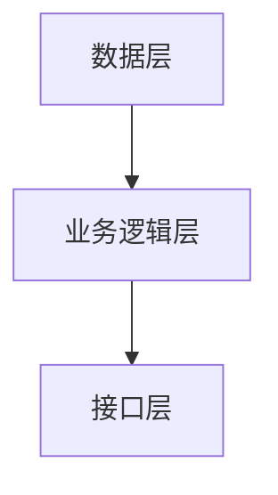
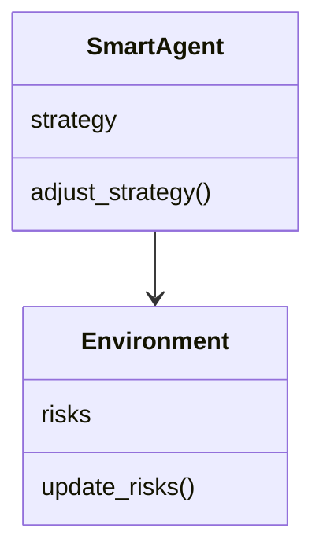

                 


# 多智能体系统如何实现动态风险平衡

> 关键词：多智能体系统、动态风险平衡、博弈论、系统架构、算法实现

> 摘要：本文探讨了多智能体系统中实现动态风险平衡的关键方法，从理论到实践，详细阐述了多智能体系统的基本概念、动态风险平衡的必要性，以及如何通过博弈论和系统架构设计来实现动态风险平衡。文章结合实际案例，通过数学模型、算法实现和系统设计，为读者提供了一个全面的理解框架。

---

## 第一部分：多智能体系统与动态风险平衡概述

### 第1章：多智能体系统基础

#### 1.1 多智能体系统的定义与特点
多智能体系统（Multi-Agent System, MAS）是由多个智能体（Agent）组成的复杂系统，这些智能体能够通过交互和协作完成特定任务。智能体是具有感知、决策和行动能力的实体，可以是软件程序、机器人或其他智能设备。

**多智能体系统的特点：**
- **分布式性**：智能体分布在网络中，不依赖于中央控制。
- **自主性**：每个智能体都具有自主决策的能力。
- **协作性**：智能体之间通过协作完成共同目标。
- **动态性**：系统环境和智能体的行为动态变化，导致风险和机会不断变化。

#### 1.2 动态风险平衡的背景与问题描述
在多智能体系统中，由于各智能体的自主性和动态性，风险和机会的平衡变得尤为重要。动态风险平衡是指在系统运行过程中，实时调整各智能体的行为策略，以达到整体风险的最小化或优化。

**动态风险平衡的核心问题：**
- 如何实时监测和评估系统中的风险。
- 如何制定和调整各智能体的行动策略，以实现风险与收益的平衡。
- 如何在动态变化的环境中保持系统的稳定性和高效性。

---

### 第2章：多智能体系统中的风险分析

#### 2.1 风险识别与评估
**风险识别**是动态风险平衡的第一步，需要明确系统中可能存在的各种风险因素。常见的风险包括：
- **外部风险**：如网络攻击、环境变化等。
- **内部风险**：如智能体之间的竞争、协作不畅等。

**风险评估模型**：
通过概率和影响矩阵对风险进行量化评估，确定风险的优先级。例如，低概率高影响的风险需要优先处理。

#### 2.2 动态风险平衡的核心概念
**动态风险平衡**的核心在于实时调整各智能体的策略，以应对环境的变化。这种调整需要基于博弈论的均衡理论，确保各智能体在动态变化中找到最优策略。

**博弈论与动态风险平衡的关系**：
- 博弈论提供了分析智能体之间相互作用的工具。
- 纳什均衡是动态风险平衡的重要理论基础。

---

## 第二部分：多智能体系统的动态风险平衡原理

### 第3章：多智能体系统中的博弈论与均衡分析

#### 3.1 博弈论基础
**博弈论**研究的是智能体之间在策略选择中的相互影响。常见的博弈论概念包括：
- **纳什均衡**：在纳什均衡中，每个智能体的策略都是最优反应，无法单方面改变策略而提高自身收益。

**纳什均衡的数学定义**：
对于一个博弈，策略组合 $(s_1, s_2, ..., s_n)$ 是纳什均衡，当且仅当对于每个智能体 $i$，策略 $s_i$ 是其在其他智能体策略固定时的最优策略。

#### 3.2 动态风险平衡的博弈论模型
动态风险平衡可以通过博弈论模型来实现。通过构建博弈树，分析智能体在不同策略下的收益和风险，找到纳什均衡点。

**博弈树分析**：
通过绘制博弈树，明确每个智能体在不同决策点的策略选择，并计算每个策略组合的收益和风险。

---

### 第4章：多智能体系统中的动态风险平衡算法

#### 4.1 动态风险平衡算法的原理
动态风险平衡算法的核心在于实时调整智能体的策略，以实现整体风险的最小化。算法通常包括以下步骤：
1. **风险监测**：实时监测系统中的风险因素。
2. **策略调整**：根据当前风险情况，调整智能体的策略。
3. **均衡计算**：通过博弈论模型计算新的纳什均衡点。
4. **策略更新**：更新智能体的策略，确保系统处于动态平衡状态。

#### 4.2 动态风险平衡算法的实现
以下是动态风险平衡算法的伪代码实现：

```python
def dynamic_risk_balance(smart_agents, environment):
    while True:
        # 风险监测
        risks = monitor_risks(smart_agents, environment)
        # 策略调整
        for agent in smart_agents:
            agent.strategy = adjust_strategy(agent, risks)
        # 均衡计算
        equilibrium = calculate_nash_equilibrium(smart_agents)
        # 策略更新
        update_strategies(smart_agents, equilibrium)
```

**数学模型**：
动态风险平衡的数学模型可以表示为：

$$
\min_{s_i} \sum_{j} risk(s_j, s_i)
$$

其中，$s_i$ 是智能体 $i$ 的策略，$risk(s_j, s_i)$ 是智能体 $j$ 在策略 $s_j$ 下的风险。

---

## 第三部分：多智能体系统的动态风险平衡实现

### 第5章：多智能体系统中的动态风险平衡实现框架

#### 5.1 系统架构设计
**系统架构设计**通常包括以下层次：
1. **数据层**：存储系统中的数据，如智能体的状态、环境信息等。
2. **业务逻辑层**：实现智能体的策略调整和风险计算。
3. **接口层**：提供与外部系统的接口，如用户界面或API。

**系统架构图**：



#### 5.2 系统功能设计
**系统功能模块**包括：
1. **风险监测模块**：实时监测系统中的风险。
2. **策略调整模块**：根据风险情况调整智能体的策略。
3. **均衡计算模块**：计算纳什均衡点。

**领域模型类图**：



---

### 第6章：项目实战

#### 6.1 环境安装
为了实现动态风险平衡，需要安装以下工具：
- Python编程语言
- 博弈论库（如game-theory）
- Mermaid图表工具

#### 6.2 核心算法实现
以下是动态风险平衡算法的Python实现：

```python
import game_theory

def main():
    smart_agents = create_agents()
    environment = Environment()
    while True:
        monitor_risks(smart_agents, environment)
        adjust_strategies(smart_agents)
        calculate_equilibrium(smart_agents)
        update_strategies(smart_agents)

if __name__ == "__main__":
    main()
```

---

## 第四部分：最佳实践与小结

### 第7章：总结与展望

#### 7.1 小结
本文详细探讨了多智能体系统中实现动态风险平衡的方法，从理论到实践，为读者提供了全面的指导。

#### 7.2 注意事项
- 动态风险平衡需要实时监测和调整，系统的稳定性和效率至关重要。
- 在实际应用中，需要考虑系统的可扩展性和容错性。

#### 7.3 拓展阅读
- 推荐阅读《博弈论与经济行为》（作者：约翰·纳什）
- 推荐学习多智能体系统的相关课程，如MIT的《Multi-Agent Systems》。

---

作者：AI天才研究院/AI Genius Institute & 禅与计算机程序设计艺术 /Zen And The Art of Computer Programming

---

通过以上结构，文章详细阐述了多智能体系统中动态风险平衡的实现方法，结合理论分析、算法实现和系统设计，为读者提供了一个全面的理解框架。

