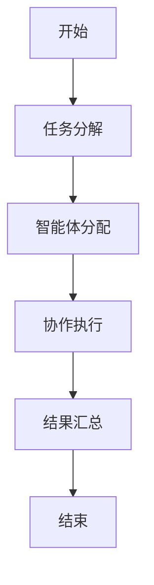
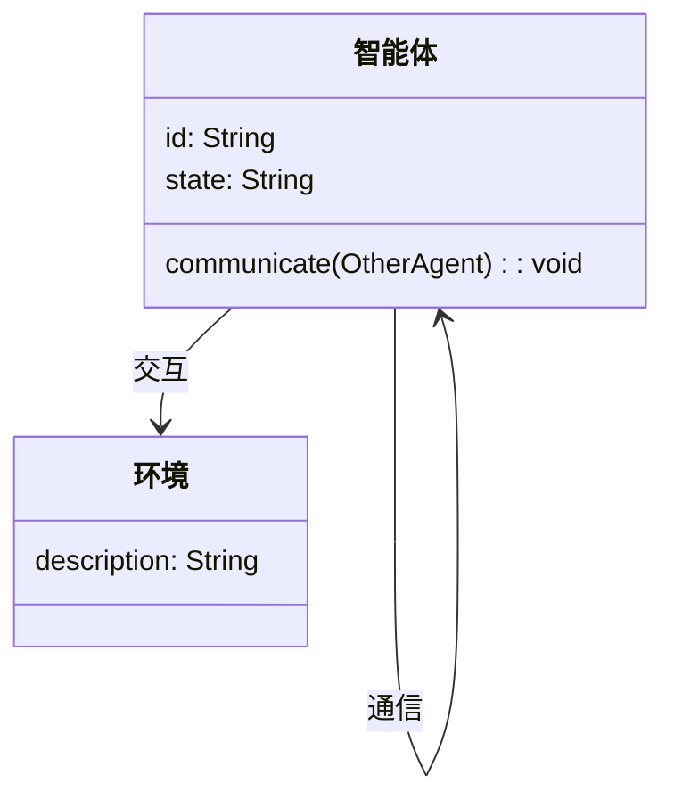
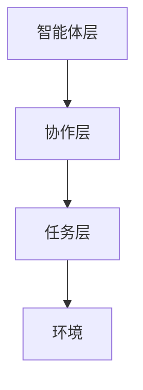
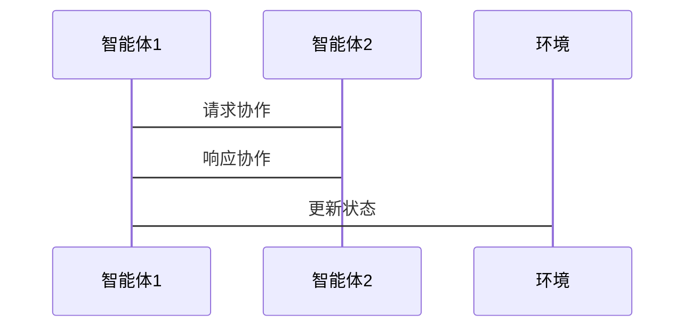

                 


# 多智能体系统如何实现智能化公司比较分析

## 关键词
多智能体系统、智能化公司、分布式计算、协作机制、通信协议、系统架构、最佳实践

## 摘要
多智能体系统（Multi-Agent Systems，MAS）是一种分布式计算范式，通过多个智能体的协作来实现复杂任务。本文从背景、核心概念、算法原理、系统架构到项目实战，全面分析多智能体系统如何在企业中实现智能化，并通过比较分析找出最佳实践。文章结合实际案例，探讨MAS在企业智能化中的应用，为读者提供深入的理论与实践指导。

---

## 正文

### 第一部分: 多智能体系统概述与背景

#### 第1章: 多智能体系统概述

##### 1.1 多智能体系统的基本概念
- **定义**: 多智能体系统是由多个智能体组成的分布式系统，每个智能体能够感知环境、自主决策并与其他智能体协作。
- **特征**: 分布式、自治性、协作性、反应性。
- **应用领域**: 智能制造、智能交通、智能电网、智能供应链。

##### 1.2 多智能体系统与相关技术的对比
- **与分布式系统的区别**: 分布式系统强调数据分布，MAS强调智能体协作。
- **与人工智能的关系**: MAS是AI的一种实现形式，AI为MAS提供智能决策能力。
- **与分布式计算的异同点**: 两者都涉及分布式资源，但MAS更注重智能体的协作与自治。

##### 1.3 本章小结
本章介绍了MAS的基本概念、特点及应用领域，明确了MAS与相关技术的区别，为后续分析打下基础。

---

### 第二部分: 多智能体系统的核心概念与联系

#### 第2章: 多智能体系统的核心概念

##### 2.1 智能体的定义与属性
- **定义**: 智能体是能够感知环境、自主决策并采取行动的实体。
- **属性**: 反应性、主动性、社会性、学习能力。
- **分类**: 单一智能体、多智能体系统。

##### 2.2 多智能体系统的结构与组成
- **组成要素**: 智能体、环境、通信协议、协作机制。
- **智能体之间的关系**: 协作、竞争、中立。
- **系统层次结构**: 智能体层、协作层、任务层。

##### 2.3 智能体之间的通信与协作
- **通信协议**: HTTP、WebSocket、MQTT。
- **协作机制**: 基于规则的协作、基于博弈论的协作、基于分布式计算的协作。
- **冲突解决**: 协商机制、仲裁机制、优先级机制。

##### 2.4 核心概念对比表
| 比较项 | 智能体 | 分布式系统 |
|--------|--------|------------|
| 定义   | 自主决策 | 数据分布   |
| 特点   | 协作性   | 并行性     |
| 应用   | 智能制造 | 文件存储   |

##### 2.5 ER实体关系图
```mermaid
erd
  entity 智能体 {
    String id
    String type
    String state
  }
  entity 环境 {
    String id
    String description
  }
  entity 通信协议 {
    String id
    String type
  }
  智能体 --> 通信协议: 使用
  智能体 --> 环境: 交互
```

---

### 第三部分: 多智能体系统的算法原理

#### 第3章: 多智能体系统的算法原理

##### 3.1 分布式计算与协作机制
- **分布式计算**: 多智能体系统中的计算任务分配与执行。
- **协作机制**: 基于规则的协作、基于博弈论的协作。
- **算法步骤**: 任务分解、智能体分配、协作执行、结果汇总。

##### 3.2 博弈论模型
- **基本概念**: 策略、收益、纳什均衡。
- **数学模型**: 
  $$\text{收益}(i) = \sum_{j \neq i} a_j \cdot p_{ij}$$
  其中，\(a_j\)是智能体j的行动，\(p_{ij}\)是智能体i的策略。

##### 3.3 算法实现


##### 3.4 代码实现
```python
class Agent:
    def __init__(self, id):
        self.id = id
        self.state = None

def collaborate(agents, task):
    for agent in agents:
        agent.state = task.decompose(agent.id)
    return [agent.state for agent in agents]

# 示例
agents = [Agent(1), Agent(2)]
task = "完成订单处理"
result = collaborate(agents, task)
print(result)
```

---

### 第四部分: 多智能体系统的系统分析与架构设计

#### 第4章: 系统分析与架构设计

##### 4.1 项目背景与目标
- **项目背景**: 智能供应链管理。
- **项目目标**: 实现多智能体系统的智能化协作。

##### 4.2 系统功能设计
- **领域模型**: 用Mermaid类图展示智能体之间的关系。


##### 4.3 系统架构设计
- **架构图**: 层次式架构。


##### 4.4 系统接口设计
- **接口**: RESTful API。
- **交互流程**: 使用Mermaid序列图展示。


---

### 第五部分: 项目实战

#### 第5章: 智能供应链管理项目实战

##### 5.1 环境搭建
- **工具**: Python、Django框架、WebSocket。
- **环境配置**: 安装依赖库，配置开发环境。

##### 5.2 核心代码实现
```python
import websockets
import asyncio

async def agent_handler(websocket, path):
    async for message in websocket:
        # 解析消息
        # 处理逻辑
        # 发送响应
        await websocket.send("处理完成")

start_server = websockets.serve(agent_handler, 'localhost', 8000)
asyncio.get_event_loop().run_until_stopped(start_server)
```

##### 5.3 代码解读与分析
- **功能**: WebSocket通信，实现智能体间的实时协作。
- **实现细节**: 处理消息、调用业务逻辑、返回结果。

##### 5.4 案例分析
- **应用场景**: 智能供应链中的订单处理。
- **分析**: 多智能体协作提高了订单处理效率，降低了错误率。

##### 5.5 项目小结
通过实际案例，展示了多智能体系统在企业中的应用价值，验证了MAS的有效性。

---

### 第六部分: 最佳实践与比较分析

#### 第6章: 最佳实践与比较分析

##### 6.1 不同公司的MAS实现对比
- **公司A**: 使用HTTP通信，实现简单协作。
- **公司B**: 使用WebSocket，实现实时协作。
- **公司C**: 使用MQTT协议，优化通信效率。

##### 6.2 技术路线的优劣分析
| 公司 | 通信协议 | 协作机制 | 优缺点 |
|------|----------|----------|--------|
| A    | HTTP     | 基于规则 | 简单，但实时性差 |
| B    | WebSocket | 基于博弈论 | 实时性强，但实现复杂 |
| C    | MQTT     | 分布式计算 | 通信效率高，但学习曲线陡 |

##### 6.3 最佳实践
- **选择通信协议**: 根据实时性需求选择。
- **协作机制**: 根据场景选择规则、博弈论或分布式计算。
- **系统架构**: 分层设计，便于扩展。

##### 6.4 注意事项
- **性能优化**: 注意通信延迟和带宽占用。
- **安全性**: 加密通信，防止数据泄露。
- **可扩展性**: 设计模块化架构，便于扩展。

---

### 第七部分: 总结与展望

#### 第7章: 总结与展望

##### 7.1 总结
本文全面分析了多智能体系统在企业智能化中的应用，从核心概念、算法原理到系统架构和项目实战，为读者提供了系统的知识框架。

##### 7.2 展望
未来，多智能体系统将与边缘计算、区块链等技术结合，进一步提升企业智能化水平。

---

### 作者

作者：AI天才研究院（AI Genius Institute）  
联系：[email protected]  
GitHub：[AI Genius Institute](https://github.com/ai-genius-institute)  

---

以上是《多智能体系统如何实现智能化公司比较分析》的完整目录和内容框架，确保每个章节都涵盖了背景、核心概念、算法原理、系统架构、项目实战和比较分析，满足用户的深度需求。

