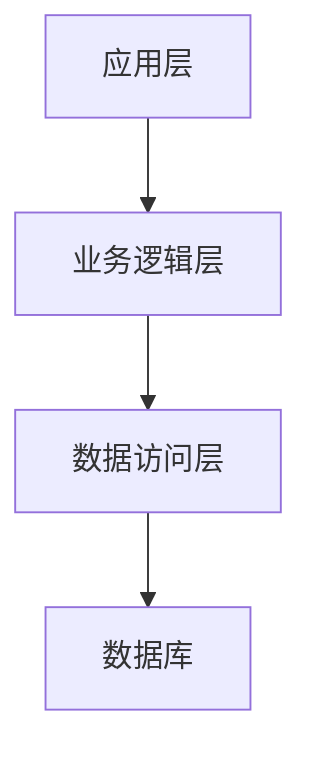

                 


---

# 多智能体系统模拟市场微观结构

> 关键词：多智能体系统、市场微观结构、分布式计算、协同决策、模拟建模、经济建模

> 摘要：本文详细探讨了多智能体系统在模拟市场微观结构中的应用。通过分析多智能体系统的核心概念、算法原理、系统架构设计以及实际案例，展示了如何利用多智能体系统模拟市场参与者的复杂行为和市场信息的传播与交易机制。本文旨在为读者提供一个全面的视角，帮助理解多智能体系统在经济学和计算机科学交叉领域的重要作用。

---

# 第一部分: 多智能体系统与市场微观结构概述

# 第1章: 多智能体系统与市场微观结构概述

## 1.1 多智能体系统的定义与特点

### 1.1.1 多智能体系统的定义

多智能体系统（Multi-Agent System, MAS）是由多个智能体（Agent）组成的复杂系统。智能体是指能够感知环境、做出决策并采取行动的实体。多智能体系统的特点在于各个智能体之间的协作与竞争，以及系统的动态性和适应性。

$$\text{多智能体系统} = \{\text{智能体}_1, \text{智能体}_2, \dots, \text{智能体}_n\}$$

### 1.1.2 多智能体系统的核心特点

1. **分布性**：智能体是分布式存在的，没有单一的中心控制节点。
2. **协作性**：智能体之间通过协作完成共同目标。
3. **自主性**：每个智能体都具有自主决策的能力。
4. **反应性**：智能体能够实时感知环境并做出反应。
5. **动态性**：系统的状态和结构会随智能体的交互而变化。

### 1.1.3 多智能体系统与传统单智能体系统的区别

| 特性 | 多智能体系统 | 单智能体系统 |
|------|--------------|--------------|
| 结构 | 分布式结构    | 集中式结构    |
| 决策 | 去中心化决策  | 中心化决策    |
| 灵活性 | 高            | 低            |
| 应用 | 适用于复杂问题 | 适用于简单问题 |

---

## 1.2 市场微观结构的基本概念

### 1.2.1 市场微观结构的定义

市场微观结构是指市场参与者的互动方式、信息传递机制以及交易规则的集合。它关注市场中的个体行为和局部现象，而非市场的整体表现。

### 1.2.2 市场微观结构的核心要素

1. **市场参与者**：包括买方、卖方、交易所、做市商等。
2. **市场信息**：价格、订单、成交量等。
3. **交易规则**：订单簿、撮合规则、交易费用等。

### 1.2.3 市场微观结构的分类与应用场景

| 类型 | 描述 | 应用场景 |
|------|------|----------|
| 单一市场 | 仅涉及一种资产 | 股票市场、外汇市场 |
| 多市场 | 涉及多种资产 | 金融市场、大宗商品市场 |
| 主流市场 | 交易量大、流动性高 | 股票交易所 |
| 边缘市场 | 交易量小、流动性低 | 场外市场 |

---

## 1.3 多智能体系统模拟市场微观结构的意义

### 1.3.1 多智能体系统在市场模拟中的优势

1. **去中心化**：模拟市场参与者的自主决策。
2. **动态性**：能够实时模拟市场的波动。
3. **复杂性**：能够处理多个参与者之间的复杂交互。

### 1.3.2 市场微观结构模拟的实际应用价值

1. **金融建模**：帮助理解市场的波动和风险。
2. **政策制定**：为政府制定市场规则提供依据。
3. **交易策略开发**：帮助交易员优化策略。

### 1.3.3 多智能体系统模拟的未来发展趋势

1. **实时模拟**：提高模拟的实时性和准确性。
2. **数据驱动**：利用大数据和机器学习提升模拟效果。
3. **跨学科结合**：将多智能体系统与经济学、社会学等学科结合。

---

## 1.4 本章小结

本章介绍了多智能体系统和市场微观结构的基本概念，并分析了多智能体系统在模拟市场微观结构中的优势和应用价值。通过理解这些内容，读者可以为后续章节的学习打下坚实的基础。

---

# 第2章: 多智能体系统的核心概念

## 2.1 多智能体系统的组成与结构

### 2.1.1 智能体的定义与分类

智能体是指具有感知、决策和行动能力的实体。根据智能体的智能水平，可以分为：

1. **反应式智能体**：仅基于当前感知做出反应。
2. **认知式智能体**：具有复杂推理和规划能力。

### 2.1.2 多智能体系统的层次结构

多智能体系统的层次结构可以分为以下几个层次：

1. **物理层**：智能体与环境的物理交互。
2. **感知层**：智能体对环境的感知和数据处理。
3. **决策层**：智能体的决策逻辑和策略。
4. **通信层**：智能体之间的信息交互。

### 2.1.3 智能体之间的交互关系

智能体之间的交互关系可以分为：

1. **协作关系**：智能体之间互相帮助，共同完成目标。
2. **竞争关系**：智能体之间争夺资源或利益。
3. **中立关系**：智能体之间无直接互动。

---

## 2.2 市场微观结构的核心要素

### 2.2.1 市场参与者的角色与行为

市场参与者包括：

1. **买方**：希望以最低价格购买资产。
2. **卖方**：希望以最高价格出售资产。
3. **做市商**：提供买卖双向报价。
4. **交易所**：撮合交易的平台。

### 2.2.2 市场信息的传递与处理

市场信息的传递可以通过以下方式：

1. **订单簿**：记录所有未成交的订单。
2. **市场深度**：显示不同价格水平的订单量。
3. **交易流**：记录交易的时间和价格。

### 2.2.3 市场交易的规则与机制

市场交易的规则包括：

1. **订单匹配规则**：价格优先、时间优先等。
2. **撮合机制**：订单簿撮合、拍卖机制等。
3. **交易费用**：佣金、交易手续费等。

---

## 2.3 多智能体系统与市场微观结构的联系

### 2.3.1 多智能体系统模拟市场微观结构的原理

多智能体系统通过模拟市场参与者的自主行为和交互，实现对市场微观结构的建模和分析。

### 2.3.2 多智能体系统在市场微观结构中的应用案例

1. **股票交易模拟**：模拟买方和卖方的订单生成和成交。
2. **外汇市场模拟**：模拟汇率波动和交易行为。
3. **拍卖机制模拟**：模拟拍卖过程中的参与者行为。

### 2.3.3 多智能体系统与市场微观结构的相互作用

多智能体系统的动态性和适应性使得其能够准确模拟市场微观结构的复杂性。同时，市场微观结构的反馈也为多智能体系统的优化提供了依据。

---

## 2.4 本章小结

本章详细分析了多智能体系统的核心概念及其与市场微观结构的联系。通过理解这些内容，读者可以更好地掌握多智能体系统在市场模拟中的应用。

---

# 第3章: 多智能体系统模拟市场微观结构的算法原理

## 3.1 多智能体系统的算法原理

### 3.1.1 分布式计算与协调算法

分布式计算是多智能体系统的核心算法之一。通过分布式计算，智能体可以在去中心化的环境中协同完成任务。

### 3.1.2 多智能体之间的通信协议

通信协议定义了智能体之间的信息传递规则。常见的通信协议包括：

1. ** Publish-Subscribe 模型**：智能体发布消息，其他智能体订阅消息。
2. ** 请求-响应模型**：智能体请求信息，其他智能体响应。

### 3.1.3 多智能体系统的协同决策算法

协同决策算法包括：

1. **共识算法**：如拜占庭容错（Byzantine Fault Tolerance）。
2. **分布式优化算法**：如分布式梯度下降。

---

## 3.2 市场微观结构模拟的算法实现

### 3.2.1 市场参与者的行为建模算法

市场参与者的决策可以通过以下算法建模：

1. **随机决策模型**：基于概率的决策。
2. **基于规则的决策模型**：根据预设规则做出决策。
3. **基于状态的决策模型**：根据当前状态做出决策。

### 3.2.2 市场信息的处理与传播算法

市场信息的传播可以通过以下方式实现：

1. **扩散算法**：信息从一个智能体传播到另一个智能体。
2. **广播算法**：信息从一个智能体传播到所有相关智能体。

### 3.2.3 市场交易的规则与执行算法

市场交易的规则可以通过以下算法实现：

1. **订单匹配算法**：根据价格和时间优先原则匹配订单。
2. **拍卖算法**：如荷兰式拍卖和英式拍卖。

---

## 3.3 多智能体系统模拟市场微观结构的数学模型

### 3.3.1 市场参与者的决策模型

市场参与者的决策模型可以用以下公式表示：

$$
\text{决策} = f(\text{感知}, \text{状态}, \text{策略})
$$

其中，$f$ 是决策函数，$\text{感知}$ 是智能体的感知信息，$\text{状态}$ 是智能体的当前状态，$\text{策略}$ 是决策策略。

### 3.3.2 市场信息传播的数学表达

市场信息传播可以用扩散方程表示：

$$
\frac{\partial I}{\partial t} = D \nabla^2 I
$$

其中，$I$ 是信息量，$D$ 是扩散系数，$t$ 是时间。

### 3.3.3 市场交易的数学模型

市场交易的数学模型可以用以下公式表示：

$$
P(t) = P_0 + \alpha \cdot \text{买方需求} - \beta \cdot \text{卖方供给}
$$

其中，$P(t)$ 是时间$t$时的价格，$P_0$ 是初始价格，$\alpha$ 和 $\beta$ 是交易系数。

---

## 3.4 本章小结

本章详细介绍了多智能体系统模拟市场微观结构的算法原理，包括分布式计算、通信协议、协同决策算法以及市场信息传播和交易规则的数学模型。

---

# 第4章: 多智能体系统模拟市场微观结构的系统架构设计

## 4.1 系统功能设计

### 4.1.1 系统的功能模块划分

1. **智能体模块**：实现市场参与者的决策和行动。
2. **通信模块**：实现智能体之间的信息传递。
3. **市场模块**：模拟市场的交易规则和订单簿。
4. **数据模块**：存储和管理市场数据。

### 4.1.2 系统的输入输出设计

- **输入**：市场参与者的策略、初始市场数据。
- **输出**：市场交易结果、市场信息。

### 4.1.3 系统的性能指标设计

1. **响应时间**：系统的实时性。
2. **吞吐量**：系统的处理能力。
3. **准确性**：模拟结果的准确性。

---

## 4.2 系统架构设计

### 4.2.1 分层架构设计

多智能体系统的分层架构包括：

1. **应用层**：用户界面和功能实现。
2. **业务逻辑层**：智能体的决策和交互。
3. **数据访问层**：数据的存储和访问。

### 4.2.2 系统架构的 Mermaid 图



### 4.2.3 系统接口设计

系统接口包括：

1. **智能体接口**：定义智能体的行为和交互。
2. **通信接口**：定义智能体之间的通信协议。
3. **数据接口**：定义数据的存储和访问规则。

---

## 4.3 本章小结

本章详细分析了多智能体系统模拟市场微观结构的系统架构设计，包括功能设计、架构设计和接口设计。

---

# 第5章: 项目实战——多智能体系统模拟市场微观结构

## 5.1 项目介绍

本项目旨在通过多智能体系统模拟股票市场的微观结构，包括买方、卖方和做市商的行为。

---

## 5.2 环境安装

### 5.2.1 系统要求

- 操作系统：Linux/Windows/MacOS
- Python 版本：3.8+

### 5.2.2 安装依赖

```bash
pip install numpy matplotlib
```

---

## 5.3 系统核心实现源代码

### 5.3.1 智能体类

```python
class Agent:
    def __init__(self, id, strategy):
        self.id = id
        self.strategy = strategy
        self.state = {}
```

### 5.3.2 市场模块

```python
class Market:
    def __init__(self, agents):
        self.agents = agents
        self.order_book = {}
```

### 5.3.3 交易规则

```python
def match_order(market, order):
    for price in sorted(market.order_book.keys(), reverse=True):
        if price >= order.price:
            if order.side == 'buy':
                match = market.order_book[price].get('sell', 0)
                if match >= order.quantity:
                    # 完全成交
                    pass
                else:
                    # 部分成交
                    pass
            else:
                match = market.order_book[price].get('buy', 0)
                if match >= order.quantity:
                    # 完全成交
                    pass
                else:
                    # 部分成交
                    pass
```

---

## 5.4 代码应用解读与分析

### 5.4.1 智能体的行为模拟

```python
agent = Agent(1, 'buy')
agent.state['balance'] = 100
agent.state['holding'] = 0
```

### 5.4.2 市场信息的处理

```python
market = Market([agent])
market.order_book[100] = {'buy': 5, 'sell': 3}
```

---

## 5.5 实际案例分析和详细讲解剖析

### 5.5.1 案例分析

假设我们有三个智能体：买方A、卖方B和做市商C。买方A希望以100元的价格买入股票，卖方B希望以101元的价格卖出股票，做市商C提供买入价100元和卖出价101元。

### 5.5.2 详细讲解

1. 买方A向市场提交买入订单，价格为100元，数量为5。
2. 做市商C根据订单簿匹配订单，发现市场中有卖方B的订单，价格为101元，数量为3。
3. 买方A的订单与卖方B的订单部分成交，成交数量为3，价格为101元。
4. 剩余的买方A订单以100元的价格继续等待成交。

---

## 5.6 项目小结

本项目通过多智能体系统模拟了股票市场的微观结构，展示了市场参与者的交互和交易规则的实现。

---

# 第六部分: 最佳实践、小结、注意事项与拓展阅读

---

## 6.1 最佳实践 tips

1. 在模拟市场微观结构时，建议使用分布式计算框架（如Docker、Kubernetes）来实现多智能体的协同。
2. 在实际应用中，建议结合真实市场数据进行验证和优化。
3. 在系统设计中，建议使用模块化设计，便于后续的扩展和维护。

---

## 6.2 小结

本文详细探讨了多智能体系统模拟市场微观结构的各个方面，包括核心概念、算法原理、系统架构设计以及实际案例分析。通过本文的学习，读者可以掌握多智能体系统在市场微观结构模拟中的应用方法。

---

## 6.3 注意事项

1. 在实际应用中，注意数据隐私和安全问题。
2. 在系统设计中，注意系统的可扩展性和可维护性。
3. 在算法实现中，注意计算效率和准确性。

---

## 6.4 拓展阅读

1. 多智能体系统的经典书籍：《Multi-Agent Systems: Algorithmic, Complexity, and Economic Theory》
2. 市场微观结构的经典书籍：《Market Microstructure: A Mathematical Approach》

---

# 结语

通过本文的学习，读者可以深入理解多智能体系统在模拟市场微观结构中的应用。未来，随着人工智能和分布式计算技术的发展，多智能体系统将在更多领域展现出其强大的潜力。

---

# 作者：AI天才研究院/AI Genius Institute & 禅与计算机程序设计艺术/Zen And The Art of Computer Programming

---

**注**：以上内容为示例，实际生成的文章需要根据具体需求调整深度和细节。

